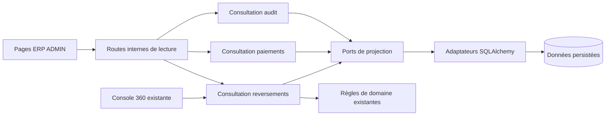

# EPIC 65 — Architecture et contrats cibles

Spécification V1, 26 septembre 2026. [Parcours et périmètre](README.md),
[preuves attendues](verification-livraison.md). Les routes et DTO **nouveaux**
ci-dessous sont à implémenter ; ils ne décrivent pas une API actuellement déployée.

## Propriétaires et frontières

| Objet / règle conservée | Propriétaire | Contribution E65 |
| --- | --- | --- |
| Autorisation des interfaces globales | `identite_acces`, politique ADMIN de `permissions_backoffice.py` | Chaque page et API E65 vérifie ADMIN explicitement ; ne pas élargir la permission historique ni se contenter de `contexte_erp`. |
| Événement d’audit persisté | Domaine `exploitation` | Lecture globale filtrée, sans transition ni réécriture d’événement. Le service applicatif assainit la projection ; l’adaptateur fournit les champs persistés. |
| Paiement, achat/commande, états financiers | Domaine `gestion_achats` et services financiers existants | Nouvelle projection globale, mapping partagé avec Vision 360 Achats. Déplacer la normalisation pure actuellement applicative vers une politique de domaine partagée si extraite, sans changer ses résultats. |
| Reversement, paiement de reversement, mouvement | Domaine `gestion_reversement` | Politique pure de classement des montants et refus d’éligibilité ; aucun changement de transition ou d’exécution financière. |
| Compte commerçant éligible | `Commercant.stripe_connect_eligible` | Réutiliser cette propriété, y compris `stripe_requirements_due`, omis dans le résumé historique de la console ; ne pas recopier son calcul incomplet. |
| Virement bancaire | `PayoutStripe.statut_public()` et associations persistées | Réutiliser les états canoniques par association ; une présentation ne déduit pas le paiement de tous les reversements du dernier payout reçu. |
| Pièces et demandes de facturation | Domaines documentaire / facturation existants | Liens de lecture vers les documents réellement rattachés aux achats enfants ; aucune génération ni transition. |

Respecter l’[ADR domaine d’abord](../../architecture/decisions/ADR-2026-08-28-domaine-avant-services-applicatifs.md).
Les nouveaux services applicatifs orchestrent droits, requêtes de projection,
lecture cohérente, rattachements et DTO. Les requêtes SQL et index appartiennent
aux adaptateurs ; agrégats descriptifs et pagination ne deviennent pas de fausses
règles d’entité. Toute décision d’éligibilité/classement financier est pure,
commune aux entrées qui l’utilisent et testée indépendamment des ORM.

Services cibles : consultation dans `application/exploitation`,
`application/gestion_achats` et `application/gestion_reversement`, via ports de
lecture des domaines correspondants. Leurs implémentations ne doivent importer
ni `admin.py`, ni un renderer HTML, ni directement un ORM. Ne pas réutiliser les
repositories à résultat limité/unique pour simuler une liste complète.

## Extraction du suivi reversements

Le constructeur `_build_reversements_360_data` de
[admin.py](../../../../localeo-backend/app/infrastructure/admin/admin.py) mêle
SQL, agrégation, règles et présentation. L’extraction fait partie de l’EPIC :

1. Introduire un port de projection et son adaptateur SQL. Appliquer le périmètre
   en base, dédupliquer les identifiants avant toute jointure de détail et sommer
   avant pagination. Ne pas charger toutes les lignes pour paginer en Python.
2. Isoler les décisions de classement/éligibilité au domaine, réutiliser le
   commerçant et le payout canoniques. Les champs, couleurs et URL restent des DTO/UI.
3. Faire consommer la même consultation par l’ERP et la console 360 historique,
   avec adaptateur de rendu pour ses anciennes clés. Maintenir son URL, ses actions
   et son export existant ; ne modifier ni leur portée financière ni leurs droits.
4. Prouver la parité des dossiers sélectionnés. Tracer les corrections de lecture
   assumées : exigences Stripe dues, devises séparées, remboursements hors sélection
   non incorporés et absence de faux « tout viré » fondé sur le dernier payout.

Le filtre de campagne de la consultation n’est **pas** le paramètre d’exécution
du lancement historique. Le lien de traitement ne promet pas que les dossiers
visibles seront les seuls traités ; la console conserve son propre périmètre
et son action explicite de lancement. Ne pas supposer une boîte de confirmation
que le formulaire historique ne possède pas.

## Routes et accès

Le producteur sera FastAPI/Pydantic dans le backend ; consommateur unique des
nouveaux contrats : assets ERP servis par ce même backend. Garder les tags de
domaine et d’exposition des [conventions API](../../architecture/transverse/conventions-api-openapi.md).

| GET cible | Réponse et objet |
| --- | --- |
| `/internal/exploitation/evenements-audit` | `PageAudit` |
| `/internal/exploitation/evenements-audit/{id}` | `DetailAudit` |
| `/internal/gestion-achats/paiements` | `PagePaiements`, synthèse du périmètre filtré incluse |
| `/internal/gestion-achats/paiements/{id}` | `DetailPaiement` |
| `/internal/gestion-achats/paiements/{id}/achats` | Achats enfants paginés, liens de consultation documentaire |
| `/internal/gestion-reversement/suivi/commercants` | `PageSuiviCommerces`, synthèse incluse |
| `/internal/gestion-reversement/suivi/commercants/{id}` | Résumé du commerce dans le périmètre filtré |
| `/internal/gestion-reversement/suivi/commercants/{id}/{section}` | Section paginée, enum fermé `mouvements`, `reversements`, `paiements` |
| `/internal/gestion-reversement/suivi/reversements/{id}` | `DetailReversement`, identité et résumé complet hors filtre de liste |
| `/internal/gestion-reversement/suivi/reversements/{id}/{section}` | Section complète paginée, enum fermé `mouvements`, `paiements`, `sources`, `virements` |

Les déclarations de routes doivent éviter que `suivi` ou une section soit capturé
comme UUID. Aucun POST/PATCH/DELETE E65. Les pages IHM sont celles du README ;
les sections du tableau sont implémentées comme routes explicites, pas comme
paramètre enum FastAPI générique, afin qu’une section inconnue réponde 404.
le détail d’un commerce financier peut rester un filtre `commercantId` de la
page Reversements, avec lien vers la fiche commerçant canonique.

**Session :** cookie interne et rôle ADMIN vérifié dans chaque route HTML/JSON.
Pas d’accès accordé par une clé `internal:finance` ou `internal:batch` à ces vues
de session ; leurs API techniques existantes restent distinctes. Réutiliser le
contexte ERP pour l’identité vérifiée, puis la politique ADMIN. La liste des
préfixes internes et les tests middleware doivent être examinés : `/internal/erp`
est actuellement exempté du verrou historique global.

Réponses `Cache-Control: no-store`, requêtes ERP `credentials: same-origin`.
Pas d’état sensible en stockage persistant navigateur. Les GET n’exigent pas de
clé d’idempotence ; répétition autorisée sans effet métier. Le mécanisme de
session et les logs d’observabilité existants restent applicables. Aucune nouvelle
écriture d’audit de consultation n’est introduite qui alimenterait sa propre liste.

## Paramètres et enveloppe commune

- `page` entier ≥ 1, défaut 1 ; `pageSize` défaut 25, intervalle 1–100.
- `dateFrom`, `dateTo` : dates ISO, fin incluse ; paire complète, ordre valide.
  Fenêtre maximale **366 jours** ; consulter une autre fenêtre pour l’historique.
  Ce bornage technique cible ne modifie pas la rétention.
- Sans aucun paramètre de période, le serveur applique les valeurs par défaut
  du README ; avec un seul paramètre d’une paire ou dates et campagne simultanées,
  il refuse en 422. Les valeurs effectivement utilisées sont toujours retournées.
- `query` facultatif, texte nettoyé ≤ 150 caractères ; recherche sur les champs
  explicités pour chaque vue. Pas de recherche libre dans les métadonnées, noms
  de tables ou expressions SQL. Caractères `%` et `_` traités littéralement.
- Tous les filtres sont appliqués avant `count`, agrégats et pagination. Filtres
  inconnus/invalides refusés ; listes vides représentées par `items: []`, `total: 0`.

Réponse paginée : `{items, page, pageSize, total, hasMore, generatedAt,
appliedFilters}`. `total` compte les objets de cette liste, pas les lignes de
jointure. `generatedAt` est UTC ISO 8601 avec suffixe Z. `appliedFilters` précise
les filtres normalisés, `timezone`, `dateBasis`, `fromInclusive`, `toExclusive`.
Les champs d’une réponse ont des types fermés ; aucun dictionnaire ORM brut.

La liste financière et sa synthèse sont calculées dans la même lecture cohérente
(transaction de lecture PostgreSQL à instantané partagé pour cette requête).
La pagination est déterministe sur un jeu inchangé ; elle n’est pas un export
figé entre plusieurs requêtes. Les changements concurrents sont visibles à la
prochaine lecture, avec un nouveau `generatedAt`. Après suppression/purge ou
page devenue vide, proposer un retour à la première page. Les détails font
autorité à leur propre date de lecture ; aucun statut conservé en navigateur
ne vaut confirmation financière.

### Dates et périmètres

Audit : `date_evenement`; Paiements : `date_creation`. Bornes de journées
Europe/Paris converties en UTC (fin au minuit suivant, y compris changement
d’heure). Les timestamps naïfs historiques sont interprétés comme UTC, sans
réécriture des données ; une date ne devient pas une date de paiement par renommage.

Reversements : conserver la **fermeture de dossiers historique**. Les dates
sélectionnées utilisent des bornes UTC, affichées comme telles. Sans dates,
la campagne courante est choisie selon la date Europe/Paris : 1–15 ou 16–fin
du mois. `campaign` vaut `FIRST_HALF` ou `SECOND_HALF`, accompagné de `month`
au format YYYY-MM ; ces paramètres sont exclusifs d’une paire de dates explicites.
Le serveur retourne toujours les dates effectives ; février et années bissextiles
sont calculés au calendrier, pas par nombre fixe de jours.

La sélection inclut les mouvements datés dans la fenêtre, les reversements créés
dans la fenêtre, et ceux dont un paiement a `date_demande_operation`,
`date_confirmation_operation`, `date_execution` ou `date_export` dans la fenêtre.
`PaiementReversementOrm` n’a pas de date de création propre : la date de création
du reversement constitue le cinquième prédicat de sa jointure historique.
Ajouter aussi les reversements référencés par les mouvements initiaux, puis
**tous** les mouvements et paiements associés aux reversements ainsi sélectionnés,
même hors fenêtre. Le filtre commerce s’applique à tout cet
ensemble. Le DTO expose `dateBasis: DOSSIERS_ACTIFS`, et le texte UI « Dossiers
actifs sur la période, composition complète ». Un événement financier peut donc
figurer dans deux fenêtres ; les totaux ne sont pas additionnables entre périodes.
Les mouvements sans reversement restent sélectionnés par `date_mouvement`.
Les paiements client sources et payouts associés sont ensuite lus sans nouveau
filtre de date. Dédoublonner chaque ensemble sur son propre ID avant agrégation.

## Audit : filtres et DTO

Filtres supplémentaires : `action`, `phase`, `actor`, `requestId`,
`resourceType`, `resourceId`, `merchantId`, `purchaseId`, `instanceId` ; les trois
derniers sont UUID. Les autres sont des égalités textuelles bornées, pas des enums
fermés inventés pour des historiques libres. `query` cherche action, requestId,
resourceId et identifiants métier textuels ; acteur via filtre explicite.
Tri : `(date_evenement DESC, id DESC)`.

`AuditItem` : `id: UUID`, `occurredAt: datetime`, `action: string`,
`phase: string|null`, `actor: string|null`, `resourceType: string|null`,
`resourceId: string|null`, `requestId: string|null`.

`DetailAudit` ajoute méthode HTTP, chemin assaini sans query/fragment, références
métier, liens internes autorisés et `metadata: [{name, value}]` après sélection
positive. Valeurs scalaires ou listes scalaires bornées, texte échappé ; maximum
30 champs, 1 000 caractères par valeur et `metadataTruncated: boolean`.
Champs non autorisés omis, avec indicateur d’occultation sans révéler leur contenu.
L’assainissement à la lecture est obligatoire même si `ServiceAudit` assainit
normalement les écritures. Aucun lien vers une valeur libre de metadata/path.

Liste positive V1 des métadonnées : `version`, `expected_version`, `count`,
`nombre` (entiers non négatifs) ; `code`, `error_code` (codes connus du producteur,
pas une chaîne libre de message) ; `achat_id`, `commande_id`, `commercant_id`,
`coffret_instance_id`, `reversement_id`, `paiement_id` (UUID valides) ;
`changed_fields` (noms de champs connus, sans anciennes/nouvelles valeurs).
Tout autre champ, objet imbriqué ou valeur ne respectant pas ce type est omis.
La liste de codes/noms admis reprend les producteurs déjà recensés lors de
l’implémentation ; un inconnu est occulté, sans empêcher l’affichage de l’événement.
Étendre cette liste impose un test de non-divulgation, pas un repli en JSON brut.

## Paiements : filtres, sources et DTO

Filtres supplémentaires : `provider`, `normalizedStatus`, `financialsStatus`,
`rootType` (`ACHAT`/`COMMANDE`), `rootId` UUID, `origin` issu du dossier racine,
`currency`. `query` cherche référence/UUID de paiement, transaction, achat/commande
et références Stripe connues ; aucune recherche payeur par coordonnées en V1.
Tri : `(date_creation DESC, id DESC)`.

| Champ DTO | Source et sémantique |
| --- | --- |
| `id`, `provider`, `status` | Valeurs persistées ; `status` reste le statut brut. |
| `normalizedStatus` | Normalisation actuelle Vision 360 Achats : `SUCCEEDED`, `PENDING`, `FAILED`, `EXPIRED`, `UNKNOWN`, à partager sans seconde table de correspondance UI. |
| `createdAt` | `date_creation` UTC, pas `paidAt`. |
| `rootKey`, `rootType`, `rootId`, `origin` | Racine canonique `COMMANDE:<uuid>` ou `ACHAT:<uuid>` ; achat enfant rattaché à sa commande. Conserver aussi `sourceAchatId`/`sourceCommandeId` pour expliquer le rattachement original. |
| `payerLabel` | Libellé masqué issu du dossier racine ; coordonnées complètes accessibles seulement par le parcours existant habilité/audité, jamais copiées dans la liste. |
| `grossAmountCents`, `currency` | `montant_brut_centimes`, `devise` ; nullables, aucune valeur EUR inventée. |
| `stripeFeeAmountCents`, `stripeNetAmountCents` | `stripe_fee_amount`, `stripe_net_amount`, nullables. |
| `localeoGrossCommissionCents`, `localeoEstimatedNetCommissionCents` | Colonnes de commission existantes ; estimation explicitement nommée. |
| `financialsStatus`, `financialsSyncedAt` | `stripe_financials_status` (`PENDING`, `COMPLETE`, `FAILED`, `NOT_APPLICABLE`) et date persistée. |
| `financialsError` | Code/message opérateur assaini, jamais erreur fournisseur brute. |

Le détail ajoute `transactionId`, références Stripe connues, liens vers dossier
achat et support autorisés, plus les disponibilités des sections. Il ne sérialise
pas de payload Stripe, moyen de paiement ou secret. Une racine absente/incohérente
produit `sourceStatus: INCOMPLETE`, liens absents et diagnostic ; ne pas masquer
le paiement ni lui inventer un achat.
`rootKey`, `rootType`, `rootId`, `origin`, `sourceAchatId` et `sourceCommandeId`
sont donc nullables. `sourceStatus` vaut `COMPLETE` ou `INCOMPLETE` ; un ID source
persisté peut rester visible lorsque le dossier cible manque, sans lien navigable.

`/achats` pagine les achats enfants réels de la racine, avec `achatId`, référence,
liens vers consultation des documents et demandes existants. Une commande peut
en avoir plusieurs. La lecture documentaire existante `/internal/achats/{id}/documents`
est réutilisée avec ses droits ; `receipt.pdf` en POST et `pack.zip` décommissionné
ne sont jamais déclenchés/proposés comme téléchargement existant.

`PagePaiements.summary` regroupe **par devise et statut normalisé**, avec nombre
de paiements et agrégats bruts/frais/net/commissions. Chaque agrégat fournit
`knownAmountCents`, `knownCount`, `unknownCount`, `complete`. Aucune donnée connue
donne `knownAmountCents: null` ; des valeurs connues égales à zéro donnent zéro.
Les devises absentes ont un compteur distinct, sans somme. Ne pas additionner les
montants de tentatives échouées aux succès ni présenter le brut comme net encaissé.
Chaque `PaiementOrm.id` n’est compté qu’une fois, indépendamment des achats enfants.

## Reversements : contrat de consultation

Filtres : période/campagne ci-dessus, `commercantId` UUID et `query` (nom du
commerce ou référence exacte de reversement/paiement/mouvement). Pour la V1,
pas de filtre de statut global ambigu. Les sections admettent uniquement leur
`movementStatus`, `reversementStatus` ou `paymentStatus` respectif ; un filtre
de section n’altère pas la synthèse du commerce, dont le périmètre est affiché.
Une recherche par référence sélectionne les **commerces** dont un dossier du
périmètre correspond, puis conserve tous leurs dossiers de la période fermée.
Le libellé UI précise « Commerces concernés » ; le DTO retourne
`selectionScope: MATCHING_MERCHANTS`. Ouvrir le dossier exact passe par son lien
de détail, dont le montant n’est pas confondu avec la synthèse de ses commerces.

`PageSuiviCommerces` contient `items` ordonnés par nom normalisé puis UUID et
`summary` du même ensemble avant pagination. Une ligne porte `merchantId`, nom,
commune disponible, compteurs de dossiers et mouvements, montants par devise,
blocages codés/libellés, disponibilité du suivi bancaire et liens réels.
Le DTO ne transporte ni HTML ni couleur ; il ne décide pas d’un droit financier.

Champs obligatoires de `SuiviCommerce` : `merchantId: UUID`, `merchantName: string`,
`communeId: UUID|null`, `communeName: string|null`, `movementCount: int`,
`reversementCount: int`, `paymentCount: int`, `movementStatusCounts: [{status,count}]`,
`amountsByCurrency: [{currency,due,transferred,remaining,pipeline}]`,
`unknownCurrencyCount: int`, `unclassifiedCount: int`,
`blockers: [{code,label,resourceType,resourceId}]`, `bankingCoverage`, `links`.
`pipeline` contient les quatre postes ci-dessous avec count et agrégat monétaire ;
`summary` reprend ces mêmes agrégats/compteurs avec `merchantCount`, sans `links`
ni identité. Chaque lien est `{rel,label,href}` construit par l’adaptateur depuis
une destination interne autorisée ; les ressources d’un diagnostic peuvent être nulles.

La synthèse classe chaque mouvement une seule fois selon **son statut** dans
les quatre postes historiques de `_reversement_pipeline`, sans le déduire du
statut d’un paiement ou de la présence d’une référence :

| `stage` | Statuts mouvement |
| --- | --- |
| `a_preparer` | `A_CALCULER`, `TRANSFERABLE`, `BLOQUE_ONBOARDING_STRIPE`, `A_REVERSER` |
| `en_cours` | `EN_CAMPAGNE`, `TRANSFER_DEMANDE`, `EN_COURS_DE_REVERSEMENT` |
| `transfere` | `TRANSFER_CONFIRME`, `REVERSE` |
| `echec` | `ECHEC_TRANSFER` |

`ANNULE` reste dans un compteur séparé, hors sommes dues/restantes. Un statut
inconnu, vide ou absent alimente `unclassifiedCount`, jamais un poste payé.
Pour rester comparable aux montants historiques, `due` somme tous les mouvements
non annulés, `transferred` les deux statuts transférés et `remaining` les non
annulés non transférés ; les inconnus sont donc signalés comme part non classable
de `due`/`remaining`, pas supprimés silencieusement. Ces termes désignent les
mouvements du dossier, pas une balance comptable ni un encaissement bancaire.

Une référence manquante ne change pas le poste. Diagnostics distincts : paiement
`TRANSFER_DEMANDE`/`TRANSFER_CONFIRME` sans `stripe_transfer_id`, référence transfer
sans BalanceTransaction, paiement `ECHEC`, mouvement actif sans source retrouvée,
compte Stripe non éligible. Un mouvement sans reversement peut être normalement
à préparer. Les DTO monétaires réutilisent les champs de complétude définis pour
les paiements : aucun montant absent n’est remplacé par zéro.

Le libellé de synthèse du commerce conserve l’ordre de la politique historique
après retrait des annulés : aucun mouvement → aucun reversement ; échec → échec
à reprendre (partiel si transfert aussi présent) ; tous transférés → crédité sur
le compte Stripe ; une partie transférée → partiellement transféré ; en cours →
en cours chez Stripe ; bloqué onboarding → compte incomplet ; transférable → prêt
à être transféré ; sinon → à préparer. Si tous les statuts sont inconnus, remplacer
le dernier repli par « État à contrôler », sans présumer leur éligibilité.

`DetailReversement` expose identité, commerce, montant et devise du domaine,
statut, dates source, compteurs et liens de sections. Champs : `id`, `merchantId`,
`status`, `createdAt`, `amountCents`, `currency`, `sectionCounts`, `bankingCoverage`,
`blockers`, `links`. Montant absent et date absente restent nullables.
Les sections sont paginées indépendamment, avec les tris et champs suivants :

| Section | Champs de chaque élément, outre `id` et `links` | Tri décroissant, puis ID décroissant |
| --- | --- | --- |
| mouvements | `status`, `occurredAt`, `amountCents`, `currency`, `reversementId`, `sourcePaymentId`, `sourceStatus` | `date_mouvement` |
| reversements (commerce) | Champs de `DetailReversement` sans listes de détails | `date_creation` |
| paiements de reversement | `reversementId`, `status`, `amountCents`, `currency`, `requestedAt`, `confirmedAt`, `executedAt`, `exportedAt`, `stripeTransferId`, `stripeBalanceTransactionId` | Première date non nulle dans l’ordre `date_demande_operation`, `date_confirmation_operation`, `date_execution`, `date_export` |
| sources | `paymentId`, `rootKey`, `sourceStatus`, `grossAmountCents`, `currency`, `createdAt` ; ID du paiement source comme ID de ligne | `PaiementOrm.date_creation` |
| virements | Champs d’association et de payout décrits ci-dessous ; ID d’association comme ID de ligne | `Association.date_rapprochement` |

Les dates nulles sont placées **après** les dates connues (`NULLS LAST`), puis
triées par ID. Elles affichent « Date non renseignée ». Les UUID de rattachement,
références fournisseur et montants absents sont nullables ; aucune chaîne vide
ne remplace une absence. Les achats enfants de paiement sont triés par
`AchatCoffretOrm.date_creation DESC, id DESC`, exposé comme `createdAt`.
Pas de limite cachée dans le détail.

Références d’encaissement source : priorité au `paiement_id` explicite, puis à la
provenance d’achat canonique déjà reconnue ; dédoublonnage et absence visibles.
Ne pas exposer les metadata utilisées pour ce rapprochement. Les remboursements
globaux du constructeur historique ne sont pas intégrés au total du commerce
filtré. La V1 renvoie vers le dossier achat pour leur détail ; conserver dans
la console historique un éventuel indicateur global seulement avec son périmètre
distinct explicite, sans le faire passer pour un remboursement du commerce.

Section `virements` : `associationId`, `paymentId`, `payoutId`, état Stripe,
`reconciliationStatus`, `publicStatus` calculé par le domaine, `includedAmountCents`,
`currency`, `payoutTotalAmountCents`, dates, destination masquée et code d’incident
assaini, `associationCoherenceStatus`, `associationSource`, `reconciledAt`.
L’association n’a pas de devise propre : reprendre celle du payout après
contrôle avec la devise du paiement de reversement. Le montant inclus vient
de l’association persistée. Le total du payout
est contextuel et n’entre jamais dans la somme individuelle des reversements.
Plusieurs associations/tentatives restent visibles ; ne pas additionner deux
tentatives de paiement de la même somme comme deux versements. Sans preuve
d’association, le suivi est « Inconnu / en attente de rapprochement ». Le résumé
de couverture bancaire vaut `COMPLETE`, `PARTIAL`, `UNKNOWN` ou `NONE` et porte
sur la qualité des rattachements, **pas sur le succès du virement**. `NONE` : aucun
paiement transféré à suivre ; `UNKNOWN` : aucun montant transféré attesté par une
association exploitable ; `PARTIAL` : seulement une partie des paiements/montants
transférés est rattachée de manière cohérente ; `COMPLETE` : tous les montants
transférés sont couverts, sans montant inconnu, devise incohérente ou dépassement.
Une somme d’associations de tentatives successives n’est jamais une preuve de
couverture : utiliser les références de transaction/destination persistées pour
identifier le même flux, et signaler l’ambiguïté si elles ne suffisent pas.

Une association n’est exploitable que si `statut_coherence = COHERENT`, ses
références ne sont pas de simples marqueurs `legacy:…` et ses références/montant
sont compatibles avec le paiement. Les états `A_ENRICHIR`, inconnus ou incohérents
restent affichés mais exclus d’une preuve de couverture complète. La source
`MIGRATION_CHAMP_DIRECT` ne suffit pas à attester un rapprochement. Ne pas modifier
`PayoutStripe.statut_public()` pour lui faire décider de cette couverture : son
résultat concerne le payout seulement. L’enrichissement relève du traitement
existant et n’est jamais lancé à la lecture.

Les objets reversement/paiement historiques exprimés en euros gardent cette devise
issue du domaine. Les mouvements/payouts ont leur devise persistée ; une divergence
produit une anomalie, pas une conversion ni une somme mélangée. Convertir les
`Numeric` exactement en unités mineures par `Decimal`, jamais via `float`.

## Refus, compatibilité et données

Erreurs conformes au socle API : 401 session absente/incomplète, 403 rôle interdit,
404 ressource absente ou section inconnue, 422 UUID/filtre/date/page invalide,
503 lecture indispensable indisponible. Réutiliser `ApiErrorResponse` : `code`
optionnel, `detail` assaini, `correlationId`, alias historique `request_id` et
`violations` éventuelles ; sans SQL ni corps prestataire. Un échec de synthèse financière fait
échouer la réponse liste+synthèse ; une section indépendante du détail peut
afficher son propre échec, sans inventer un résultat vide.

À l’implémentation, le contrat Pydantic producteur sera exporté hors ligne vers
`docs/specifications/epic-41-api/openapi.json` par le générateur backend existant.
Ne pas modifier aujourd’hui cet OpenAPI pour annoncer des routes inexistantes.
L’ERP ne doit pas embarquer un deuxième schéma maintenu à la main. Les anciens
contrats publics/protégés et les trois frontends restent inchangés ; les routes
historiques de consultation/actions conservent leurs chemins et permissions.

Aucune nouvelle entité, migration d’état, réécriture d’audit, backfill Stripe,
politique de rétention ou paramètre secret n’est nécessaire. Les index de date,
racine et jointure sont à examiner avec `EXPLAIN` sur base jetable représentative.
Si un index manque, créer une migration additive indépendante, sans changer une
migration déjà appliquée ; consigner son besoin et son ordre de livraison.

## Limites connues à lever par l’implémentation

Les tables de mapping, la liste positive de métadonnées d’audit et les plans SQL
décrits ici doivent être matérialisés et couverts par tests avant
de déclarer les vues prêtes. Ils ne justifient ni réemploi aveugle de l’ancien
constructeur ni élargissement des permissions. Les choix H01/H02 du README
limitent explicitement la couverture financière de cette version.
