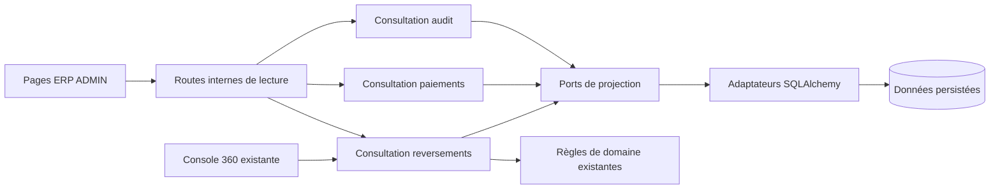

# EPIC 65 — Architecture et contrats cibles

Spécification V1.4, implémentation locale le 1er octobre 2026. [Parcours et périmètre](README.md),
[preuves attendues](verification-livraison.md). Les routes et DTO ci-dessous sont implémentés localement ; le contrat exporté
provient du code. Cela ne prouve pas leur disponibilité sur un environnement déployé.

## Propriétaires et frontières

| Objet / règle conservée | Propriétaire | Contribution E65 |
| --- | --- | --- |
| Autorisation des interfaces globales | `identite_acces`, politique ADMIN de `permissions_backoffice.py` | Chaque page et API E65 vérifie ADMIN explicitement ; ne pas élargir la permission historique ni se contenter de `contexte_erp`. |
| Événement d’audit persisté | Domaine `exploitation` | Lecture globale filtrée, sans transition ni réécriture d’événement. Le service applicatif assainit la projection ; l’adaptateur fournit les champs persistés. |
| Paiement, achat/commande, états financiers | Domaine `gestion_achats` et services financiers existants | Nouvelle projection globale, mapping partagé avec Vision 360 Achats. Déplacer la normalisation pure actuellement applicative vers une politique de domaine partagée si extraite, sans changer ses résultats. |
| Reversement, paiement de reversement, mouvement | Domaine `gestion_reversement` | Politique pure de classement des montants et refus d’éligibilité ; aucun changement de transition ou d’exécution financière. |
| Compte commerçant éligible | `Commercant.stripe_connect_eligible` | Réutiliser cette propriété, y compris `stripe_requirements_due`, omis dans le résumé historique de la console ; ne pas recopier son calcul incomplet. |
| Virement bancaire | `PayoutStripe.statut_public()` et associations persistées | Réutiliser les états canoniques par association ; une présentation ne déduit pas le paiement de tous les reversements du dernier payout reçu. |
| Pièces et demandes de facturation | Domaines documentaire / facturation existants | Liens de lecture vers les documents réellement rattachés aux achats enfants ; aucune génération ni transition. |

Respecter l’[ADR domaine d’abord](../../architecture/decisions/ADR-2026-08-28-domaine-avant-services-applicatifs.md).
Les nouveaux services applicatifs orchestrent droits, requêtes de projection,
lecture cohérente, rattachements et DTO. Les requêtes SQL et index appartiennent
aux adaptateurs ; agrégats descriptifs et pagination ne deviennent pas de fausses
règles d’entité. Toute décision d’éligibilité/classement financier est pure,
commune aux entrées qui l’utilisent et testée indépendamment des ORM.

```mermaid
flowchart LR
  ERP[Pages ERP ADMIN] --> API[Routes internes de lecture]
  API --> Audit[Consultation audit]
  API --> Achats[Consultation paiements]
  API --> Finance[Consultation reversements]
  Ancien[Console 360 existante] --> Finance
  Audit --> Ports[Ports de projection]
  Achats --> Ports
  Finance --> Ports
  Finance --> Domaine[Règles de domaine existantes]
  Ports --> SQL[Adaptateurs SQLAlchemy]
  SQL --> DB[(Données persistées)]
```

Services cibles : consultation dans `application/exploitation`,
`application/gestion_achats` et `application/gestion_reversement`, via ports de
lecture des domaines correspondants. Leurs implémentations ne doivent importer
ni `admin.py`, ni un renderer HTML, ni directement un ORM. Ne pas réutiliser les
repositories à résultat limité/unique pour simuler une liste complète.

## Extraction du suivi reversements

Le constructeur `_build_reversements_360_data` de
[admin.py](../../../../localeo-backend/app/infrastructure/admin/admin.py) mêle
SQL, agrégation, règles et présentation. L’extraction fait partie de l’EPIC :

1. Introduire un port de projection et son adaptateur SQL. Appliquer le périmètre
   en base, dédupliquer les identifiants avant toute jointure de détail et sommer
   avant pagination. Ne pas charger toutes les lignes pour paginer en Python.
2. Isoler les décisions de classement/éligibilité au domaine, réutiliser le
   commerçant et le payout canoniques. Les champs, couleurs et URL restent des DTO/UI.
3. Faire consommer la même consultation par l’ERP et la console 360 historique,
   avec adaptateur de rendu pour ses anciennes clés. Maintenir son URL, ses actions
   et son export existant ; ne modifier ni leur portée financière ni leurs droits.
4. Prouver la parité des dossiers sélectionnés. Tracer les corrections de lecture
   assumées : exigences Stripe dues, devises séparées, remboursements hors sélection
   non incorporés, conservation des paiements sources explicitement liés et
   absence de faux « tout viré » fondé sur le dernier payout.

Le filtre de campagne de la consultation n’est **pas** le paramètre d’exécution
du lancement historique. Le lien de traitement ne promet pas que les dossiers
visibles seront les seuls traités ; la console conserve son propre périmètre
et son action explicite de lancement. Ne pas supposer une boîte de confirmation
que le formulaire historique ne possède pas.

## Routes et accès

Le producteur sera FastAPI/Pydantic dans le backend ; consommateur unique des
nouveaux contrats : assets ERP servis par ce même backend. Garder les tags de
domaine et d’exposition des [conventions API](../../architecture/transverse/conventions-api-openapi.md).

| GET cible | Réponse et objet |
| --- | --- |
| `/internal/exploitation/evenements-audit` | `PageAudit` |
| `/internal/exploitation/evenements-audit/{id}` | `DetailAudit` |
| `/internal/gestion-achats/paiements` | `PagePaiements`, synthèse du périmètre filtré incluse |
| `/internal/gestion-achats/paiements/{id}` | `DetailPaiement` |
| `/internal/gestion-achats/paiements/{id}/achats` | Achats enfants paginés, liens de consultation documentaire |
| `/internal/gestion-reversement/suivi/commercants` | `PageSuiviCommerces`, synthèse incluse |
| `/internal/gestion-reversement/suivi/commercants/{id}` | Résumé du commerce dans le périmètre filtré |
| `/internal/gestion-reversement/suivi/commercants/{id}/{section}` | Section paginée, enum fermé `mouvements`, `reversements`, `paiements` |
| `/internal/gestion-reversement/suivi/reversements/{id}` | `DetailReversement`, identité et résumé complet hors filtre de liste |
| `/internal/gestion-reversement/suivi/reversements/{id}/{section}` | Section complète paginée, enum fermé `mouvements`, `paiements`, `sources`, `virements` |

Les déclarations de routes doivent éviter que `suivi` ou une section soit capturé
comme UUID. Aucun POST/PATCH/DELETE E65. Les pages IHM sont celles du README ;
les sections du tableau sont implémentées comme routes explicites, pas comme
paramètre enum FastAPI générique, afin qu’une section inconnue réponde 404.
Le détail d’un commerce financier peut rester un filtre `commercantId` de la
page Reversements, avec lien vers la fiche commerçant canonique.

**Session :** cookie interne et rôle ADMIN vérifié dans chaque route HTML/JSON.
Pas d’accès accordé par une clé `internal:finance` ou `internal:batch` à ces vues
de session ; leurs API techniques existantes restent distinctes. Réutiliser le
contexte ERP pour l’identité vérifiée, puis la politique ADMIN. La liste des
préfixes internes et les tests middleware doivent être examinés : `/internal/erp`
est actuellement exempté du verrou historique global.

Réponses `Cache-Control: no-store`, requêtes ERP `credentials: same-origin`.
Pas d’état sensible en stockage persistant navigateur. Les GET n’exigent pas de
clé d’idempotence ; répétition autorisée sans effet métier. Le mécanisme de
session et les logs d’observabilité existants restent applicables. Aucune nouvelle
écriture d’audit de consultation n’est introduite qui alimenterait sa propre liste.

### Intégration dans la chaîne de session existante

La relecture du backend `ad42635` distingue trois contrôles complémentaires :
[`AdminSessionMiddleware`](../../../../localeo-backend/app/security/admin_session.py)
vérifie la session persistée et sa révocation ;
[`contexte_erp`](../../../../localeo-backend/app/security/erp.py) vérifie les
attributs d'identité et de rôle du cookie ; la politique ADMIN refuse ensuite
les lectures globales aux autres profils. Le cookie seul ne prouve pas que la
session est encore valide. Une indisponibilité du registre des sessions renvoie
503 et ne doit jamais permettre une lecture des données E65.

Les tests actuels `test_erp_session_access.py` montent le routeur avec le seul
`SessionMiddleware` : ils prouvent les contrôles du cookie, pas la révocation
persistée. Les nouveaux tests E65 doivent aussi monter la chaîne complète dans
une application isolée, avec un double explicite du registre, puis vérifier
session active, expirée, révoquée et registre indisponible. Le rôle ADMIN est
contrôlé avant la projection métier, y compris sur une section ou un UUID absent.

Le middleware global de `main.py` choisit aujourd'hui certaines redirections
selon `Accept: text/html`. Pour les nouvelles API JSON E65, une requête anonyme
reste un 401 JSON, même avec cet en-tête ; seule une page HTML de consultation
redirige en 303 vers la connexion. Adapter cette classification pour les routes
E65 identifiées, sans exempter globalement leurs préfixes de l'authentification.
Les erreurs 401/403/404/422/503, comme les succès, portent `Cache-Control: no-store`.

Le routeur IHM actuel n'admet ni les trois nouvelles pages ni leurs détails.
Ajouter leurs routes et garde ADMIN avant les routes génériques du shell ;
garder les assets dans l'allowlist du serveur. Les rubriques Finance/Supervision
restent accessibles selon les droits actuels, mais leurs nouvelles destinations
E65 sont proposées seulement aux ADMIN. Aucune redirection générale des anciennes
URL SQLAdmin n'est requise : leurs accès historiques restent disponibles.

« Lecture sans mutation » vise les données métier : aucun paiement, mouvement,
document ou événement d'audit ne change. Le registre de session et le mécanisme
existant de renouvellement d'activité restent autorisés. La lecture cohérente
des projections n'englobe pas la transaction technique de vérification de session.
E65 n'introduit ni renouvellement de rôle depuis un nouveau référentiel ni
refonte des profils : ces évolutions sont désormais portées par la nouvelle
[EPIC 69](../../roadmap/en-cours/epic-69-profils-acces-erp-satellites-backlog.md),
qui reprend le cadrage initialement rattaché à E35.

## Paramètres et enveloppe commune

- `page` entier ≥ 1, défaut 1 ; `pageSize` défaut 25, intervalle 1–100.
- `dateFrom`, `dateTo` : dates ISO, fin incluse ; paire complète, ordre valide.
  Fenêtre maximale **366 jours** ; consulter une autre fenêtre pour l’historique.
  Ce bornage technique cible ne modifie pas la rétention.
- Sans aucun paramètre de période, le serveur applique les valeurs par défaut
  du README ; avec un seul paramètre d’une paire ou dates et campagne simultanées,
  il refuse en 422. Les valeurs effectivement utilisées sont toujours retournées.
- `query` facultatif, texte nettoyé ≤ 150 caractères ; recherche sur les champs
  explicités pour chaque vue. Pas de recherche libre dans les métadonnées, noms
  de tables ou expressions SQL. Caractères `%` et `_` traités littéralement.
- Tous les filtres sont appliqués avant `count`, agrégats et pagination. Filtres
  inconnus/invalides refusés ; listes vides représentées par `items: []`, `total: 0`.

Réponse paginée : `{items, page, pageSize, total, hasMore, generatedAt,
appliedFilters}`. `total` compte les objets de cette liste, pas les lignes de
jointure. `generatedAt` est UTC ISO 8601 avec suffixe Z. `appliedFilters` précise
les filtres normalisés, `timezone`, `dateBasis`, `fromInclusive`, `toExclusive`.
Les champs d’une réponse ont des types fermés ; aucun dictionnaire ORM brut.

La liste financière et sa synthèse sont calculées dans la même lecture cohérente
(transaction de lecture PostgreSQL à instantané partagé pour cette requête).
La pagination est déterministe sur un jeu inchangé ; elle n’est pas un export
figé entre plusieurs requêtes. Les changements concurrents sont visibles à la
prochaine lecture, avec un nouveau `generatedAt`. Après suppression/purge ou
page devenue vide, proposer un retour à la première page. Les détails font
autorité à leur propre date de lecture ; aucun statut conservé en navigateur
ne vaut confirmation financière.

Pour `E65-CA-07`, l'absence d'omission/doublon est vérifiée sur un jeu stable,
y compris dates égales et jointures multiples. Des insertions ou changements
d'état entre deux pages peuvent déplacer les lignes : `generatedAt` est une
date de lecture, pas un jeton d'instantané ni une preuve de changement.
L'interface indique que les résultats peuvent évoluer et permet de reprendre
la première page ; cette V1 ne promet pas une traversée figée sous concurrence.
Une page au-delà du total renvoie 200, `items: []`, `hasMore: false` et le vrai
total/synthèse, sans remplacer ceux-ci par zéro.

La recherche textuelle est une sous-chaîne insensible à la casse, sauf les
références exactes explicitement indiquées pour Reversements. Après trim, une
recherche vide équivaut à l'absence de recherche. Les égalités de filtres restent
exactes après leur normalisation documentée ; des critères différents se
combinent par ET. Un paramètre scalaire répété est refusé en 422, afin de ne pas
laisser serveur et navigateur sélectionner des valeurs différentes. Un détail
Audit/Paiement/Reversement accepte uniquement son identifiant ; ses sections
acceptent pagination et filtres de section expressément prévus, jamais les
filtres de liste hérités implicitement de l'URL précédente.

### Dates et périmètres

Audit : `date_evenement`; Paiements : `date_creation`. Bornes de journées
Europe/Paris converties en UTC (fin au minuit suivant, y compris changement
d’heure). Les timestamps naïfs historiques sont interprétés comme UTC, sans
réécriture des données ; une date ne devient pas une date de paiement par renommage.

Reversements : conserver la **fermeture de dossiers historique**. Les dates
sélectionnées utilisent des bornes UTC, affichées comme telles. Sans dates,
la campagne courante est choisie selon la date Europe/Paris : 1–15 ou 16–fin
du mois. `campaign` vaut `FIRST_HALF` ou `SECOND_HALF`, accompagné de `month`
au format YYYY-MM ; ces paramètres sont exclusifs d’une paire de dates explicites.
`campaign` et `month` forment une paire obligatoire dès que l’un est fourni :
un mois seul, une campagne seule, un mois invalide ou leur combinaison avec
`dateFrom`/`dateTo` répond 422. Les paramètres de campagne sont propres au suivi
des commerces ; Audit et Paiements les refusent. Les détails Audit, Paiement
et Reversement par identifiant, ainsi que leurs sections complètes, n’acceptent
pas de filtre de période : leur accès direct doit retrouver le même objet même
lorsque la liste change de campagne. Le résumé et les sections de suivi d’un
commerce conservent, eux, les filtres de période/campagne de la liste des commerces.
Le serveur retourne toujours les dates effectives ; février et années bissextiles
sont calculés au calendrier, pas par nombre fixe de jours.

La sélection inclut les mouvements datés dans la fenêtre, les reversements créés
dans la fenêtre, et ceux dont un paiement a `date_demande_operation`,
`date_confirmation_operation`, `date_execution` ou `date_export` dans la fenêtre.
`PaiementReversementOrm` n’a pas de date de création propre : la date de création
du reversement constitue le cinquième prédicat de sa jointure historique.
Ajouter aussi les reversements référencés par les mouvements initiaux, puis
**tous** les mouvements et paiements associés aux reversements ainsi sélectionnés,
même hors fenêtre. Le filtre commerce s’applique à tout cet
ensemble. Le DTO expose `dateBasis: DOSSIERS_ACTIFS`, et le texte UI « Dossiers
actifs sur la période, composition complète ». Un événement financier peut donc
figurer dans deux fenêtres ; les totaux ne sont pas additionnables entre périodes.
Les mouvements sans reversement restent sélectionnés par `date_mouvement`.
Les paiements client sources et payouts associés sont ensuite lus sans nouveau
filtre de date. Dédoublonner chaque ensemble sur son propre ID avant agrégation.

## Audit : filtres et DTO

Filtres supplémentaires : `action`, `phase`, `actor`, `requestId`,
`resourceType`, `resourceId`, `merchantId`, `purchaseId`, `instanceId` ; les trois
derniers sont UUID. Les autres sont des égalités textuelles bornées, pas des enums
fermés inventés pour des historiques libres. `query` cherche id, action, requestId,
resourceId et identifiants métier textuels ; acteur via filtre explicite.
Tri : `(date_evenement DESC, id DESC)`.

`AuditItem` : `id: UUID`, `occurredAt: datetime`, `action: string`,
`phase: string|null`, `actor: string|null`, `resourceType: string|null`,
`resourceId: string|null`, `requestId: string|null`.

`DetailAudit` ajoute méthode HTTP, chemin assaini sans query/fragment, références
métier, liens internes autorisés et `metadata: [{name, value}]` après sélection
positive. Valeurs scalaires ou listes scalaires bornées, texte échappé ; maximum
30 champs, 1 000 caractères par valeur et `metadataTruncated: boolean`.
Champs non autorisés omis, avec indicateur d’occultation sans révéler leur contenu.
L’assainissement à la lecture est obligatoire même si `ServiceAudit` assainit
normalement les écritures. Aucun lien vers une valeur libre de metadata/path.

Liste positive V1 des métadonnées : `version`, `expected_version`, `count`,
`nombre` (entiers non négatifs) ; `code`, `error_code` (codes connus du producteur,
pas une chaîne libre de message) ; `achat_id`, `commande_id`, `commercant_id`,
`coffret_instance_id`, `reversement_id`, `paiement_id` (UUID valides) ;
`changed_fields` (noms de champs connus, sans anciennes/nouvelles valeurs).
Tout autre champ, objet imbriqué ou valeur ne respectant pas ce type est omis.
La liste de codes/noms admis reprend les producteurs déjà recensés lors de
l’implémentation ; un inconnu est occulté, sans empêcher l’affichage de l’événement.
Étendre cette liste impose un test de non-divulgation, pas un repli en JSON brut.

Compléments V1.2 issus du producteur de validation
[`ServiceValidationPrestation`](../../../../localeo-backend/app/application/exploitation/services/service_validation_prestation.py) :
`validation_id`, `prestation_coffret_id`, `mouvement_reversement_id` sont admis
comme UUID ; `prestation_version`, `prestations_restantes` comme entiers non
négatifs. Un booléen n'est pas admis comme entier. Tant qu'un code ou nom de
champ n'est pas recensé dans une liste positive testée, il est occulté.
`metadataRedacted: boolean` signale les champs/valeurs omis ;
`metadataTruncated` ne concerne que les bornes de taille. Aucun nom de clé
inconnu n'est renvoyé pour expliquer une occultation.

L'assainissement porte aussi sur les colonnes hors metadata. Retirer query et
fragment d'un chemin ne suffit pas : un jeton peut être un segment d'URL.
`path: string|null` est un gabarit interne reconnu, avec paramètres remplacés
par leurs noms, jamais le chemin historique brut. Si le chemin n'est pas
reconnu, retourner null. `method` est une méthode HTTP reconnue ou null.
`resourceId` n'est une référence navigable que si le type et le format sont
reconnus ; un chemin, une URL ou une valeur suspecte est occulté. Les champs
textuels exposés sont bornés et assainis avant sérialisation, puis échappés
par l'interface. Aucun lien ne résulte d'une concaténation de texte historique.
L'acteur persisté vide ou `unknown` devient null / « Non renseigné » ;
`anonymous` désigne explicitement un acteur anonyme. Ne pas les remplacer par
l'identité de l'opérateur courant ni leur attribuer une identité nominative.

Ces règles complètent, sans la modifier, la collecte actuelle :
[`ServiceAudit`](../../../../localeo-backend/app/application/exploitation/services/service_audit.py)
masque certaines clés à l'écriture, tandis que
[`erp_api.py`](../../../../localeo-backend/app/api/erp_api.py) écrit aussi des
événements ORM directement. Le repository global
[`EvenementAuditRepositorySqlAlchemy`](../../../../localeo-backend/app/infrastructure/persistence/repositories/repositories_sqlalchemy.py)
reste limité à 200 sans filtres ; sa projection Animation spécialisée n'est
pas le contrat global E65.

## Paiements : filtres, sources et DTO

Filtres supplémentaires : `provider`, `normalizedStatus`, `financialsStatus`,
`rootType` (`ACHAT`/`COMMANDE`), `rootId` UUID, `origin` issu du dossier racine,
`currency`. `query` cherche référence/UUID de paiement, transaction, achat/commande
et références Stripe connues ; aucune recherche payeur par coordonnées en V1.
Tri : `(date_creation DESC, id DESC)`.

| Champ DTO | Source et sémantique |
| --- | --- |
| `id`, `provider`, `status` | Valeurs persistées ; `status` reste le statut brut. |
| `normalizedStatus` | Normalisation actuelle Vision 360 Achats : `SUCCEEDED`, `PENDING`, `FAILED`, `EXPIRED`, `UNKNOWN`, à partager sans seconde table de correspondance UI. |
| `createdAt` | `date_creation` UTC, pas `paidAt`. |
| `rootKey`, `rootType`, `rootId`, `origin` | Racine canonique `COMMANDE:<uuid>` ou `ACHAT:<uuid>` ; achat enfant rattaché à sa commande. Conserver aussi `sourceAchatId`/`sourceCommandeId` pour expliquer le rattachement original. |
| `payerLabel` | Libellé masqué issu du dossier racine ; coordonnées complètes accessibles seulement par le parcours existant habilité/audité, jamais copiées dans la liste. |
| `grossAmountCents`, `currency` | `montant_brut_centimes`, `devise` normalisée selon la règle commune ci-dessous ; nullables, aucune valeur EUR inventée. |
| `stripeFeeAmountCents`, `stripeNetAmountCents` | `stripe_fee_amount`, `stripe_net_amount`, nullables. |
| `localeoGrossCommissionCents`, `localeoEstimatedNetCommissionCents` | Colonnes de commission existantes ; estimation explicitement nommée. |
| `financialsStatus`, `financialsSyncedAt` | `stripe_financials_status` (`PENDING`, `COMPLETE`, `FAILED`, `NOT_APPLICABLE`) et date persistée. |
| `financialsError` | Code/message opérateur assaini, jamais erreur fournisseur brute. |

Le détail ajoute `transactionId`, références Stripe connues, liens vers dossier
achat et support autorisés, plus les disponibilités des sections. Il ne sérialise
pas de payload Stripe, moyen de paiement ou secret. Une racine absente/incohérente
produit `sourceStatus: INCOMPLETE`, liens absents et diagnostic ; ne pas masquer
le paiement ni lui inventer un achat.
`rootKey`, `rootType`, `rootId`, `origin`, `sourceAchatId` et `sourceCommandeId`
sont donc nullables. `sourceStatus` vaut `COMPLETE` ou `INCOMPLETE` ; un ID source
persisté peut rester visible lorsque le dossier cible manque, sans lien navigable.

**Parité avec le dossier Vision 360 Achats.** Pour une racine COMMANDE, la lecture
commune sélectionne l’union des paiements directement rattachés à la commande et
des paiements rattachés à chacun de ses achats enfants, dédoublonnée par ID de
paiement. Le schéma actuel autorise ces deux formes de rattachement ;
`ServiceVision360Achats._paiements` ne sélectionne actuellement que la première.
L’EPIC doit donc adapter cette lecture et ses diagnostics consommateurs avec la
projection ERP, sans modifier les rattachements persistés ou les commandes de paiement.

Exemple de recette : commande C, achat enfant A, paiement réussi P attaché à A
et paiement réussi Q attaché à C. E65 et le dossier canonique présentent P et Q
sous C ; le diagnostic existant de succès multiples reste visible (`AMBIGUOUS`).
Ne pas fusionner ces paiements ou choisir Q au motif qu’il est directement lié
à la commande. Les listes filtrées restent filtrées ; le dossier présente toutes
les tentatives de sa racine, même celles hors période de la liste.

`/achats` pagine les achats enfants réels de la racine, avec `achatId`, référence,
liens vers consultation des documents et demandes existants. Une commande peut
en avoir plusieurs. Une racine ACHAT sans commande retourne cet achat une seule
fois. Tri stable par `AchatCoffretOrm.date_creation DESC, id DESC` (dates nulles
en dernier), date exposée comme `createdAt`, total calculé avant pagination ;
aucun filtre de période de la liste des paiements ne retranche un achat enfant.
La page `/internal/achats/{id}/documents` est un **dossier de traces** : elle
ne fournit pas actuellement un téléchargement des fichiers de chaque trace.
Dans `admin.py`, son lien GET `receipt.pdf` vise une route seulement POST qui
génère un reçu ; `pack.zip` est décommissionné (410). L'intégration E65 doit
retirer ce faux lien de téléchargement du parcours de consultation, y compris
de la page de traces réutilisée. Les commandes de génération existantes restent
dans leurs parcours explicites autorisés.

Pour chaque achat, le DTO distingue `documentTraceCount: int|null`,
`documentAvailability: AVAILABLE|TRACE_ONLY|NONE|UNKNOWN`, `documentDossierUrl: string|null`
et `documentLinks: [{documentId,label,href}]`. `AVAILABLE` exige au moins une
pièce dont le fichier et une route de lecture habilitée sont effectivement
disponibles ; `TRACE_ONLY` signifie traces existantes sans téléchargement
attesté ; `NONE` exige une lecture réussie sans trace ni pièce ; `UNKNOWN`
signale une lecture indisponible (compteur null). Plusieurs états de pièces
peuvent coexister : la disponibilité d'une pièce ne certifie pas les autres.
Le lien du dossier de traces ne figure pas parmi `documentLinks`. Les demandes
de facture conservent leurs propres liens/états et ne prouvent pas la présence
d'un fichier. Aucun fichier n'est généré pour rendre un lien disponible ; si
aucune lecture sûre n'existe, afficher cette limite et le dossier de traces.
La V1 ne crée pas un service de téléchargement universel. Les détails des
traces restent dans leur dossier, pas une liste non bornée embarquée dans E65.
`documentLinks` est vide pour `TRACE_ONLY`, `NONE` et `UNKNOWN`. Pour `AVAILABLE`,
il contient au plus 20 liens triés par date de document décroissante puis UUID,
avec `documentLinkCount: int|null` (total avant limite, null si indisponible)
et `documentLinksTruncated: boolean`. Les autres traces se consultent depuis
leur dossier, sans promettre un téléchargement par ce lien ; aucune troncature
n'est silencieuse. Un nom de fichier, hash ou
`stockage_path` seul n'atteste pas un téléchargement : aucun href construit
depuis ce chemin ni par substitution d'un ID `DocumentAchatCoffretOrm` dans une
route du modèle distinct `DocumentOrm`.

`PagePaiements.summary` regroupe **par devise et statut normalisé**, avec nombre
de paiements et agrégats bruts/frais/net/commissions. Chaque agrégat fournit
`knownAmountCents`, `knownCount`, `unknownCount`, `complete`. Aucune donnée connue
donne `knownAmountCents: null` ; des valeurs connues égales à zéro donnent zéro.
Les devises absentes ont un compteur distinct, sans somme. Ne pas additionner les
montants de tentatives échouées aux succès ni présenter le brut comme net encaissé.
Chaque `PaiementOrm.id` n’est compté qu’une fois, indépendamment des achats enfants.

## Reversements : contrat de consultation

Filtres : période/campagne ci-dessus, `commercantId` UUID et `query` (nom du
commerce ou référence exacte de reversement/paiement/mouvement). Pour la V1,
pas de filtre de statut global ambigu. Les sections admettent uniquement leur
`movementStatus`, `reversementStatus` ou `paymentStatus` respectif ; un filtre
de section n’altère pas la synthèse du commerce, dont le périmètre est affiché.
Une recherche par référence sélectionne les **commerces** dont un dossier du
périmètre correspond, puis conserve tous leurs dossiers de la période fermée.
Le libellé UI précise « Commerces concernés » ; le DTO retourne
`selectionScope: MATCHING_MERCHANTS`. Ouvrir le dossier exact passe par son lien
de détail, dont le montant n’est pas confondu avec la synthèse de ses commerces.

`PageSuiviCommerces` contient `items` ordonnés par nom normalisé puis UUID et
`summary` du même ensemble avant pagination. Une ligne porte `merchantId`, nom,
commune disponible, compteurs de dossiers et mouvements, montants par devise,
blocages codés/libellés, disponibilité du suivi bancaire et liens réels.
Le DTO ne transporte ni HTML ni couleur ; il ne décide pas d’un droit financier.

Champs obligatoires de `SuiviCommerce` : `merchantId: UUID`, `merchantName: string`,
`communeId: UUID|null`, `communeName: string|null`, `movementCount: int`,
`reversementCount: int`, `paymentCount: int`, `movementStatusCounts: [{status,count}]`,
`amountsByCurrency: [{currency,due,transferred,remaining,pipeline}]`,
`unknownCurrencyCount: int`, `unclassifiedCount: int`,
`blockers: [{code,label,resourceType,resourceId}]`, `bankingCoverage`, `links`.
`pipeline` contient les quatre postes ci-dessous avec count et agrégat monétaire ;
`summary` reprend ces mêmes agrégats/compteurs avec `merchantCount`, sans `links`
ni identité. Chaque lien est `{rel,label,href}` construit par l’adaptateur depuis
une destination interne autorisée ; les ressources d’un diagnostic peuvent être nulles.

`blockers` est un aperçu borné à 20 diagnostics, ordonnés par code, type et ID
de ressource ; les doublons `(code, resourceType, resourceId)` sont éliminés.
`blockerCount` compte l'ensemble avant limite et `blockersTruncated` signale
les diagnostics supplémentaires. Même contrat dans `DetailReversement`.
Les sections paginées portent les diagnostics de leurs objets ; les anomalies
de source sont sur les mouvements, celles d'association sur les virements.
Les blocages du commerce sans ressource restent dans son résumé. La limite de
présentation ne modifie ni un compteur, ni la synthèse financière, ni l'éligibilité.

La synthèse classe chaque mouvement une seule fois selon **son statut** dans
les quatre postes historiques de `_reversement_pipeline`, sans le déduire du
statut d’un paiement ou de la présence d’une référence :

| `stage` | Statuts mouvement |
| --- | --- |
| `a_preparer` | `A_CALCULER`, `TRANSFERABLE`, `BLOQUE_ONBOARDING_STRIPE`, `A_REVERSER` |
| `en_cours` | `EN_CAMPAGNE`, `TRANSFER_DEMANDE`, `EN_COURS_DE_REVERSEMENT` |
| `transfere` | `TRANSFER_CONFIRME`, `REVERSE` |
| `echec` | `ECHEC_TRANSFER` |

`ANNULE` reste dans un compteur séparé, hors sommes dues/restantes. Un statut
inconnu, vide ou absent alimente `unclassifiedCount`, jamais un poste payé.
Pour rester comparable aux montants historiques, `due` somme tous les mouvements
non annulés, `transferred` les deux statuts transférés et `remaining` les non
annulés non transférés ; les inconnus sont donc signalés comme part non classable
de `due`/`remaining`, pas supprimés silencieusement. Ces termes désignent les
mouvements du dossier, pas une balance comptable ni un encaissement bancaire.

Une référence manquante ne change pas le poste. Diagnostics distincts : paiement
`TRANSFER_DEMANDE`/`TRANSFER_CONFIRME` sans `stripe_transfer_id`, référence transfer
sans BalanceTransaction, paiement `ECHEC`, mouvement actif sans source retrouvée,
compte Stripe non éligible. Un mouvement sans reversement peut être normalement
à préparer. Les DTO monétaires réutilisent les champs de complétude définis pour
les paiements : aucun montant absent n’est remplacé par zéro.

Le libellé de synthèse du commerce conserve l’ordre de la politique historique
après retrait des annulés : aucun mouvement → aucun reversement ; échec → échec
à reprendre (partiel si transfert aussi présent) ; tous transférés → crédité sur
le compte Stripe ; une partie transférée → partiellement transféré ; en cours →
en cours chez Stripe ; bloqué onboarding → compte incomplet ; transférable → prêt
à être transféré ; sinon → à préparer. Si tous les statuts sont inconnus, remplacer
le dernier repli par « État à contrôler », sans présumer leur éligibilité.

`DetailReversement` expose identité, commerce, montant et devise du domaine,
statut, dates source, compteurs et liens de sections. Champs : `id`, `merchantId`,
`status`, `createdAt`, `amountCents`, `currency`, `sectionCounts`, `bankingCoverage`,
`blockers`, `links`. Montant absent et date absente restent nullables.
Les sections sont paginées indépendamment, avec les tris et champs suivants :

| Section | Champs de chaque élément, outre `id` et `links` | Tri décroissant, puis ID décroissant |
| --- | --- | --- |
| mouvements | `status`, `occurredAt`, `amountCents`, `currency`, `reversementId`, `sourcePaymentId`, `sourceStatus` | `date_mouvement` |
| reversements (commerce) | Champs de `DetailReversement` sans listes de détails | `date_creation` |
| paiements de reversement | `reversementId`, `status`, `amountCents`, `currency`, `requestedAt`, `confirmedAt`, `executedAt`, `exportedAt`, `stripeTransferId`, `stripeBalanceTransactionId` | Première date non nulle dans l’ordre `date_demande_operation`, `date_confirmation_operation`, `date_execution`, `date_export` |
| sources | `paymentId`, `rootKey`, `sourceStatus`, `grossAmountCents`, `currency`, `createdAt` ; ID du paiement source comme ID de ligne | `PaiementOrm.date_creation` |
| virements | Champs d’association et de payout décrits ci-dessous ; ID d’association comme ID de ligne | `Association.date_rapprochement` |

Les dates nulles sont placées en dernier (`NULLS LAST`) avant le départage par
ID et affichent « Date non renseignée ». Les UUID de rattachement, références
fournisseur et montants absents restent nullables ; aucune chaîne vide ne remplace
une absence. Ce tri et le calcul du total s’appliquent en base avant pagination
pour chaque section, sans limite cachée dans le détail.

### Rattachement des paiements sources

La section `sources` conserve chaque `MouvementReversement.paiement_id` explicite
retrouvé, dédoublonné par **ID de paiement**, jamais par achat. Deux mouvements
liés à deux paiements du même achat conservent donc leurs deux sources ; plusieurs
mouvements liés au même paiement n’en créent qu’une ligne. Ces montants de source
ne s’ajoutent pas aux sommes des mouvements ou reversements.

Pour un mouvement sans ID de paiement, les références d’achat historiques
(`transfer_group` de forme `achat:<UUID>` ou `metadata_stripe.achat_id`) permettent
un repli seulement si l’achat est univoque et possède un seul paiement candidat.
Les candidats sont l'ensemble canonique du dossier : paiement de l'achat seul
s'il n'a pas de commande, sinon union des paiements directs de sa commande et
des paiements de ses achats enfants, dédoublonnée par ID. Aucun filtre de date
ou de succès ne réduit cet ensemble pour fabriquer une unicité. Si la racine
est absente ou incohérente, aucun repli n'est attesté. Ce rattachement explique
une provenance, jamais l'affectation d'une fraction de paiement à un mouvement.
Des références contradictoires, plusieurs tentatives ou un ID explicite introuvable
produisent `sourceStatus: INCOMPLETE` sur le mouvement et un diagnostic lié à son
ID. Aucun repli sur le dernier paiement, ni sélection supposée du paiement réussi.
Le dossier achat connu reste consultable ; aucune fausse ligne de paiement source
n’est créée. Un ID explicite manquant reste visible sans lien vers un paiement
inexistant. Le total de `sources` compte seulement les paiements effectivement
rattachés, les mouvements incomplets étant signalés séparément dans leur section.

Cette correction de lecture est volontaire : `_build_reversements_360_data`
réduit actuellement ses résultats dans `paiements_par_achat`, ce qui ne garantit
pas la conservation de plusieurs références explicites. L’extraction commune doit
supprimer cette ambiguïté sans modifier les liens persistés ni lancer de rapprochement.

Références d’encaissement source : priorité au `paiement_id` explicite, puis à la
provenance d’achat canonique déjà reconnue ; dédoublonnage et absence visibles.
Ne pas exposer les metadata utilisées pour ce rapprochement. Les remboursements
globaux du constructeur historique ne sont pas intégrés au total du commerce
filtré. La V1 renvoie vers le dossier achat pour leur détail ; conserver dans
la console historique un éventuel indicateur global seulement avec son périmètre
distinct explicite, sans le faire passer pour un remboursement du commerce.

### Suivi bancaire

Section `virements` : `associationId`, `paymentId`, `payoutId`, état Stripe,
`reconciliationStatus`, `publicStatus` calculé par le domaine, `includedAmountCents`,
`currency`, `payoutTotalAmountCents`, dates, destination masquée et code d’incident
assaini, `associationCoherenceStatus`, `associationSource`, `reconciledAt`.
L’association n’a pas de devise propre : reprendre celle du payout après
contrôle avec la devise du paiement de reversement. Le montant inclus vient
de l’association persistée. Le total du payout
est contextuel et n’entre jamais dans la somme individuelle des reversements.
Plusieurs associations/tentatives restent visibles ; ne pas additionner deux
tentatives de paiement de la même somme comme deux versements. Sans preuve
d’association, le suivi est « Inconnu / en attente de rapprochement ». Le résumé
de couverture bancaire vaut `COMPLETE`, `PARTIAL`, `UNKNOWN` ou `NONE` et porte
sur la qualité des rattachements, **pas sur le succès du virement**. `NONE` : aucun
paiement transféré à suivre ; `UNKNOWN` : aucun montant transféré attesté par une
association exploitable ; `PARTIAL` : seulement une partie des paiements/montants
transférés est rattachée de manière cohérente ; `COMPLETE` : tous les montants
transférés sont couverts, sans montant inconnu, devise incohérente ou dépassement.
Une somme d’associations de tentatives successives n’est jamais une preuve de
couverture : utiliser les références de transaction/destination persistées pour
identifier le même flux, et signaler l’ambiguïté si elles ne suffisent pas.

Une association n’est exploitable que si `statut_coherence = COHERENT`, ses
références ne sont pas de simples marqueurs `legacy:…` et ses références/montant
sont compatibles avec le paiement. Les états `A_ENRICHIR`, inconnus ou incohérents
restent affichés mais exclus d’une preuve de couverture complète. La source
`MIGRATION_CHAMP_DIRECT` ne suffit pas à attester un rapprochement. Ne pas modifier
`PayoutStripe.statut_public()` pour lui faire décider de cette couverture : son
résultat concerne le payout seulement. L’enrichissement relève du traitement
existant et n’est jamais lancé à la lecture.

La cohérence des références utilise les faits du producteur
[`payouts_stripe.py`](../../../../localeo-backend/app/application/gestion_reversement/services/payouts_stripe.py) :
`destination_payment_id` de l'association doit correspondre au paiement de
reversement ; le compte connecté du payout doit correspondre à sa destination.
La destination de référence est le compte **historisé sur le reversement**
(`ReversementOrm.stripe_account_id`), confronté à la destination de l'intention
persistée lorsqu'elle existe
(`metadata_stripe.intention_transfer.requete.destination_account_id`). Le compte
Stripe actuel du commerçant ne remplace pas cette preuve historique : son
changement ne doit ni déplacer un ancien flux ni invalider une association
cohérente vers l'ancien compte. Si les faits historiques se contredisent ou
ne permettent pas d'attester la destination, la couverture reste non attestée.
La consultation ne réécrit ni le compte historisé ni les associations.
Contrôler également devise et montant inclus. `connected_balance_transaction_id`
désigne le flux du **compte connecté** ; il n'est pas le
`stripe_balance_transaction_id` enregistré à partir du Transfer sur le paiement
de reversement. Deux identifiants différents ne constituent donc pas à eux seuls
une anomalie. Pour identifier un même flux bancaire, utiliser compte connecté,
destination payment et transaction connectée ; les tentatives successives restent
affichées, mais ne multiplient pas la somme couverte. Références absentes,
contradictoires ou incompatibles : couverture non attestée, sans appel Stripe.
Ces références servent au contrôle interne ; le DTO ne doit pas exposer pour
autant une charge utile prestataire brute.

Les objets reversement/paiement historiques exprimés en euros gardent cette devise
issue du domaine. Les mouvements/payouts ont leur devise persistée ; une divergence
produit une anomalie, pas une conversion ni une somme mélangée. Convertir les
`Numeric` exactement en unités mineures par `Decimal`, jamais via `float`.

### Normalisation commune des devises — CA-03, CA-05, CA-06, CA-07

La relecture des producteurs montre deux représentations : les paiements
validés et mouvements utilisent notamment `EUR`, tandis que le service payouts
conserve la valeur fournisseur, notamment `eur`. Une différence de casse ne
constitue pas une différence de monnaie.

La politique pure commune applique trim puis majuscules ASCII avant comparaison,
regroupement ou égalité de filtre ; un code exploitable contient trois lettres
ASCII. Une valeur absente, vide ou mal formée devient inconnue et conserve son
compteur d'incomplétude, sans repli EUR. Un filtre devise vide ou mal formé est
refusé en 422 ; un code bien formé sans résultat retourne une liste vide. Le DTO
`currency` expose cette valeur normalisée ou null. Cette normalisation n'écrit
pas dans les lignes source, ne convertit aucun montant et ne modifie pas les
unités monétaires des modèles historiques.

Ainsi `EUR`, `eur` et ` EUR ` composent un même groupe EUR ; un payout `eur`
peut couvrir un paiement EUR si les autres preuves concordent. EUR et USD
restent deux groupes et une association EUR/USD reste incohérente. Partager
cette politique entre projection paiements, suivi ERP et adaptateur 360 ;
aucune normalisation ou conversion supplémentaire dans le JavaScript.

## Refus, compatibilité et données

Erreurs conformes au socle API : 401 session absente/incomplète, 403 rôle interdit,
404 ressource absente ou section inconnue, 422 UUID/filtre/date/page invalide,
503 lecture indispensable indisponible. Ces statuts concernent les API JSON.
Les pages HTML conservent la convention ERP : 303 vers `/admin/login` sans
session complète, 403 pour un rôle interdit, 404 pour une page ou un UUID
de détail invalide. Vérifier le rôle avant toute recherche de ressource ;
un non-ADMIN ne doit pas distinguer un UUID existant d'un UUID absent.
Réutiliser `ApiErrorResponse` : `code`
optionnel, `detail` assaini, `correlationId`, alias historique `request_id` et
`violations` éventuelles ; sans SQL ni corps prestataire. Un échec de synthèse financière fait
échouer la réponse liste+synthèse ; une section indépendante du détail peut
afficher son propre échec, sans inventer un résultat vide.

Le contrat Pydantic producteur a été exporté hors ligne vers
`docs/specifications/epic-41-api/openapi.json` par
[`generate_epic41_openapi.py`](../../../../localeo-backend/scripts/documentation/generate_epic41_openapi.py),
qui utilise le chargeur isolé `export_openapi_offline.py`.
L'export V1.4 décrit les routes implémentées et a été contrôlé sémantiquement
contre l'instantané précédent ; voir le bilan de vérification.
L’ERP ne doit pas embarquer un deuxième schéma maintenu à la main. Les anciens
contrats publics/protégés et les trois frontends restent inchangés ; les routes
historiques de consultation/actions conservent leurs chemins et permissions.

Aucune nouvelle entité, migration d’état, réécriture d’audit, backfill Stripe,
politique de rétention ou paramètre secret n’est nécessaire. Les index de date,
racine et jointure sont à examiner avec `EXPLAIN` sur base jetable représentative.
Si un index manque, créer une migration additive indépendante, sans changer une
migration déjà appliquée ; consigner son besoin et son ordre de livraison.

## Limites connues à lever par l’implémentation

Les tables de mapping, la liste positive de métadonnées d’audit et les plans SQL
décrits ici doivent être matérialisés et couverts par tests avant
de déclarer les vues prêtes. Ils ne justifient ni réemploi aveugle de l’ancien
constructeur ni élargissement des permissions. Les choix H01/H02 du README
limitent explicitement la couverture financière de cette version.

## Contrats implémentés — précisions V1.4

- Les schémas fermés sont dans `consultation_audit_api.py`,
  `consultation_paiements_api.py` et `consultation_reversements_api.py` ; tags
  `internal` et domaine propriétaire. Les routes HTML précèdent le shell générique.
- `ConsultationErpMiddleware` intervient après le contrôle de session persistée
  et avant le garde global HTML : une API anonyme conserve un 401 JSON, quel que
  soit `Accept`. Les dépendances répètent le contrôle ADMIN avant toute projection.
- `DetailAudit.method` est la méthode HTTP assainie. `businessReferences` et
  `links` utilisent `type: MERCHANT|PURCHASE|INSTANCE` et UUID. Les codes et champs
  modifiés non recensés restent occultés ; aucune clé inconnue n'est renvoyée.
- `summary.groups` des paiements contient les groupes devise/état normalisé et
  cinq agrégats monétaires. `invoiceRequests` des achats est borné à 20 demandes,
  avec `invoiceRequestCount` et `invoiceRequestsTruncated`. Les tables de traces
  disponibles ne prouvent pas un téléchargement : elles produisent `TRACE_ONLY`
  ou `NONE`, jamais un faux `AVAILABLE`. Une panne de lecture indispensable
  répond 503, sans retourner un faux zéro ni une fausse absence de pièce.
- Le suivi des reversements expose `cancelledCount`, un code `status` de synthèse
  et un `pipeline` sous forme de liste `{stage,count,amount}`. Un mouvement expose
  `outsidePeriod` dans le suivi filtré du commerce. Les sections sans période
  conservent la composition complète sans inventer une fenêtre de référence.
- Les champs de section `blockers` portent les diagnostics de leurs objets.
  La couverture bancaire reste un enum `NONE|UNKNOWN|PARTIAL|COMPLETE` ; les états
  du payout sont distincts, y compris après un échec tardif. Les associations
  de tentatives du même flux sont dédupliquées ; des montants contradictoires
  ne constituent même pas une preuve partielle de ce flux.
- La console historique et son CSV consomment la projection partagée. Le CSV
  sépare les devises et indique la complétude des montants et la couverture des
  rattachements, au lieu d'attribuer à tout un commerce l'état de son dernier payout.
  L'URL d'export et les commandes financières existantes sont conservées.

Les détails des résultats réellement exécutés et des écarts examinés sont dans
le [bilan de validation](verification-livraison.md#bilan-dimplementation-v14).
