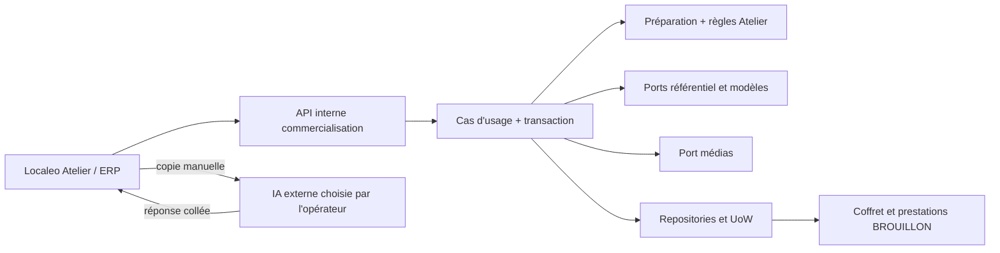

# Localeo Atelier — Domaine, données et transaction

[Spécification V1 et décisions](README.md) · [Contrats](contrats.md)

## Responsabilités

La V1.1 ci-dessous décrit le socle implémenté. Les sections **Extensions V1.2**
précisent l'évolution implémentée localement et priment pour les comportements
modifiés ; les limites de validation restent dans le bilan V1.2.

Conception conforme à l'[ADR domaine d'abord](../../architecture/decisions/ADR-2026-08-28-domaine-avant-services-applicatifs.md).
Le domaine **commercialisation** porte la préparation, la cohérence du retour et
la création du coffret. Référencement fournit les faits des commerçants/modèles ;
identité/accès fournit les capacités et communes autorisées ; DAM possède les médias.
La conformité BUM et les règles financières existantes restent leurs propriétaires.

| Élément | Responsabilité et opérations |
| --- | --- |
| Préparation persistée et règles pures de préparation | UUID, commune, paramètres opérateur, sélection versionnée, contexte émis, proposition validée, état, version et résultat. Les commandes orchestrent modifier, émettre un contexte, accepter une proposition, retoucher, marquer créée, en appliquant les règles du domaine. |
| Sélection normalisée | 1..20 modèles distincts pour émission/import/création ; références/version, commune unique, absence de libellés incompatibles et ordre complet. Un enregistrement incomplet peut avoir 0 sélection. |
| Proposition éditoriale normalisée | Nom/accroche/description, ordre et texte alternatif, référence du média validé, limites du contrat, absence de champs de commande. Le base64 appartient au transport et n'est pas conservé dans cette valeur. |
| Service de domaine pur de préparation | Compare contexte courant et émis ; exige ensemble exact, mêmes versions et faits applicables ; réutilise les règles d'éligibilité et budget de l'Atelier. |
| Politique média Atelier | Décide à partir des faits certifiés par l'adaptateur : image active, WebP décodable, taille réelle < 150 000, quota et accès. Le domaine ne décode pas d'octets et n'appelle pas le DAM. |
| Coffret et prestations existants | Conservent états, copies/version, budget et qualification. Une opération explicite de rattachement en brouillon protège le statut cible sans modifier les autres usages d'Atelier. |

L'application charge les faits et autorisations, ouvre l'UoW, obtient les verrous,
appelle le domaine, persiste et audite. Les repositories traduisent les modèles
persistés. Les routes valident le transport et présentent les refus. Aucune règle
de composition nouvelle ne doit être recopiée dans JavaScript, SQLAdmin ou l'API.

Les règles pures sont portées par
[`preparation_coffret_assiste.py`](../../../../localeo-backend/app/domaine/commercialisation/services/preparation_coffret_assiste.py).
`ServiceAtelierAssiste` orchestre les snapshots et la session transactionnelle ;
la composition réutilise `ServiceAtelierErp.rattacher_en_brouillon` avec un ordre
explicite. Le rattachement ERP historique conserve son comportement. Les modèles
de préparation sont dans `atelier_assiste_models.py` ; il ne s'agit pas de nouveaux
agrégats objet nommés `SelectionPrestations` ou `PropositionEditoriale`.

## Invariants et états

| Référence | Invariant | Entrées et preuves liées |
| --- | --- | --- |
| E66-I01 | Droits ERP et commune recontrôlés à chaque consultation/commande, avant même un rejeu. Être auteur ne donne aucun droit persistant. | Liste, détail, prompt, import, média, création ; CA-01/11. |
| E66-I02 | Exactement tous les modèles sélectionnés, une fois, dans leur version acceptée, issus de la commune. Budget et éligibilité partagés avec l'ERP. | Sauvegarde, prompt, import, retouche et création ; CA-02/05/09. |
| E66-I03 | Une proposition appartient au contexte serveur courant de cette préparation ; un identifiant recopié par l'IA n'est ni un secret ni une autorisation. | Import puis création ; CA-03/04/09. |
| E66-I04 | L'IA ne fournit aucun montant, droit, statut, validation fiscale, URL à télécharger ou modification de source. | Schéma fermé et domaine ; CA-03/05/10. |
| E66-I05 | L'image base64 est décodée strictement et conforme au format/poids réel/accès ; import de la proposition et du média atomique, conformité recontrôlée à la création. | Import, dépôt de remplacement, bibliothèque, rattachement final ; CA-04/05/06. |
| E66-I06 | Une préparation ne produit qu'un coffret, atomiquement, pour tous acteurs/clés et sans expiration de cette garantie. | Transaction et contrainte durable ; CA-07/08. |
| E66-I07 | Coffret et toutes copies/snapshots initiaux sont BROUILLON ; origine IA sans exemption de publication. | Composition et diagnostic ; CA-07/10. |

États persistés :

| État | Opérations permises | Transition |
| --- | --- | --- |
| `BROUILLON` | Sauvegarder une préparation incomplète ou valide ; aucun dépôt/sélection de remplacement avant import complet | Émission valide → `PROMPT_DISPONIBLE`. |
| `PROMPT_DISPONIBLE` | Relire/copier le contexte courant ; importer une réponse | Import valide → `APERCU_VALIDE`. Changement de contexte → `BROUILLON`. |
| `APERCU_VALIDE` | Retoucher les champs éditoriaux, l'ordre ou l'image ; confirmer création ; remplacer le retour sous le même contexte | Création réussie → `CREEE`. Changement de contexte → `BROUILLON` et proposition invalidée. |
| `CREEE` | Consulter le résultat et ouvrir le dossier ERP selon droits actuels | Terminal pour l'assemblage ; aucune nouvelle création ou retouche de préparation. Contenu préparatoire nettoyable après 30 jours, résultat durable conservé. |
| `EXPIREE` | Aucune reprise ni création | Préparation non créée arrivée au terme des 30 jours ; identifiant jamais réutilisé. |

L'import valide le JSON, le contexte et la sélection puis décode le base64 dans
l'adaptateur sous les bornes de transport. L'image doit être un WebP valide de
1..149 999 octets. L'application persiste asset DAM, proposition normalisée,
référence/checksum et `media_contexte_id` dans une seule transaction. L'import
réutilise quota, limitation de débit et protection idempotente du DAM ; aucun
stockage de la chaîne base64 ou du body brut dans la préparation, les audits ou
le registre de résultats HTTP. Un remplacement sous une nouvelle clé ne duplique
pas un asset de même checksum déjà associé à cette préparation ; ne pas révéler
l'existence d'un asset d'un autre périmètre par une déduplication globale.

Un import refusé ne modifie ni la préparation ni le DAM ; l'ancienne proposition éventuelle
reste stockée et explicitement identifiable comme telle. L'interface ne présente
jamais la réponse refusée comme acceptée. Une source devenue obsolète produit un
blocage dérivé, visible en lecture sans mutation ; pour poursuivre, recharger les
faits et réémettre un contexte par commande. Aucun GET ne crée de coffret, contexte
ou document ; la journalisation de consultation autorisée reste possible.

### Contexte et concurrence

`version` est un entier croissant sur toute mutation de préparation. Chaque commande
reçoit `expected_version`. Un conflit renvoie 409 et la version courante accessible,
sans écrasement. `contexte_id` est un UUID généré côté serveur lors de l'émission ;
le serveur conserve une empreinte SHA-256 du contexte normalisé : commune, paramètres
opérateur, intention, références/versions et faits sources utiles.

Les faits comprennent les textes publics réellement inclus, commerçant et commune,
statuts, version des modèles, montants du calcul interne, situation d'éligibilité
et configuration de contrôle applicable. L'empreinte inclut les faits internes
nécessaires sans les exporter vers l'IA. Une évolution d'éligibilité ou de contenu
invalide l'import même si l'ancien numéro de modèle n'a pas changé. Ignorer les
timestamps sans effet métier. À l'import et à la création, relire/recalculer cette
empreinte sous les verrous nécessaires ; ne pas croire un hash fourni par le client.

Retoucher des textes ou changer d'image incrémente la version et modifie le contenu
confirmé sans changer `contexte_id`. Émettre un nouveau contexte invalide la réponse
précédente et sa confirmation d'image (`media_contexte_id`), même pour la même
sélection. L'import valide associe l'image décodée au nouveau contexte ; une
sélection/confirmation volontaire de remplacement fait de même. Un double clic avec la même clé rejoue
l'émission déjà réussie et ne crée pas un contexte différent.

## Création atomique et reprise

1. Authentifier, vérifier droit de mutation et commune, CSRF et clé d'idempotence.
2. Réutiliser la sérialisation ERP par acteur puis verrouiller la préparation.
   L'ordre de verrouillage de toutes les entrées doit être documenté et commun.
3. Si un résultat existe pour la même version confirmée, vérifier l'accès au coffret
   courant et renvoyer ce résultat. Ne pas revalider les anciennes sources d'un
   assemblage déjà réussi. Une autre version demandée donne un conflit.
4. Sinon exiger `APERCU_VALIDE` et la version attendue. Verrouiller modèles et
   commerçants dans un ordre d'identifiants stable, puis leurs faits d'éligibilité
   et le média retenu ; recontrôler contexte, références, budget et droits.
5. Créer le coffret BROUILLON avec les paramètres opérateur et textes validés.
   Copier chaque modèle avec **statut cible BROUILLON** et snapshot version 1,
   enregistrer le rattachement et l'ordre. Conserver les montants de la source.
   Les brouillons réservent déjà leur budget dans le calcul ERP courant.
6. Lier la préparation au coffret, enregistrer résultat final, version confirmée,
   acteur et audit ; effectuer **un seul commit**. Une erreur à n'importe quelle
   étape annule toutes ces écritures, y compris copies/snapshots et résultat.

Ne pas enchaîner les endpoints existants depuis le navigateur : chacun commettrait
une transaction. Réutiliser les services/ports dans une UoW commune et extraire
vers le domaine les règles touchées ; ne pas créer une seconde politique d'Atelier.
Avec les incréments actuels, la version coffret créée vaut `1 + N` après N copies ;
retourner la version effectivement persistée, jamais la version initiale mémorisée.
Un interblocage ou échec transitoire entraîne rollback et reprise de la même commande.

Le registre ERP de 24 h protège les retries HTTP par acteur. Il est complété par
le résultat durable de préparation et son verrou, avec `coffret_id` unique non nul
uniquement à l'état CREEE. Après 24 h, une nouvelle clé ou un autre acteur autorisé
retrouve le même coffret. Si le coffret est supprimé ultérieurement par une opération
permise, conserver une trace terminale et renvoyer « Coffret supprimé » (410), jamais
recréer. Une purge de contenu doit conserver le marqueur de création et la version
confirmée ; les identifiants supprimés ne sont jamais réutilisés.

## Persistance cible et compatibilité

### Conservation de 30 jours — E66-D05 / E66-CA-11

L'échéance se calcule côté serveur en UTC : dernière modification persistée de
la préparation + **30 × 24 heures** (création initiale si jamais modifiée).
Une lecture, un refus, une tentative échouée, un rejeu idempotent ou le nettoyage
ne modifient pas cette date. Afficher l'échéance à l'opérateur. Toute mutation
valide avant expiration recalcule l'échéance ; une préparation expirée ne peut
pas être réactivée par une ancienne requête.

Dès `maintenant >= expires_at`, interdire reprise/import/création d'une préparation
non créée, y compris avant le passage du nettoyage. Contrôler cette condition
avant le registre de rejeu. La préparation devient EXPIREE ; le contenu à nettoyer
comprend intention, sélection, faits/prompt, proposition éditoriale et références
de travail. Conserver seulement une trace minimale d'identifiant/état/échéance et
de périmètre nécessaire au refus d'accès, sans contenu IA. Elle ne réutilise pas l'ID.

Pour CREEE, nettoyer le même contenu préparatoire après 30 jours mais conserver
le lien/résultat minimal, la version confirmée et le marqueur d'unicité durable.
Ne supprimer ni le coffret, ni ses prestations, ni leurs versions ou achats.
Les médias utilisés par un coffret, une autre préparation ou un autre objet DAM
sont conservés. Pour les médias de travail devenus orphelins, effacer les octets
et marquer l'asset `PURGEE` après vérification de toutes les références. Conserver
son identifiant comme sentinelle : une ancienne URI ne doit jamais retrouver un
nouveau contenu. Le trigger v250 verrouille les assets lors du rattachement d'une
référence et refuse un asset `PURGEE`, pour fermer la course entre purge et usage.
Les sentinelles sont terminales, protégées contre UPDATE et DELETE. Les références
métier sont recherchées aussi dans les snapshots JSON et les variantes d'UUID
(canonique, majuscules, hexadécimal compact) ou d'URI encodées. Toute nouvelle table
persistante doit recevoir le trigger : une couverture incomplète fait refuser la
purge, sans effacement partiel. Les verrous d'assets `NOWAIT` et la reprise de la
transaction complète sur SQLSTATE `55P03`, `40P01`, `40001` sont bornés à trois
tentatives. Un média référencé à l'échéance quitte le suivi temporaire Atelier et
reste un asset DAM durable ; sa libération ultérieure ne déclenche aucune purge
Atelier. Cette conservation n'est pas un ramasse-miettes global du DAM.

Le nettoyage automatique rejoint l'ordonnancement existant, par lots bornés,
avec simulation `dry_run`, audit de compteurs sans contenu et reprise idempotente.
Le batch `commercialisation.atelier.conserver` est planifié chaque jour à 04:00 UTC,
avec une limite de 100 préparations par défaut. L'accès est déjà bloqué à l'échéance, la suppression
physique a lieu au prochain passage réussi. Superviser le retard de nettoyage.
Sous verrou de préparation, recalculer l'échéance avant purge : une sauvegarde
concurrente valide ne doit pas être effacée ; une création déjà réussie conserve
toujours son résultat. Ne pas présenter le nettoyage de la base active comme
l'effacement des sauvegardes, qui suivent la politique d'exploitation existante.

Migration **additive**
[`v250_localeo_atelier.sql`](../../../../localeo-backend/sql/v250_localeo_atelier.sql),
sans modification des SQL historiques. Son existence dans le dépôt ne signifie
pas qu'elle a été appliquée sur les environnements déployés. Le contrôle de schéma
exige les nouvelles tables et colonnes, même lorsque la fonctionnalité est désactivée :

- `preparations_coffret_assiste` : UUID, `ville_id`, `etat`, `version`, acteur/date de
  création/modification, `expires_at` et date de nettoyage, type/prix/validité/intention, sélection ordonnée et versions,
  contexte UUID/empreinte/version du schéma, faits émis autorisés, proposition normalisée,
  `media_id`/checksum/`media_contexte_id`, résultat coffret et version confirmée. Références relationnelles
  aux ressources stables ; snapshots bornés pour contexte et proposition. Index
  `(ville_id, updated_at, id)` pour listes, contrainte d'unicité du résultat.
- `medias_preparation_atelier` : liens préparation/asset et checksum, avec unicité
  par préparation et empreinte. Ils portent la provenance et la déduplication
  locale ; la conservation vérifie les autres usages avant de purger les octets.
- `coffrets` : `accroche` (160), `description` (4 000), `image_alt` (180), nullables,
  limites également portées par les objets-valeur et API. Le nom reste `nom` (200),
  l'image reste `image_uri` dérivée du média. Aucun alias avec les textes BUM.
- `prestations_coffret` : `ordre_presentation` positif nullable. Ordres non nuls
  uniques par coffret ; les créations Atelier affectent 1..N. Les anciennes lignes
  restent nulles, sans changement des textes, prix, statuts ou achats.
- Étendre entités, mappers, repositories, commandes de modification/détail ERP et
  projections publiques. Modifier uniquement les champs fournis : une ancienne
  commande ne doit pas effacer l'accroche/description/alt/ordre nouvellement persistés.

Tri canonique pour les nouvelles compositions : positions explicites croissantes,
puis lignes sans position triées par libellé et UUID. Une prestation ajoutée ensuite
via le dossier ERP prend la dernière position lorsque le coffret utilise déjà ce
mode ; suppression laisse un trou sans changer l'ordre relatif. Pour les coffrets
sans position, conserver le comportement de tri existant de chaque lecteur ; ne
pas réordonner des achats historiques. Toute commande de réordonnancement valide
l'ensemble complet et la version coffret. L'ordre ne change pas la consommation.

La préparation conserve les textes et références du média validé, jamais le base64.
Les photos ne sont pas copiées en base de préparation : réutiliser les références
DAM. Quota, contrôle de flux et stockage des octets restent au DAM. Une référence
libre `image_uri` ne remplace pas un média autorisé dans la commande Atelier.

### Médias

La bibliothèque actuelle n'encode pas un droit territorial par média. V1 : ADMIN
peut choisir les médias actifs du DAM ; EXPLOITATION choisit ceux déposés et liés
à une préparation d'une commune qui lui est actuellement autorisée. Ne pas ouvrir
tout le DAM à un profil limité. Une sélection d'UUID direct applique le même filtre.
Tracer provenance et commune du dépôt dans les données de préparation, pas seulement
dans un libellé de fichier. Les autres parcours DAM conservent leurs droits.

Le contrôle de signature existant ne suffit pas à garantir un WebP valide. L'adaptateur
doit vérifier le décodage, les dimensions et la taille réellement lue, avec limites
de ressources (V1 : image statique, maximum 16 millions de pixels et 8 192 pixels
par côté). Ces bornes de sûreté ne prescrivent aucun ratio créatif. Le texte
alternatif décrit l'image effectivement choisie ; l'opérateur peut corriger celui
proposé avant d'enregistrer. Dépôt refusé : aucun asset ; échec de création : un
asset déjà déposé reste attaché à sa préparation, sans doublon ni suppression globale.

## Effets et frontière fiscale

Création/retouche émet uniquement les audits internes prévus. Pas d'email, paiement,
appel IA, publication ou webhook externe. Les audits portent acteur, IDs, opération,
versions et code résultat ; aucun texte collé, prompt complet, jeton ou texte privé.
L'édition de la promesse garantie et la qualification BUM restent explicites dans
les services existants. Les descriptions éditoriales ne doivent jamais remplacer
les mentions contractuelles dans le panier, le reçu ou les droits du bénéficiaire.
La vérité factuelle du texte reste soumise à la relecture humaine avant création
et à la préparation habituelle avant publication.

## Extensions V1.2 — invariants et prix

| Référence | Règle et propriétaire | Entrées / preuves |
| --- | --- | --- |
| E66-I08 | Commercialisation : en AUTO, le prix enregistré découle de la somme exacte des valeurs TTC autorisées et versionnées ; le client ne fournit pas le total de référence. En MANUEL, aucun changement de sélection n'écrase le prix. | Création/modification de préparation, émission/import/création ; CA-18 à 21. |
| E66-I09 | Commercialisation : un GET ne revalorise jamais une préparation, un coffret ou un achat. Les faits périmés bloquent la progression jusqu'à actualisation explicite. | DTO, candidats, commandes et reprise ; CA-15/21. |
| E66-I10 | Identité/accès : shell PWA, anciennes URL et API imposent les mêmes droits ; une installation et un cache ne sont pas des droits d'accès. | Navigation, middleware, session et API ; CA-13 à 17. |
| E66-I11 | Construction du prompt : les consignes d'expérience sont fixes et prioritaires sur les données libres ; aucun prix ou secret supplémentaire n'est exporté. | Émission du prompt ; CA-03/22/23. |

### Calcul pur et orchestration

Étendre les règles pures de préparation avec le mode et le calcul à partir de
faits autorisés, sans ORM ni JavaScript comme propriétaire du calcul. L'application
charge sous verrou les modèles puis les commerçants dans l'ordre stable existant.
Elle contrôle ensemble exact, versions, commune, droits et éligibilité avant de
transmettre les montants au domaine. Les valeurs absentes, non entières ou négatives
sont refusées ; zéro est un tarif connu, pas une absence. La somme utilise des
entiers en centimes, sans float ni arrondi successif. Les doublons sont refusés.

Séparer l'éligibilité des sources et le budget global dans les règles d'Atelier :
ne plus simuler un coffret à prix artificiellement élevé pour les candidats.
Un candidat structurellement éligible reste sélectionnable même si son reversement
dépasse l'ancien prix. Après validation des sources, calculer la somme complète
puis appliquer les contrôles de budget au prix effectif, jamais avant le calcul.
Le rattachement historique ERP conserve ses contrôles ; il réutilise les mêmes
fonctions de domaine avec le contexte de budget approprié.

Sauvegarder sélection, mode, prix et référence de calcul dans la même transaction.
Un prix manuel hors budget mais dans les bornes monétaires peut être conservé
comme préparation à corriger ; afficher le blocage dérivé. Émission, import et
création exigent prix complet et budget valide. Une sélection invalide ou une
source périmée refuse toute la commande, sans changer le mode, prix ou échéance.
En AUTO, somme nulle, sélection vide ou total supérieur à 99 999 999 donnent
`prix_centimes: null`, avec motif ; le total exact reste visible si calculable.
Passer en MANUEL permet un prix valide indépendant de la somme, sous les contrôles
financiers existants. Aucun prix n'est plafonné silencieusement.

### Stockage, contexte et anciennes préparations

Conserver dans le JSONB `parametres` existant : `mode_prix` (AUTO/MANUEL),
`prix_centimes` effectif, et `reference_prix` serveur uniquement, contenant
`selection: [{modele_id, version, valeur_centimes}]` et `total_centimes`.
La sélection de référence est triée par UUID, bornée à 20 lignes ; pas de libellés,
données personnelles ni copie du prompt. Une sélection vide a une référence vide
et un total 0. Le DTO expose `mode_prix` et `total_prestations_centimes` ; il
n'aplatit pas le snapshot interne. Les écritures remplacent explicitement l'objet
JSONB afin d'être suivies par SQLAlchemy.

Sans `mode_prix` historique, lire **MANUEL**, même si le prix coïncide avec le
total. Préserver le prix, y compris null, et ne rien écrire pendant cette lecture.
Sans référence historique, le DTO peut calculer un total indicatif à partir des
versions encore identiques, sans le persister ; si une version manque ou diffère,
retourner total null et blocage source obsolète. À la première mutation volontaire
de sélection/prix/mode, écrire mode et référence ; les autres modifications ne
forcent pas une lecture/migration de sources anciennes. Une émission explicite
de prompt V2 matérialise aussi mode MANUEL et référence manquants à partir des
sources revalidées, dans la transaction d'émission, en conservant le prix historique.
Si les sources ne sont plus valides, elle échoue sans écrire ces métadonnées.

Pour une référence existante, comparer aussi les montants de ses faits aux sources,
même si leur numéro de version n'a pas changé. Un écart rend la lecture obsolète
et bloque émission/import/création. Recharger puis confirmer explicitement la
sélection (PATCH avec le tableau `selection`, même si les IDs sont identiques)
autorise une nouvelle référence des faits courants après revalidation ; une simple
modification d'intention/type/validité ne vaut pas confirmation de nouveaux tarifs.

Les nouveaux paramètres ne sont pas injectés rétroactivement dans les anciennes
empreintes. Ajouter au contexte émis `version_empreinte: 2` pour la V1.2 : cette
version inclut mode effectif et référence ainsi que les faits/paramètres existants.
Pour un contexte sans version, calculer l'empreinte historique avec les paramètres
historiques uniquement, sans les deux nouvelles clés. Un contexte ancien peut
donc être relu/importé si ses faits n'ont pas changé. Toute modification effective
des paramètres ou de la sélection invalide explicitement ce contexte comme
aujourd'hui ; retouches éditoriales et remplacement de média conservent le contexte
selon leurs règles V1.1. Une émission explicite crée un nouveau contexte. Un rejeu
de commande réussie ne migre ni ne réémet le contexte. Les résultats CREEE et
leurs versions confirmées restent inchangés. Le nettoyage existant efface aussi
les nouvelles métadonnées de préparation, sans toucher au prix canonique du coffret.

Pas de DDL requis : aucun index/colonne/table nouveau, v250 immuable. Les fixtures
et restauration doivent couvrir des JSONB anciens et nouveaux. En cas de retour
à l'ancien backend, désactiver Atelier et empêcher les commandes avec l'ancien
code sur des préparations AUTO ; ce code ne sait pas préserver leur mode.
Ne pas convertir en masse ni réécrire les prix pour permettre ce retour arrière.

## Extensions V1.2 — frontières PWA et session

Servir une coquille dédiée `/internal/atelier/` depuis le backend. Réutiliser
`atelier-assiste.js` par injection des chemins de navigation et du contexte UI ;
aucune duplication des use cases, règles de prix ou contrôles d'import. Les anciennes
routes ERP redirigent vers les nouvelles, après vérification d'accès. Ajouter le
préfixe au garde `interface_interne_avec_perimetre`, sans élargir les rôles ERP.

Le menu partagé reçoit une capacité serveur, pas une déduction de rôle en JS.
Étendre le contexte ERP avec `applications.atelier: {disponible, url}` (voir
contrats). L'échec de lecture masque uniquement Atelier ; ne pas supprimer les
autres liens historiques. ADMIN et EXPLOITATION autorisés sont les rôles actuels ;
pour ce dernier, exiger au moins une commune accessible. Les futures capacités
Lecteur/Backoffice seront intégrées avec l'EPIC 35, sans anticipation.

Le manifeste, les icônes et le worker sont publics, neutres et explicitement
autorisés par le middleware global ; aucune donnée de session ou de préparation.
Les autres routes requièrent session/droits/flag. Le worker ne prend en charge
que les navigations dans `/internal/atelier/`, avec réseau prioritaire et réponse
statique 503 en cas d'erreur réseau. Il ne gère ni ne met en cache les fetch API,
les médias DAM, la page de login ou d'autres applications. Aucun Cache Storage,
IndexedDB, localStorage ou sessionStorage pour les contenus métier, jetons ou
commandes. La page de secours neutre peut être embarquée dans le worker.

Ne pas appeler `skipWaiting` ou recharger via `controllerchange` sans choix
explicite de l'opérateur si une saisie existe. Limiter les opérations de worker
à son propre scope, sans désinscrire les workers Control, Support ou Ops.
Les HTML et données authentifiées sont `no-store` ; sur restauration de page ou
retour de visibilité, masquer provisoirement le contenu puis revalider la session.
Le contrôle technique de session utilise le moniteur partagé, en préservant ses
événements. L'API reste l'autorité, même si l'interface n'a pas encore reçu un retrait
de droits. Un 401/403 supprime les données affichées et bloque les commandes.

Le moniteur actuel ne publie pas d'événement lors de toute expiration détectée.
Étendre son contrat pour émettre `localeo:session-expired` une fois lors du passage
à l'état expiré, sur échéance locale et sur 401 de synchronisation ; ses propres
listeners ne doivent pas réémettre en boucle. Atelier masque et vide le contenu
à cet événement, y compris sur un onglet visible sans action métier. Conserver
`localeo:session-restored` pour la reprise après revalidation complète. Vérifier
les autres applications consommatrices et la propagation de logout entre onglets ;
aucune saisie ni donnée personnelle n'est transmise dans ces événements.

Ajouter un retour de connexion Atelier fermé : seuls `/internal/atelier/` et
`/internal/atelier/preparations/{UUID}` sont acceptés après normalisation, sans
query ni fragment. Rejeter URLs absolues, `//`, antislashs et encodages contournant
la liste ; repli `/internal/atelier/`. Transmettre cette destination par le flux
login, la consommer une seule fois après succès et recontrôler droits/flag à l'arrivée.
L'ouverture d'un nouvel onglet pour se reconnecter conserve l'onglet initial mais
n'autorise pas le rejeu d'une commande ; il recharge son contexte CSRF et l'état
serveur avant reprise. Le logout reste celui du backoffice, avec masquage immédiat
des contenus et propagation via le mécanisme partagé de suivi de session.

La nouvelle lecture de contexte par le menu et la coquille peut être concurrente.
Pour une session serveur réelle sans ancien `erp_csrf`, dériver le jeton CSRF par
HMAC-SHA256 à partir du secret de session et de son token serveur, avec séparation
de domaine `localeo:erp:csrf:v1`. Ne pas écrire un nouveau jeton aléatoire dans le
cookie lors de ces lectures concurrentes. Garder les anciens `erp_csrf` tant que
leur session existe ; le login renouvelle la session et le jeton dérivé. La
comparaison constante, le contrôle Origin et la révocation restent inchangés.
