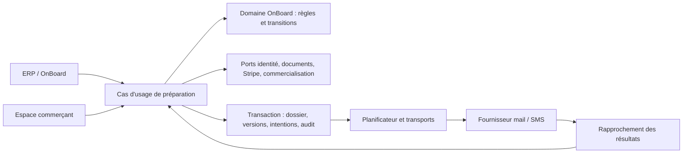

# E68 — Architecture et contrats de préparation

Conception V1.2 du 3 octobre 2026, liée au [parcours](README.md) et aux
[preuves attendues](verification-livraison.md). Tous les ajouts décrits sont des
**contrats cibles**, pas des routes ou colonnes déjà livrées.

Les extensions de la V1.2 ci-dessous servent exclusivement
le dossier, les rendez-vous, les communications autorisées, la préparation et
la finalisation E68. Réutiliser identité, documents, Stripe, transports et règles
OnBoard existants. Aucun moteur de workflows réutilisable, CRM, nouvel espace
temporaire ou nouveau moteur fiscal/financier n'est un livrable de cette epic.
Les agrégats, permissions et protections de concurrence restent des moyens de
garantir le processus, pas des sous-produits à construire séparément.

## Correspondance avec les sept étapes

| Étape | Responsabilité et contrats concernés |
| --- | --- |
| 1. Référencer et ouvrir le dossier | Référencement/OnBoard : ouverture transactionnelle unique, affectation, checklist et projection de prochaine action |
| 2. Planifier le rendez-vous | Rendez-vous/révision, intentions calendaires, aperçu/confirmation de l'email léger et ICS |
| 3. Préparer et confirmer les communications | Politique J−7, autorisation d'envoi, contenus/PJ figés, émission et rapprochement email/SMS |
| 4. Accompagner la préparation | Identité existante et scope limité, contrat PDF, réception/questions, propositions/revues/accords, lecture des preuves Stripe et documents |
| 5. Faire le point avant J | Décision maintien/report, rappel J−1 à confirmer, neutralisation des intentions périmées et correction autorisée |
| 6. Conduire le rendez-vous | Déroulé 10/15/10/25, contrôle version/signataire, signature jour J, démonstration isolée et constat d'autonomie |
| 7. Enregistrer et finaliser | Dépôt interne de la copie signée, contrôles documentaires, bilan/actions, finalisation sur preuves actuelles |

Les étapes structurent le parcours ; elles ne créent pas un second automate à côté
des statuts OnBoard. L'espace conserve réception, questions, contrat et prestations.
La liste des pièces indique quoi préparer et qui contacter, sans téléversement
ni déclaration « pièce reçue » par le marchand. La prochaine action est visible,
sans présenter les états techniques d'envoi comme des démarches supplémentaires.

## Sources réutilisées et frontières

| Propriétaire actuel | Source vérifiée | Réutilisation / extension |
| --- | --- | --- |
| OnBoard | [domaine](../../../../localeo-backend/app/domaine/conformite_fiscale_bum/onboarding.py), [service](../../../../localeo-backend/app/application/conformite_fiscale_bum/service_onboarding_commercant.py) | Dossier et finalisation E50 ; nouvelles règles pures de préparation, agenda et fraîcheur des revues |
| Référencement | [use case](../../../../localeo-backend/app/application/referencement/use_cases/referencer_commercant.py), [ERP](../../../../localeo-backend/app/application/commercialisation/services/atelier_erp.py), [OnBoard API](../../../../localeo-backend/app/api/onboarding_commercant_api.py) | Orchestration commune d'ouverture atomique, sans email E68 implicite |
| Persistance | [modèles E50](../../../../localeo-backend/app/infrastructure/persistence/epic50_models.py) | Unicité commerçant/dossier et version optimiste conservées ; extension additive |
| Identité | [accès portail](../../../../localeo-backend/app/domaine/identite_acces/acces_portail_commercant.py), [scopes internes](../../../../localeo-backend/app/domaine/identite_acces/acces_interne.py) | Scope marchand limité ; profils E69 globaux, sans contexte de commune |
| Commercialisation | Service Atelier ERP précité, modèles de prestations | Contribution puis revue versionnée ; aucune écriture directe d'une prestation applicable |
| Exploitation | [email](../../../../localeo-backend/app/domaine/exploitation/entities/email_sortant.py), [SMS](../../../../localeo-backend/app/domaine/exploitation/entities/sms_sortant.py) | Transports existants, extension explicite de l'incertitude et coordination E68 |
| Documents | API OnBoard précitée, dépôt documentaire interne existant | Liste de préparation et réutilisation des preuves ; collecte par processus interne autorisé, pas de dépôt marchand E68 ; aucun signataire/date déduit d'une simple réception |
| Interface marchand | [App](../../../../localeo-commercant/src/App.jsx), [MerchantPreparation](../../../../localeo-commercant/src/features/onboarding/MerchantPreparation.jsx) | Étendre l'espace interceptant déjà les sessions en préparation |
| Documentation | [lecteur](../../../../localeo-backend/app/infrastructure/documentation.py) | Alias unique de guide exporté, route OnBoard limitée ; aucune ouverture des guides admin |

`CommercantAdmin.insert_model` dans `app/infrastructure/admin/admin.py` doit
appeler la même orchestration de création que l'ERP. Si cette adaptation ne peut
être atomique, désactiver sa création directe avec renvoi vers l'ERP, plutôt que
créer le dossier après commit. La décision technique finale devra être documentée
dans le bilan d'implémentation. Aucun import métier distinct n'a été trouvé dans
les scripts actifs ; tout nouveau producteur devra utiliser cette orchestration.
Le générateur de démonstration est un producteur spécifique à adapter et tester.

L'application charge et autorise, compose les preuves via ports, applique la
décision du domaine et persiste dans une transaction. Ni les vues, ni les batchs,
ni les DTO ne décident de l'aptitude, de la signature ou du message autorisé.
Les adaptateurs produisent PDF/ICS, stockage privé et appels fournisseur.

## Modèle et invariants

L'extension appartient au domaine OnBoard existant. Les noms ci-dessous sont
conceptuels ; leur persistance ne crée pas un second référentiel commerçant.

| Objet / propriétaire | Champs et comportements à protéger |
| --- | --- |
| DossierOnboardingCommercant | Identifiant commerçant unique, version, activation explicite du parcours E68, référent, références de preuves ; ouvrir/reprendre/diagnostiquer/finaliser |
| RendezVousPreparation | UUID stable, révision, début UTC, fuseau IANA, durée 60 min, TEAMS ou PHYSIQUE, URL HTTPS facultative en Teams ou adresse obligatoire en physique, référent/interlocuteur ; brouillon, planifier, reporter, annuler, constater tenue/absence |
| PolitiquePreparation | Version globale, délai en jours calendaires, fuseau/heure/fenêtre, rappel, délais de revue et escalade ; planifier à partir d'une horloge injectée |
| ActionPreparation | Code stable, type DERIVEE ou HUMAINE, état, responsable, échéance facultative, preuves/versions, motif non applicable, auteur/date/résultat des seules tâches humaines |
| ContributionPrestation | Dossier, contenu brouillon, modèle source éventuel/version, auteur, révision ; soumettre/corriger ; aucune référence à un coffret obligatoire |
| RevuePreparation | Sujet et version/empreinte exacts, décision, réserves partagées séparées des notes internes, auteur/date ; périmée si sujet changé |
| AccordConditionsPrestation | Proposition/revue/version et empreinte des conditions présentées, identité et qualité de l'acceptant, décision ACCEPTE/REFUSE, date serveur ; confirmation distincte de la soumission et de la revue |
| QuestionPreparation | Dossier, auteur, texte, réponses, état OUVERTE/REPONDUE/RESOLUE, caractère bloquant pour la préparation et motif partagé, qualification par référent, confirmation de résolution et réouvertures |
| IntentionCommunication | Dossier, RDV/révision, type, canal, échéance, version politique, génération/correctif, état et rattachement au message figé |
| AutorisationEnvoiPreparation | Domaine OnBoard : séquence et canaux autorisés, versions/empreintes des destinataires, contenus, PJ, rendez-vous et politique ; auteur habilité, date serveur, état valide/périmé/révoqué ; aucun droit général aux envois futurs |
| Message et tentative | Enveloppe, versions figées, octets/empreintes des PJ, identifiant fournisseur, résultat certain/incertain/simulé, historique immuable |
| BilanRendezVous | Issue, durée réelle, constat d'autonomie, actions restantes et bilan partageable ; aucune note interne exposée |

Invariants à appliquer à toutes les entrées :

1. **I01** Un nouveau commerçant a un seul dossier dans la transaction de
   référencement. Verrou par commerçant ou reprise du conflit unique par savepoint ;
   deux créations concurrentes ne produisent ni seconde tâche ni second message.
2. **I02** La préparation, l'issue du rendez-vous et la finalisation sont trois
   axes. Les statuts E50 BROUILLON, RDV_PLANIFIE, EN_COURS, A_COMPLETER,
   PRET_A_VALIDER, VALIDE, CLOTURE, ABANDONNE ne sont pas remplacés par « email reçu ».
   ABANDONNE reste terminal. CLOTURE ne se rouvre que par sa commande existante motivée.
3. **I03** Les contrôles dérivés utilisent les faits actuels ; une progression
   acquise reste historique. À validation **et clôture**, relire les preuves et
   contrôler leurs versions sous verrou cohérent. Une pièce perdue après VALIDE
   interdit la clôture, indique la réserve et conserve l'historique de validation.
4. **I04** Le rendez-vous est prêt si les contrôles de préparation applicables
   sont actuels, les pièces exigées examinées, les prestations présentes revues,
   le contrat courant accessible et les questions bloquantes traitées. Stripe peut
   rester en contrôle externe : afficher cette réserve, sans inventer les capacités.
   Le référent peut maintenir un rendez-vous adapté, jamais forcer « prêt ».
5. **I05** Document reçu, document vérifié, contrat consulté, lecture déclarée et
   contrat signé sont distincts. Signataire et pouvoir doivent être établis. Un
   GET, une adresse email ou une date de dépôt ne constituent pas une signature.
6. **I06** Une revue ou un accord porte sur une version précise. Modifier la
   prestation, le contrat ou la pièce rend le contrôle correspondant périmé ;
   ne pas effacer la décision précédente. Aucune prestation n'est obligatoire à la clôture.
7. **I07** La préparation ne publie rien, ne rattache pas de coffret, ne qualifie
   pas favorablement la BUM et ne modifie pas une offre applicable. REVIEW_REQUIRED
   reste une réserve. Les commandes commerciales existantes gardent leurs règles.
8. **I08** La réception est un POST authentifié du commerçant pour une version
   du pack. Un pack corrigé demande une nouvelle confirmation ; la précédente
   reste visible. Une réponse ne résout pas automatiquement une question.
9. **I09** Les effets externes sont journalisés ; une issue incertaine n'est
   jamais un échec certain ni une permission de renvoyer aveuglément.
10. **I10** Un changement avant remise fournisseur invalide l'intention périmée.
    Après début de remise, il exige rapprochement puis correction explicite ;
    aucune annulation locale ne prouve l'absence de remise externe.

## Checklist et préparation métier

La projection unique présente : accès récupérable et test personnel ; coordonnées
et rendez-vous ; réception explicite ; questions ; pièces applicables ; contrat
courant et signataire ; Stripe selon fonctions visées ; propositions et revues ;
préparation de la démonstration ; décision avant J ; bilan et actions restantes.
Les statuts dérivés se recalculent à lecture et aux commandes concernées.

La liste de pièces vient de `onboardingChecklist.merchantTypeRequirements`, du
profil légal/facturation et des fonctions visées déjà utilisés par E50. Chaque
exigence expose code, libellé, motif d'applicabilité, preuve réutilisable,
statut à préparer/reçu/à corriger/vérifié et consigne de présentation au rendez-vous
ou canal sécurisé existant vérifié. Aucun nouveau dépôt E68 ; une pièce seulement
préparée ne devient pas reçue. Si l'examen est prévu le jour J, garder la réserve
et permettre un maintien adapté, sans afficher la préparation complète. Aucune nouvelle
exigence universelle Kbis/identité/RIB n'est inventée par le mail. Les justificatifs
bancaires et KYC Stripe restent dans le parcours Stripe hébergé.

Une nouvelle question non qualifiée empêche de déclarer la préparation complète.
Le référent Backoffice peut la qualifier non bloquante pour le rendez-vous avec
motif partagé et action datée ; cette qualification ne la résout pas et ne lève
aucun contrôle de finalisation. Le commerçant peut signaler qu'elle conditionne
sa participation : la préparation repasse alors à revoir. La résolution reste
sa confirmation explicite, distincte de la qualification opérationnelle du référent.

Le contrat courant est accessible et téléchargeable en PDF, lisible et imprimable,
depuis l'espace authentifié du commerçant avant J. Le téléchargement vérifie le
rattachement au commerçant et ne vaut ni lecture déclarée ni signature. La déclaration
de lecture reste facultative. La signature a lieu
le jour J après les questions ; le gestionnaire Localeo dépose la copie signée
après le rendez-vous par le circuit documentaire interne autorisé. Le contrôle
porte sur version signée, signataires habilités, date réelle de signature,
lisibilité et contrôles documentaires existants. Aucune date de dépôt ne remplace
la date de signature. Un contrat préparatoire non signé ne satisfait pas cette preuve.
Pour Teams, le référent organise la remise de la copie signée par un moyen existant
adapté ; tant qu'elle n'est pas reçue et contrôlée, le dossier reste à compléter.
E68 ne crée ni upload commerçant ni signature électronique par bouton ni fournisseur
de signature. Remplacer le contrat rouvre les confirmations requises ; comparer
la version imprimée à la version applicable avant de signer.

La grille de revue validée ARB-06 examine description compréhensible, faisabilité,
prix/valeur et conditions explicites, disponibilité/capacité à honorer, restrictions
et réserves fiscales. Réponse FAVORABLE/A_CORRIGER/EN_ATTENTE, raison partageable
et réserves. Le domaine vérifie droits, version et complétude de la décision ;
l'appréciation économique reste humaine. Toute transformation en modèle de
prestation est une commande commercialisation distincte, acceptée explicitement.

Après revue, présenter au commerçant la version finale et les conditions concernées.
Une commande distincte enregistre son accord ou son refus, acteur/date/version et
empreinte des conditions ; soumettre un brouillon ne vaut pas accepter une version
modifiée par Localeo. Vérifier l'habilitation de l'acceptant selon les règles de
conditions/commission existantes ; un simple contact ne reçoit pas le pouvoir de
contracter. Un refus garde l'offre à reprendre, sans publier ni modifier les
conditions applicables. Toute modification pertinente périme l'accord. Cette
attestation de préparation ne remplace pas la signature contractuelle requise.

## Accès et contrats HTTP V1.2

### Identité et compatibilité

Ajouter `commercant:preparation` pour BROUILLON/REFERENCE, et ACTIF si un dossier
E68 ouvert l'autorise ; contrôle du dossier en use case. SUSPENDU/ARCHIVE refusés.
Ne pas ajouter les scopes commerciaux messages/prestations/validation. Les scopes
actuels sont intersectés avec ceux de la session : les sessions préexistantes
doivent être renouvelées par connexion contrôlée. Le frontend affiche ce besoin,
sans attribuer lui-même un scope ni créer une boucle de reconnexion.

Réutiliser les routes d'identité existantes sous
`/protected/identite-acces/commercants/` : `auth/login`,
`auth/mot-de-passe-oublie`, `auth/initialiser-mot-de-passe`,
`auth/reinitialiser-mot-de-passe`, `session/valider`. Les durées de jeton existantes
s'appliquent. Le pack n'embarque aucun jeton personnel : son bouton principal
mène à `/mot-de-passe-oublie?retour=%2Fpreparation` sur l'hôte de l'espace
commerçant. La confirmation explicite d'un PACK prépare l'identifiant s'il manque,
dans la même transaction, sans invitation supplémentaire ni mot de passe créé.
Le contact doit correspondre au destinataire confirmé et au login existant ; un
conflit d'identité bloque sans écraser un compte. Aucun compte n'est créé par
l'aperçu ou par un GET public.

Le commerçant saisit son email et demande son lien : les limites de fréquence et
la réponse générique existantes s'appliquent. Pour un compte sans mot de passe et
un retour `/preparation`, la demande produit un jeton INITIALISATION et le mail
« Créez votre mot de passe Localeo » ; un compte déjà configuré conserve la
récupération existante. Un compte absent n'est pas créé par cette route publique.
L'email personnel passe par la file d'envoi existante. La destination locale est
reprise après connexion/initialisation ; le lien secondaire du pack ouvre
directement `/preparation`. Aucun jeton de dossier public dans le pack ou l'ICS.

L'interface doit aussi offrir une route explicite de préparation aux commerçants
ACTIF dont le dossier a été repris : ne pas dépendre uniquement de l'interception
des sessions sans `commercant:validation` dans `App.jsx`. Cette route lit les actions
autorisées par le serveur et conserve la navigation commerciale déjà acquise.
Le lien du mail et le menu mènent au même dossier. Absence de dossier repris : état
informatif sans écran inaccessible en boucle ; refus de toute commande non autorisée.

Les scopes E69 `onboarding.consulter` et `onboarding.gerer` restent globaux,
sans commune. Lecteur consulte les données internes autorisées, Backoffice gère,
Finance seul n'acquiert aucun droit OnBoard par E68. L'admin historique conserve
ses droits et SQLAdmin. La qualification BUM reste soumise à son contrôle existant.

### Endpoints V1.2

Préfixe marchand **`/protected/identite-acces/commercants/me/preparation`**,
cohérent avec les autres entrées du même compte commerçant.
Le principal fournit commerçant et dossier ; aucun `commercant_id` accepté du
client pour choisir le propriétaire. API interne existante étendue sous
**`/internal/onboard/api/dossiers/{dossier_id}`**.

| Surface / méthode et suffixe cible | Entrée / sortie et comportement |
| --- | --- |
| Marchand GET racine | Projection marchande : rendez-vous, checklist partagée, pièces demandées, contrat, propositions, questions, version de pack et actions permises ; aucune note interne ni diagnostic technique fournisseur |
| Marchand POST `/reception` | `pack_version`, `expected_version` ; confirme la réception explicite de ce pack, retourne état et nouvelle version |
| Marchand POST `/questions`, POST `/questions/{id}/messages`, POST `/questions/{id}/resolution` | Texte borné, version attendue ; signalement d'une question conditionnant la participation, résolution explicite ou réouverture, contrôle appartenance |
| Marchand POST `/contrat/lecture` | ID/version/empreinte du contrat affiché et déclaration explicite ; aucune signature automatique |
| Marchand GET `/contrat/{document_id}` | PDF courant du seul commerçant authentifié ; stockage et empreinte contrôlés, téléchargement sans effet sur lecture/signature, cache interdit |
| Marchand POST `/propositions`, PATCH `/propositions/{id}`, POST `/propositions/{id}/soumission` | Brouillon/version, description, prix/conditions/capacité renseignés ; champs inconnus explicitement manquants, montant décimal et devise ; pas de coffret obligatoire ni prestation applicable modifiable |
| Marchand POST `/propositions/{id}/accord` | Version proposition/revue et empreinte conditions, ACCEPTE ou REFUSE ; acteur/date serveur et habilitation vérifiée, aucun accord implicite par soumission |
| Marchand POST `/prestations/{id}/accord` | Même preuve d'accord pour une prestation existante relue ; sujet fixé par le serveur, conditions et capacité explicites dans la revue, sans modifier l'offre applicable |
| Interne GET liste (route existante à étendre) | Filtres date, non planifié, retard, attente, référent ; pagination stable et bornée, prochaine action calculée |
| Interne PUT `/preparation/rendez-vous` | `expected_version`, date UTC avec offset et fuseau, modalité, lien Teams facultatif ou adresse physique obligatoire, référent/interlocuteur ; durée fixée serveur à 60 min, révision et échéances retournées |
| Interne POST `/preparation/rendez-vous/annulation` | Version, motif ; annule les intentions non remises, prépare information corrective et ICS d'annulation |
| Interne PATCH `/preparation/actions/{id}` | Tâches humaines seulement : responsable/échéance/résultat/motif ; refuser écriture des preuves dérivées |
| Interne POST `/preparation/revues` | Sujet/version, décision, réserves partagées, note interne séparée ; preuve et auteur serveur |
| Interne POST `/preparation/questions/{id}/reponses` | Réponse partagée, état REPONDUE ; pas de résolution au nom du commerçant |
| Interne POST `/preparation/questions/{id}/qualification` | Bloquante ou non pour le rendez-vous, motif partagé et prochaine action ; référent ou remplaçant Backoffice tracé |
| Interne POST `/preparation/decision-rendez-vous` | Maintien/maintien adapté/report proposé, réserves, motif et actions ; ne reporte pas silencieusement le calendrier |
| Interne POST `/preparation/bilan` | Issue, durée, autonomie, bilan partagé, actions restantes ; aucune clôture implicite |
| Interne POST `/preparation/reprise` | Activation E68 explicite d'un dossier antérieur ouvert selon ARB-10 ; simulation du calendrier avant confirmation |
| Interne POST `/preparation/communications/apercu` | Prépare une intention persistée et son aperçu sans autorisation ni envoi ; mutation protégée par CSRF et habilitation, clé d'idempotence requise ; rendu et PJ, destinataires, séquence/canaux, échéance/fenêtre, versions/empreinte et blocages |
| Interne POST `/preparation/communications/{id}/confirmation` | `expected_version`, empreinte de l'aperçu et canaux approuvés ; résolution des contenus côté serveur, contrôle `onboarding.gerer`, auteur/date serveur ; autorise une seule séquence complète sans changer silencieusement les destinataires ; 409 si aperçu périmé, 403 sans droit ; double clic idempotent |
| Interne GET `/preparation/communications` | Liste des intentions du dossier avec message réellement figé, versions/PJ exactes et suivi par canal ; données accessibles selon scope |
| Interne POST `/preparation/communications/{id}/rapprochement` | Relit le résultat fournisseur vérifiable ; aucun résultat fourni par le client ni réémission implicite |
| Interne POST `/preparation/communications/{id}/reprise` | Canal, motif, version attendue, empreinte de l'aperçu confirmé, résultat de rapprochement ; confirmation humaine explicite de la reprise ; refuse issue incertaine non résolue et message périmé |

Lecture interne : `onboarding.consulter` ; mutations : `onboarding.gerer`.
L'ancienne identité Exploitation conserve ses restrictions communales historiques ;
les profils internes E69 restent globaux. Les commandes de finalisation existantes sont renforcées sans modifier leur
signification. Les batchs restent `internal:batch`, jamais appelables par le marchand.

Indicateurs : GET `/internal/onboard/api/preparation/indicateurs`, bornes facultatives
`date_debut` et `date_fin` sur la date d'activation en Europe/Paris, cohorte,
dénominateurs et valeurs inconnues explicites. Même habilitation de consultation.

Politique globale : GET et PUT
`/internal/onboard/api/preparation/politique`, et POST
`/internal/onboard/api/preparation/politique/apercu` sans effet. Les accès sont
réservés à l'admin historique, comme configuration d'exploitation, par contrôle
explicite indépendant du scope large OnBoard. Lecture retourne version/valeurs ;
aperçu retourne les intentions affectées, regroupées/annulées et leurs échéances ;
PUT exige version attendue, clé d'idempotence et motif. Il enregistre politique
et travail de recalcul atomiquement ; chaque intention vérifie à nouveau la
version de politique à sa réservation. Si l'état a évolué depuis l'aperçu,
demander un nouvel aperçu plutôt qu'appliquer silencieusement des effets différents.
Paramètres invalides ou plage sans heure cible sont refusés. Les choix calendaires
validés du README sont les valeurs initiales. Les supports exigent encore
l'approbation éditoriale explicite avant activation de cette politique.

Les **nouvelles mutations de préparation** exigent `Idempotency-Key` et
`expected_version` ; clé liée au principal,
à la commande et à l'empreinte du corps. Même clé/même corps retourne le résultat
enregistré ; même clé/autre corps ou version périmée → 409 avec code métier et
version actuelle autorisée. Authentification absente → 401 ; scope manquant → 403 ;
objet marchand non possédé → 404 ; entrée invalide → 422 ; création → 201 ;
autres succès → 200/204 selon réponse. Aucun upload ou suivi de dépôt marchand
asynchrone n'est introduit en V1.2.
Ajouter des codes stables `PREPARATION_VERSION_CONFLICT`, `PREUVE_PERIMEE`,
`RENDEZ_VOUS_INCOMPLET`, `ENVOI_INCERTAIN`, `SUPPORT_INDISPONIBLE` sans texte sensible.
Les reçus d'idempotence des effets durables restent liés à l'objet pendant sa vie
opérationnelle ; leur purge suit la politique de conservation, pas une expiration
rapide permettant de rejouer un envoi.

Cette obligation ne renomme pas le `expectedVersion` des commandes OnBoard déjà
consommées et ne le rend pas rétroactivement obligatoire sans mise à niveau des
clients. Les DTO cibles portent `expected_version`, adapté explicitement à la
version de l'agrégat. Les commandes existantes conservent leur enveloppe,
y compris validation/clôture actuellement sans corps de requête ; leurs
contrôles serveur relisent/verrouillent les preuves avant validation/clôture même
si l'ancien client n'envoie pas de version. Toute évolution ultérieure obligatoire
de ces anciennes entrées nécessitera inventaire et migration de leurs consommateurs.

La V1.2 ne crée pas de pipeline de dépôt documentaire marchand ni de stockage
temporaire associé. Les outils internes existants restent responsables de la
collecte, de l'analyse et des contrôles documentaires. Leurs limites doivent être
respectées : une réception de pièce ou un projet ne peut hériter d'une date de
signature par défaut. Finalisation interdite tant que la pièce nécessaire n'est
pas vérifiée. La consultation du contrat reste dans le parcours autorisé existant.

### Source de contrat et consommateurs

Backend FastAPI produit les schémas exécutables. À l'implémentation, exporter
l'OpenAPI par les scripts isolés existants et régénérer
`localeo-commercant/api/localeo-openapi.json` ; vérifier `src/lib/api/contracts.test.js`
et les tests `MerchantPreparation`. Ce document ne remplace pas ce contrat généré.
Les autres frontends gardent leurs contrats actuels. Livrer backend additif avant
frontend ; ne pas activer les communications tant que le parcours lié n'est pas
disponible. L'ancien frontend continue profil/Stripe sans recevoir de faux droits.

## Calendrier et coordination

En V1.2, une échéance ne déclenche pas d'envoi :
le calendrier prépare une séquence **A_CONFIRMER** et une action du référent.
Seul un gestionnaire disposant de `onboarding.gerer` peut autoriser explicitement
l'envoi. La programmation du rendez-vous, sa sauvegarde et la simple prévisualisation
ne donnent aucune autorisation. Cette règle appartient au domaine OnBoard et
s'applique aux commandes API, aux batchs et aux reprises, pas seulement à une modale ERP.
Une confirmation porte sur le pack mail + SMS nominal ensemble. La confirmation
de rendez-vous, le rappel J−1, le secours SMS, les avis de report/annulation et
les correctifs sont chacun des séquences distinctes à confirmer. L'autorisation
du pack n'autorise ni les rappels ni un destinataire ou un contenu différent.
Sans validation, aucune remise fournisseur : conserver l'action en attente,
signaler le retard et ne jamais assimiler le silence à un accord. Après J,
neutraliser les messages devenus inutiles et attribuer une action humaine.

Valeurs soumises à arbitrage : Europe/Paris, pack et rappel à 10 h, plage 9–18 h,
48 h avant action humaine et revue J−2. Les règles ci-dessous définissent la cible
technique sous ces paramètres, sans annoncer leur validation produit.

- Calculer J−7/J−1/J−2 en **dates civiles du fuseau**, puis convertir en UTC.
  Horloge injectée ; pas de soustraction de 168 heures à travers un changement d'heure.
  Date/heure inexistante ou ambiguë de rendez-vous : refuser tant que l'offset
  n'est pas explicité. UTC stocké, fuseau conservé pour affichage et ICS.
- Sans date : aucune échéance relative ; action « fixer le rendez-vous », attribuée.
  À planification complète, confirmation légère à valider avant remise au prochain créneau autorisé.
- Pack en retard : au prochain créneau autorisé **avant** le rendez-vous. S'il
  n'en existe plus, aucune rafale postérieure : action humaine immédiate dans la file.
- Proposition de regroupement : dans une même journée locale d'envoi, le pack
  remplace confirmation légère et rappel, avec l'ICS ; après pack, pas de SMS de
  rappel supplémentaire ce jour. Le SMS nominal du pack reste son seul compagnon.
  Le lendemain, le rappel J−1 peut avoir lieu si sa date est encore pertinente.
- Report : même UUID rendez-vous, révision augmentée, intentions précédentes
  neutralisées. Si aucun message remis, recalcul simple. Sinon un avis de report
  avec ICS actualisé ; le nouveau pack remplace cet avis s'ils se regroupent.
- Annulation : neutralisation des intentions pendantes, avis avec ICS CANCEL si
  une invitation précédente a été remise ; pas de nouveau pack/rappel.
- Coordonnées, référent ou lieu modifiés : nouvelle révision de communication,
  contrôle du destinataire et correction explicite si ancien contenu déjà remis.
- Politique globale modifiée : prévisualiser dossiers affectés, confirmer la
  nouvelle version, recalculer seulement les intentions non remises. Aucun renvoi
  d'un pack déjà traité ni activation de dossiers historiques par ce réglage.

ICS : UID stable par rendez-vous, SEQUENCE monotone, DTSTART/DTEND cohérents
avec les 60 minutes, UTC ou TZID valide, DTSTAMP, libellé/lieu/URL Teams sans secret
d'accès. Annulation exportée explicitement ; échappement et repliement des lignes
par un adaptateur testé. Aucun rendez-vous Teams ni synchronisation calendrier
automatique n'est créé. Une importation reste une action du commerçant.

## Envois, concurrence et reprise

La programmation stocke une intention, pas un corps obsolète préparé à J−30,
ni une autorisation d'envoi. À échéance, rendre la séquence confirmable ; aucun
batch ne peut confirmer à la place d'un gestionnaire.
Unicité logique : dossier + rendez-vous/révision + intention + canal + génération
de correctif. Une reprise technique réutilise le message ; une correction métier
crée une génération distincte et laisse visible ce qu'elle corrige.

À échéance : charger données autorisées et supports, vérifier complétude, préparer
contenu HTML/texte, destinataire, références/versions prestations et contrat,
pièces personnalisées, octets/empreintes des deux PDF et ICS. Une PJ manquante
bloque le pack avec tâche assignée, sans envoi incomplet ni SMS nominal.
L'aperçu présente les destinataires exacts (email et mobile), le rendez-vous,
les corps et PJ, les canaux et la fenêtre effective d'envoi. Le gestionnaire
clique « Confirmer l'envoi du mail et du SMS » (ou le libellé du canal concerné).
Annuler/fermer ne produit aucun effet externe. La commande fige ce qui a été
approuvé et enregistre auteur/date serveur ; la remise respecte encore l'échéance,
la fenêtre et la pertinence du rendez-vous. Une confirmation ne force pas un envoi nocturne.
Un changement de destinataire, rendez-vous, contenu, PJ ou politique avant remise
invalide l'autorisation : recalcul, nouvel aperçu puis nouvelle confirmation.
Deux validations concurrentes ou un double clic autorisent la même séquence une
seule fois. L'émetteur vérifie atomiquement autorisation valide et versions avant
REMISE_EN_COURS. Après remise engagée, aucune annulation fictive ; le correctif
éventuel exige sa propre confirmation. Après envoi du mail, un changement avant
le SMS bloque ce dernier, sans renvoyer automatiquement le mail déjà remis.

L'émetteur et les commandes modifiant agenda/contact partagent le verrou du
dossier et un identifiant de tentative. Le passage à **REMISE_EN_COURS** est le
point de sérialisation persistant : avant ce point une modification neutralise
l'envoi ; après ce point, elle le marque « correction nécessaire, remise à
rapprocher ». Le fournisseur peut recevoir l'ancien contenu : l'interface ne
prétend pas l'avoir annulé. Préparer les supports hors verrou puis vérifier leurs
versions dans la transaction de figement ; ne pas conserver un verrou long pendant
leur génération. Réutiliser SKIP LOCKED pour réserver les intentions éligibles.

Une tentative persistée précède l'appel externe. Utiliser une clé fournisseur
si le transport la supporte effectivement ; ne pas présumer cette capacité.
Timeout, réponse illisible, crash après remise ou lease expiré avec tentative
engagée → **ISSUE_INCONNUE**, jamais réémission automatique sur le seul délai.
Les erreurs certainement antérieures à toute remise sont réessayables avec borne
des transports existants (5 tentatives) et respect de la fenêtre/pertinence,
uniquement pour le même message et une autorisation toujours valide. Un réessai
technique n'exige pas de nouvelle confirmation s'il n'en change aucun élément ;
une nouvelle séquence ou une reprise manuelle exige une confirmation explicite.
Ces garanties évitent les duplications évitables ; elles ne promettent pas un
« exactly once » entre base et fournisseur.

| Résultat email du pack | Décision SMS / suivi |
| --- | --- |
| Pas encore tenté / PJ manquante / incident réessayable certain | SMS nominal en attente ; tâche si intervention nécessaire |
| Acceptation fournisseur certaine | Un SMS nominal éligible si couvert par l'autorisation du pack encore valide, sous la même politique horaire et version courante |
| Échec définitif confirmé sans SMS nominal déjà engagé | Préparer un SMS de secours distinct à confirmer explicitement, sans annoncer d'email envoyé |
| Issue inconnue | Ni nominal ni secours ; rapprochement fournisseur / opérateur, puis décision tracée |
| Livraison échouée après SMS nominal engagé ou remis | Tâche humaine, pas de second SMS de secours automatique |
| Mode simulation | Affichage SIMULE ; aucune preuve de livraison ou réception humaine, aucun déclenchement d'un canal réel |

Le SMS a son propre résultat certain/incertain et ses tentatives. Un échec SMS
n'entraîne jamais le renvoi du mail. Si l'heure du rendez-vous est dépassée,
annuler les intentions encore non remises et créer une action humaine.

Le rapprochement réutilise le polling fournisseur existant, sans inventer un
webhook. Dédupliquer par message/événement fournisseur et conserver ordre/horodatage
et faits connus ; un événement ancien ne rétrograde pas une livraison constatée.
Conserver aussi un rejet tardif explicite et son action, sans effacer l'historique.
Sans identifiant fournisseur, recherche par corrélation si supportée ou traitement
opérateur : « introuvable » seul ne prouve pas la non-remise. Toute réémission
après incertitude exige une preuve de non-remise, ou une correction manuelle
explicitement assumée et tracée après rapprochement, sans cloner aveuglément le pack.

Exclure les types E68 des relances génériques email/SMS qui cloneraient l'ancien
destinataire ou effaceraient le provider ID. La reprise dédiée repasse toutes les
règles de version/pertinence. Historique et prévisualisation après envoi servent
les octets figés, jamais le document courant reconstruit.

## Données, sécurité et guide ERP

Migration additive : tables/références de rendez-vous et révisions, tâches,
questions/contributions/revues, intentions et tentatives, autorisations d'envoi
avec auteur/date/empreinte et état, contenu figé, preuves de
réception et bilan ; clés uniques, versions et index échéance/état/référent.
Conserver les IDs et statuts OnBoard existants. Une intention E68 sans autorisation
historique démontrable devient A_CONFIRMER, jamais autorisée par défaut. Déployer
le contrôle backend/batch avant l'interface de confirmation ; un ancien client
ne peut plus déclencher un envoi implicite. La seule confirmation gestionnaire
des envois ne modifie pas le contrat Commerçant ; les extensions de préparation
E68 décrites plus haut restent à générer. Les communications hors E68 sont inchangées.
Les anciens `rendez_vous_at` naïfs
ne doivent pas être convertis en devinant leur fuseau : reprise contrôlée avec
origine et validation opérateur avant activation de calendrier. Pas de backfill
de dossier pour tous les commerçants, pas d'envoi à la migration.

Collecte minimale ; pièces et PJ figées en stockage privé, accès authentifié,
limites MIME/taille et contrôle antivirus existants. Téléchargements et API
authentifiés hors cache PWA/public. Contenus marchand/notes internes séparés dans
les DTO. Audit des décisions, versions, acteurs, corrections et reprises ; jamais
mot de passe, jeton, corps de pièce sensible ou clé fournisseur dans les logs.
Conservation selon registre documentaire existant ; les durées de chaque nouvelle
catégorie et leur purge doivent être rattachées au registre avant déploiement,
sans inventer une conservation illimitée du contenu de communication.

Guide : source unique
`docs/produit/formation/backend/guide-preparation-onboarding-commercant.md`, alias
exporté `docs/ops/formation/guide-preparation-onboarding-commercant.md`.
Route cible **GET `/internal/onboard/guide`**, scope `onboarding.consulter`, résout
uniquement cet alias via `resolve_ops_document`. Pas de chemin documentaire libre
ni ouverture de `/internal/docs/knowledge`. Ajouter entrée « Préparer l'inscription
du commerçant » dans l'aide ERP autorisée et lien contextuel dans le dossier,
tous deux vers cette route. HTML nettoyé, liens internes contrôlés, no-store ;
absence du guide : erreur explicite supervisée, pas de lecture hors manifeste.

## Mesure et limites

Événements : dossier créé/activé E68, RDV planifié/reporté/tenu/absent, pack remis,
réception confirmée, revue terminée, minutes de traitement déclarées, relance
humaine, autonomie constatée, inscription finalisée. Conserver versions et dates.
Pilote : médiane/durée des réunions tenues mesurées ; taux ≤60 min sur ces réunions ;
préparation avant J sur RDV arrivés à échéance hors annulations préalables ;
autonomie réussie sur bilans évalués ; temps backoffice sur dossiers avec temps
saisi ; relances humaines par dossier activé. Publier séparément volumes inconnus,
reports et absences. Comparer cohortes et même fenêtre, sans imputer zéro aux absents.

Hors périmètre : CRM autonome, nouvelle politique de reversement, sas E62,
signature électronique nouvelle, création Teams automatique, campagnes marketing
et mesure intrusive d'ouverture comme preuve de compréhension.
