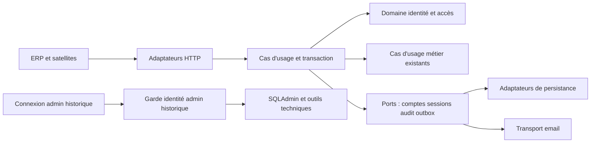

# E69 — Architecture et contrats V1.3

Implémentation locale du 1er octobre 2026, liée au [périmètre et décisions](README.md).
Les contrats décrivent les changements du backend et de ses interfaces embarquées.
Ils ne prouvent ni migration distante ni recette d’un environnement déployé ;
les preuves et limites figurent dans le [bilan de vérification](verification-livraison.md).

## Point de départ et adaptations

Le backend porte ERP et satellites. Les comptes Animation restent distincts des
nouveaux comptes internes. La table conserve le point de départ observé avant E69 ;
les adaptations sont réalisées localement, sans présumer l’état des environnements partagés.

| Source | Fait actuel | Adaptation E69 |
| --- | --- | --- |
| [AdminAuthBackend](../../../../localeo-backend/app/infrastructure/admin/auth.py) | Login configuré, rôle et communes en cookie ; garde SQLAdmin admin | Conserver le login historique, introduire un principal interne distinct ; aucun compte nominatif converti en `ADMIN` |
| [Registre sessions](../../../../localeo-backend/app/infrastructure/persistence/admin_sessions.py) | Empreinte et dates, sans identité nominative ni habilitations | Ajouter un registre lié au compte interne ; garder le registre historique indépendant |
| [Middleware session](../../../../localeo-backend/app/security/admin_session.py) | Relecture du registre, expiration/révocation, 503 si indisponible | Résoudre un principal typé et ses droits courants ; aucun repli admin sur erreur |
| [Sécurité HTTP](../../../../localeo-backend/app/security/http.py) et [assemblage](../../../../localeo-backend/app/main.py) | Cookie `session`, contrôles Origin/CSRF et redirections vers `/admin/login` | Distinguer connexion nominative et admin, préserver CSRF et les alias sans ouvrir SQLAdmin |
| [Politique de session](../../../../localeo-backend/app/domaine/identite_acces/services/politique_session_admin.py) | 15 minutes d'inactivité, 8 heures absolues | Réutiliser les durées sans entretenir la session par sondage de fond |
| [Invitation Animation](../../../../localeo-backend/app/application/identite_acces/services/service_invitation_animation.py) | Jeton haché, expiration 24 h, verrou gestionnaire puis invitation, usage unique | Réutiliser les mécanismes par ports ; ne pas importer le service ORM dans le domaine interne |
| [Email Animation](../../../../localeo-backend/app/infrastructure/email/acces_animation.py) | Invitation/reset, HTML et texte, aucune transmission de mot de passe | Nouveau modèle ERP avec branding commun et destinataire/environnement contrôlés |
| [Entrées ERP](../../../../localeo-backend/app/api/erp_api.py) | Reçus de commande indexés par nom d'acteur | Identité interne UUID stable et namespace distinct, sans migration implicite des reçus historiques |

## Propriétaire et frontières

`identite_acces` porte `UtilisateurInterne`, `AttributionRoleInterne`,
`InvitationInterne`, `SessionInterne` et les politiques pures. Les méthodes du
domaine décident créer/inviter, consommer, désactiver, remplacer email, changer
attributions, expirer et autoriser une capacité sur une ressource.

L'application charge les faits, appelle ces politiques, ouvre la transaction,
utilise les ports de hash/horloge/aléa/persistance/notification et produit les
projections. SQLAlchemy, cookies, FastAPI, HTTP et templates restent adaptateurs.
Les domaines financiers/catalogue conservent leurs invariants, montants et états.
Les routes ou menus ne recréent aucune règle d'autorisation.



Le principal serveur est un type discriminé : `ADMIN_HISTORIQUE` ou
`UTILISATEUR_INTERNE(id)`. L'identité historique provient exclusivement de la
connexion configurée et de son registre de session ; jamais d'un champ `roles`
fourni par un client, d'un email correspondant ou d'une ligne métier nommée ADMIN.
Une identité de service garde ses scopes propres ; elle ne peut obtenir les
droits humains en présentant un champ acteur dans une commande.

## Modèle et états

| Objet | Données utiles / contraintes |
| --- | --- |
| UtilisateurInterne | UUID immuable, nom/prénom, email normalisé unique dans cette population, hash nullable, état, version entière, version de sécurité, dates création/modification/initialisation/dernière connexion ; aucun secret dans les DTO |
| AttributionRoleInterne | Rôle `LECTEUR`, `BACKOFFICE` ou `FINANCE` ; `scope.type=GLOBAL` ou `COMMUNES` avec UUID distincts non vides ; combinaisons autorisées L seul, B seul, F seul, B+F |
| InvitationInterne | UUID, utilisateur, finalité INITIALISATION ou REINITIALISATION, empreinte de jeton aléatoire, expiration UTC, date utilisation/annulation, version d'email, génération ; au plus une invitation non consommée par finalité, génération précédente annulée |
| SessionInterne | Empreinte du secret, utilisateur, version de sécurité, dates création/activité/expiration/révocation ; index par utilisateur pour révocation ; cookie ne porte pas les droits |
| Reçu de commande | Clé idempotente + acteur stable + opération, empreinte normalisée de la demande et résultat sans secret ; réemploi de clé avec autre payload = conflit |
| Envoi associé | Référence invitation/génération et compte, email prévu, état de remise technique ; l'email n'est pas une preuve d'activation |

Email normalisé : trim et casse normalisée, sans supprimer `+suffixe` ou points
dans la partie locale. L'unicité ne fusionne jamais un compte Animation/Commerçant.
La liste de communes est validée depuis le référentiel ; `GLOBAL` nécessite un
choix explicite de l'admin, jamais un défaut déduit d'une liste vide.

États compte : `EN_ATTENTE_INITIALISATION`, `ACTIF`, `DESACTIVE`. L'activation
initiale passe de l'attente à ACTIF après validation du mot de passe et du lien.
La désactivation est possible depuis attente/actif, annule invitations et sessions.
Réactiver explicitement un compte désactivé retourne à ACTIF si un mot de passe
existe, sinon à l'attente ; aucun ancien lien/session ne redevient valide. Pas
de suppression physique via l'ERP dans cette V1, pour conserver l'audit.

Invitation : `EN_ATTENTE`, `UTILISEE`, `ANNULEE`, ou `EXPIREE` calculé avec l'horloge.
Renvoi = annulation de l'ancienne génération et émission d'une nouvelle. Un compte
actif n'accepte pas une nouvelle INITIALISATION ; demander une REINITIALISATION.
Remplacer l'email annule les invitations de cette adresse et révoque les sessions ;
la réinitialisation vers la nouvelle adresse doit être explicite, sans preuve
fictive de réception. Le changement ne restitue aucun secret existant.

## Politique d'autorisation et portée

Entrées de la politique : principal chargé depuis la session, état du compte,
attributions courantes, capacité demandée et périmètre réel de la ressource.
Résultat : autorisé/refusé, raison interne stable et projection de données permises.

1. Déclarer chaque lecture et commande dans le catalogue de capacités.
2. Identifier la ressource et son périmètre depuis le serveur, pas un `commune_id`
   client. Une liste filtre en base **avant** calcul du total, pagination ou agrégat.
3. Calculer la portée effective de la capacité demandée par union des seules
   attributions qui l'accordent, puis vérifier qu'elle couvre entièrement la
   ressource. Ne jamais unir des territoires associés à des capacités différentes.
4. Ressource mixte/intercommunale : périmètre propriétaire déterminé par son
   contrat métier ; sans règle vérifiée, refuser aux comptes limités. Ne pas
   accepter « au moins une commune correspond » sur un objet contenant d'autres données.

Une ressource indivisible couvrant A et B peut donc être lue avec B/A + F/B si
les deux attributions accordent la même capacité de consultation et si son contrat
métier définit cette couverture complète comme suffisante. La même ressource ne
peut pas être modifiée avec une capacité catalogue accordée seulement sur A.
Sans règle métier vérifiée pour la ressource mixte, le refus de l'étape 4 demeure.
5. Refuser par défaut toute entrée inconnue, technique ou interdite à la V1.

La validation métier, la vendabilité ou le remboursement éligible ne sont jamais
déduits du rôle. Une action métier peut avoir une conséquence économique normale
(vente/réservation/consommation) : E69 interdit les **commandes financières directes**,
pas toutes les actions générant indirectement un événement financier. La liste
des capacités distingue précisément ces cas dans la matrice des surfaces.

Décision E69-ARB-06 : B et B+F peuvent qualifier/suspendre le BUM d'un coffret,
activer une souscription dont le montant est déjà nul et annuler une commande
impayée non active. Ces exceptions métier explicites ne donnent pas `finance.executer`.
Elles n'autorisent ni réduction d'un montant positif à zéro, ni remboursement,
ni annulation de facture, ni transfert, ni modification brute d'une dette ou d'un
état PSP. Finance seul reste refusé. Pour B+F, vérifier le périmètre Backoffice
pour ces trois commandes, jamais le territoire Finance pour élargir leur portée.

## Connexion, sessions et CSRF

Le backend conserve le cookie signé existant `session` pour l'enveloppe
navigateur afin de préserver les contrôles HTTP, mais y stocker une référence
opaque et un discriminant de principal. Pour un utilisateur interne, ne jamais
remplir `admin_authenticated`, `admin_username` ou `admin_role` comme raccourci.
Les adaptateurs ERP doivent demander le principal au résolveur commun ; les gardes
historiques SQLAdmin restent strictement liés à l'identité historique.

Un navigateur possède un principal interne ou historique à la fois ; une connexion
nouvelle révoque la session précédente de cette enveloppe et remplace le cookie,
sans révoquer les sessions distinctes Animation/Commerçant. Rotation après login,
Secure en cible HTTPS, HttpOnly, SameSite et contrôles Origin/CSRF existants
préservés. Toute commande avec cookie exige CSRF, y compris gestion des comptes,
logout et connexion nominative ; le formulaire anonyme reçoit un contexte CSRF
non authentifiant. Le lien d'invitation n'est pas un jeton de session.

À chaque requête protégée : vérifier registre, expiration, utilisateur actif et
version de sécurité ; recharger les attributions. En cas d'indisponibilité, 503
sans données ni repli sur les droits signés dans un ancien cookie. La session
historique utilise son registre actuel et n'a aucune dépendance au référentiel
des nouveaux comptes ; elle n'est pas un contournement d'une panne générale de DB.

Une modification d'attributions conserve la session mais re-résout les droits ;
désactivation, changement d'email, reset du mot de passe ou révocation explicite
invalident toutes ses sessions. Les commandes et reprises différées rechargent
le principal avant exécution. Le contrôle d'autorisation précède aussi la lecture
d'un reçu idempotent, pour ne pas retourner des données après retrait de droits.

## Contrat HTTP

Producteur : backend `identite_acces`. Consommateurs : écrans ERP, formulaires
login/activation, monitor de session et satellites du backend. Les routes et schémas
alimentent l'export complet par le [générateur existant](../../../../localeo-backend/scripts/documentation/generate_epic41_openapi.py)
et son chargement hors ligne, vers [le contrat complet canonique](../epic-41-api/openapi.json).
Malgré son nom historique E41, cette source contient l'API complète. Une vue E69
filtrée éventuelle inclut connexion/activation publiques **et** gestion interne :
la vue runtime `/openapi/internal.json` seule omettrait les routes publiques.
Les JS ERP/satellites sont embarqués dans le backend ; aucun contrat embarqué
distinct n'a été identifié pour eux. Les schémas du portail Animation ne représentent
pas les comptes ERP. L’état de régénération de l’export figure dans le bilan de vérification.

Les routes suivantes sont **implémentées localement** dans le
[routeur des comptes](../../../../localeo-backend/app/api/comptes_internes_api.py) ; les routes métier existantes
restent à leur place avec une politique commune. Les pages `/admin/login` et
`/internal/session` existantes conservent leurs usages historiques ; le monitor
doit être adapté aux deux types de principal.

| Méthode / chemin | Entrée / résultat | Autorisation |
| --- | --- | --- |
| GET `/internal/erp/utilisateurs` | Page de gestion, sans rendu de secret | Admin historique |
| GET `/internal/identite-acces/utilisateurs` | Recherche email/nom, état, rôle, page>=1, pageSize 1..100 (25 défaut) ; `items,total,page,pageSize` | Admin historique |
| POST `/internal/identite-acces/utilisateurs` | `nom,prenom,email,attributions` ; 201 DTO + `emailPrepare=true` | Admin, CSRF, `Idempotency-Key` ; création + invitation atomiques |
| GET `/internal/identite-acces/utilisateurs/{id}` | DTO détail, invitations et suivi de remise sans jeton/corps email | Admin historique |
| PATCH `/internal/identite-acces/utilisateurs/{id}` | `version,nom,prenom,email,attributions` ; 200 version actualisée | Admin, CSRF, contrôle de concurrence ; modification email invalide liens/sessions |
| POST `/internal/identite-acces/utilisateurs/{id}/invitation` | `version` ; 202 `invitationId,emailPrepare,expiresAt` | Admin ; compte en attente ; renvoi idempotent |
| POST `/internal/identite-acces/utilisateurs/{id}/annuler-invitation` | `version,invitationId,finalite` ; 204 | Admin ; référence liée à ce compte et à la génération courante, finalité INITIALISATION ou REINITIALISATION |
| POST `/internal/identite-acces/utilisateurs/{id}/desactiver` ou `/reactiver` | `version,motif` ; 200 DTO | Admin ; motif audit, aucune invitation implicite lors de réactivation |
| POST `/internal/identite-acces/utilisateurs/{id}/revoquer-sessions` | `version,motif` ; 204 | Admin |
| POST `/internal/identite-acces/utilisateurs/{id}/reinitialisation` | `version` ; 202 suivi | Admin ; compte ACTIF ; récupération administrée validée |
| GET `/internal/connexion` et `/internal/initialiser-acces` | Formulaires seuls, contexte CSRF, aucun contenu métier | Accessibles sans session métier ; exceptions explicites au routage, aucune API admin ouverte |
| POST `/public/identite-acces/interne/connexion` | `email,motDePasse` ; 204 + cookie renouvelé | Anonyme, CSRF/Origin et limitation tentatives ; 401 générique |
| POST `/public/identite-acces/interne/initialisation` | `token,motDePasse,confirmation` ; 204 | Jeton dédié, Origin et CSRF ; pas de session automatique |
| POST `/public/identite-acces/interne/reinitialisation` | Même structure ; 204, toutes sessions révoquées | Jeton finalité REINITIALISATION ; récupération administrée validée |
| GET `/internal/identite-acces/session` | `principalType,id,nom,attributions,capabilities,authorizationVersion,expiresAt` | Principal courant ; aucune donnée d'autre utilisateur |
| POST `/internal/identite-acces/deconnexion` | 204 + cookie supprimé | Session courante, CSRF ; révocation serveur |

DTO utilisateur : `id,nom,prenom,email,etat,attributions,version,createdAt,
initializedAt,lastLoginAt,invitation,envoi`. Pas de hash/password/token/session
secrets. Attribution : `{role,scope:{type,communeIds}}`. Une projection de capacité
est un outil d'affichage, jamais une preuve présentée au backend.

### Précisions des schémas et de la compatibilité V1.1

Les schémas refusent les champs d'autorité supplémentaires (`ADMIN`,
`principalType`, hash, token, version de sécurité, état injecté dans PATCH).
`attributions` comporte un à deux éléments : L seul, B seul, F seul ou B+F,
sans rôle dupliqué. Pour `GLOBAL`, `communeIds=[]` ; pour `COMMUNES`, liste non
vide d'UUID existants et distincts. Un champ manquant ou null n'est jamais GLOBAL.

POST exige identité et attributions complètes. PATCH modifie uniquement les champs
présents ; `attributions` remplace atomiquement la collection entière, sans fusion
implicite. `version` est obligatoire et positive ; une chaîne vide pour l'identité,
un email invalide ou une attribution null renvoie 422. La désactivation/réactivation
reste une commande dédiée. Email normalisé inchangé ne renouvelle pas l'invitation.

Trois versions ont des responsabilités distinctes :

| Version | Événements | Effet |
| --- | --- | --- |
| `version` du compte | Toute mutation réussie du compte et commande de gestion affectant son cycle d'accès | Contrôle optimiste des formulaires admin ; un rejeu idempotent ne l'incrémente pas |
| `authorizationVersion` | Modification des attributions/périmètres ou de l'état d'accès | Recalcul de navigation/projections ; les droits serveur restent relus même si le client présente la dernière valeur |
| `securityVersion` | Désactivation, changement d'email, reset consommé ou révocation des sessions | Invalidation des sessions portant l'ancienne valeur ; jamais modifiable par le client |

Les mises à jour techniques de dernière activité/dernière connexion et de transport
email ne rendent pas obsolète un formulaire métier en incrémentant `version`.
Les changements de secret/attributions associés à une commande de gestion sont
atomiques avec leurs versions et événements d'audit. Une réactivation ne rétablit
jamais une ancienne `securityVersion`.

Le DTO de session est une union discriminée, pas un faux compte nominatif admin :

- `UTILISATEUR_INTERNE` : `id` UUID, nom, attributions, versions d'autorisation,
  capacités bornées et dates d'expiration ; aucune `securityVersion` ni empreinte.
- `ADMIN_HISTORIQUE` : `id=null`, nom d'affichage, `attributions=[]`,
  `authorizationVersion=null`, capacités admin explicites et dates d'expiration.
  Ce résultat provient uniquement du registre historique, jamais d'un DTO fourni.

`capabilities` est une liste de `{code,scope:{type,communeIds}}`. La portée d'une
capacité est l'union des seules attributions qui l'accordent. Cette projection
sert aux écrans, sans remplacer le contrôle de la ressource sur le serveur.
`expiresAt` est l'échéance effective courante (minimum inactivité/absolue), avec
`idleExpiresAt` et `absoluteExpiresAt` explicites ; dates ISO 8601 UTC.

Exemple de création (identifiants de communes fictifs) :

```json
{
  "nom": "Exemple",
  "prenom": "Camille",
  "email": "camille@example.test",
  "attributions": [
    {"role": "BACKOFFICE", "scope": {"type": "COMMUNES", "communeIds": ["11111111-1111-4111-8111-111111111111"]}},
    {"role": "FINANCE", "scope": {"type": "COMMUNES", "communeIds": ["22222222-2222-4222-8222-222222222222"]}}
  ]
}
```

Le résultat ne donne pas le droit de gérer le catalogue de la deuxième commune.
Les capacités d'export métier et d'export spécialisé sont distinctes dans la
[matrice](permissions-surfaces.md). Un rôle unique de compatibilité ne peut pas
représenter B+F sans perdre cette information.

### Contexte ERP et monitor de session

Le contexte ERP V2 expose le principal typé, les capacités bornées et la version
d’autorisation ; il filtre les référentiels par tâche. Aucun rôle synthétique
ADMIN/EXPLOITATION nominatif n’est produit pour satisfaire un ancien JavaScript.
Le champ role est conservé pour le principal historique ; les modules se fondent
sur les capacités et refusent un ancien contexte non compatible.

Consommateurs adaptés ensemble : `erp.js`, navigation, modules finance, Audit,
instances/Support, accès commerçant/Animation, offres/souscriptions et Atelier.
Le serveur reste responsable des droits si le navigateur conserve un ancien bundle.
Un bundle incompatible affiche une demande de rechargement sans élargir les accès.

`GET /internal/session` existant devient un adaptateur du résolveur commun pour
le monitor ; il conserve les champs historiques attendus et ajoute le type et
la version d'autorisation sans renouveler l'activité. `POST /internal/session`
enregistre une activité utilisateur réelle avec contrôles Origin/CSRF et l'en-tête
existant `X-Localeo-Session: activity` ; cet en-tête seul ne constitue pas un CSRF.
La nouvelle route de session et ce monitor exposent les mêmes droits/échéances.
Une PWA sans réseau n'autorise aucune commande ni lecture de données sensibles
en cache ; elle peut seulement présenter son shell et demander la reconnexion.

Sur changement de principal/version, refus ou déconnexion : fermer les détails
désormais interdits, vider les projections en mémoire et recharger les capacités.
Un ancien formulaire peut conserver une saisie non sensible, mais sa soumission
revalide les droits. Aucun polling ou événement synthétique ne maintient la session
indéfiniment ; le monitor n'utilise plus implicitement `/admin/login` pour un nominatif.

Erreurs JSON : enveloppe commune detail, correlationId et alias request_id.
Pour les erreurs métier des comptes, detail porte code/message ; les erreurs
de validation peuvent conserver une chaîne ou une liste de violations.
400 lien invalide générique,
401 session/credentials invalides, 403 capacité refusée, 404 ressource absente ou
hors périmètre, 409 version obsolète/doublon/clé réutilisée/transition impossible,
422 champs ou combinaison de rôles invalides, 429 avec Retry-After, 503 service
d'autorisation indisponible. Refus d'accès avant chargement de données sensibles.
Pages : redirection vers connexion autorisée pour 401, rendu 403 explicite pour
principal connecté ; API ne retourne jamais une page login à la place du JSON.

Les routes POST de gestion exigent `Idempotency-Key`, version attendue pour une
cible existante, CSRF et contrôle d'auteur. Pour rejouer une même commande,
vérifier d'abord les droits puis son reçu ; une répétition retourne le résultat
initial même si sa version attendue est devenue ancienne. Une commande nouvelle
avec une ancienne version échoue 409. Ni état reçu ni clé ne court-circuite le garde.

## Invitation, transaction et transport

Le jeton aléatoire dédié ERP est suffisamment long (réutiliser les 32 octets
aléatoires d'Animation), stocké uniquement par empreinte dans l'agrégat. Son
espace de validation est séparé d'Animation, du reset et des sessions. Lien HTTPS
de l'environnement configuré, jamais construit depuis un Host fourni librement ;
fragment `#activation=...`, nettoyé par l'écran, sans stockage local ni télémétrie.
Referrer-Policy no-referrer, Cache-Control no-store sur les pages et réponses
d'identité ; aucun script tiers sur ces formulaires.

Pour un reset, le même écran reçoit `#reinitialisation=...` et appelle uniquement
la route publique de finalité REINITIALISATION ; l'initialisation appelle sa route
distincte. Aucune tentative automatique avec une autre finalité si la première
échoue. Le serveur contrôle la finalité stockée, l'état du compte et la génération,
même si le fragment ou le formulaire est modifié. Un renvoi de reset passe par
la commande `/reinitialisation`, jamais `/invitation`. L'annulation cible une
invitation explicitement identifiée et versionnée, pas une finalité choisie par
déduction à partir de l'état affiché dans un ancien onglet.

Ordre transactionnel commun : reçu/clé de création si applicable, compte,
invitation, sessions, outbox. L'email normalisé possède une contrainte UNIQUE en
DB en plus de la validation : deux créations concurrentes ne produisent qu'un
compte. Activation et renvoi verrouillent le même compte puis la génération ;
une seule activation concurrente peut réussir. État, hash, consommation et audit
sont validés ensemble ; une erreur de mot de passe laisse le lien utilisable.

Compte + invitation + événement d'audit + envoi sont persistés dans une transaction.
Un crash avant commit n'envoie rien. Après commit, un worker remet l'email ; une
relance technique traite le même message sans changer le jeton. Si le fournisseur
a peut-être accepté, conserver l'état incertain et rapprocher avant de renvoyer.
L'admin peut remplacer une invitation après contrôle, pas rejouer aveuglément un
ancien email d'accès. Aucun message n'est marqué livré sans preuve fournisseur.

Avant remise au fournisseur, contrôler l'état courant et la génération du compte ;
changement d'email/annulation neutralise les envois non commencés. Une remise déjà
engagée peut encore aboutir : l'ancien lien est invalide, l'audit garde cette issue.
Le retrait de droits est ordonné par verrou/version avec l'autorisation de commande.
Une action dont l'autorisation a été acquise avant le retrait peut se terminer ;
une tâche seulement en file n'a pas acquis cette autorisation et doit la revérifier.
Ne pas promettre l'annulation rétroactive d'un effet externe déjà engagé.

Le corps de l'email contient nécessairement le lien ; il doit être protégé dans
l'outbox et masqué dans les listes, previews, exports génériques et traces de debug.
Ne conserver ensuite que les métadonnées nécessaires selon la politique de purge
définie en livraison. Ne pas supprimer les preuves métier. Mot de passe validé
par la politique existante, hash via port ; limite bcrypt en octets préservée tant
que cet adaptateur est utilisé. Aucun secret dans l'audit ni reçu idempotent.

Invitation INITIALISATION et récupération administrée REINITIALISATION : **24 h** ;
finalités et générations séparées. Configuration implémentée :

- `LOCALEO_ERP_URL` : origine HTTPS de l’ERP, indépendante du Host client ; HTTP
  uniquement sur localhost/127.0.0.1 en développement.
- `LOCALEO_INTERNE_INVITATION_INTERVAL_SECONDS` : 60 par défaut.
- `LOCALEO_INTERNE_INVITATION_MAX_PER_DAY` : 5 par défaut, fenêtre glissante de 24 h.
- Limites de connexion et de verrouillage : politique d’authentification existante ;
  mot de passe validé par son port, limite bcrypt de 72 octets conservée.

Les valeurs effectives et la remise fournisseur restent à vérifier en cible.
La reprise d’un envoi engagé sans résultat certain ne réexpédie pas aveuglément
le lien : rapprocher sa remise avant une nouvelle invitation explicite.
Les corps sont neutralisés après consommation/annulation ou invalidité constatée
avant transport. **Dette restante :** aucune tâche périodique universelle ne purge
les corps d’invitations déjà envoyées puis seulement expirées, jamais consommées
ni annulées ; la rétention n’est donc pas complètement automatisée.

## Données, compatibilité et migration

### Réutilisation du Support pour le suivi financier (ARB-05)

Le domaine Support conserve ses tickets, responsable et états `OUVERT`, `EN_COURS`,
`RESOLU`. L'adaptation ajoute un rattachement contrôlé à un dossier financier,
sans état bancaire ni commande de remboursement. La résolution d'un ticket ne
résout pas automatiquement une anomalie PSP.

Rattachement implémenté : une ressource primaire typée (instance, paiement, mouvement
de reversement, reversement ou facture), son identifiant et une classification financière.
Le serveur charge cette ressource, vérifie capacité et portée, puis dérive les
liens métier. La référence seule et le texte libre ne prouvent aucune autorisation.
Un ticket doit avoir exactement un propriétaire primaire valide ; les objets
secondaires et les documents sont contrôlés séparément avant restitution.

La migration additive v252 conserve les tickets d’instance et leur historique,
ajoute les rattachements typés, index et contrainte d’un propriétaire unique.
Un ticket financier a une instance nulle et exactement une source financière ;
aucune reclassification automatique des anciens échanges en « financier ». Les notes financières sont rattachées au ticket,
pas publiées comme notes générales de l'instance accessibles par un garde trop large.

Contrats implémentés par le [routeur de suivi financier](../../../../localeo-backend/app/api/suivi_financier_api.py),
avec les cas d’usage Support adaptés :

| Méthode / chemin | Résultat / autorisation |
| --- | --- |
| GET `/internal/erp/api/suivi-financier/{type}/{id}/demandes` | Tickets financiers liés à la source, paginés ; `finance.support.consulter` et accès à la source |
| POST même chemin | `motif,description,responsable` selon schéma Support ; `finance.suivre`, contrôle source, CSRF et idempotence |
| PATCH même chemin + `/{ticketId}` | `statut,responsable,expected_version` selon schéma Support ; même capacité, appartenance ticket/source obligatoire |
| POST même chemin + `/{ticketId}/notes` | `contenu` selon schéma Support ; même capacité, note interne limitée au dossier financier |
| GET même chemin + `/{ticketId}/notes` | Notes financières paginées ; `finance.support.consulter`, accès source et appartenance du ticket contrôlés |
| GET `/internal/erp/api/suivi-financier/{type}/{id}/intervenants` | Intervenants actifs autorisés sur tout le dossier ; projection `id,nom,prenom`, sans email ni habilitations |

Listes de tickets et notes : `page>=1`, `pageSize` de 1 à 100 (25 par défaut),
réponse `{items,total,page,pageSize}` ; tri stable date de création puis UUID,
filtrage avant total et pagination. Aucune chronologie générale de l'instance
n'est utilisée comme substitut à la lecture des notes financières.

Les types sont `PAIEMENT`, `REVERSEMENT`, `MOUVEMENT`, `FACTURE`, jamais un nom
de table arbitraire. La façade parallèle `/internal/erp/api/support-financier`
utilise `support.consulter/gerer` pour Backoffice ; `/suivi-financier` emploie
`finance.support.consulter/finance.suivre`. B+F ne fusionne pas les portées de ces
deux commandes différentes. Le sélecteur d’intervenants applique les mêmes bornes
de pagination et présente les personnes éligibles ou « Non affecté », sans UUID à saisir.
Le responsable éventuel est validé parmi les intervenants autorisés au dossier, sans exposer à Finance
l'administration des utilisateurs. Les schémas métier réutilisent les limites
de texte, états et version existantes. Refus 403/404, conflit 409, audit et absence
d'effet financier sont testés avec et sans instance de coffret.

### Exports et pièces financières

Les lectures E65 conservent leurs routes. Deux exports distincts existent sous
/internal/gestion-achats/paiements et /internal/gestion-reversement/suivi :
/export-metier.csv (finance.exporter_metier) et /export-finance.csv (finance.exporter).
Ils reprennent les filtres de recherche hors pagination, avec colonnes et portées
propres. Retirer Finance retire l’export spécialisé sans élargir le métier Backoffice.

/internal/erp/api/factures propose la liste autorisée et /{id}/telecharger sert
uniquement un PDF FACTURE_LOCALEO publié déjà produit. Le contrôle vérifie la
facture courante, son propriétaire, les rattachements et la cohérence avec source
et destinataire. Pas de rendu caché, pièce KYC ou document partagé hors périmètre.

### Migration des comptes et compatibilité

La migration [v251](../../../../localeo-backend/sql/v251_comptes_internes.sql) ajoute
les comptes, attributions, invitations, sessions et reçus idempotents, leurs contraintes
et index. La [v252](../../../../localeo-backend/sql/v252_support_financier.sql) étend
les tickets Support et leurs notes financières. Elles ont des preuves PostgreSQL
locales ; aucune n’a été appliquée à un environnement partagé dans cette phase.
Les dates sont UTC, avec rendu utilisateur local.

Pas de conversion automatique du compte configuré en compte métier. Inventorier
éventuels anciens rôles/supports de comptes, simuler les écarts et faire attribuer
explicitement les nouvelles permissions ; `FINANCE` historique ne vaut pas la
nouvelle attribution. Aucun email envoyé par migration, restauration ou seed.

Sessions historiques déjà ouvertes : conserver seulement celles que le registre
actuel et la connexion historique permettent de prouver ; en cas de doute, exiger
une nouvelle connexion historique. Les anciennes sessions EXPLOITATION ne deviennent
ni admin ni comptes nominatifs. Leur traitement doit être inventorié avant bascule.
Une panne du registre des nouveaux comptes ferme leurs accès ; ne pas étendre les
exceptions middleware prévues pour le login à l'ensemble `/internal/*`.

Backend et JS embarqué ERP/satellites sont livrés ensemble. Ne pas ouvrir les nouveaux
comptes avec une ancienne interface qui suppose ADMIN, ni assouplir un garde avant
que la projection soit filtrée et les mutations protégées. Les guards partenaires,
API keys de batch et cookies publics sont inchangés dans leur contrat.

Retour arrière : fermer l'entrée nominative, révoquer les sessions internes,
revenir à un artefact compatible avec les données additives et vérifier l'accès
historique. Conserver comptes, audit et migrations ; aucune restauration de DB
ancienne ne doit rétablir des liens/session révoqués. Une restauration de démo
neutralise sessions, invitations et outbox internes, efface les anciens hash de
mot de passe et augmente les versions de sécurité. Les comptes actifs restaurés
retournent en attente d’initialisation, les désactivés restent désactivés ; une
nouvelle invitation admin est nécessaire. Identités, emails et attributions sont
conservés. Le hash de la sauvegarde originale est vérifié avant transformation,
puis une empreinte distincte prouve la restauration neutralisée ; `initialized_at`
reste une information historique, sans rétablir un accès.
