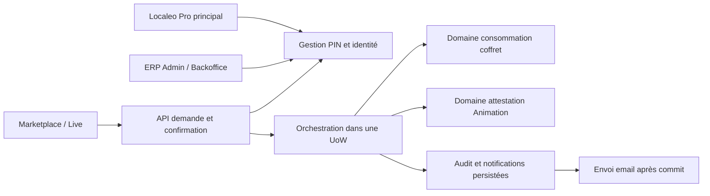

# E70 — Architecture et contrats V1

Source : [spécification](README.md), [backlog et 34 critères](../../roadmap/en-cours/epic-70-validation-prestation-telephone-client-backlog.md).
Conception du 5 octobre 2026, implémentée et vérifiée localement le 7 octobre.
Les preuves et limites figurent dans [le bilan](verification-livraison.md) ;
aucune disponibilité sur une cible déployée n’est annoncée.

## 1. Existant vérifié et adaptations

| Source réelle | Comportement observé | Adaptation E70 |
| --- | --- | --- |
| [Vérification consultation coffret](../../../../localeo-backend/app/application/identite_acces/use_cases/verifier_consultation_token_coffret_instance.py) | Jeton courant ou session `cs1.`, expiration/révocation, correspondance instance ; UoW propre | Extraire une vérification dans l'UoW de confirmation, recontrôler le droit sous verrou ; pas de vérification détachée suivie d'un effet |
| [Validation QR coffret](../../../../localeo-backend/app/application/exploitation/use_cases/valider_prestation.py) | Session commerçant, transaction QR et instance verrouillée | Garder le contrôle QR pour son canal ; PIN apporte une autorisation distincte, jamais un faux QR |
| [Consommation commune](../../../../localeo-backend/app/application/exploitation/services/service_validation_prestation.py) | CAS `A_VALIDER → VALIDEE`, occurrence, feedback, mouvement idempotent, état instance | Réutiliser les effets communs, contexte d'acteur explicite ; sortir les règles modifiées vers le domaine et le SQL vers l'adaptateur |
| [Validation Animation](../../../../localeo-backend/app/application/animation_locale/services/validations_animation.py) | Autorise commerce, token, étape et versions ; verrou animation/participant ; reçu idempotent et réconciliation | Extraire cœur `dans_uow` commun QR/PIN ; ne pas appeler un service qui committe après un contrôle PIN indépendant |
| [Résolution scan Animation](../../../../localeo-backend/app/api/merchant_animation_scan_api.py) | Résolution QR avec scope commerçant, étape attestable | Projection client dédiée limitée au participant autorisé ; pas d'accès à cette route professionnelle avec un PIN |
| [API Marketplace](../../../../localeo-marketplace/src/services/api.js) | Échange lien `cl1.` en session consultation `cs1.`, Bearer participant Live | Ajouter demande/confirmation/reçu ; secrets dans corps ou headers, jamais URL |
| [Jeu Live](../../../../localeo-marketplace/src/live/LiveAnimationGame.jsx) | Commandes et états versionnés du jeu | Proposer le PIN seulement sur une étape commerçante actuellement attestable |
| [Notifications Pro](../../../../localeo-commercant/src/features/animations/api.js) | Lectures/marquage via API des notifications commerçantes Animation | Créer une projection PIN distincte : le DTO Animation actuel exige animation_id ; ne pas conditionner les notifications PIN au service Animation |
| [Audit](../../../../localeo-backend/app/application/exploitation/services/service_audit.py) | Assainissement des métadonnées et écriture d'événements | Ajouter clés sensibles PIN/vérificateur, limiter par allowlist ; ne pas se fier à la seule liste actuelle de clés |

## 2. Propriétaires et objets de domaine

Application de l'[ADR domaine d'abord](../../architecture/decisions/ADR-2026-08-28-domaine-avant-services-applicatifs.md).

| Objet cible | Domaine et responsabilité pure |
| --- | --- |
| `PinValidationCommerce` (racine par commerce) | `identite_acces` : version, activation/révocation, dates, décision d'utilisation, unicité du PIN courant |
| `DureePinValidation`, `FormatPinValidation` | `identite_acces` : jours entiers 1..30, longueur et valeurs exclues ; génération aléatoire fournie par port, sans aléatoire d'infrastructure dans le domaine |
| `ProtectionEssaisPin` | `identite_acces` : fenêtre glissante de 15 minutes et blocage par commerce, indépendant des appareils/demandes/versions |
| `DemandeValidationPin` | `exploitation` : cible immuable discriminée COFFRET/ANIMATION, finalité, identité du droit client, dates, état et résultat réel |
| Autorisation client | `identite_acces` avec droits coffret/participant existants ; le PIN n'en crée aucun |
| Consommation prestation | Entités de `gestion_achats` et `exploitation`, effets de reversement chez leur propriétaire ; aucun nouveau calcul financier |
| Attestation et progression | Domaine `animation_locale`, définition publiée, versions et règles du scan ; pas de moteur PIN parallèle |
| `ActeurValidation` | Valeur serveur commune : type PRINCIPAL/SALARIE/PIN, `acteur_id` nullable, `commercant_id`, `session_id` nullable, `pin_version` nullable ; jamais fournie par le client |

Le domaine ne dépend ni de FastAPI, ni d'ORM, ni d'email ou de configuration.
L'application charge les faits, contrôle le droit, appelle les décisions pures,
gère l'UoW et persiste les événements. SQL, cryptographie, horloge et transports
passent par des ports et adaptateurs. Pas de façade transportant une règle dans la route.

## 3. États, règles et limites temporelles

- PIN : absent → actif par génération ; actif → révoqué par invalidation ; actif
  → expiré par l'horloge ; remplacement crée une version différente et invalide
  l'ancienne atomiquement. Ni déblocage ni réactivation du mode ne ressuscitent
  un ancien PIN. La désactivation du mode révoque la version courante ; réactiver
  nécessite une nouvelle génération. La suspension du commerce interdit son usage.
- Le PIN contient exactement 6 chiffres, zéros initiaux conservés. La génération
  par CSPRNG rejette les 6 chiffres identiques et les suites de six chiffres
  consécutifs croissantes/décroissantes, y compris avec retour 9/0. Elle rejette
  également le PIN courant lors d'un remplacement pour que l'ancien code ne reste
  pas valable par coïncidence. Ces exclusions sont testées comme valeurs, pas en UI.
- Durée : `expires_at = generated_at + days × 24 h`, `1 <= days <= 30`, défaut 7.
  UTC serveur injecté ; pas d'activation différée, pas de modification de durée
  d'une version active : changer la durée passe par remplacement.
- Demande : `EN_ATTENTE`, `VALIDEE`, `ANOMALIE`, `EXPIREE`, `ANNULEE`. Les refus
  d'un essai sont audités mais ne consomment pas la demande encore valable.
  `ANOMALIE` conserve le résultat métier Animation sans prétendre à une progression.
  Expiration exclusive à création +5 minutes ; une réponse perdue après succès
  ne change pas le résultat terminal en expiration.
- Une demande fixe cible, commerce, droit client et versions métier pertinentes.
  Toute substitution refuse ; une modification métier impose une nouvelle demande.
  Le commerce Coffret est dérivé du droit prestation ; pour Animation, le client
  choisit une action offerte par le serveur, qui en déduit le commerce autorisé.
- Le PIN présenté est la version courante au moment de confirmer ; on ne stocke
  pas une autorisation « PIN correct » réutilisable. Une demande créée avant
  révocation n'accorde aucun droit à l'ancien PIN.
- Essais : fenêtre `(now - 15 min, now]`, cinq comparaisons incorrectes → blocage
  jusqu'à `now + 15 min`. Les refus avant comparaison (droit client absent, demande
  expirée, format invalide) ne permettent pas de tester un PIN et restent soumis
  au rate limiting HTTP. Un succès ne remet pas les échecs récents à zéro.
- Pendant le blocage : aucune comparaison, aucun ajout prolongeant le blocage.
  À la borne de fin, le blocage cesse ; les erreurs à la borne gauche de la fenêtre
  sont exclues. Remplacer le PIN ne contourne pas le blocage du commerce. Une
  invalidation urgente reste possible et le scan continue selon ses propres règles.

## 4. Atomicité et idempotence

Toutes les entrées mutantes concernées (QR principal/salarié, PIN, révocation,
suspension, option E72 et correction métier pertinente) doivent respecter un
ordre commun de verrouillage, validé par tests PostgreSQL. La garde commune est
la ligne commerce verrouillée, distincte de l'option E72. Ordre total : commerce
→ option salariés (si canal salarié ou commande E72) → identité Pro puis session
(si pertinentes) → PIN/protection essais (si canal PIN) → demande/transaction
→ instance coffret OU animation puis participant → enregistrements du droit
client → occurrence/résultat/outbox. Chaque canal saute seulement les objets
sans objet, sans inverser les autres. Les créations de transactions QR suivent
cet ordre et ne consomment pas de droit.

Suspension commerce, changement option, révocation Pro et reset passent par la
garde commerce puis leurs objets concernés. Rotation/révocation d'un droit client
prend son parent instance ou animation/participant avant son enregistrement,
sans reprendre un verrou commerce ensuite. Les cœurs communs restent dans l'UoW
appelante. Adapter toutes les routes qui prennent ces verrous dans l'ordre inverse
et tester les courses ; le seul appel à un vérificateur avant verrouillage ne suffit pas.

1. Vérifier forme et droit client sans effets, ouvrir l'UoW, verrouiller et
   recharger les faits. Revalider le droit courant, la suspension et l'éligibilité.
2. Relire un résultat terminal uniquement après vérification du droit client.
   Si la cible a déjà été consommée par QR, rattacher le résultat réel sans
   nouvelle occurrence, et conserver son mode QR ; pas de notification PIN fictive.
3. Vérifier état courant PIN et compteur. Pour un PIN incorrect, persister compteur
   et refus, puis commit avant de produire l'erreur HTTP. Une exception ne doit pas
   annuler le compteur. Le cinquième refus crée une seule alerte de blocage.
4. Pour un PIN correct, exécuter le cœur commun de consommation/attestation dans
   cette UoW ; aucune transaction imbriquée qui committe seule. Mutation métier,
   résultat demande, audit de succès et notification sont atomiques. Un échec
   de persistance annule tous les effets métier et ne devient pas un succès UI.
5. Les envois email partent après commit via le mécanisme de notification existant.
   Leur échec ne remet jamais une prestation à valider. Un refus métier après
   contrôle PIN ne compte pas comme PIN incorrect ; son audit est persisté par
   la voie de refus, séparée du rollback métier.

Création de demande et génération PIN portent une `Idempotency-Key` UUID, bornée
au principal/droit courant et à l'opération. Même clé + corps différent : conflit.
La confirmation est idempotente par demande et occurrence, sans stocker le PIN
dans l'empreinte de requête. Les mêmes droits sont contrôlés lors de la relecture.
La génération ne restitue le secret qu'une fois ; si sa réponse se perd, le rejeu
renvoie les métadonnées avec `pin_reaffichable=false`, puis l'utilisateur remplace
explicitement avec une nouvelle clé. Aucun stockage réversible pour faciliter le rejeu.

Après révocation effective, aucune nouvelle consommation par cette version ; un
effet committé avant elle reste acquis et traçable. Après expiration du PIN, le
reçu déjà acquis reste lisible avec le droit client encore valable. La lecture
n'exige pas de nouvelle saisie et n'accorde aucun accès professionnel.

## 5. Contrats cibles et droits

Producteur : backend. Source de conception : ce document. Les nouvelles routes
suivent les [conventions](../../architecture/transverse/conventions-api-openapi.md).
Les noms actuels sont conservés : cette epic ne renomme pas les routes existantes.

| Méthode et chemin cible | Autorisation / entrée | Sortie et erreurs spécifiques |
| --- | --- | --- |
| GET `/protected/identite-acces/commercants/moi/pin-validation` | Session principale | `EtatPin` sans secret |
| POST même chemin | Principal, mot de passe vérifié depuis <=15 min ; JSON `{duree_jours: 7}`, Idempotency-Key | 201 `PinGenere` avec secret à affichage unique ; remplacement atomique s'il existe |
| DELETE même chemin | Session principale valable, sans nouvelle vérification de mot de passe | 204 même si déjà révoqué ; invalidation et désactivation du mode |
| POST `/protected/identite-acces/commercants/moi/reauthentification` | Principal ; `{mot_de_passe}` | 204, horodatage serveur attaché à cette session ; ne crée pas un jeton autonome de gestion |
| POST `/internal/identite-acces/commercants/{id}/pin-validation/revoquer` | Session ERP + CSRF, scope E69 `acces_externes.gerer` (Admin/Backoffice), motif | 204, audit ; ni création ni lecture du secret par le support |
| POST `/protected/exploitation/validations-pin/coffrets/demandes` | Bearer consultation actuel ; `{coffret_instance_id, droit_prestation_id}`, Idempotency-Key | 201 `DemandePin` ; le droit doit viser cette instance, commerce dérivé du droit prestation |
| POST `/protected/exploitation/validations-pin/animations/demandes` | Bearer participant ; `{participant_id, etape_id, versions}`, Idempotency-Key | 201 `DemandePin`, animation et commerce issus du droit participant et de l'étape publiée |
| POST `/protected/exploitation/validations-pin/demandes/{id}/confirmer` | Même droit client courant ; `{pin: "012345"}` | 200 `ResultatPin`, aucun bearer professionnel ; contrôle courant et réponse minimale |
| GET `/protected/exploitation/validations-pin/demandes/{id}` | Même droit client, revalidé | `DemandePin` ou `ResultatPin` ; récupération après timeout |
| DELETE même chemin | Même droit client | 204 si attente déjà annulée ; résultat terminal conservé s'il était acquis |

`EtatPin` : `mode_actif: bool`, `version: int|null`, `etat: ABSENT|ACTIF|EXPIRE|REVOQUE`,
`generated_at`, `expires_at`, `blocked_until` (dates RFC3339 UTC/null),
`server_time`. Le blocage est un état orthogonal : ne masque pas une expiration.
`PinGenere` ajoute `pin` uniquement sur la première réponse et
`pin_reaffichable: bool`. Réponse `Cache-Control: no-store`, sans PIN dans headers.

`DemandePin` : `id: UUID`, `type: COFFRET|ANIMATION`, `etat`, `created_at`,
`expires_at`, `server_time`, `commerce: {id,nom}`, `cible: {id,libelle}`,
`effet_libelle`, `versions` pour Animation. Pas d'email client, financier,
QR, hash ou état interne du compte. `ResultatPin` ajoute `validation_id`,
`mode_effectif`, `validated_at`, `resultat: VALIDEE|ANOMALIE`, `rejoue: bool`,
progression uniquement si déjà permise dans la projection participante.

Erreurs : enveloppe du backend avec code stable, message sûr et corrélation.
401 droit absent/expiré ; 403 `ACTION_INTERDITE` ; 404 `DEMANDE_INTROUVABLE`
pour un objet étranger ; 409 `VERSION_OBSOLETE`, `CIBLE_NON_ELIGIBLE`,
`IDEMPOTENCE_CONFLIT` ou `DEMANDE_TERMINEE` ; 410 `DEMANDE_EXPIREE` ;
422 `FORMAT_INVALIDE` pour durées/structure, `PIN_INCORRECT` pour comparaison
incorrecte ; 429 `PIN_BLOQUE` avec `Retry-After` et `blocked_until` ;
409 `PIN_INDISPONIBLE` pour secret absent/révoqué/expiré ou mode désactivé.
Le client n'obtient pas le nombre d'essais restant ni la cause détaillée d'un
secret indisponible. Les motifs précis restent dans l'audit habilité.
Les schémas rejettent les champs supplémentaires : notamment commerce/acteur
injecté à la confirmation, PIN non chaîne, durée fractionnaire, nul et booléen.

### Contrats existants et consommateurs

- Consultation coffret : réutiliser le vérificateur de consultation, y compris
  les règles courantes des liens échangés, sans étendre le QR ni accepter une
  référence publique. Pas de journalisation des Authorization.
- Participant Live : vérifier correspondance `participant_id` et token personnel,
  l'état, les versions et les révocations. Une session de carnet Live seule ne
  dispense pas du droit sur cette participation.
- Commerçant : les endpoints PIN refusent le rôle salarié même s'il porte un scope
  historique de validation. Conserver la séparation acteur/commerce d'E72.
- Notifications : créer une table et projection générique PIN rattachées au commerce,
  distinctes de NotificationCommercantAnimation dont le DTO exige animation_id.
  Types : PIN_VALIDATION_REUSSIE, PIN_MODIFIE, PIN_BLOQUE ; déduplication
  (type, occurrence_id, commerce). Pour un succès, occurrence_id est la validation
  effective ; pour un changement ou un blocage, c’est l’UUID de l’événement de
  changement de version ou de l’épisode de blocage, persisté une seule fois. Succès → détail historique ; changement/blocage
  → gestion PIN réservée au principal. Pas de donnée financière ni secret.
  Ajouter GET /protected/exploitation/commercants/me/notifications-pin avec
  page >=1, page_size défaut 20 et maximum 100 : {items,page,page_size,total}.
  Item : {id,type,titre,message,created_at,read_at,cible:{type,id},lien_relatif}.
  POST même collection /{id}/lecture marque la lecture de façon idempotente,
  404 hors commerce. Session principale seulement ; 403 salarié. Un lien relatif
  est produit par allowlist, jamais une URL client. Lecture et marquage restent
  disponibles sans activation Animation. Le centre de notifications Pro charge
  cette collection séparément de la liste Animation et sait les présenter sans
  modifier la pagination de l'ancienne collection. Les routes/DTO Animation ne
  sont pas rendus nullable pour faire entrer artificiellement un coffret.
  Les intentions email de changement/blocage référencent l'événement générique,
  pas une animation fictive, et réutilisent le transport asynchrone existant.
- Backend : exporter les contrats implémentés via
  [export hors ligne](../../../../localeo-backend/scripts/documentation/export_openapi_offline.py)
  et les générateurs EPIC 41/42 si leurs schémas changent. La conception ne remplace
  pas les OpenAPI générés par une fiction d'API déjà livrée.
- Contrat embarqué Pro : `localeo-commercant/api/localeo-openapi.json`, régénération
  via son script existant et tests. Marketplace : `src/services/api.js` et tests
  de contrats ; Live partage ce dépôt. Animation partenaire : aucune nouvelle UI
  demandée, mais lectures des validations et types de notifications à tester.

## 6. Persistance, confidentialité et conservation

Nouvelles structures proposées, migrations additives numérotées lors de l'implémentation :

| Structure | Contraintes minimales |
| --- | --- |
| `pins_validation_commerce` | PK commerce, version monotone, vérificateur, identifiant de clé serveur, dates, état ; pas de PIN lisible ; FK commerce |
| `protections_pin_commerce` et essais récents | Verrou unique par commerce, timestamps des erreurs comparées et `blocked_until` ; pas de secret ni empreinte de PIN tenté ; retrait des timestamps hors fenêtre sans effacer l'audit |
| `demandes_validation_pin` | UUID opaque, cible typée, commerce, identité du droit sans token, versions, dates, résultat/occurrence ; contraintes excluant une cible mixte |
| Validations et audit existants | Ajout mode et contexte d'acteur, pin_version nullable ; historique ancien conservé comme mode connu/historique, jamais attribué à un salarié inventé |
| `notifications_pin_commerce` / envois | FK commerce, type, cible typée sans FK Animation obligatoire, dates création/lecture, clé unique de déduplication ; références d’occurrence, pas de PIN, lien relatif contrôlé |

Vérificateur : HMAC-SHA-256 avec clé serveur dédiée versionnée sur une représentation
canonique non ambiguë de commerce, version et PIN ; secret jamais en base ;
comparaison en temps constant par adaptateur. La clé n'est pas dans la base ou
les DTO ; rotation conserve les anciennes clés seulement tant que des versions
actives en dépendent, puis les retire. Une clé indisponible fait refuser le canal,
sans repli sur un hash simple ou sur le scan client. La liste des clés, leur
provisionnement et les droits de lecture sont des prérequis de livraison, sans
secret dans la documentation. La génération et les comparaisons ne sont pas loguées.

Pas de stockage du PIN dans navigateur, analytics, traces, messages d'erreur,
outbox ou empreinte d'idempotence. Le code n'est présent en clair que dans la
réponse de génération et la saisie transitoire. Inclure `pin`, `pin_hash`,
`pin_verifier`, `mot_de_passe` et headers sensibles aux tests de non-divulgation.

Le [rattachement commun de conservation](../identite-acces/conservation-validations-acces.md), vérifié le 7 octobre sur l'Annexe A, définit les catégories et leurs points de départ : journaux de sécurité ordinaires au maximum 12 mois, preuves nécessaires de consommation Coffret 5 ans selon l'événement qualifié, habilitations selon la fin de relation, secrets supprimés dès inutiles. Notifications et reçus Animation restent distincts. Les copies SQL/JSONL, gels, liens comptables et marqueurs anti-rejeu doivent être traités ensemble. L'expiration des droits s'applique indépendamment de la conservation. Les traitements et leurs tests restent à implémenter avant mise en service.

## 7. Migration et compatibilité

1. Ajouter les tables et champs nullable, sans PIN prédéfini ni activation
   automatique. Aucun changement des comptes principaux ou des droits achetés.
2. Livrer les cœurs communs, gardes et DTO additifs avec canal fermé, vérifier les
   anciens consommateurs QR et effets financiers. Compatibilité à prouver, pas
   inférée du seul caractère additif des colonnes.
3. Livrer gestion Pro et parcours Marketplace/Live ; activer le canal seulement
   après recette des deux et disponibilité de la clé. E72 n'est pas un prérequis,
   mais son rôle doit être refusé si déployé.
4. Retour applicatif : fermer E70, préserver audit, demandes et effets acquis ;
   ne pas supprimer les tables ni annuler des consommations pour faire un rollback.
   Les migrations ne sont pas déclarées réversibles sans preuve.

Pas de nouveau calcul de reversement, pas de modification de tarification, pas de
matériel ni validation offline. La préparation PIN peut être expliquée dans E68
sans rendre obligatoire son activation pendant l'onboarding.
