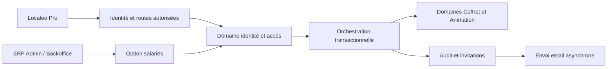

# E72 — Architecture et contrats

Version du 5 octobre 2026 ; [périmètre et parcours](README.md), [22 critères canoniques](../../roadmap/en-cours/epic-72-acces-salaries-validation-localeo-pro-backlog.md). Les structures et routes sont implémentées localement les 7–8 octobre ; voir le [bilan de vérification](verification-livraison.md). Aucun déploiement annoncé. Les chemins applicatifs sont relatifs aux dépôts indiqués.

## Existant vérifié et réutilisations

| Source réelle | Constat et conséquence |
| --- | --- |
| Backend `app/domaine/identite_acces/entities/identifiant_commercant.py`, `app/infrastructure/persistence/models.py` | `IdentifiantCommercantOrm` impose `commercant_id` et `login` uniques : un identifiant principal par commerce. Ne pas enlever cette contrainte pour y glisser les salariés. |
| Backend `entities/session_commercant.py`, `services/service_session_commercant.py` sous `identite_acces` | Session liée au commerce, scopes et révocation, sans identifiant d'une personne salariée. Enrichissement requis. |
| Backend `app/application/identite_acces/use_cases/verifier_session_commercant.py` | Relit session et statut commerce, intersecte scopes autorisés ; ne vérifie actuellement ni option ni salarié. Une vérification avant transaction seule ne garantit pas une révocation concurrente. |
| Backend `app/security/commercant_session.py` | L'acteur d'audit actuel est `commercant:<id>` ; introduire acteur individuel serveur sans perdre le commerce. |
| Backend `app/api/validation_api.py`, `merchant_animation_scan_api.py`, `animation_locale_api.py` | Scan et validation sous `commercant:validation`. Réutiliser les use cases métier, pas les règles dans une route salariée. |
| Backend `app/api/chorus_pro_api.py`, `demandes_facture_commercant_api.py` | Des actions financières utilisent aussi `commercant:validation` : ce scope seul est insuffisant pour isoler le salarié. |
| Backend `app/application/identite_acces/use_cases/reinitialiser_mot_de_passe_commercant.py` | Réinitialisation actuelle retrouve l'identifiant par commerce, déverrouille et révoque toutes les sessions du commerce. Ne pas appliquer ce comportement au salarié. |
| Backend `app/domaine/identite_acces/acces_interne.py` | `acces_externes.gerer` appartient à Admin/Backoffice et pas à Lecteur/Finance seuls ; réutilisation pour l'option. Les invitations ERP restent distinctes. |
| Pro `src/features/session/api.js`, `src/lib/session.js` | Login/validation de session retournent token, session et commerce ; ajouter acteur/capacités sans retirer les champs du principal. Bearer en mémoire/sessionStorage. |
| Pro `src/features/validation/ValidationActionWorkspace.jsx`, `src/features/animations/api.js` | Scanner commun, résolution QR dans corps JSON et reçu Animation existants à réutiliser avec projection réduite. |
| Pro `src/app/merchantNavigation.js`, `MobileNavigation.jsx`, `ProtectedRoute.jsx` | Navigation actuelle orientée commerce complet ; filtrage explicite par capacités et garde des URL requis, sans remplacer le contrôle serveur. |

Les primitives de mot de passe, aléa cryptographique, hash des tokens, email/outbox et limitation d'authentification sont réutilisées. Les états ERP et les tokens principaux ne deviennent pas des états/tokens salariés par simple alias.

## Domaine et données cibles

Le domaine `identite_acces` possède les nouveaux agrégats et la politique pure d'autorisation. `exploitation` possède la consommation Coffret ; `animation_locale` possède passage/progression/récompense. Application : chargement sous verrou, faits d'autorisation, UoW, ports, audit et outbox. Adaptateurs : ORM, HTTP, email et ERP. Conformité à l'[ADR domaine d'abord](../../architecture/decisions/ADR-2026-08-28-domaine-avant-services-applicatifs.md).

| Objet cible | Données et responsabilité |
| --- | --- |
| `OptionSalariesCommerce` | `commercant_id` unique, `active=false`, `version`, `session_epoch`, dates et acteur dernier changement. Activation/désactivation contrôlées par politique domaine. |
| `AccesSalarie` | UUID stable, commerce immuable, email normalisé, état `EN_ATTENTE_INITIALISATION/ACTIF/REVOQUE`, hash mot de passe, `security_version`, dates. Suspension par option est dérivée, distincte de `REVOQUE`. |
| `InvitationSalarie` | UUID, salarié, hash token, génération, création, expiration, utilisation/annulation ; finalité `INITIALISATION` ou `REINITIALISATION`. 24 h ou 1 h exactes en UTC ; invalide dès `now >= expires_at`. |
| `IdentiteLoginPro` | Registre unique de login normalisé vers type `PRINCIPAL/SALARIE` et ID ; réservation atomique au premier rattachement. Empêche conflit inter-tables et course d'invitations de commerces différents. |
| Session commerçante enrichie | `acteur_type`, `acteur_id`, `security_version`, `option_session_epoch` pour salarié ; champs commerce/token/scopes/dates existants conservés. Valeurs principal reprises par migration. |
| Attribution de validation | Contexte serveur partagé E70 `ActeurValidation {type: PRINCIPAL\|SALARIE\|PIN, acteur_id, commercant_id, session_id, pin_version}` (champs non pertinents null), mode `QR_PRINCIPAL/QR_SALARIE/PIN`, date serveur, référence de commande/reçu ; PIN ne prétend jamais identifier un salarié. Projection historique sans secrets ni données financières. |

Le registre email normalise espaces périphériques et casse, sans réécrire points ou suffixes `+`. Il couvre login principal et salarié, pas les comptes internes ERP. Les écritures existantes de login principal, notamment préparation E68, doivent utiliser ce registre. Une invitation du même email dans le même commerce renvoie un conflit contrôlé et oriente vers la fiche existante ; renvoi explicite seulement, aucun écrasement. Un compte révoqué ne peut être réactivé par un simple renvoi ou un reset ; aucune réaffectation automatique à un autre commerce. Le registre suit la conservation du compte et la politique de données existante, sans réservation à vie nouvelle. Une restauration individuelle ou un transfert explicite ne sont pas conçus dans cette epic ; ne pas en déduire une interdiction métier irréversible.

## Invariants et transitions

- **E72-I1** : seul principal du commerce avec option active invite/renvoie ; Admin/Backoffice seuls changent l'option ; rôle fixe salarié, commerce tiré de la session.
- **E72-I2** : accès utile seulement si compte actif, option active, génération session courante et statut commerce autorisé. Les vérifications dynamiques ne reposent pas uniquement sur les scopes au login.
- **E72-I3** : désactivation incrémente `session_epoch`, annule tous les liens en attente (invitation et reset) et invalide sessions salariées dans la même transaction. Réactivation n'abaisse jamais l'epoch. Un nouveau reset peut changer le mot de passe pendant la suspension, sans ouvrir de session ni restaurer les anciens liens.
- **E72-I4** : révocation individuelle persistante, jamais levée par reset ni réactivation de l’option ; incrémente `security_version`, annule invitations et sessions. Le reset ne modifie pas l'état ni l'option.
- **E72-I5** : acceptation et reset à usage unique, consommation du token et modification du compte atomiques. Token brut jamais stocké dans journal ou DTO de gestion.
- **E72-I6** : salarié ne reçoit que les capacités scanner, confirmation, reçu, historique minimal, session/déconnexion ; aucune capacité financière ou d'administration implicite.
- **E72-I7** : autorisation et effet de validation sont ordonnés transactionnellement avec révocation/désactivation ; consommation et effets financiers/progression restent uniques entre acteurs et modes.

Ordre total partagé avec E70 : ligne commerce (garde commune, distincte de l'option)
→ option salariés si pertinente → identité Pro puis session → PIN/protection essais
si pertinent → demande/transaction → instance coffret OU animation puis participant
→ enregistrements du droit client → occurrence/résultat/outbox. Un canal saute les
objets sans objet mais n'inverse jamais les autres. Validation, suspension commerce,
changement d'option, révocation Pro et reset prennent cette même garde et leurs
objets dans cet ordre. Rotation/révocation du droit client verrouille son parent
instance ou animation/participant puis le droit, sans reprendre ensuite la garde
commerce. Les cœurs métier ne committent pas une transaction distincte.

Si validation gagne, son commit précède la révocation effective ; sinon elle refuse
sans effet. La révocation répond après commit. Aucun appel email pendant transaction
SQL. Un reçu connu n'autorise pas une nouvelle mutation après suspension. Vérifier
ces ordres dans toutes les entrées existantes et les prouver sous PostgreSQL.

## Autorisation par capacité et audit des routes

Ajouter les capacités internes `validation.scanner`, `validation.confirmer`, `validation.recu`, `validation.historique`, `session.consulter`, `session.fermer`. Le principal conserve ses droits existants ; la politique salariée impose une liste fermée d'opérations, pas un scope large partagé.

Opérations existantes autorisables (suffixes du montage `/protected`, distinct du proxy `/api`) : `POST /exploitation/validation/ouvrir-transaction`, `POST /exploitation/validation/valider-prestation`, résolution `POST /animation-locale/commercants/me/participants/resoudre`, confirmation `POST /animation-locale/validations`, lecture du reçu `GET /animation-locale/commercants/me/participants/{participant_id}/attestations/commandes/{cle}`. Les DTO retournés au salarié sont minimisés : aucun montant/reversement/client inutile. La transaction Coffret conserve l'attribution de son initiateur et permet uniquement confirmation autorisée pour le même commerce ; IDs fournis ne font jamais autorité.

Ajouter pour la reprise Coffret `GET /protected/exploitation/validation/transactions/{transaction_id}/resultat` : état `EN_ATTENTE/VALIDEE/EXPIREE/REFUSEE`, ID validation éventuelle, date, service, sans données financières. Session et commerce recontrôlés ; 404 pour objet d'un autre commerce. Adapter le DTO commun du scanner et ses lecteurs à cette projection. Aucun accès général au coffret complet n'est donné pour afficher le reçu.

Les autres routes refusent le salarié par défaut, notamment annulation/signalement modifiant un état, finance/Chorus Pro/factures, prestation/catalogue, profil/documents, messages, animations administrables, PIN et gestion salariés. Un test d'inventaire de toutes les routes authentifiées commerçantes impose une décision explicite par opération ; toute route future non classée est refusée au salarié. Les écritures internes/batch doivent passer la même politique pour tout acteur salarié.

## API cible et DTO

Les chemins du tableau sont complets à la racine backend, avec exposition explicite. Pro ajoute seulement son préfixe de proxy `/api` ; les helpers doivent éviter de doubler `/protected`. Les nouvelles routes de jeton anonyme utilisent `/public`, celles de session `/protected` et celles ERP `/internal`. UUID, dates ISO 8601 UTC, corps stricts avec champs supplémentaires interdits. Aucun champ `role`, `commerce_id` ou `acteur` libre accepté sur une commande responsable. Pagination `page >= 1`, `page_size` par défaut 20, maximum 100 ; réponse `{items,page,page_size,total}`.

| Méthode et route cible | Accès, entrée et résultat |
| --- | --- |
| `GET /protected/identite-acces/commercants/me/salaries` | Principal ; liste `{id,email,etat,acces_effectif,invitation:{id,etat,expires_at,remise},version}` et `{option_active}`. Aucun hash/token. Lecture possible option désactivée. |
| `POST /protected/identite-acces/commercants/me/salaries/invitations` | Principal, option active ; `{email}` et `Idempotency-Key` ; 201 `{salarie_id,invitation_id,etat,expires_at,remise}`. |
| `POST /protected/identite-acces/commercants/me/salaries/invitations/{id}/renvoyer` | Principal, option active ; `{expected_version}`, clé idempotence ; 200 nouvelle génération et ancien lien annulé. |
| `POST /protected/identite-acces/commercants/me/salaries/invitations/{id}/annuler` | Principal ; `{expected_version}` ; 200 état annulé, même action répétée sans effet supplémentaire. |
| `POST /protected/identite-acces/commercants/me/salaries/{id}/revoquer` | Principal ; `{expected_version}` ; 200 `REVOQUE`, sessions/tokens invalidés. Possible option désactivée. |
| `POST /public/identite-acces/salaries/invitations/resoudre` | Public limité ; `{token}` en corps ; 200 `{commerce:{nom},email_masque,expires_at}` sans consommation du lien. Refus générique si expiré/annulé/utilisé ou option inactive ; aucun identifiant interne ni token renvoyé. |
| `POST /public/identite-acces/salaries/invitations/accepter` | Public limité en débit ; `{token,nouveau_mot_de_passe}` ; 200 `{statut:"ACTIVE"}`, pas de session implicite. |
| `POST /public/identite-acces/salaries/auth/mot-de-passe-oublie` | Public limité ; `{login}` ; toujours 202 et texte générique, même email inconnu. Envoi seulement vers email enregistré. |
| `POST /public/identite-acces/salaries/auth/reinitialiser-mot-de-passe` | Public limité ; `{token,nouveau_mot_de_passe}` ; 200 `{statut:"REINITIALISE"}` sans session. |
| `GET /protected/identite-acces/commercants/me/validations` | Principal ou salarié autorisé ; `page,page_size,type=COFFRET/ANIMATION,mode,date_debut,date_fin` ; items `{id,type,libelle,date,resultat,mode,auteur:{type,id,libelle}}`. Aucun filtre de commerce accepté. |
| `GET /internal/identite-acces/commercants/{id}/option-salaries` | ERP `acces_externes.consulter` ; état/version et dernier changement sans identifiants privés salariés. |
| `PUT /internal/identite-acces/commercants/{id}/option-salaries` | ERP `acces_externes.gerer` + CSRF ; `{active,expected_version}` ; 200 état/version ; mutation répétée déjà réalisée sans incrément ni annulation supplémentaire. |

Les chemins de session existants sous `/protected/identite-acces/commercants`, suffixes `/auth/login`, `/session/valider` et `/session/{id}/invalider`, restent utilisables selon leur contrat actuel ; login sans session préalable demeure une exception historique de routage, pas une justification pour les nouvelles routes publiques. Le login résout le registre d'identité ; un principal garde sa logique de préparation E68. Ajouter `acteur:{type:"PRINCIPAL"|"SALARIE",id}`, `capacites:[...]`, `option_salaries_active` à la réponse de session, conserver `commercant`, `session_token`, `session_id`, `expires_at`, `scopes`. Pour un salarié, la projection `commercant` se limite à ID/nom/statut ; ne jamais déclencher un chargement automatique du profil commercial. Pas de token dans URL, localStorage, logs ni notification.

Erreurs cibles dans l'enveloppe API commune, code stable et identifiant de corrélation : 401 `SESSION_INVALIDE` ; 403 `ACTION_NON_AUTORISEE`, `OPTION_SALARIES_INACTIVE`, `ACCES_SALARIE_REVOQUE` pour session connue ; 404 `RESSOURCE_INTROUVABLE` pour ressource tierce ; 409 `IDENTITE_PRO_INDISPONIBLE`, `VERSION_OBSOLETE`, `IDEMPOTENCE_CONFLIT` ; 400 `LIEN_INDISPONIBLE` sans distinguer token inconnu/expiré/utilisé ; 422 payload/politique mot de passe ; 429 limitation avec `Retry-After`. Login public reste générique et ne révèle ni commerce ni révocation.

Idempotence des invitations : même acteur/commande/clé et même corps normalisé retourne le reçu ; corps différent donne 409. Le reçu ne contient jamais le token. Renvoi crée au plus une génération et une intention email. Le fournisseur email n'est pas transactionnel : outbox dédupliquée par invitation/génération, worker revérifiant annulation/expiration avant émission. Le token est persisté uniquement sous forme de hash côté identité. Pour la livraison
email asynchrone, la donnée permettant de construire le lien est chiffrée dans
une charge de remise protégée, accessible au seul worker par un port de chiffrement ;
elle ne figure ni en clair dans l’outbox générale ni dans les logs de diagnostic.
La charge est retirée après remise ou expiration/annulation, sans effacer les
métadonnées de preuve d’envoi. Les clés sont provisionnées séparément de la base,
jamais dans le frontend ; perte de clé signifie échec de remise puis renvoi explicite.
Une livraison tardive ne rend jamais le lien annulé valable. Échec fournisseur laisse invitation non acceptée et remise `ECHEC`, avec renvoi explicite reprenable.

## Interface, migration et compatibilité

Créer dans Pro l'acceptation `/salaries/invitation`, la récupération `/salaries/reinitialiser-mot-de-passe`, la gestion responsable `/salaries` et l'historique restreint `/validations`. Lire le token une fois en mémoire, nettoyer l'URL immédiatement, `Referrer-Policy: no-referrer`, aucun analytics sur ces écrans. Le login salarié dirige vers scanner, les liens entrants interdits vers un écran de refus/scanner ; jamais vers le menu principal complet. Navigation salarié : scanner, historique, déconnexion et récupération d'accès. Caches vidés au changement d'identité, 401/403 de suspension, reset et déconnexion. Pas de cache API hors ligne ni mutation rejouée automatiquement.

Migration additive : nouvelles tables, registre email repris depuis identifiants principaux, colonnes sessions/attribution compatibles nullable pendant déploiement puis contraintes après reprise vérifiée. Détecter les collisions de normalisation avant toute écriture : arrêt avec rapport d'IDs, sans fusion. Sessions historiques explicitement principales ; traces historiques conservées sans acteur inventé. Option false pour tous, aucun salarié automatique. Le registre et l'audit doivent être intégrés à tous les producteurs principaux avant activation. Le reset principal conserve la sémantique antérieure de révocation de ses sessions principales ; il ne révoque pas implicitement les salariés sauf désactivation explicite de l'option.

Déployer backend et migration, Pro/contrat embarqué régénéré, puis seulement activation ERP pilote. Ancien Pro ne doit pas recevoir de session salariée : ouverture salarié conditionnée à une version de contrat client supportée (en-tête `X-Localeo-Pro-Contract: salaries-v1` sur login/validation session) ; principal inchangé. Cette compatibilité n'est jamais une mesure d'autorisation. Les appels salariés restent contrôlés côté serveur même avec en-tête forgé.

Le producteur est FastAPI ; conception canonique ici, OpenAPI documentaire dans le dépôt projet selon le générateur backend existant. À l'implémentation, régénérer l'OpenAPI embarqué `localeo-commercant/api/localeo-openapi.json` par son script, pas une fixture manuelle. Aucun contrat Marketplace ou partenaire Animation à changer pour gérer les salariés ; les extensions d'audit doivent rester additives pour leurs lecteurs.

## Audit et conservation

Événements : invitation/renvoi/annulation/acceptation, reset, login/refus, révocation, changement option, validation et refus. Attributs : acteur authentifié type/ID, commerce, cible, action, date serveur, résultat/code sûr, corrélation, mode, version avant/après. Exclure email complet des logs techniques lorsque ID suffit, mot de passe, token invitation/session/reset et QR. L'auteur du reset public n'est identifié qu'après validation du token. Les erreurs d'envoi ne publient pas le lien dans l'ERP.

Appliquer le [rattachement commun de conservation](../identite-acces/conservation-validations-acces.md), établi sur l'Annexe A le 7 octobre : journaux ordinaires au maximum 12 mois, preuves nécessaires de consommation Coffret 5 ans selon l'événement qualifié, preuves d'habilitation 5 ans après la fin de relation correspondante. Secrets et notifications suivent leurs catégories propres. Les archives probatoires sortent de l'historique opérationnel salarié et restent soumises aux habilitations internes. Les jobs et leurs protections SQL/JSONL restent à réaliser et à tester ; le rattachement documentaire est établi.
