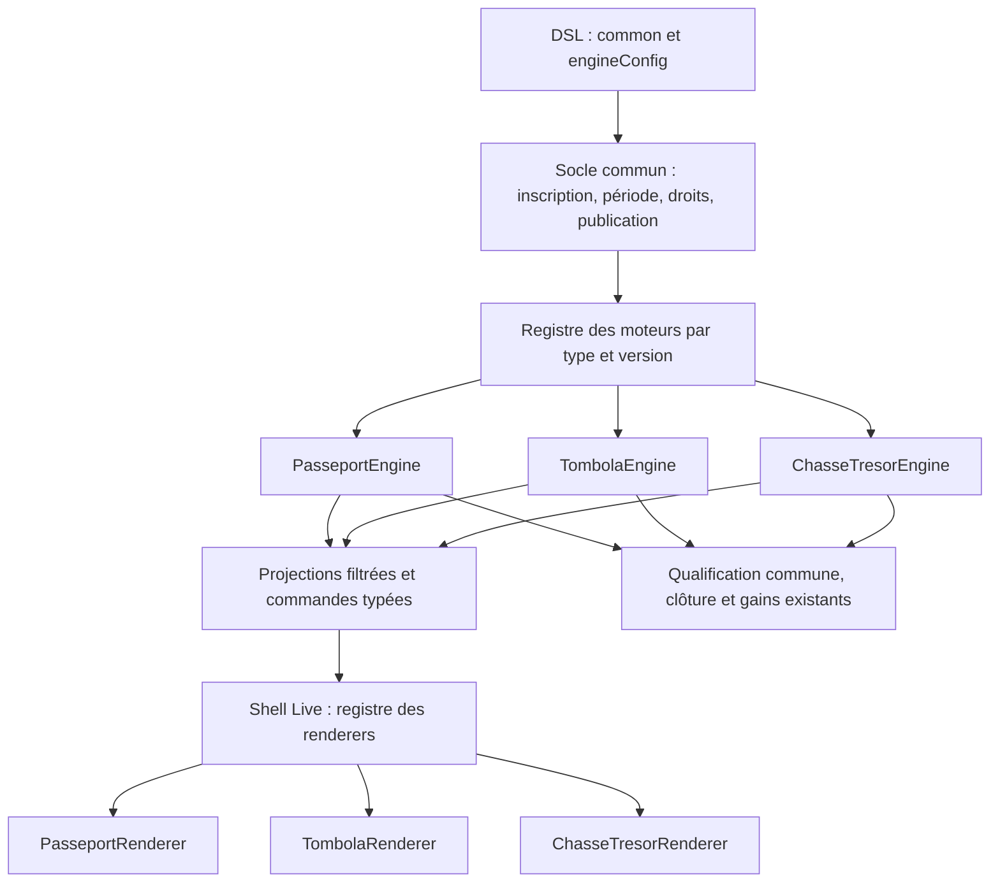
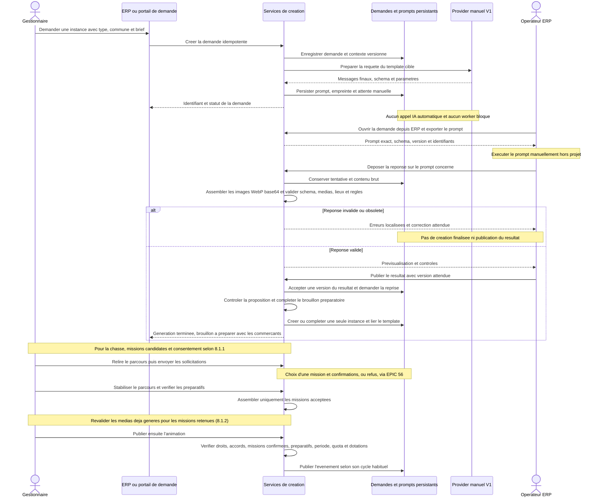

# Localeo Animation Engine — Animation générique, DSL et moteurs spécialisés

Version documentaire : 1.18 — 19 septembre 2026. Epic 55, statut produit : **En cours** (classement de la roadmap au 18 septembre 2026).

Cette spécification unique organise le produit autour du concept commun d’Animation, d’un DSL JSON extensible par type et d’un moteur de rendu propre à chaque type. Le catalogue V1 comprend Passeport commerçant, Tombola locale et Chasse au trésor. Elle conserve les décisions sur les prompts persistants, le dernier appel IA bouchonné et la conversion des configurations existantes et la bascule directe vers le moteur commun.

Les schémas, interfaces et routes ci-dessous décrivent la cible ; cette réorganisation documentaire ne constitue pas leur implémentation.

Le [lot de conception technique V1](conception-technique.md), établi à partir du code le 19 septembre 2026, fixe désormais les contrats de production, le mapping de persistance, les verrous, les API/droits, les budgets médias et l’exploitation. Il précise les noms auparavant proposés ici ; les anciens exemples JSON restent illustratifs. Les règles métier et arbitrages de cette spécification restent la référence.

## Sommaire

- [1. Objet et catalogue V1](#perimetre)
- [2. Modélisation générique de l’animation](#modele)
- [3. DSL JSON : commun et spécifique](#dsl)
- [4. Moteurs spécialisés et moteurs de rendu](#engines)
- [5. Responsabilités des applications](#responsabilites)
- [6. Architecture et raccordement à l’existant](#architecture)
- [7. Contrats API, commandes et transactions](#api)
- [8. Génération, prompts et dernier appel bouchonné](#generation)
- [9. Publication, versions et bascule](#publication)
- [10. Expériences Live et protection des contenus](#experience)
- [11. Mesures et exploitation](#exploitation)
- [12. Livraison et besoins](#livraison)
- [13. Décisions et arbitrages](#arbitrages)
- [14. Conception technique et vérifications restantes](#questions-ouvertes)
- [15. Recette](#recette)
- [Annexe A. Exemples JSON](#exemples)
- [Annexe B. Références](#references)

<a id="perimetre"></a>
## 1. Objet et catalogue V1

Une **animation** est un événement territorial décrit par un DSL JSON versionné. Elle possède un socle commun — identité, organisateur, territoire, période, inscription, publication, participation et suivi — puis une configuration métier propre à son type.

Le catalogue V1 comprend exactement trois types : **Passeport commerçant**, **Tombola locale** et **Chasse au trésor**. Chacun possède son moteur spécialisé et son moteur de rendu. Le socle commun délègue l'interprétation de la partie spécifique du JSON au moteur sélectionné par le type.

Le moteur spécialisé est un module du produit, enregistré et versionné. Le document JSON le configure ; il ne fournit pas de code exécutable. Un même shell Live peut accueillir trois expériences distinctes sans imposer aux Passeports et Tombolas les étapes narratives de la chasse.

Cette version reprend les mécaniques Passeport et Tombola dans le moteur commun. Précision utilisateur du 18 septembre 2026 : Live n’est pas encore déployé et aucune animation n’a été publiée avec l’ancien moteur. La livraison prévoit donc une bascule directe, sans rétrocompatibilité avec un ancien Live ni coexistence de moteurs. Les éventuels brouillons/configurations sont inventoriés et convertis sans perte silencieuse. Rallye, quiz territorial et autres types sont des extensions ultérieures du catalogue.

Le flux de génération décrit plus loin construit réellement le prompt final et l'enregistre en base. Seul le dernier appel IA est bouchonné ; l'opérateur traite les prompts hors projet et rattache les réponses. La migration technique de données existantes est déterministe et ne nécessite pas ce flux de génération.

Le document décrit une cible à implémenter. Les arbitrages validés sont identifiés dans le registre ; les noms de champs, interfaces, routes et tables de production sont précisés dans le [dossier technique](conception-technique.md), distinct des exemples exploratoires.

<a id="modele"></a>
## 2. Modélisation générique de l'animation

### 2.1 Entités et responsabilités communes

| Concept | Responsabilité commune | Ce qui dépend du type |
| --- | --- | --- |
| `Animation` | Événement identifié, organisateur/partenaire, commune, type, dates et cycle de vie. Réutilise l'entité du domaine actuel. | Code du type et version du contrat de son moteur. |
| `AnimationDefinition` | Description JSON privée, versionnée, structurée en enveloppe commune et configuration spécifique. | Contenu et schéma d'`engineConfig`. Elle n'est pas nécessairement narrative et ne possède pas toujours un graphe. |
| `ConfigurationAnimation` | Version concrète et associations autorisées de l'événement ; provenance des changements. | Paramètres interprétés par le moteur spécialisé. |
| `ParticipantAnimation` | Inscription, identité de participation, accès et reprise, consentements applicables et rattachement à l'événement. | Conditions d'éligibilité et état métier de participation. |
| Exécution de participation | Référence à la version applicable, état persistant, version de concurrence et historique des commandes. | Données d'exécution privées : tampons du Passeport, qualification Tombola ou progression narrative. `GameSession` est une notion de chasse, pas une obligation de modélisation de tous les types. |
| Preuve / validation | Acteur, date, événement, statut effectif ou annulé, références et audit. | Sens de la preuve, conditions d'acceptation et impact sur la progression. Une preuve commerçante existante reste distincte d'un défi ou d'un QR de POI. |
| Dotations et tirage | Lots financés, population gelée, attribution, gains et notifications existants. | Critères de qualification calculés par le moteur, dans les limites autorisées par le socle. |
| Opération / prompt | Demande, auteur, contexte, version, résultat et suivi asynchrone. | Schéma de réponse et instructions propres au type demandé lorsque la génération s'applique. |

Une animation concrète conserve l'identité existante `Animation`. `AnimationInstance` désigne son exploitation configurée et ne crée pas un agrégat commercial concurrent. Le participant et ses tokens ne sont pas recréés au changement de moteur.

### 2.2 Caractéristiques communes

| Bloc commun | Données décrites ou référencées | Contrôle du socle |
| --- | --- | --- |
| Présentation | Titre, description, assets et informations publiques. | Taille, format, droits sur les ressources et projection publique. |
| Organisateur et territoire | Partenaire responsable et commune. | Autorisation et correspondance avec l'animation persistée ; un JSON importé ne peut changer de propriétaire. |
| Période | Date/heure de début et de fin, fuseau d'affichage. | Instants normalisés, début avant fin, contrôle de la période lors des commandes. |
| Inscription | Inscription requise pour les trois types V1 ; ouverture dès publication, fermeture à la fin ou date anticipée, plafond facultatif, données et consentements requis. | Création/reprise du participant, unicité, fenêtre, capacité atomique et autorisations. Politique commune aux nouvelles animations ; paramètres des brouillons existants explicitement vérifiés à la conversion. |
| Publication | Version acceptée, visibilité et état de l'événement. | Cycle de vie, accords, quota, financement et gel de version ; l'état effectif est une donnée serveur, pas une instruction libre du DSL. |
| Participation | Référence à une version, accès autorisé, reprise et état d'éligibilité. | Identité, concurrence, historique et coordination avec clôture. |
| Récompenses | Référence au mode de dotation et au circuit de tirage existant. | Lots, réservations, population figée et gains ; le JSON n'autorise pas un paiement ou un gain arbitraire. |
| Exploitation | Audit, notifications, métriques, erreurs et décisions autorisées. | Persistance et périmètre ; les actions telles qu'une dispense d'étape ne sont disponibles que pour les types qui les supportent. |

**Politique d’inscription V1 :** le socle l’applique aux Passeports, Tombolas et Chasses, indépendamment du moteur spécialisé. Les brouillons convertis sont validés avec ces règles avant leur première publication ; toute valeur source contradictoire est signalée, sans écrasement implicite ni seconde politique d’inscription héritée.

| Point | Règle commune retenue |
| --- | --- |
| Ouverture | Dès la publication publique effective de l’animation ; publier une définition ou un résultat fournisseur n’ouvre pas les inscriptions. Avant `startsAt`, inscription et reprise sont possibles, mais aucune commande de jeu ni preuve de passage ne peut être validée. |
| Fermeture | À `endsAt` par défaut ; l’organisateur peut définir une date/heure de fermeture anticipée, y compris avant le démarrage. Une inscription pendant le déroulement reste possible si la fenêtre est ouverte et la capacité disponible. |
| Droits des inscrits | La fermeture des inscriptions empêche les nouvelles inscriptions, sans fermer le jeu ni retirer l’accès aux participants déjà inscrits. Ils jouent/reprennent jusqu’à la fin de l’animation, sous réserve des états et règles habituels. Une inscription tardive ne prolonge pas la période de jeu. |
| Capacité | Aucune limite par défaut. L’organisateur peut fixer un nombre maximal d’inscriptions pour cette animation ; une participation familiale compte pour une seule place, quel que soit le nombre d’accompagnants. |
| Clôture/annulation | L’état métier reste prioritaire : aucun accès nouveau au jeu ou inscription dans une animation clôturée, archivée ou annulée, même si une date configurée est ultérieure. La consultation des résultats/historiques garde ses droits propres. |

La fenêtre utilise les instants serveur, avec ouverture incluse et fermeture exclue. Une fermeture anticipée doit être au plus tard à la fin de l’animation et encore future lors de sa publication ; le socle refuse une fenêtre vide ou incohérente. La date de début reste la borne de début des commandes de jeu. Pour un exemple avec début le 10, fin le 20 et fermeture des inscriptions le 15, un inscrit du 14 peut jouer jusqu’au 20 ; aucune nouvelle inscription n’est créée dès l’instant de fermeture du 15.

La création du participant et la prise de place sont atomiques : deux demandes pour la dernière place ne peuvent dépasser le plafond. Rejeu, récupération d’accès et reprise sur plusieurs appareils retrouvent l’inscription existante et ne consomment pas de nouvelle place, même lorsque l’animation est complète ou les inscriptions fermées. Compter les inscriptions uniques enregistrées, pas les connexions, scans, membres d’une famille ou participants qualifiés ; une invalidation de preuve ne libère pas de place. Les détails d’une éventuelle annulation d’inscription ne sont pas introduits implicitement ici.

**Modification après publication — décision du 19 septembre 2026 :** les contenus et la version jouable restent figés. Seuls les paramètres d’exploitation ci-dessous sont modifiables par un acteur autorisé sur l’animation ; les commandes du domaine appliquent les mêmes règles depuis Animation, ERP ou API.

| Situation | Changements autorisés et contrôles |
| --- | --- |
| Avant démarrage | Modifier début, fin, fermeture des inscriptions et capacité, sous réserve de cohérence des dates et des droits. Refaire les contrôles concernés, notamment horaires, accords, période de financement et checklist applicables ; une configuration incohérente n’est pas rendue effective. |
| Après démarrage | Le début ne change plus. Prolonger la fin et ajuster la capacité sont possibles ; raccourcir la fin par cette commande est refusé. Les vérifications affectées restent exigées. Le contenu et les acquis des participants ne sont pas modifiés. |
| Réouverture des inscriptions | Une fermeture d’inscriptions peut être levée explicitement avant la fin effective si l’animation n’est ni clôturée, ni archivée, ni annulée. Modifier la fermeture en une borne future valide ou rétablir la fermeture à la fin ; les nouvelles inscriptions restent soumises au plafond et aux droits. Une capacité pleine ne permet jamais de dépasser ce plafond. |
| Clôture, archivage ou annulation | Ces ajustements ne rouvrent ni inscriptions ni jeu, et ne modifient jamais une population de tirage figée. |

Les changements préservent les inscriptions existantes : une baisse de plafond ne supprime aucun participant et bloque seulement les nouvelles créations tant que la capacité ne le permet pas. Si `closesAt` n’est pas défini, la fermeture suit la fin effective de l’animation ; s’il est explicite, une prolongation de jeu ne décale pas silencieusement cette fermeture. Une réouverture d’inscriptions reste distincte d’une réouverture de jeu ou de population figée.

Tracer l’auteur, la date, le motif/contexte de l’action, les anciennes et nouvelles valeurs, ainsi que la révision d’exploitation. Une modification concurrente avec démarrage, inscription ou clôture recontrôle état, instants serveur et version dans la transaction ; aucun écran ou endpoint ne contourne ces règles. Les noms de permissions, payloads et verrous restent à aligner avec les contrats techniques. La validation de ces règles ne présume pas leur implémentation.

### 2.3 Définition, état et projections

Le DSL décrit les caractéristiques configurées. Les participants, réponses, scans, tokens, états de progression, tirages exécutés et gains restent des données opérationnelles persistées séparément. Ils ne sont pas sérialisés dans le DSL de définition comme source d'autorité modifiable.

**Stockage retenu (TRE-ARB-67, choix 8.A du 19 septembre 2026) :** conserver les définitions versionnées en JSON et les participations, preuves et états de progression dans des tables structurées. Réutiliser les tables existantes lorsqu’elles portent déjà ces responsabilités ; prévoir les relations, clés, contraintes d’unicité et index des compléments lors de la conception physique. Le JSON de définition reste distinct de l’état opérationnel et ne remplace ni les preuves ni les contraintes transactionnelles. Ce choix n’impose pas une table pour chaque élément éditorial ni un modèle d’étapes commun à tous les moteurs.

La version publiée associe une enveloppe commune à un couple type/version spécifique. Les paramètres d'exploitation modifiables et leurs révisions sont distincts des contenus figés. La projection publique expose la présentation ; la projection participant expose uniquement les données autorisées par le moteur du type. La définition complète reste privée.

<a id="dsl"></a>
## 3. DSL JSON : enveloppe commune et configuration spécifique

### 3.1 Contrat racine proposé

| Champ | Responsabilité |
| --- | --- |
| `schemaVersion` | Version du schéma commun du DSL. |
| `definitionVersion` | Version du document complet ; commune et spécifique évoluent ensemble dans une version acceptée. |
| `type` | Discriminant du catalogue : `PASSEPORT_COMMERCANT`, `TOMBOLA_LOCALE` ou `CHASSE_TRESOR_COMMERCANTE`. Les codes existants sont conservés ; le troisième est le code cible proposé. |
| `engineConfigVersion` | Version du contrat spécifique comprise par le moteur de ce type ; distincte d'une version de déploiement du code. |
| `common` | Présentation, thème visuel facultatif de l’animation (8.1.2), organisateur/territoire, période, inscription, assets contrôlés et politique commune de récompenses. |
| `engineConfig` | Configuration privée au type : seuil/commerces, règles de Tombola ou étapes/défis/collectibles. |

Contrat proposé pour `common.registration` des nouvelles animations :

| Champ proposé | Sens et contrôle |
| --- | --- |
| `required` | `true` pour les trois types V1. |
| `openingPolicy` | `ON_PUBLICATION` : l’ouverture effective dépend de l’événement de publication persisté, pas d’une date libre déclarée par le fournisseur. |
| `closesAt` | Date/heure explicite de fermeture anticipée ou `null` pour suivre `common.schedule.endsAt` ; cohérence contrôlée avec publication et période. |
| `maxParticipants` | Entier strictement positif ou `null` pour aucune limite ; compteur réel et places disponibles restent des données serveur hors DSL. |

Les noms de champs sont proposés ; les règles métier ci-dessus sont décidées. Les paramètres sont choisis par l’organisateur et contrôlés par le socle : le provider de contenus ne peut les modifier. La conversion des brouillons rend explicites les valeurs conservées, les valeurs par défaut V1 et les conflits à résoudre avant publication.

`common` possède un schéma fermé. `engineConfig` possède également un schéma fermé, mais celui du moteur choisi par `type` et `engineConfigVersion`. Il n'est donc ni un champ libre ignoré par la validation, ni un ensemble de champs de chasse imposés à tous les types.

**Source des schémas retenue (TRE-ARB-65, choix 6.A du 19 septembre 2026) :** les modèles de validation du backend définissent les structures acceptées ; les JSON Schema sont exportés automatiquement depuis ces modèles. Les consommateurs et la génération utilisent les exports correspondant à la version visée, sans schéma parallèle maintenu manuellement. Les modèles de validation structurelle et leur export respectent les couches existantes : ils n’introduisent pas de dépendance à un framework dans le domaine. Les règles métier et contrôles contextuels restent dans le domaine et sont exécutés en plus de la validation de structure ; un export JSON Schema seul ne prouve pas leur respect. Le générateur reste dans le dépôt applicatif ; les références documentaires restent centrales. Les modèles, chemins d’export et contrôles de concordance restent à implémenter.

Le socle connaît l'existence et la version de `engineConfig` ; il peut le stocker, le transmettre au moteur et en calculer l'empreinte. Il n'interprète pas ses clés métier. Les autres moteurs n'ont pas à comprendre ce bloc. L'administrateur doit pouvoir connaître les erreurs de validation produites par le moteur approprié.

### 3.2 Exemple d'enveloppe : Passeport commerçant

Les identifiants sont illustratifs et les noms de champs proposés. Le bloc `registration` explicite ici la politique des nouvelles animations : ouverture à la publication, fermeture à la fin et absence de plafond par défaut.

```json
{
  "schemaVersion": "1.0",
  "definitionVersion": 1,
  "type": "PASSEPORT_COMMERCANT",
  "engineConfigVersion": "1.0",
  "common": {
    "metadata": {
      "title": "Passeport des commerces de Latresne",
      "description": "Faire valider ses passages chez les commerces participants."
    },
    "organizer": {
      "partnerId": "partner-latresne"
    },
    "territory": {
      "communeId": "commune-latresne"
    },
    "schedule": {
      "startsAt": "2026-10-01T08:00:00+02:00",
      "endsAt": "2026-10-31T18:00:00+01:00",
      "timeZone": "Europe/Paris"
    },
    "registration": {
      "required": true,
      "openingPolicy": "ON_PUBLICATION",
      "closesAt": null,
      "maxParticipants": null
    },
    "assets": [],
    "rewards": {
      "mode": "EXISTING_DRAW"
    }
  },
  "engineConfig": {
    "merchantIds": [
      "merchant-a",
      "merchant-b",
      "merchant-c"
    ],
    "validation": {
      "uniquePerMerchant": true
    },
    "qualification": {
      "requiredDistinctMerchants": 2
    },
    "visitOrder": "FREE"
  }
}
```

Dans cet exemple, le socle contrôle période, inscription, territoire et récompenses. Seul le moteur Passeport interprète la liste des commerces, le seuil et l'ordre libre. Les références de lieux déclarées par ce moteur sont ensuite contrôlées par les services communs d'autorisation.

### 3.3 Validation et compatibilité

1. Valider la syntaxe et le schéma de l'enveloppe commune, sa version et les limites de taille.
2. Résoudre le moteur via le registre à partir du type et de la version demandés. Refuser un type inconnu ou une version non supportée ; ne pas sélectionner par défaut le moteur de chasse.
3. Déléguer à ce moteur la validation et la normalisation d'`engineConfig`, avec des erreurs localisées dans ce bloc.
4. Appliquer les contrôles transverses aux références déclarées par le moteur : partenaire, commune, commerces, POI, ressources et dotations autorisés.
5. Vérifier l'ensemble des préconditions de publication et l'acceptation requise pour les contenus, puis figer la définition et les versions compatibles.

Un bloc Passeport transmis sous `type=TOMBOLA_LOCALE` doit être refusé même s'il est syntaxiquement du JSON valide. Le fait que le socle n'interprète pas le bloc spécifique ne permet pas de contourner ses droits, son financement ou son cycle de vie. Les actions contenues dans une chasse sont traitées par son moteur et ne deviennent pas des commandes privilégiées générales du DSL.

Le DSL ne contient ni script, ni chemin de module à charger, ni nom de composant arbitraire. Les moteurs et renderers sont installés dans le produit. Une nouvelle définition d'un type déjà supporté ne nécessite pas de redéploiement ; ajouter un nouveau type ou une primitive non supportée demande une implémentation et une mise à jour du registre.

### 3.4 Construction et génération

Le serveur construit l'enveloppe commune à partir des choix autorisés du gestionnaire. Pour la création assistée, il prépare le prompt final avec le type, le contexte et le schéma de contenus attendu par ce moteur, puis le stocke avant le dernier appel bouchonné. Les règles de progression et de gains restent fixées côté serveur.

Une réponse générateur n'est pas automatiquement le DSL exécutable complet. Le moteur cible vérifie les contenus proposés, le serveur les assemble avec la configuration commune et les règles autorisées, puis le même pipeline de validation s'applique. Un bouchon contenant déjà un document complet reste soumis à ces contrôles ; il ne peut changer les droits ou le type demandé.

La conversion d'un Passeport ou d'une Tombola existant produit directement l'enveloppe et son `engineConfig` à partir des données déjà enregistrées, sans prompt ni appel IA. Cette voie conserve les mécaniques propres au modèle et contrôle la configuration contre les règles V1 avant publication.

<a id="engines"></a>
## 4. Moteurs spécialisés et moteurs de rendu

### 4.1 Registre du catalogue

Chaque entrée du catalogue associe **un type, son interpréteur métier serveur et son moteur de rendu frontend**. Ces deux composants partagent un contrat de projection versionné. Leur responsabilité est distincte : le renderer affiche l'expérience et soumet des commandes ; seul le serveur valide les preuves, la progression et la qualification.

| Type V1 | Moteur métier proposé | Renderer proposé | Partie spécifique |
| --- | --- | --- | --- |
| `PASSEPORT_COMMERCANT` | `PasseportEngine` | `PasseportRenderer` | Commerces accessibles sans ordre narratif, validations distinctes, seuil et présentation des tampons. |
| `TOMBOLA_LOCALE` | `TombolaEngine` | `TombolaRenderer` | Attestation d'achat, qualification fixe, état d'inscription/participation et suivi du tirage. |
| `CHASSE_TRESOR_COMMERCANTE` | `ChasseTresorEngine` | `ChasseTresorRenderer` | Étapes, accès, défis, aides, collectibles, transitions et dispenses. |

Ces noms sont proposés. **Organisation retenue (TRE-ARB-64, choix 5.A du 19 septembre 2026) :** les moteurs sont des modules internes au backend existant, enregistrés explicitement et livrés avec lui. Leur code est regroupé par moteur dans les couches concernées, avec des interfaces communes et une séparation domaine/application/infrastructure préservée. La V1 ne crée ni paquets de moteurs distribués séparément ni services réseau dédiés. Les renderers restent dans les frontends existants et leur livraison est coordonnée avec les contrats backend ; composants visuels, preuves et fonctions de domaine peuvent être réutilisés.

### 4.2 Contrat d'un moteur et de son renderer

| Fonction du moteur serveur | Résultat attendu |
| --- | --- |
| Décrire les versions/capacités | Schémas de configuration, commandes, projection et fonctions supportées. |
| Valider/normaliser la configuration | Configuration spécifique typée, erreurs métier et références à faire autoriser par le socle. |
| Initialiser ou reconstruire l'exécution | État propre au type, y compris depuis une configuration source convertie. |
| Déterminer les commandes autorisées | Actions disponibles pour l'acteur selon son état, la période et les preuves. |
| Traiter une commande ou une preuve | Résultat métier et effets autorisés, appliqués dans l'unité de travail commune et de façon idempotente. |
| Évaluer la qualification | Progression, conditions requises/effectives, éligibilité et chances compatibles avec le circuit commun. |
| Produire les projections | Vue joueur, commerçant ou organisateur filtrée, propre au type et versionnée. |

Le socle orchestre authentification, accès participant, période, transactions et événements. Le moteur ne publie pas directement une animation, ne facture pas et ne tire pas les gagnants hors du circuit commun. Les interfaces concrètes restent à adapter aux protocoles existants.

Le shell frontend commun prend en charge découverte, fiche, dates, inscription, reprise, erreurs transverses et accès aux résultats. Il distingue inscription possible, animation complète, inscriptions fermées et attente du démarrage. Avant le début, un inscrit voit sa confirmation et la date de démarrage ; après fermeture des inscriptions, il conserve l’accès à sa participation. Le serveur fournit ces états et actions autorisées ; masquer un bouton ne remplace pas les contrôles de fenêtre/capacité. Il résout `type` vers le renderer enregistré. Ce renderer comprend la projection spécifique issue du moteur correspondant ; il ne reçoit pas nécessairement `engineConfig` brut, qui peut contenir des réponses secrètes.

L'enveloppe de projection commune porte au minimum l'animation, le type, la version de contrat, l'état d'inscription et la participation autorisée. Son bloc `view` et ses commandes typées sont spécifiques. Le shell ne recherche pas un `currentStepId` dans toutes les réponses et n'impose pas un compteur d'étapes aux Tombolas. Le registre refuse aussi les projections dont le renderer ne supporte pas la version.

**Versionnement retenu (TRE-ARB-66, choix 7.A du 19 septembre 2026) :** une version de contrat coordonnée par type associe configuration spécifique, commandes et projections compatibles. Passeport, Tombola et Chasse évoluent chacun à leur rythme, sans version globale imposée aux trois moteurs ni combinaisons libres de versions indépendantes pour ces trois composantes en V1. Le champ proposé `engineConfigVersion` est à raccorder à cette version coordonnée ; les noms définitifs et le mapping dans les commandes/projections restent à formaliser. `schemaVersion` continue d’identifier le schéma commun, `definitionVersion` la révision du contenu ; ces identités restent distinctes de la version du contrat moteur et de celle du déploiement. Une définition publiée et sa participation conservent leur contrat et leur contenu ; une évolution de moteur ne les migre pas silencieusement.

**Première livraison (décision du 18 septembre 2026) :** Live n’étant pas encore déployé, aucune rétrocompatibilité avec une ancienne projection Live, aucun adaptateur legacy et aucun maintien parallèle d’anciens renderers ne sont requis. Backend, Live, Animation, ERP et application commerçant sont alignés sur le contrat V1 avant ouverture. Le versionnement des schémas, contenus, commandes et projections reste utile pour identifier les contrats et préserver les futures animations publiées ; il ne justifie pas une couche de compatibilité préalable au lancement.

### 4.3 Moteur Passeport commerçant

Le participant consulte les commerces accessibles et les validations obtenues, sans ordre narratif. `engineConfig` décrit les commerces et le seuil requis ; le moteur préserve les règles effectives, l'unicité par commerçant, la normalisation des anciens paramètres et les consignes actuelles. Il compte uniquement les validations effectives des commerces autorisés.

Le renderer montre les tampons/visites, le seuil et l'état de qualification. Les commerces manquants peuvent rester visibles ; aucune énigme future n'est à cacher. Il n'impose ni défi, ni collectible, ni écran de fin supplémentaire. Une chance est attribuée lorsque le seuil est atteint ; la règle n'est pas remplacée par « tous les commerces ».

#### 4.3.1 Configuration et invariants du Passeport

| Élément | Contrat du moteur |
| --- | --- |
| Entrée spécifique | `merchantIds`, `validation.uniquePerMerchant=true`, `qualification.requiredDistinctMerchants`, `visitOrder=FREE` ; références de template et contenus éditoriaux selon le schéma versionné à finaliser. |
| Normalisation | Dédupliquer les commerces ; convertir l’alias source `seuil_validations` s’il est présent dans un brouillon, puis n’exposer que le contrat V1 ; conserver l’origine automatique/manuelle du seuil. |
| Publication | Liste autorisée et seuil entier atteignable ; contrôles communs des accords, dates et lots. Le provider ne choisit ni un commerce hors périmètre ni un nouveau seuil. |
| Validation effective | Statut `VALIDEE`, commerce autorisé ; une validation par commerce compte, quelle que soit la répétition des commandes. Les preuves annulées/en anomalie sont exclues. |
| Qualification | `n` commerces distincts validés, `s` requis : progression `min(100, 100*n/s)`, éligibilité `n >= s`, une chance si éligible, zéro sinon. Première validation = première date effective applicable. |
| Annulation | Recalcul selon les règles Passeport existantes, sans inventer de dispense globale de chasse ; populations déjà gelées non modifiées silencieusement. |

#### 4.3.2 Commandes, état et rendu du Passeport

L'état spécifique contient les références des validations effectives par commerce, leur date, le compteur et la qualification calculée. Il ne contient pas de `currentStepId`. Les états fonctionnels affichés sont « inscrit / aucun passage », « en progression » et « qualifié » ; les états de clôture/tirage proviennent du socle.

Le commerçant connecté atteste le passage par le circuit existant ; le joueur consulte et actualise son Passeport, sans pouvoir s'auto-attribuer un tampon. Toute correction de validation passe par les droits existants. Le moteur retourne les commerces autorisés, tampons obtenus, nombre requis, progression, éligibilité et actions disponibles. Le renderer conserve l'accès libre aux commerces et affiche le résultat sans écran narratif obligatoire.

Refus à couvrir : commerce inconnu/non autorisé, période invalide, acteur non autorisé, seuil inatteignable, type de template incorrect, version incompatible et modification concurrente. Les codes HTTP et noms d'erreurs exacts restent à aligner avec les contrats existants.

#### 4.3.3 Template Passeport délégué à un provider

**Évolution du 20 septembre 2026 — T6-UX03 :** dans Localeo Animation, le Passeport se crée et se configure manuellement, sans choix de préparation ni panneau Léo. La capacité technique historique décrite ci-dessous reste conservée dans les contrats ; elle ne doit pas être exposée comme un parcours IA pour le gestionnaire.

**Décision utilisateur :** le moteur Passeport doit prévoir la génération d'un template via un provider de type LLM. Le contrat de délégation sépare la préparation de la requête et le traitement de la réponse. En V1, la préparation fonctionne, mais aucun appel LLM n'est exécuté automatiquement : une action humaine récupère le prompt, l'exécute hors projet et publie le résultat pour reprendre la création.

Le template désigne une définition de présentation et de contenus du Passeport : titre, introduction, consignes, libellés de progression et contenus autorisés liés aux commerces. Il peut référencer des assets approuvés. Il ne contient pas de composant exécutable, de HTML libre ou de règle de qualification privilégiée. Le template de l'animation est distinct du gabarit de prompt utilisé pour le produire.

La demande fournit commune, période, commerces autorisés, faits locaux confirmés, thème/ton, langue et règles Passeport imposées par le serveur. La réponse porte au minimum le type `PASSEPORT_COMMERCANT`, la version du contrat de réponse, les contenus autorisés et les références de lieux/faits. Les champs finaux du schéma de réponse restent à définir, en liste fermée. Le moteur refuse une réponse de chasse, une instruction d'ajout de chances ou une modification du seuil.

Après publication manuelle d'une réponse valide, le serveur assemble le template avec `common` et les règles Passeport choisies, revalide le DSL complet, enregistre la version de template acceptée et termine la création/configuration du brouillon d'animation. Le renderer sait afficher ce template sans dépendre du provider. Une migration ou une duplication autorisée d'un template existant n'impose pas une régénération ; elle conserve la provenance et les contrôles de réutilisation.

Recette propre au moteur : seuil inférieur au nombre total de commerces, seuil automatique, répétition d'un scan, annulation, progression plafonnée, aucun ordre forcé ; génération du prompt sans appel externe, mauvaise réponse de type refusée, publication manuelle reprise sans doublon et template incapable de modifier les règles.

### 4.4 Moteur Tombola locale

Le moteur conserve inscription requise, condition `ACHAT_CONFIRME`, une validation requise, unicité par commerce, absence de montant minimum et une chance par participant éligible. Les règles imposées par le modèle restent non modifiables ; leur représentation dans le DSL n'en fait pas des paramètres libres.

Le renderer montre inscription, attestation/qualification et état du tirage. Il n'affiche ni parcours de défis, ni étapes à compléter séquentiellement. Les lots, résultats et gains restent servis par les fonctions communes autorisées.

#### 4.4.1 Configuration, règles et état de Tombola

| Élément | Contrat du moteur |
| --- | --- |
| Entrée spécifique | `merchantIds` et `rules` selon le DSL proposé. |
| Règles imposées | Inscription, `ACHAT_CONFIRME`, une validation requise, unicité par commerce, aucun montant minimum, une chance par participant éligible. Toute surcharge contradictoire est refusée. |
| Qualification | Au moins une validation effective d'un commerce autorisé ; progression 0 ou 100 %, éligibilité binaire, une chance au maximum même après plusieurs validations. |
| État spécifique | Références des attestations et état de qualification ; aucun graphe, indice ou défi obligatoire. |
| Cycle commun | Clôture, population figée, tirage, gagnants et gains servis par le socle existant. |

#### 4.4.2 Commandes, projection et recette de Tombola

Le participant s'inscrit/reprend via le socle. Le commerçant connecté confirme l'achat selon le circuit existant ; le joueur ne peut pas déclarer lui-même une preuve d'achat effective. Le moteur contrôle périmètre, période et validations, puis retourne inscription, qualification et les informations de tirage accessibles au participant.

Le renderer affiche « inscription requise », « en attente d'attestation », « participation qualifiée », puis les informations de clôture/résultat autorisées. Il ne déduit pas un gain de la seule éligibilité et ne transforme pas plusieurs achats en plusieurs chances. Les refus de type/version, modification des règles imposées, acteur non autorisé, mauvaise période ou commerce non participant sont explicites.

La création Tombola utilise ses paramètres et formulaires existants convertis en DSL. Aucune obligation de génération par LLM n'est ajoutée à ce moteur par la présente demande. Si cette capacité est ajoutée ultérieurement, elle devra emprunter le même contrat provider et conserver les règles imposées.

Recette propre au moteur : aucune qualification avant attestation, qualification après une validation, invariance des chances avec plusieurs commerces, annulation avant gel selon les règles existantes, refus des règles altérées, absence de tirage ou de gain déclenché par une conversion de brouillon.

### 4.5 Moteur Chasse au trésor

Le moteur interprète le graphe, les accès, interactions, défis, réponses, aides, collectibles et transitions contenus dans son `engineConfig`. Le renderer affiche seulement l'étape accessible et les aides autorisées. La définition détaillée et les réponses restent privées.

Les règles validées de scan commerçant, POI, aide sans pénalité, qualification unique et neutralisation globale sont conservées. La chasse V1 suit un ordre strict, vise la fourchette du brief (cinq à huit étapes proposées par défaut), avec avertissement non bloquant hors plage, et propose QCM, information, association, remise en ordre et saisie courte (TRE-ARB-88). Les lieux et défis futurs sont masqués ; le commerce de l’étape débloquée est nommé et localisé, avec un défi sur place et une seule étape par commerçant dans le parcours. L’aide permettant de terminer est accessible après une première mauvaise réponse ; le scan peut précéder ou suivre la résolution, et les dispenses sont uniquement globales en V1. Ils ne contraignent pas les deux autres moteurs.

#### 4.5.1 Contrat du moteur Chasse au trésor

| Élément | Contrat |
| --- | --- |
| Entrée spécifique | Récit, paramètres, `startStepId`, collectibles et étapes avec accès, interactions, défis, validations, effets et transitions ; détails en sections 4.6 et 4.7. |
| État | Version jouable, étape accessible, QR de lieu, tentatives, aide, attestations commerçantes, collectibles, dispenses et progression. |
| Commandes | Scanner le QR de lieu, soumettre une réponse, demander indice/aide, continuer ; scan du QR participant par le commerçant via son circuit authentifié ; neutralisation globale par l'organisateur autorisé. |
| Qualification | Toutes les étapes encore requises terminées selon leurs preuves ; une chance, aucun bonus ni pénalité d'aide. |
| Projection | Étape accessible et historique autorisé, nombre total d’étapes et progression, conditions manquantes, aides et actions ; aucun lieu ni défi futur. Pour un commerce débloqué, nom et adresse accessibles immédiatement, défi sur place selon les conditions d’accès. Aucune réponse privée. |
| Refus | Étape hors de l’ordre imposé, preuve absente, acteur ou période invalide, référence de lieu interdite, défi/version non supporté, commande concurrente devenue obsolète. |

La création du template de chasse utilise le provider avec prompt préparé/persisté et réponse manuelle. **En V1, les demandes de création d'instances de chasse sont pilotables depuis l'ERP** : retrouver une demande, récupérer son prompt, publier une réponse contrôlée, reprendre la création et consulter l'instance obtenue. Le détail fonctionnel de cet écran est défini en section 8.7.

Recette propre au moteur : combinaison défi/preuve, aide sans pénalité, POI sans faux commerçant, filtrage du contenu futur, dispense sans annulation en cascade, effets uniques, concurrence avec clôture, prompt récupérable et création d'instance reprise depuis l'ERP après publication du résultat.

### 4.6 DSL spécifique de la chasse

Les structures suivantes résident dans `engineConfig` du type chasse et sont comprises par son moteur uniquement.

#### 4.6.1 Définition, instance et progression

La configuration spécifique de la chasse décrit narration, paramètres, collectibles, étapes, accès, interactions, défis, validations, effets et transitions. Elle reste privée même lorsqu'une version devient disponible dans la bibliothèque autorisée : réponses et consignes commerçantes ne sont pas publiées aux joueurs.

L'instance associe cette définition à une animation, une commune, des dates, des lieux autorisés, des accords commerçants et des lots financés. Les QR/tokens concrets appartiennent à l'instance ; un nom libre dans le JSON n'est pas une identité de commerce.

Proposition de données de progression :

| Objet | Données conceptuelles |
| --- | --- |
| `GameSession` | Identifiant, animation, participant, version jouable, début, étape courante, statut, fin et version de progression. |
| `StepExecution` | Étape, état, déblocage, QR de lieu validé, déclaration joueur éventuelle, référence/date de validation commerçante, tentatives, recours à l'aide et fin. |
| Tentative | Acteur, commande, version, réponse soumise, résultat, date et clé d'idempotence. |
| Effet | Origine, bénéficiaire, type et clé d'unicité permettant de ne pas réattribuer un collectible ou un droit lors d'un rejeu. |
| Décision de dispense | Animation, étape, portée globale, auteur, motif, date et version d'exploitation. |

`qrValidatedAt` concerne le QR du lieu. `interactionConfirmedAt`, si conservé, décrit seulement une déclaration joueur. `merchantValidationId` référence une attestation authentifiée effective ; sa seule présence ne suffit pas si la preuve a été annulée. `assistedAt` distingue la résolution avec aide sans réduire les droits. Les noms et le stockage physique de ces champs sont proposés.

#### 4.6.2 Structure d'une étape

```text
engineConfig de la chasse
 ├── story / settings
 ├── collectibles[]
 └── steps[]
      ├── id / type / title
      ├── location
      ├── access
      ├── content
      ├── interaction
      ├── challenge
      ├── validation
      ├── actions[]
      └── transitions[]
```

| Bloc | Contrat proposé et limites |
| --- | --- |
| `location` | `MERCHANT`, `POI`, `VIRTUAL`, avec `refId` métier contrôlé pour les lieux physiques. Le [contrat technique](conception-technique.md#33-assemblage-déterministe) sépare les rôles narratifs `START`/`FINAL` dans `roles`, dérivés des première/dernière positions. Une seule étape par identité métier de commerçant dans une chasse V1 ; noms ou identifiants d’étape différents ne permettent pas de contourner cette unicité. Nom et adresse du commerce sont affichés dès le déblocage de son étape, avant le QR du lieu ; défi sur place. Départ et finale sont configurables par l’organisateur, chacun virtuel dans Live ou sur un lieu physique (TRE-ARB-60). Les contrôles du lieu choisi restent applicables : preuve commerçante ou QR de POI selon le cas ; une finale virtuelle ne contourne aucune étape ni preuve requise. Les champs et leur assemblage sont fixés dans le dossier technique ; leur validation reste à implémenter. |
| `access` | Conditions `QR_CODE`, `PREVIOUS_STEP_COMPLETED`, `STEP_COMPLETED`, `GAME_STARTED`, combinées uniquement par `ALL` en V1 ; `ANY` est refusé. Distinguer étape atteignable et preuve d’accès encore à obtenir. Les obligations de période, d’ordre et d’attestation propres au type de lieu restent imposées par le moteur, indépendamment de cette liste. |
| `content` | Introduction, instruction, indice, messages de succès/échec, information et `assetRefs[]`. Présentation facultative de l’étape : illustration contrôlée et surcharge du thème d’animation selon 8.1.2. Les aides et médias sont préparés avant publication. |
| `interaction` | Pour un commerce, consignes utiles à la découverte du métier/produit, avec instructions joueur et commerçant distinctes ; pas seulement un mot secret systématique. |
| `challenge` | Une primitive compatible avec le renderer et la validation supportés. |
| `validation` | Résultat contrôlé par le serveur ; les réponses attendues restent privées, sauf contenu d'aide explicitement autorisé par le parcours. |
| `actions` | Intentions d'effets contrôlées par le serveur, jamais des droits librement choisis par le navigateur ou le générateur. |
| `transitions` | Cibles d'étape explicites ; `startStepId` est le départ. La forme générale est un graphe ; la chasse V1 impose un parcours linéaire unique, dans l’ordre fixé par l’organisateur. Une étape ne débloque la suivante qu’une fois terminée ou neutralisée globalement. Le Passeport et la Tombola exigent aussi une exécution sans ordre narratif et une qualification par seuil. |

Types d'interactions proposés : `ASK_MERCHANT`, `MERCHANT_QUESTION`, `SHOW_OBJECT`, `IDENTIFY_PRODUCT`, `CHOOSE_WITH_MERCHANT`, `FIND_IN_STORE`.

#### 4.6.3 Catalogue de défis et validations

| Primitive | Validation proposée | Situation V1 |
| --- | --- | --- |
| `SINGLE_CHOICE` | `EXPECTED_ANSWER` | Retenue : 2 à 6 propositions, exactement une bonne réponse, correction côté serveur ; présent dans l’exemple. |
| `INFORMATION` | `USER_CONFIRMATION` | Retenue : bouton « Continuer », sans QCM ajouté ni fin automatique à l’affichage. La confirmation termine le contenu d’information ; l’étape ne se termine que lorsque toutes ses autres conditions sont réunies. |
| `TEXT_INPUT` | `EXPECTED_TEXT` | Retenue (TRE-ARB-88) : mot, courte expression ou code comparé côté serveur aux variantes prévues, selon une normalisation explicite ; aucune évaluation par IA. |
| `ASSOCIATION` | `EXPECTED_ASSOCIATIONS` | Retenue (TRE-ARB-88) : relier 2 à 6 éléments à autant de correspondants, avec une association un-à-un complète. |
| `ORDERING` | `EXPECTED_ORDER` | Retenue (TRE-ARB-88) : remettre 3 à 6 éléments dans un ordre unique attendu. |
| `OBSERVATION`, `OBJECT_SEARCH` | Selon le mécanisme réel de réponse | Pas de primitive ni de renderer spécifique en V1 : observation et recherche sont mises en scène dans un QCM `SINGLE_CHOICE`. |

`Step.type` classe l’étape : `QUIZ`, `OBSERVATION`, `OBJECT_SEARCH`, `INFORMATION`, `TEXT_ANSWER`, `ASSOCIATION`, `ORDERING` ou `FINAL`. Le rendu dépend de `challenge.type`, de l’interaction et de l’état. La matrice V1 est fermée : `QUIZ`, `OBSERVATION` et `OBJECT_SEARCH` utilisent `SINGLE_CHOICE` ; `INFORMATION` utilise `INFORMATION` ; `TEXT_ANSWER` utilise `TEXT_INPUT` ; `ASSOCIATION` utilise `ASSOCIATION` ; `ORDERING` utilise `ORDERING` ; `FINAL` accepte une des cinq primitives retenues, sans contourner la qualification. Vérifier cette matrice à l’import, à la prévisualisation et avant publication. Le schéma de réponse éditoriale Latresne porte seulement `defi.type` : l’assemblage dans le DSL choisit une catégorie compatible, sans confondre contenu fournisseur et configuration exécutable.

**Enchaînement et destination.** Dans la réponse IA simplifiée, l’ordre du tableau `etapes` porte l’ordre du parcours. `etapes[i].lieu` désigne le lieu courant ; `etapes[i+1].lieu` est la prochaine destination, ou `null` pour une étape virtuelle sans déplacement. Aucun `nextStepId` n’est demandé au LLM. Après stabilisation du parcours par l’organisateur et choix confirmé des missions commerçantes (8.1.1), l’assemblage attribue les identifiants d’étape, fixe `engineConfig.startStepId` à la première et crée une transition `SUCCESS` avec `targetStepId` vers chaque successeur ; la dernière a `transitions: []`. Chaque nom de lieu est résolu sans ambiguïté vers un commerce/POI autorisé et son `location.refId`, avec nom/adresse issus du catalogue ; un lieu absent ou ambigu est refusé à l’assemblage. Le moteur ne transmet pas le tableau complet au joueur : à la fin de l’étape courante, il rend accessible la suivante selon ses conditions et révèle sa destination. Les consignes du défi précédent ne doivent pas annoncer les lieux futurs.

Pour `SINGLE_CHOICE`, exiger une question non vide, de 2 à 6 propositions avec identifiants uniques et libellés non vides, et une seule valeur `validation.expected` référençant l’identifiant d’une proposition. Refuser à l’import et avant publication les QCM avec une ou sept propositions, aucune bonne réponse, plusieurs réponses attendues, identifiant dupliqué ou réponse attendue inexistante. La commande du participant soumet un seul identifiant de choix ; un tableau ou un identifiant inconnu est un payload invalide, pas une mauvaise réponse ouvrant les aides. Les noms des propriétés restent ceux du contrat proposé ; ces invariants sont décidés. Aucun QCM à réponses multiples n’est pris en charge en V1.

#### 4.6.3.1 Association, remise en ordre et saisie courte

**Extension V1 acceptée par l’utilisateur : TRE-ARB-88.** Elle étend TRE-ARB-27 ; elle ne crée pas de nouveau type d’animation. Les règles suivantes cadrent la première implémentation. Le domaine du moteur Chasse possède la correction, appelée par les commandes joueur ; import fournisseur, édition ERP/partenaire, prévisualisation et publication partagent les contrôles de définition. Le schéma illustratif ne remplace pas les futurs modèles backend et leurs exports automatiques.

| Activité | Définition privée dans la réponse IA | Réponse du joueur et correction serveur |
| --- | --- | --- |
| `ASSOCIATION` | `elementsGauche`, `elementsDroite` : 2 à 6 éléments `{id, texte}` par liste ; mêmes tailles. `pairesAttendues` : paires `{gaucheId, droiteId}`. | Une liste de paires complète ; chaque identifiant utilisé exactement une fois de chaque côté. Comparer les paires comme un ensemble : leur ordre d’envoi ne compte pas. Toutes les associations doivent être correctes pour réussir. |
| `ORDERING` | `elements` : 3 à 6 éléments `{id, texte}` ; `ordreAttendu` : liste ordonnée des identifiants. | Une liste contenant chaque identifiant exactement une fois ; comparer la séquence complète à l’ordre attendu. Aucun classement partiel, ex æquo ou ordre alternatif en V1. |
| `TEXT_INPUT` | `normalisation` : `TEXTE` ou `CODE` ; `reponsesAcceptees` : 1 à 10 variantes non vides, de 1 à 80 points de code Unicode chacune avant normalisation, et distinctes après normalisation. | Une chaîne courte, jamais un nombre JSON ni un texte évalué par IA. Comparer la saisie à chaque variante avec le même profil ; une égalité suffit. Aucun rapprochement approximatif, expression régulière fournie par l’IA ou correction sémantique. |

Pour les trois activités : `question`, `indice` et `aideResolution` non vides sont obligatoires ; les informations nécessaires pour tenter le défi sont accessibles dès l’accès au contenu. L’aide préparée explique la solution complète. Les limites portent sur les éléments du défi, jamais sur le nombre d’étapes du parcours.

**Intégrité de définition.** Identifiants opaques uniques dans chaque liste, libellés non vides et éléments distinguables. Les associations attendues forment une bijection entre les deux listes, sans référence inconnue, manquante ou répétée. L’ordre attendu est une permutation complète des éléments. Refuser une définition incohérente à l’import et avant publication, y compris si elle provient du LLM. JSON Schema contrôle formes, bornes et doublons d’objets exacts ; les égalités de tailles, unicités par identifiant, références croisées, variantes équivalentes après normalisation et absence d’ambiguïté nécessitent le domaine et la relecture. Une seule solution logique est attendue pour l’association et l’ordre ; reformuler les consignes ambiguës.

**Normalisation de la saisie courte.** Appliquer les transformations dans l’ordre, côté serveur, à la saisie et aux réponses acceptées :

- `TEXTE` : Unicode NFKC ; suppression des espaces Unicode en bordure et réduction de chaque suite d’espaces Unicode à un espace ; casefold Unicode ; décomposition NFD, retrait des marques combinantes de catégorie Mn, puis recomposition NFC. Les accents et la casse ne distinguent donc pas les réponses. La ponctuation et les espaces internes restants sont conservés : « porte-clef » et « porte clef » nécessitent deux variantes si les deux sont admises. Ni synonymes ni fautes ne sont devinés. Une saisie vide avant ou après normalisation est invalide.
- `CODE` : Unicode NFKC, retrait des espaces Unicode en bordure, passage des lettres ASCII en majuscules ; vérifier ensuite 1 à 32 caractères parmi `A-Z`, `0-9` et `-`. Conserver les zéros initiaux et les tirets ; ne pas retirer d’espace intérieur. Dans la définition, les variantes sont déjà au format ASCII `[A-Za-z0-9-]{1,32}`. Le code `0031` n’est pas `31`. Une saisie de plus de 80 points de code avant normalisation est invalide, quel que soit le profil.

Ces deux profils sont versionnés avec le contrat Chasse et partagés par les validations de définition et de réponse ; le client peut aider à saisir mais n’est pas l’autorité de correction. Les exemples « ÉTOILE » / « etoile » en `TEXTE` et « hal031 » / « HAL031 » en `CODE` sont équivalents ; les doublons normalisés dans une définition sont refusés.

**Essais, aides et progression.** Une association ou séquence incomplète, un identifiant inconnu/dupliqué, une saisie de mauvais type, vide ou hors bornes constitue un payload invalide, pas une mauvaise réponse. Une réponse structurellement valide mais incorrecte ouvre indice et aide après la première erreur, comme pour le QCM. Pas de score partiel, de réponse correcte par élément révélée avant l’aide, ni de validation locale. Succès et recours explicite à l’aide restent distincts ; scans, attestations, neutralisation globale, qualification et idempotence conservent leurs règles. Une aide ne crée jamais une preuve de passage.

**Projection et interfaces.** `pairesAttendues`, `ordreAttendu`, `reponsesAcceptees`, `bonneReponseId` et le bloc de validation DSL restent privés. L’indice et l’aide ne sont exposés qu’au moment autorisé. Le renderer reçoit la question, les éléments publics et le profil de saisie, sans solution dans le DOM, les attributs, le cache, les erreurs ou les ressources préchargées. L’ordre de présentation des correspondants/éléments est mélangé côté serveur et conservé par participation, étape et version : ne pas montrer d’emblée toutes les bonnes associations par position ni une séquence déjà résolue. Les identifiants et métadonnées ne doivent pas encoder la solution. Les solutions restent celles de la version jouée, pas celles d’un brouillon modifié.

Associer par deux sélections et réordonner avec des commandes « Monter » / « Descendre » ; le glisser-déposer est un complément facultatif. Tout est utilisable au clavier et annoncé aux lecteurs d’écran. Le joueur valide explicitement sa réponse complète. La reprise conserve les saisies temporaires selon les règles existantes, sans soumission automatique ni progression hors ligne.

**Applications concernées.** Backend : définitions, correction, commandes/projections et aides ; Animation/ERP : édition, import, prévisualisation et erreurs ciblées ; Marketplace/Live : trois nouveaux rendus et reprise. L’application commerçant conserve l’attestation existante, sans évaluation des nouvelles réponses. Aucun appel IA n’est requis pendant le jeu. La version du contrat Chasse, ses capacités et les consommateurs sont alignés avant ouverture ; rejeter un renderer ne supportant pas ces activités.

**Exemples de contenus fournisseur** (solutions privées, avant assemblage dans le DSL) :

```json
{
  "type": "ASSOCIATION",
  "question": "Reliez chaque fromage fictif à sa fiche : Brume est doux, Croc est puissant.",
  "elementsGauche": [
    {
      "id": "g1",
      "texte": "Brume"
    },
    {
      "id": "g2",
      "texte": "Croc"
    }
  ],
  "elementsDroite": [
    {
      "id": "d1",
      "texte": "Goût puissant"
    },
    {
      "id": "d2",
      "texte": "Goût doux"
    }
  ],
  "pairesAttendues": [
    {
      "gaucheId": "g1",
      "droiteId": "d2"
    },
    {
      "gaucheId": "g2",
      "droiteId": "d1"
    }
  ],
  "indice": "Relisez la fiche de Brume.",
  "aideResolution": "Brume va avec goût doux ; Croc avec goût puissant."
}
```

```json
{
  "type": "ORDERING",
  "question": "Reconstituez le conte : invitation, arrivée, puis danse.",
  "elements": [
    {
      "id": "b",
      "texte": "Le fantôme danse au bal."
    },
    {
      "id": "c",
      "texte": "Le fantôme reçoit une invitation."
    },
    {
      "id": "a",
      "texte": "Le fantôme arrive au bal."
    }
  ],
  "ordreAttendu": [
    "c",
    "a",
    "b"
  ],
  "indice": "Il faut recevoir une invitation avant de se rendre au bal.",
  "aideResolution": "Invitation, arrivée, danse."
}
```

```json
{
  "type": "TEXT_INPUT",
  "question": "Réunissez les deux fragments du code : HAL puis 031.",
  "normalisation": "CODE",
  "reponsesAcceptees": [
    "HAL031"
  ],
  "indice": "Gardez les trois chiffres, y compris le zéro.",
  "aideResolution": "Le code est HAL031."
}
```


#### 4.6.4 Effets et transitions

Collectibles proposés : `SYMBOL`, `INGREDIENT`, `KEY`, `LETTER`, `MAP_FRAGMENT`, `OBJECT`. Ils sont narratifs et ne constituent pas un coffret offert.

Effets proposés pour la V1 : `MARK_STEP_COMPLETED`, `GRANT_COLLECTIBLE`, `MARK_GAME_COMPLETED`, `GRANT_DRAW_ENTRY`. Le moteur décide de la fin d'étape à partir des conditions, puis applique les effets une seule fois. Il ne permet pas à une action JSON de court-circuiter une attestation ou les étapes encore requises.

`GRANT_DRAW_ENTRY` exprime l'éligibilité unique au tirage existant. En V1, une quantité différente de 1 est refusée ; essais, aide et collectibles ne pondèrent pas les chances. Aucun second compte de tickets n’est créé. **La chasse V1 ne comporte ni score ni classement**, même indicatifs : progression et objets collectés sont les seuls indicateurs ludiques affichés. L’effet `ADD_SCORE`, les règles de points et de classement sont hors contrat V1 et refusés dans le DSL et les réponses fournisseur. Les métriques d’exploitation (durée, tentatives, complétion) restent disponibles aux acteurs autorisés, sans produire de classement des joueurs.

Profil linéaire V1 retenu le 18 septembre 2026 : chaque étape non terminale possède exactement une transition `SUCCESS` vers son unique successeur ; l’étape terminale n’a aucune transition. `SUCCESS` signifie que toutes les conditions de fin d’étape sont réunies, pas seulement que la réponse est correcte. `FAILURE`, `DEFAULT`, branches, cycles, cibles multiples et sauts sont refusés à l’import et avant publication. Une mauvaise réponse laisse le joueur sur l’étape sans effets de succès ; l’aide explicite ne remplace pas les preuves requises. Toutes les étapes appartiennent à la même chaîne issue de `startStepId` et chaque étape non initiale a un seul prédécesseur. La neutralisation rejoint le prochain successeur requis dans cette chaîne, sans nouvelle branche. Les préconditions configurables ne peuvent créer une dépendance à une étape future ni contourner les obligations imposées par le moteur.

#### 4.6.5 Contrôles avant exécution

Après validation de l’enveloppe commune, le JSON Schema du moteur Chasse vérifie la forme et les champs autorisés de son bloc spécifique. Le validateur métier contrôle les identifiants uniques, les références de départ/cibles/collectibles, l'atteignabilité, les fins, la compatibilité défi/validation, les primitives supportées, les limites de taille et les conditions des effets.

Il vérifie aussi les associations territoriales, l’unicité du commerçant parmi les étapes `MERCHANT` de la chasse, les étapes commerçantes exigeant une attestation, les POI avec responsable et vérification validée par l’organisateur, les champs obligatoires de cette vérification, les alternatives textuelles des contenus visuels/sonores nécessaires, la présence d’aides et les conditions de finale. Une fin atteignable n'est pas suffisante si un chemin permet de contourner une obligation. La chasse V1 ne peut imposer aucun achat : le schéma, les règles, les consignes et les contenus fournisseur ne doivent pas conditionner accès, validation, progression ou qualification à un achat, un ticket de caisse ou un montant dépensé. Les contraintes structurées contradictoires sont refusées ; les textes sont contrôlés lors de la relecture avant publication. Durée estimée et difficulté sont renseignées pour guider la conception ; les conseils et avertissements associés sont non bloquants (TRE-ARB-61). Les valeurs de référence seront ajustées après le pilote. Une estimation hors recommandation ne bloque pas à elle seule la publication ; les contrôles d’intégrité et de sécurité restent exigés. Les champs et l’échelle de difficulté restent à formaliser. Le parcours vise la fourchette renseignée dans le brief (TRE-ARB-87), avec **5 à 8 étapes** comme suggestion par défaut, comptées dans `engineConfig.steps`, départ et finale inclus lorsqu’ils constituent des étapes. En dehors de cette plage, afficher un avertissement de conception non bloquant à la prévisualisation et avant publication ; ce seul motif ne rend pas le DSL ou le résultat fournisseur invalide et ne bloque ni finalisation ni publication. Les contrôles d’intégrité et les limites techniques de taille restent applicables ; leurs bornes doivent être explicitées séparément. Une neutralisation en cours de jeu peut réduire le nombre d’étapes requises sans bloquer la poursuite.

L'intérêt réel d'une interaction, la vérité d'un fait local, la praticabilité d'un trajet ou l'accessibilité d'un lieu relèvent aussi de la relecture humaine ; la validation de structure ne les certifie pas.

#### 4.6.6 Vérification des POI et alternatives textuelles

**Fiches réutilisables retenues (TRE-ARB-71, choix 12.A du 19 septembre 2026) :** une bibliothèque de fiches POI appartient à l’espace du partenaire. Chaque animation réutilise une version identifiée des informations du lieu et possède sa propre validation, avec accès, emplacement/affectation du QR et consignes revérifiés pour cette édition. Conserver la référence de provenance ; une modification de la fiche source ne modifie pas silencieusement les versions déjà utilisées ou les contenus publiés. Réutiliser une fiche ne reprend pas sa validation précédente et n’accorde ni droit interpartenaire ni extension du périmètre territorial. Les droits sont vérifiés côté serveur pour consultation, sélection et modification. Les règles d’accessibilité et les contrôles de lieu ci-dessous restent applicables.

Pour chaque POI de la chasse, un responsable est identifié et l’organisateur autorisé valide la vérification du lieu avant publication. **Aucune approbation supplémentaire d’un opérateur Localeo n’est requise en V1.** La validation doit appartenir au périmètre partenaire/animation concerné ; la présence d’une attestation préparée par un fournisseur ou d’une simple valeur JSON ne constitue pas une validation humaine.

| Élément de vérification | Exigence |
| --- | --- |
| Périmètre | Références de l’animation, du POI et de l’étape/version concernés. |
| Responsable du lieu | Identité ou référence exploitable par l’organisateur, dans les vues de préparation autorisées. |
| Auteur | Auteur de la vérification enregistré ; acteur authentifié validant la fiche pour l’organisateur conservé dans l’audit. |
| Date | Date de vérification du lieu obligatoire, avec date de validation enregistrée côté serveur. |
| Emplacement du QR | Description précise obligatoire de l’emplacement prévu/vérifié et référence du QR associé à l’instance, afin de contrôler la bonne destination. |
| Observations | Texte obligatoire sur les vérifications réalisées et constats utiles : accès, disponibilité, lisibilité du QR, contraintes du lieu. |
| Photo | Facultative ; son absence ne bloque pas une fiche complète et validée. Si fournie, elle reste dans les vues autorisées de préparation, sans dévoiler les étapes futures. |

L’absence d’un champ obligatoire, du responsable ou de la validation de l’organisateur bloque la publication avec une erreur liée au POI concerné. Enregistrer la version couverte ; un changement de lieu, d’emplacement/affectation de QR ou d’élément affectant sa vérification impose une nouvelle validation avant publication. La duplication exige une vérification pour la nouvelle édition, sans reprendre automatiquement la validation précédente. L’indisponibilité en cours de jeu suit la neutralisation globale déjà définie. La fiche de préparation ne remplace ni le QR d’accès du joueur ni le défi, et ne devient pas une preuve forte de présence.

Tout élément visuel ou sonore **nécessaire pour comprendre ou résoudre un défi** possède une alternative textuelle avant publication : description utile d’une image, transcription d’un son ou présentation textuelle équivalente de l’information nécessaire. Les éléments purement décoratifs ne nécessitent pas un contenu de jeu supplémentaire. L’alternative est disponible avec le contenu accessible correspondant, sans attendre une mauvaise réponse ; elle ne doit pas être traitée comme un indice optionnel verrouillé. Elle conserve l’exercice à résoudre, sans annoncer automatiquement la bonne réponse ni terminer le défi. Si une simple description résout involontairement l’énigme, reformuler le défi ou son alternative dans les primitives V1 retenues et les soumettre à la relecture.

Le schéma proposé associe aux contenus nécessaires leur alternative (noms des champs à finaliser). Les contrôles bloquent une alternative manquante ou vide ; l’organisateur vérifie son équivalence, son utilité et l’absence de réponse directement révélée lors de la prévisualisation et de la checklist. Une validation de structure seule ne prouve pas cette qualité. Le renderer rend le texte accessible au même moment que le contenu auquel il se substitue, sans exposer de contenu futur. Consulter une alternative ne donne ni pénalité ni bonus et ne remplace jamais les conditions de passage : QR de POI, attestation commerçante, résolution ou confirmation selon l’étape restent exigés.

<a id="execution"></a>
### 4.7 Exécution et qualification de la chasse

Cette section décrit la chasse au trésor. Les Passeports et Tombolas appliquent leurs propres conditions de qualification décrites en section 9.1 ; ils ne nécessitent ni défi, ni aide, ni finale narrative.

#### 4.7.1 Preuves et fin d'étape

La chasse est jouable sans achat. Le scan commerçant atteste le passage dans l’étape et non un achat ; une interaction de découverte ne peut imposer de consommation. Un achat volontaire ne donne ni validation automatique, ni étape dispensée, ni chance supplémentaire.

Une participation familiale est portée par un adulte responsable, au moyen de l’inscription et de l’identité participant du socle existant. Elle possède une seule progression et une seule chance une fois qualifiée, quel que soit le nombre d’accompagnants. Aucun profil, nom, date de naissance, contact ou progression individuelle d’enfant n’est demandé ni créé ; aucune liste des membres de la famille n’est nécessaire. Les droits au gain restent rattachés à l’adulte inscrit, via le circuit existant. Reprise et usage sur plusieurs appareils conservent cette participation, sans créer de chance supplémentaire. L’adulte confirme obligatoirement, lors de l’inscription à la chasse, qu’il est un adulte responsable de cette participation. Le formulaire propose une déclaration explicite non précochée, par exemple « Je déclare être un adulte et être responsable de cette participation ». Le serveur refuse une création d’inscription si cette déclaration est absente ou fausse. Aucune date de naissance ni pièce d’identité n’est demandée pour cette confirmation ; la règle est déclarative et ne prétend pas vérifier matériellement l’âge. Conserver la déclaration, sa version de texte et sa date avec la participation, sans introduire de données sur les enfants. La reprise retrouve cette déclaration et l’inscription existante, sans créer de nouvelle participation ni consommer une autre place. Ce contrôle spécifique à la chasse ne s’applique pas aux inscriptions Passeport/Tombola.

| Situation | Conditions de progression |
| --- | --- |
| Commerce encore requis | Conditions d'accès réunies, défi terminé par réussite ou aide, et attestation effective issue du scan par le commerçant connecté et autorisé. |
| POI encore requis | QR d'accès et défi terminé par réussite ou aide ; aucune fausse validation commerçante. |
| Écran informatif/finale | Confirmation explicite par « Continuer » pour `INFORMATION` ; toutes les conditions de progression et de qualification restent contrôlées côté serveur. |
| Étape neutralisée globalement | Dispense d'exécution, distincte d'une réussite ou d'un passage ; prise en compte par le calcul des étapes restant requises. |

Une déclaration joueur, une bonne réponse, l'aide ou le QR affiché dans un commerce ne remplace jamais l'attestation d'une étape commerçante encore requise. Le QR statique peut être partagé : il n'est pas une preuve forte de présence physique. Même l'attestation commerçante ne certifie pas la qualité exacte de la conversation.

Dès qu’une étape commerçante devient accessible, le participant voit le nom et l’adresse de destination. Il n’a pas à résoudre une énigme pour trouver le commerce ; le défi se déroule sur place et suit les conditions d’accès de l’étape. Les autres lieux et défis restent masqués jusqu’à leur déblocage. Le nombre total d’étapes et la progression restent visibles ; l’historique des étapes déjà accessibles ne révèle aucune étape future.

Le commerçant reçoit ses consignes privées. Le participant ne peut pas émettre une commande créant cette attestation. Le scan est accepté avant ou après la résolution du défi de l’étape accessible. Une attestation obtenue avant la résolution est conservée ; le participant termine ensuite le défi par réussite ou aide sans second passage au comptoir. Inversement, un défi terminé attend l’attestation manquante. Aucun des deux faits seul ne termine une étape commerçante encore requise, et cette liberté d’ordre ne permet pas de scanner une étape future non accessible.

#### 4.7.2 Aides et reprise

Une mauvaise réponse seule ne termine pas le défi. Des essais et indices sont proposés, puis une aide explicite permet de le terminer sans pénalité sur progression, récompenses ou tirage. Le recours à cette aide est enregistré séparément d'une bonne réponse. L’aide permettant de terminer devient disponible après la première mauvaise réponse du participant à ce défi, constatée côté serveur. Son utilisation reste une action explicite : l’erreur ne termine pas automatiquement le défi. Le serveur conserve cette disponibilité à la reprise et sur un autre appareil. Une erreur réseau, un payload invalide ou le rejeu d’une commande ne constitue pas une nouvelle mauvaise réponse. L’indice optionnel du défi devient lui aussi disponible après la première mauvaise réponse constatée côté serveur, jamais dès l’ouverture. Il guide sans terminer le défi et reste distinct de l’aide de résolution. Après cette erreur, le participant peut réessayer, consulter l’indice ou demander explicitement l’aide de résolution ; consulter l’indice n’est pas un préalable obligatoire à cette aide. Avant l’erreur, le contenu de l’indice n’est ni envoyé ni préchargé et sa commande est refusée. Sa disponibilité est conservée à la reprise et sur un autre appareil, sans être ouverte par une erreur réseau, un payload invalide ou un rejeu. Les informations nécessaires pour comprendre et tenter le défi, notamment les éléments fournis dans l’interaction commerçante, restent accessibles selon les conditions d’accès ; elles ne sont pas des indices optionnels à verrouiller.

Pour `INFORMATION`, le bouton « Continuer » soumet une confirmation explicite, sans QCM supplémentaire et sans erreur artificielle. Le serveur conserve cette confirmation et contrôle les autres conditions : accès/QR, attestation commerçante le cas échéant, obligations de finale. Une confirmation avant scan commerçant reste acquise et attend la preuve manquante ; elle ne termine pas seule l’étape. Un double clic ou un rejeu n’attribue aucun effet supplémentaire. `NONE` ne permet pas de terminer automatiquement une étape d’information en V1.

Tous les contenus de jeu, y compris aides et révélations, sont enregistrés avant publication. Aucun appel LLM n'est requis pour jouer, reprendre ou demander de l'aide. La progression n'est pas stockée exclusivement dans Live.

La reprise après fermeture de Live, perte de réponse réseau ou changement d’appareil retrouve la même participation. **La récupération utilise un lien personnel envoyé à l’adresse email d’inscription, sans compte ni mot de passe supplémentaire.** Réutiliser le service `renvoyer_lien_par_email` et la route publique existants dans le code local, avec contrôles d’accès/expiration et limites de débit. Ce constat de code ne présume pas leur déploiement sur un environnement.

La demande de renvoi utilise l’animation et l’email ; sa réponse reste générique qu’une inscription corresponde ou non. Le token est remis uniquement à la boîte enregistrée, jamais dans la réponse de cette demande publique. Le lien donne accès à la participation existante : mêmes identifiants, version jouable, preuves, aides, objets, corrections et chance, sans seconde inscription ni prise de place. Une inscription fermée ou un plafond atteint n’empêche pas la récupération d’une participation existante ; la période et l’état de l’animation continuent de contrôler les actions de jeu. La reprise après clôture permet uniquement les consultations encore autorisées, jamais une nouvelle progression.

Le code local conserve actuellement des liens jusqu’à 90 jours après la fin configurée de l’animation ; la récupération ne doit pas étendre cette durée implicitement ni la confondre avec une durée de conservation des données. Les tokens restent hachés côté stockage et soumis aux droits habituels ; connaître un identifiant de participant, de session ou un email ne suffit pas à exécuter une commande joueur. Après la première ouverture publique, toute modification du mécanisme d’accès devra préserver les droits des participations créées ; aucun contrat d’anciens participants Live à migrer n’est prévu pour la bascule initiale.

#### 4.7.3 Machine à états conceptuelle

**Séparation retenue le 18 septembre 2026 :** conserver séparément la résolution du défi (réussite, aide ou confirmation), la preuve effective et ses corrections, les effets déjà attribués, la position narrative et la qualification. La qualification est calculée par le domaine à partir des obligations effectives ; elle n’est jamais déduite du seul pourcentage ou du statut `GAME_COMPLETED`. Après annulation d’une attestation, un parcours peut rester narrativement terminé tout en étant non qualifié. Live affiche alors « Parcours terminé — un passage reste à régulariser » et les preuves manquantes. Une régularisation restaure la qualification si toutes les conditions sont réunies, sans rejouer les effets. Les noms de colonnes et les DTO seront définis dans le contrat technique.

```text
STEP_LOCKED
  -> STEP_UNLOCKED
  -> acquisition des conditions manquantes :
       QR du lieu si requis
       défi : réussite, ou première mauvaise réponse puis aide explicite
       attestation et résolution acceptées dans les deux ordres
       attestation commerçante si MERCHANT
  -> STEP_COMPLETED lorsque toutes les conditions sont réunies
  -> effets uniques et prochaine étape encore requise
  -> GAME_COMPLETED / qualification si toutes les obligations sont réunies

Décision organisateur sur une étape : DISPENSE_GLOBALE
  -> historique conservé
  -> recalcul des étapes requises, progression et qualification
```

Les noms d'états proposés `WAITING_FOR_QR`, `WAITING_FOR_INTERACTION`, `WAITING_FOR_ANSWER`, `WAITING_FOR_MERCHANT_VALIDATION` expriment les conditions manquantes. La projection montre les conditions manquantes sans imposer un ordre entre attestation commerçante et résolution ; leurs noms définitifs restent à arrêter. `WAITING_FOR_INTERACTION` ne doit pas être une simple confirmation joueur assimilée à une attestation.

#### 4.7.4 Neutralisation d'un lieu indisponible

**Parcours opérateur retenu (TRE-ARB-72, choix 13.A du 19 septembre 2026) :** avant un retrait d’étape ou une correction de preuve, présenter un aperçu des conséquences sur les participants concernés, la progression et la qualification ; recueillir le motif puis une confirmation explicite. L’aperçu est calculé côté serveur dans le périmètre autorisé et ne constitue pas une réservation du résultat. À la confirmation, recontrôler droits, état, version et effets dans la transaction ; si les conséquences présentées sont devenues obsolètes, demander une actualisation et une nouvelle confirmation plutôt qu’appliquer silencieusement un autre impact. Conserver motif, auteur, date et références dans l’audit. Le retrait reste global et les règles de gel restent prioritaires ; après clôture, le parcours de signalement d’anomalie ne modifie ni preuves gelées ni population du tirage. Les formats d’aperçu et de confirmation restent à définir.

L'organisateur autorisé peut dispenser tous les participants, présents et futurs, d'une étape commerce ou POI. En V1, aucune dispense réservée à un participant particulier n’est disponible. La portée globale, le motif, l'auteur et la date sont explicites et tracés. Les participants sont informés ; toute la chasse ne passe pas en suspension.

Le moteur conserve tentatives, preuves historiques, récompenses acquises et étapes suivantes. Il dirige le joueur vers la prochaine étape restant requise, recalcule progression et qualification pour tous et ne réclame pas un nouveau passage sur l'étape neutralisée. Il ne fabrique ni bonne réponse ni preuve de visite et ne gonfle pas les statistiques commerçantes.

Les dépendances à l’étape retirée ne doivent pas bloquer la finale ou la suite. Le moteur fournit automatiquement aux participants concernés les objets narratifs et indices indispensables normalement obtenus à cette étape, à partir des contenus et dépendances préparés avant publication. Il ne supprime pas ces dépendances du DSL. Cette attribution porte une provenance de dispense reliée à la décision globale ; elle ne crée ni bonne réponse, ni attestation commerçante, ni chance ou récompense supplémentaire. Aucun remplacement improvisé par un LLM n’est prévu. La version des contenus reste immuable ; la dispense est une décision d’exploitation distincte et versionnée.

Pour respecter la découverte progressive, l’attribution et la révélation interviennent lorsque le participant atteint la position de l’étape dispensée : immédiatement s’il y est bloqué ou l’a déjà dépassée, sinon lors de sa progression jusqu’à cette position. La même règle s’applique aux inscriptions futures. Une attribution existante n’est pas dupliquée et conserve sa provenance ; reprise, rejeu ou course avec une réussite ne donnent qu’un seul objet. Le joueur voit que l’élément a été fourni en raison du retrait. Un indice indispensable ainsi fourni est une information de continuité du parcours, distincte de l’indice optionnel d’un défi encore requis, qui reste disponible après une première erreur. Le schéma déclare explicitement chaque objet ou information de continuité, son étape source, ses étapes consommatrices et le contenu préparé à fournir en cas de dispense. Les références sont validées avant publication : aucun objet absent, aucune dépendance à une étape future ni cycle. Cette déclaration est distincte des indices optionnels après erreur. Lors de retraits consécutifs, le moteur parcourt la chaîne dans l’ordre, fournit les éléments nécessaires une seule fois puis atteint la prochaine étape requise, sans dévoiler le contenu ultérieur. L’attribution conserve la source, la décision de dispense et sa révision ; si l’élément a déjà été acquis, sa provenance initiale reste conservée. Les noms de champs et relations physiques restent à arrêter, sans génération en cours de jeu.

Après le début de l’animation, le retrait est définitif pour cette édition : aucune réactivation n’est disponible ni acceptée côté serveur, même si le lieu redevient disponible. Les obligations restent les mêmes pour les participants présents et futurs. Une nouvelle édition repart d’un brouillon vérifié ; elle ne réactive pas l’édition en cours.

La commande de retrait ne peut laisser le parcours sans aucune étape requise. Ce contrôle porte sur la configuration globale après neutralisation, indépendamment des étapes déjà terminées par chaque participant ; terminer sa dernière étape reste évidemment possible. Le contrôle et l’enregistrement du retrait sont atomiques : deux retraits concurrents ou une opération groupée ne doivent pas contourner la limite. Une commande refusée ne fournit aucun objet, ne modifie aucune progression et ne qualifie personne. Si le parcours est entièrement impraticable, l’organisateur passe par l’action distincte d’annulation de l’animation ; le refus de retrait ne déclenche pas automatiquement cette annulation et ne demande pas de conserver un lieu impraticable comme étape jouable. Les règles ordinaires de cycle de vie, lots, gains et notifications de l’annulation continuent de s’appliquer ; aucun tirage automatique ni qualification sans parcours n’est créé.

La neutralisation se coordonne avec réponses, scans et clôture. Elle ne modifie pas silencieusement une population déjà figée. Après clôture, aucune neutralisation ou correction ne peut modifier la population figée en V1 ; les anomalies sont consignées pour traitement manuel, sans réouverture ni recalcul automatique du tirage. La dispense individuelle est hors périmètre V1.

#### 4.7.5 Invalidation limitée et qualification

Le choix 1.A précise le précédent 3.C : le retrait d’une étape concerne toute l’animation, sans invalider les autres étapes acquises ; aucune dispense individuelle n’est prévue en V1. L’annulation d’une preuve de scan erronée reste une correction distincte : elle ne dispense ni ce participant ni les autres de l’étape. Avant clôture, une preuve annulée rend l’attestation de cette étape manquante et retire l’éligibilité tant qu’elle n’est pas remplacée, si l’étape reste requise. Les autres étapes, le défi déjà résolu (par réussite ou aide) et les objets acquis sont conservés ; aucune annulation en cascade. Le participant peut conserver sa progression narrative, mais doit obtenir un nouveau scan authentifié du commerçant concerné avant de redevenir qualifié. Si plusieurs preuves requises manquent, toutes doivent être régularisées.

Cette régularisation constitue une exception ciblée à l’ordre narratif : le moteur autorise le scan d’une étape déjà atteinte dont la preuve a été annulée, sans autoriser de scan anticipé d’une étape future. Le participant voit les validations à régulariser et conserve son étape courante. La nouvelle attestation référence l’étape et l’historique de correction, respecte les droits, le commerce autorisé, la période et la clôture ; elle ne rejoue ni défi ni effets déjà acquis. Un rejeu ou deux scans simultanés ne dupliquent pas la preuve effective ni la chance. Si l’étape est ensuite neutralisée globalement, elle cesse d’être requise selon les règles ordinaires de dispense.

Après clôture, la population et ses chances sont figées : aucune correction n’ajoute ni ne retire de participant, même avant le tirage. Une anomalie est enregistrée avec motif, auteur, date et références pour traitement manuel dans l’ERP, sans mutation du résultat historique, réouverture de la participation, recalcul automatique ou nouveau tirage. La résolution opérationnelle est tracée séparément et ne permet pas de contourner ce gel en V1. Les corrections, scans et clôture se coordonnent atomiquement : une correction validée avant le gel compte dans la qualification ; après le gel, elle ne peut changer la population.

Après achèvement des étapes encore requises, le participant devient éligible à une seule chance au tirage. La clôture ordinaire fige la population, puis les services existants tirent, réservent les lots et remettent les gains. L'inscription, les lots financés, les gains et notifications restent ceux du domaine existant.

### 4.8 Extensibilité du catalogue

**Décision utilisateur du 18 septembre 2026 :** le moteur commun doit accueillir de nouveaux types d’animation après le catalogue initial. Les restrictions de parcours linéaire, catalogue fermé de cinq primitives de défi et absence de score de cette spécification constituent le profil de la **Chasse au trésor V1**, pas une limite architecturale de tous les futurs types. Passeport et Tombola prouvent déjà qu’une animation n’a pas nécessairement de graphe ni de défi. Les règles métier d’un futur type feront l’objet de leur propre cadrage ; leur possibilité technique ne vaut pas validation produit ni ajout au périmètre V1.

#### Socle stable et module par type

Le socle conserve identité de l’animation, organisateur/territoire, cycle de publication, inscriptions et accès, période, coordination transactionnelle, audit et services de dotation/tirage. Il délègue les décisions propres à une mécanique au module enregistré pour le type. Il n’impose ni `currentStepId`, ni ordre de visite, ni pourcentage uniforme, ni génération IA à tous les modèles.

Chaque module s’enregistre explicitement dans le catalogue avec un contrat typé :

| Élément du module | Responsabilité |
| --- | --- |
| Identifiant et versions | Code de type stable et version de contrat coordonnée associant configuration, commandes et projections compatibles ; versions de contrat supportées, correspondance avec le renderer et référence enregistrée dans la définition publiée. |
| Schéma de configuration | Validation fermée de son `engineConfig`, normalisation et contraintes de publication ; le module ne peut modifier librement `common` ni le propriétaire de l’animation. |
| Règles et état | Initialisation, conditions d’accès, résolution des commandes, état persistant propre au type et calcul de qualification ; logique de domaine sans ORM, réseau ou effet externe direct. |
| Commandes et effets | Catalogue fermé de commandes/payloads, autorisations métier et intentions d’effets ; le socle applique transaction, idempotence et services autorisés. Aucun module ne crée directement paiement, gain ou permission. |
| Projections | Présentation publique, vue participant et vues privées nécessaires ; filtrage serveur, actions autorisées et révision, sans exposer la définition privée complète. |
| Rendu et préparation | Renderer du type enregistré côté interface ; schéma/formulaire de préparation et prévisualisation associés. Réutiliser les composants communs sans imposer un écran de chasse aux autres types. |
| Capacités déclarées | Par exemple étapes, collecte, génération de contenu, dispense ou tirage. Ces capacités guident les interfaces et les services disponibles ; leur déclaration n’accorde aucun droit et ne remplace pas les contrôles serveur. |
| Génération facultative | Provider et schéma de résultat uniquement si le type utilise la génération ; un type peut être entièrement configuré sans prompt ni IA. |

Les noms des interfaces et les champs de ce descripteur restent à aligner avec le registre existant. Les points de dispatch passent par ce registre ; ne pas disperser les tests de type dans les routes, services communs et shells frontend. Les adaptations nécessaires aux contrats partagés restent explicites et testées, sans promettre qu’aucune évolution du socle ne sera jamais nécessaire.

**Priorité d’extension retenue (TRE-ARB-85, choix 26.C du 19 septembre 2026) :** après le catalogue V1, donner la priorité à un rallye à ordre libre pour proposer une autre manière de découvrir les commerces. Il s’agit du prochain type à cadrer ; ses règles de participation, validation, qualification, contenus et rendu restent à spécifier avant réalisation. Cette priorité ne transforme pas la Chasse V1 en parcours libre et ne supprime pas les autres sujets de la roadmap, notamment le calendrier de l’Avent.

#### Ajouter un type demain

1. Définir sa mécanique, ses invariants, ses données, ses capacités et son contrat de qualification avec le socle.
2. Fournir schéma, module métier, commandes, projections, préparation et renderer, puis les enregistrer. Définir son contrat provider seulement s’il en a besoin.
3. Vérifier les mêmes garanties communes : droits, période, rejouabilité, concurrence avec clôture, confidentialité, publication et effets uniques ; ajouter ses scénarios propres et contrôler la non-régression des types existants.
4. Déployer ensemble les composants qui supportent le nouveau contrat avant de rendre le type publiable. Un type/version absent d’un registre reste refusé. Un simple JSON ou une réponse IA ne peut installer un moteur, charger du code ou introduire une primitive inconnue.

Un futur calendrier pourrait utiliser des fenêtres de dates, un rallye un ordre libre, ou un quiz une mécanique dédiée : ce sont des exemples d’extension, pas des fonctionnalités livrées avec cette V1. Une configuration nouvelle d’un type/version déjà pris en charge ne nécessite pas de redéploiement ; un nouveau comportement exécutable, type ou renderer en nécessite un. Dès les premières publications, préserver la version jouable des animations existantes lors de ces extensions.

<a id="responsabilites"></a>
## 5. Responsabilités des applications

| Surface | Responsabilités |
| --- | --- |
| Backend / Backoffice | Autorisations, contexte local, demandes de génération, prompts persistants, import des réponses, contrôles, version jouable, progression, qualification, dispenses, audit et supervision. Le suivi ERP des demandes de chasse comprend consultation/export, dépôt, publication manuelle du résultat et reprise de création. |
| Localeo Animation | Catalogue de modèles, brief, sélection des lieux, ordre proposé, génération, prévisualisation, variantes disponibles, retouches, acceptation, publication, neutralisation d'étape et suivi du parcours. |
| Marketplace | Présentation publique du thème, période, difficulté et gains ; pour la chasse, nombre d’étapes sans liste des commerces/POI, itinéraire détaillé ni défis. Accès à Live, où les lieux se dévoilent au déblocage. Les présentations Passeport/Tombola conservent leurs règles propres. |
| Localeo Live | Shell commun d’inscription/reprise et choix du renderer selon le type ; vue Passeport, participation Tombola ou player Chasse avec leurs actions autorisées. |
| Application commerçant | Consignes privées de son étape, scan du QR participant, attestation du passage, retour explicite et volume de passages/anomalies utiles. Elle ne révèle pas l'étape suivante. |

Le Backoffice, les exports et les statistiques distinguent attestation commerçante, résultat du défi et dispense. Les notifications accompagnent les opérations persistées ; leur échec ne doit pas empêcher une actualisation ou une reprise dans Live.

<a id="architecture"></a>
## 6. Architecture et raccordement au moteur existant

### 6.1 Frontières

Le socle commun et les moteurs spécialisés sont des capacités du domaine `animation_locale` dans le backend FastAPI existant. Les invariants et décisions appartiennent à `app/domaine/animation_locale`, l'orchestration à `app/application/animation_locale`, les adaptateurs et la persistance à `app/infrastructure`, et les contrats HTTP à `app/api`.

La première proposition d'un arbre autonome `animation_engine/` est remplacée par ce raccordement aux couches existantes. Aucun second cycle de vie commercial, service de tirage ou système de gains ne doit être introduit. Un port de génération sépare l'orchestration du dernier appel fournisseur, actuellement bouchonné.



Le moteur commun doit exécuter les trois modèles après migration. Les stratégies existantes servent de référence comportementale et peuvent être conservées comme composants de domaine ou adaptées sous le runtime commun ; conserver deux sources concurrentes de qualification ne constitue pas une migration achevée.

### 6.2 Objets à réutiliser et extensions nécessaires

| Concept cible | Socle constaté | Raccordement proposé |
| --- | --- | --- |
| `AnimationDefinition` | `ModeleAnimation`, catalogue de stratégies et configuration versionnée ; aucune définition narrative autonome. | DSL privé versionné avec enveloppe commune et configuration spécifique validée par le moteur de son type ; le graphe concerne seulement la chasse. |
| `AnimationInstance` | `Animation` porte déjà partenaire, commune, modèle, dates et cycle de vie. | Conserver l'identité de `Animation` et lui rattacher la version jouable et les associations de lieux. |
| `GameSession` | `ParticipantAnimation` porte l'inscription et l'accès par token. | Réutiliser la participation commune ; ajouter pour la chasse une progression narrative unique proposée par participant/animation. Une partie n’est pas une session d’authentification. |
| `StepExecution` | `ValidationAnimation` atteste le passage commerçant et peut être annulée ou en anomalie. | Conserver cette preuve et ajouter défis, essais, aides, QR de lieu et état d'exécution. |
| Génération et prompt | `OperationAnimation` offre des conventions de statut, tentatives et erreurs. | Étendre/réutiliser le suivi d'opération, ajouter contexte, prompt final et réponse ; vérifier claims, reprise et attente manuelle. |
| Qualification et gains | Stratégies Passeport/Tombola, participant éligible, population figée, tirage, lots et gains. | Actualiser l'éligibilité dans ce circuit, sans compteur parallèle de tickets. |

### 6.3 Écarts identifiés avec le code actuel

La revue a été réalisée sur le backend au commit `a3d199b`, avec les modifications locales alors présentes. Les travaux locaux de reprise d'inscription ne sont pas présumés déployés. Cette photographie doit être réévaluée lors de l'implémentation.

| Référence | Constat | Conséquence pour l'implémentation |
| --- | --- | --- |
| ENG-01 | Le scan existant reçoit le commerçant authentifié ; une commande joueur `CONFIRM_INTERACTION` n'a pas cette valeur. | Séparer déclaration joueur, résultat du défi et preuve de passage. |
| ENG-02 | L'identifiant d'étape existant est dérivé du couple animation/commerçant ; la validation impose un commerçant non nul. | Identité narrative propre ; pas de faux commerçant pour un POI. Plusieurs étapes par commerce nécessitent un contrat supplémentaire. |
| ENG-03 | Le scan actuel ne contrôle pas l'ordre narratif ; la consultation participant expose toutes les étapes et calcule une progression par nombre de validations. | Décision de domaine commune pour scan, action, progression et qualification ; nouvelle projection filtrée. Une stratégie seule ne suffit pas. |
| ENG-04 | La clôture fige les participants éligibles ; les stratégies courantes donnent une chance. | Synchroniser la qualification avant clôture ; garder le circuit de tirage et de gains existant. |
| ENG-05 | Configuration courante versionnée et prolongation possible de la date de fin. | Distinguer version jouable immuable, paramètres d'exploitation et version de progression. |
| ENG-06 | Verrou d'animation utilisé pour validations/clôture, accès participant par token. | Spécifier les droits des nouvelles commandes, leur idempotence et la concurrence ; un UUID de partie ne suffit pas. |
| ENG-07 | Aucun interpréteur complet de graphe/challenge n'est présent. | Définir sémantique des conditions, effets, transitions, indices et dispenses ; refuser les primitives non implémentées. |
| ENG-08 | Publication soumise aux droits, commune, abonnement, quota, accords et financement. | Une définition valide n'est pas automatiquement publiable ; conserver tous les contrôles existants. |
| ENG-09 | La place et l'autorité du LLM étaient contradictoires entre documents. | Décision consolidée : chaîne réelle jusqu'au prompt en base, dernier appel bouchonné, règles serveur et acceptation humaine. |
| ENG-10 | Le quota de publication n'est pas un compteur de génération IA. | Suivi d'usage distinct ; vente de crédits hors V1. |
| ENG-11 | Pas de dépendances narratives ni de statut `SUSPENDUE` dans le cycle actuel. | Concevoir la neutralisation globale d'étape et son recalcul sans supposer une suspension existante. |

Le registre métier actuel ne prend en charge que Passeport/Tombola. La cible ajoute une résolution coordonnée des moteurs serveur et des renderers par type et version. Le code DSL proposé pour la chasse est `CHASSE_TRESOR_COMMERCANTE` ; l’ancien libellé de travail `TREASURE_HUNT` doit être traité uniquement dans un éventuel convertisseur explicite, pas comme un quatrième type V1.

<a id="api"></a>
## 7. Contrats API, commandes et transactions

### 7.1 Contrats raccordés aux routes existantes

Le [dossier technique, section 6](conception-technique.md#6-api-habilitations-et-projections), fixe les routes existantes à étendre, les nouvelles routes et les droits. Il remplace les alias exploratoires `/api/live/game-sessions` : `/api` est un préfixe éventuel de proxy, les routes backend suivent les familles d’exposition et de domaine existantes.

| Capacité | Raccordement retenu |
| --- | --- |
| Catalogue et inscription | `/public/animation-locale/animations` et `/{id}/inscriptions`, existants. |
| Participation et QR personnel | `/public/localeo-live/participations/{id}` et `/qrcode`, existants, accès personnel requis. |
| Commandes et résultat incertain | Nouvelles sous-ressources `/commandes` et `/commandes/{cle}` de la participation, sans nouvelle identité de session. |
| Preuve commerçante | `/protected/animation-locale/validations`, existant, contrôlé par le moteur. |
| Préparation, publication et suivi | Ressources Animation/configuration/opérations existantes, étendues pour génération, acceptation de résultat et neutralisation. |

Ces raccordements sont une cible d’implémentation, pas une annonce de routes déjà livrées.

**Habilitations retenues (TRE-ARB-68, choix 9.A du 19 septembre 2026) :** permissions par action, regroupées dans des profils prêts à l’emploi. Distinguer consultation, préparation, publication, correction et gestion des quotas, puis préciser les permissions des opérations sensibles. Les contrôles combinent permission et périmètre partenaire/animation ; les profils utilisent les mécanismes d’identité existants. La même règle s’applique aux API, à l’ERP et aux autres entrées concernées, avec audit des actions sensibles. Un même opérateur peut déposer et publier un résultat s’il possède les deux permissions. Les profils ne donnent aucun accès implicite aux autres partenaires. Les permissions supplémentaires, profils initiaux et adaptations des sessions Animation/ERP sont fixés dans le dossier technique, section 6.2 ; les contrôles et leurs tests restent à réaliser.

### 7.2 Commandes et projections

L’enveloppe commune de commande est routée vers le moteur du type. Les commandes de scan de lieu, réponse, indice et aide ci-dessous concernent la chasse ; elles ne deviennent pas obligatoires pour Passeport/Tombola. Le résultat porte le type et la version de projection pour sélectionner le bon renderer. Les commandes de chasse s’ajoutent à la participation existante ; les projections et commandes restent spécifiques au moteur.

Commandes joueur fixées dans le dossier technique : `START_GAME`, `SCAN_QR`, `SUBMIT_ANSWER`, `CONTINUE`, `REQUEST_HINT`, `REQUEST_HELP`. `SCAN_QR` concerne ici le QR du lieu. Aucune commande joueur ne crée une attestation commerçante. Le scan commerçant utilise son circuit authentifié et contrôle l'étape attendue, ou une étape déjà atteinte explicitement ouverte à régularisation après annulation de sa preuve, avant clôture. `CONTINUE` confirme le contenu d’une étape `INFORMATION` accessible, sans créer de preuve de passage ni contourner les autres conditions. Les commandes d’indice et d’aide de résolution restent distinctes et contrôlent la première mauvaise réponse côté serveur.

La lecture de participation retourne une projection `UI State` et les actions autorisées ; les commandes retournent un reçu minimal et déclenchent une relecture, avec résultat d’étape consultable après avancement. La projection comprend : étape accessible, état des preuves, contenu autorisé, progression, aides disponibles et historique utile. Il ne retourne pas la définition complète au joueur. Chaque moteur produit une progression cohérente avec sa qualification : seuil de tampons pour Passeport, qualification binaire pour Tombola, étapes et dispenses pour Chasse. Le shell générique ne recalcule pas un pourcentage à partir d’un champ supposé commun à tous.

L'enveloppe de commande doit identifier l'acteur autorisé, l'action, une clé d'idempotence, la version attendue, un payload fermé et un résultat rejouable. Un `sessionId` ou un UUID n'est pas une autorisation. Ne jamais accepter du client score, statut éligible, prochaine étape, liste de collectibles ou droits au gain.

### 7.3 Transaction et concurrence

**Conception retenue le 18 septembre 2026 :** formaliser un protocole unique pour toutes les entrées API, commerçant, ERP et traitements planifiés avant l’implémentation. Le domaine porte les conditions et la qualification ; l’application coordonne la transaction et la persistance. Le [dossier technique, section 5](conception-technique.md#5-protocole-transactionnel-idempotence-et-reprise), fixe la portée des clés d’idempotence, l’empreinte normalisée, les versions contrôlées, l’ordre des verrous et les contraintes d’unicité. Le choix physique des verrous reste à éprouver sur le stockage existant ; la validation du principe ne vaut pas validation d’un algorithme déjà implémenté.

| Concurrence ou rejeu | Résultat exigé |
| --- | --- |
| Même acteur, même participation, même clé et même empreinte | Retour du résultat métier initial, aucun nouvel essai ni effet ; une projection obsolète ne doit pas faire régresser le client. |
| Même clé avec une autre empreinte | Conflit explicite, aucune mutation. |
| Deux commandes nouvelles depuis deux appareils | Vérification de version et sérialisation des effets ; la commande devenue obsolète exige une relecture, sans rejeu implicite d’une écriture au résultat incertain. |
| Dernière preuve/résolution ou correction contre clôture | L’ordre transactionnel détermine ce qui précède le gel. Un état validé avant le gel est pris en compte ; après le gel, aucune commande ne modifie sa population. Une ancienne date client ne permet pas de contourner cette règle. |
| Réussite contre retrait d’étape | Une seule attribution par élément, provenance conservée, révision de dispense prise en compte et aucune preuve fictive. |
| Retrait contre clôture ou deux retraits simultanés | Pas de qualification figée sur une ancienne révision d’exploitation ; le retrait ne laisse jamais zéro étape globalement requise. |
| Deux inscriptions pour la dernière place | Une seule inscription nouvelle ; récupération et rejeu ne consomment pas de seconde place. |

La publication de notifications passe par un événement durable/outbox après validation transactionnelle. Un recalcul différé après dispense ne peut laisser la clôture figer des qualifications périmées : la clôture doit calculer ou vérifier sur la révision d’exploitation courante. Ces scénarios doivent être testés avec les entrées réelles et des pannes avant/après commit.

Ordre technique recommandé : authentifier et borner la demande ; prendre le verrou adapté ; retrouver une commande déjà exécutée pour le même acteur et vérifier son empreinte ; sinon contrôler version, période, étape et décisions d'exploitation ; enregistrer essai/preuve, effets, progression, qualification et événement durable dans une transaction. Émettre les notifications après commit.

Un rejeu ne réattribue aucun effet même avec deux appareils. Distinguer le rejeu exact d'une commande réussie d'une nouvelle tentative incohérente sur une étape déjà réalisée. Les scans hors ordre, acteur non autorisé, période invalide et mauvais lieu sont refusés selon des erreurs métier stables.

**Granularité retenue (TRE-ARB-69, choix 10.A du 19 septembre 2026) :** verrou par participation pour les actions individuelles et coordination au niveau de l’animation pour les opérations globales, notamment clôture, neutralisation et annulation. Permettre aux participations distinctes d’avancer simultanément tout en garantissant leur coordination avec le gel et les révisions d’exploitation. La capacité d’inscription reste contrôlée atomiquement au niveau approprié. Des verrous de participation isolés ne suffisent pas : le protocole doit imposer un ordre cohérent et empêcher une commande de terminer sur une révision périmée après une opération globale. Une fin concurrente avec le gel ne peut être perdue ni ajoutée après coup. Le dossier technique fixe une coordination PostgreSQL partagée pour les commandes individuelles, exclusive pour les opérations globales, puis un verrou de participation et un ordre commun à toutes les entrées. Le protocole reste à implémenter et éprouver sur une base jetable.

La récupération par lien email est décidée et réutilise le circuit existant ; son adaptation à la projection/aux commandes de chasse doit être spécifiée. La conservation du détail des tentatives est fixée à 90 jours après la fin de l’animation selon la section 11.3. Les limites initiales de débit/payloads et les codes d’erreur sont fixés dans le dossier technique, sections 6–7 ; leur application et leur mesure restent à vérifier.

<a id="generation"></a>
## 8. Création, prompt final et dernier appel IA bouchonné

### 8.1 Atelier de conception et contrat provider

**Template d'animation** : définition de contenus et de présentation compatible avec un engine, associée à une version acceptée. **Gabarit de prompt** : instructions utilisées par le projet pour construire la requête du provider. **Instance d'animation** : événement concret rattaché au template, à une commune, des dates et des associations de lieux. Ces trois objets ne sont pas interchangeables.

Contrat provider proposé : préparer une requête complète pour un type/version et son contexte ; soumettre cette requête ou déclarer une attente de traitement manuel ; recevoir une réponse corrélée ; retourner une proposition de template. En V1, le provider manuel prépare et persiste réellement le prompt, puis s'arrête avant tout appel réseau IA. La demande attend une action humaine. Le futur adaptateur automatique remplacera cette dernière interaction sans changer le contrat du moteur ni la création d'instance.

L'opérateur récupère le prompt, l'exécute hors projet, dépose le résultat, consulte les contrôles puis choisit **Publier le résultat**. Cette action accepte une version de réponse valide pour la demande et déclenche la reprise de création. Elle n'ouvre pas l'animation au public. L'ouverture publique passe ensuite par **Publier l'animation**, avec accords, dates, quota et lots habituels.

Un fichier préchargé peut faciliter le dépôt d'une réponse, mais ne satisfait pas à lui seul l'action manuelle de publication du résultat. La reprise ne doit pas intervenir silencieusement à la simple découverte d'un fichier compatible.

La génération est routée par type et version de configuration. Les éléments narratifs ci-dessous concernent d’abord la chasse. Le prompt persistant identifie le type cible et le schéma spécifique attendu ; une réponse d’un autre type est refusée. La construction de l’enveloppe commune reste contrôlée par le serveur. La migration des Passeports/Tombolas reste sans génération. Pour une nouvelle génération de template Passeport, la délégation au provider et le traitement manuel sont désormais spécifiés. La chasse utilise également ce circuit, avec pilotage de ses demandes de création d’instance depuis l’ERP en V1. La Tombola conserve sa création métier sans obligation de génération.

**Brief de génération retenu (TRE-ARB-87, précision utilisateur du 19 septembre 2026) :** fournir une liste de commerçants, une liste de POI, une fourchette d’étapes (minimum et maximum), une durée approximative attendue, le public visé, le niveau de difficulté et un thème général, avec le schéma de la réponse attendue. La commune situe les lieux et le type est fourni par le moteur. Aucun dossier historique ou technique exhaustif n’est requis. Le LLM invente le récit et les défis dans le thème fourni, sélectionne et ordonne les lieux disponibles et choisit le nombre exact d’étapes dans la fourchette, en visant la durée demandée et le public indiqué. Le schéma décrit une liste d’étapes variable, sans nombre exact ni étapes préconstruites ; les bornes du brief sont transmises dans les messages, sans être figées dans le schéma commun. Le gestionnaire ajuste puis accepte les lieux et l’ordre avant publication ; cet ordre reste imposé aux joueurs pendant la chasse. Les informations et contrôles nécessaires à la publication restent exigés par le serveur, sans devenir des prérequis de rédaction ni encombrer les messages IA. Pour la chasse V1, le prompt demande un parcours linéaire visant la fourchette d’étapes fournie dans le brief et un choix parmi QCM de 2 à 6 propositions à réponse unique, information, association, remise en ordre et saisie courte selon la section 4.6.3 ; une observation/recherche étiquetée comme telle reste formulée en QCM. Aucun score, classement ni effet `ADD_SCORE` ne doit être généré. Il impose des activités sans achat obligatoire et adaptées à une participation portée par un adulte, sans demander de données sur les enfants. Le fournisseur prépare également les alternatives textuelles des contenus visuels/sonores nécessaires, sans ajouter de primitive hors V1 ni donner automatiquement la réponse. Il peut proposer des contenus mais ne peut attester les vérifications terrain, les accords ou la checklist à la place de l’organisateur ; aucune approbation opérateur Localeo supplémentaire des POI n’est requise. Les contrôles d’import appliquent ces règles : format de défi non supporté refusé, nombre hors cible signalé sans bloquer à lui seul.

La conception peut proposer deux synopsis puis un brouillon cohérent, des variantes et des retouches de textes ou d'étapes, en conservant les éléments verrouillés. Deux synopsis ne sont pas obligatoires : par défaut, demander une proposition complète et laisser le récit ainsi que les défis ouverts dans le thème général fourni. Varier les cinq formats de défi et les activités selon leur intérêt pour le récit et les lieux, sans imposer de quota ni utiliser systématiquement tous les formats ; une activité orale ou créative libre reste une étape d’information avec « Continuer », sans réponse libre évaluée. Personnaliser chaque étape commerçante selon son activité et ses particularités connues, sans inventer son stock ou ses services ; un produit ou une installation peut être proposé comme condition à confirmer selon TRE-ARB-89. La suggestion de dialogue liée au métier est facultative et distincte des preuves ou attestations gérées par le moteur ; elle ne conditionne pas la résolution du défi. Le contrat éditorial distingue `interactionCommercant` (suggestion adressée au joueur) et `consigneCommercant` (consigne privée adressée au commerçant). Dans la réponse préparatoire, `consigneCommercant` est présent dans chaque mission candidate ; dans le contenu assemblé il concerne la mission choisie. Pour un POI ou une étape virtuelle, il vaut `null`. Il décrit le rôle, l’accueil, les préparatifs et l’échange éventuel. Il peut inclure le message exact ou la correspondance à installer ; ces informations restent privées et ne sont pas une solution à dicter au joueur. À l’assemblage, ces contenus alimentent respectivement `interaction.participantInstruction` et `interaction.merchantInstruction`. Le domaine contrôle la présence de la consigne sur la référence métier résolue ; elle ne configure ni attestation, ni obligation de réponse, ni condition de progression. Pendant la préparation, la projection commerçant présente uniquement les alternatives et prérequis de son propre commerce ; après choix et assemblage, sa projection de jeu fournit la consigne et les supports de sa mission retenue ; elle reste absente des projections joueur/publique, du cache et des aperçus accessibles au joueur, et ne révèle pas les lieux futurs. La préparation autorisée de l’organisateur peut la consulter et l’éditer. Garder les messages courts ; le schéma de sortie est joint séparément par l’adaptateur. Identifiants techniques, empreinte, sources détaillées et configuration d’exploitation restent dans les métadonnées du moteur lorsqu’ils n’aident pas la création. Les demandes de préparation et éléments à confirmer peuvent figurer dans la réponse IA ; les accords effectifs, choix de mission, confirmations et contrôles terrain restent des données serveur, jamais des décisions produites par le LLM. Un contexte moins riche n’autorise ni faits locaux inventés ni lieux non identifiés traités comme autorisés. Avec les bouchons, une variante nécessite une réponse compatible préparée ou un nouveau prompt traité manuellement ; le projet ne prétend pas produire spontanément un nouveau récit.

L'acceptation humaine est explicite. Une proposition générée reste distincte du brouillon appliqué. L'application reverifie droits, commune, version attendue et lieux ; un résultat devenu obsolète n'écrase pas une modification concurrente.

Les faits utiles sont sourcés, datés et confirmés par l'organisateur ou le commerce. La fiction est distinguée des faits. Le générateur ne doit pas présenter comme acquis une date historique, un objet exposé, une ouverture ou un chemin praticable non confirmé. Il peut proposer un objet ou support à prévoir explicitement sous condition d’acceptation de la mission ; ces contenus candidats ne sont rendus jouables qu’après confirmation et préparation. Un nom de commune ne suffit pas à établir son actualité ; un nom de lieu ne suffit pas à établir son identité. Distance à vol d'oiseau et belle narration ne garantissent pas un parcours réalisable.

Le gestionnaire vérifie durée, horaires, accessibilité, charge d'accueil, ambiguïtés et cohérence des défis. Le choix retenu est « commerce connu avec défi sur place » : nom et adresse sont fournis au déblocage de l’étape, sans énigme de destination. Le prompt et les contrôles imposent une seule étape par commerçant dans la chasse ; un résultat fournisseur répétant la même identité métier est invalide, même avec des identifiants d’étape distincts. Les lieux futurs restent privés dans les projections des joueurs, même si l’organisateur les consulte tous pour préparer le parcours.

### 8.1.1 Préparation et choix des missions commerçantes

**TRE-ARB-89 — demande utilisateur du 19 septembre 2026.** La chasse se prépare avec les commerçants : initialisation (dates, commune, contexte, durée, public, difficulté, thème, commerces et POI), génération d’un parcours avec idéalement deux missions par commerce, relecture/modification par l’organisateur, sollicitations, choix d’une mission ou refus, puis décision explicite de publier ou d’annuler. L’acceptation du résultat fournisseur ne signifie ni accord commerçant ni autorisation de lancement.

#### Propositions et contrat éditorial

**Document d’entrée conservé :** le [schéma JSON de réponse préparatoire](contrats/reponse-generation-chasse.schema.json) accompagne cette spécification. Sa [notice](contrats/README.md) précise son rôle et sa contextualisation actuelle aux lieux de Latresne. Le [dossier d’exemple](exemples/latresne/README.md) regroupe le prompt et la réponse générée correspondants. Ce document décrit la structure attendue du contenu fourni par le LLM ; il ne constitue pas un schéma d’entrée du joueur ni le DSL exécutable final. Les modèles backend et leurs exports automatiques restent à réaliser selon TRE-ARB-65.

Une entrée commerçante dans `etapes` représente une seule position du parcours et contient `lieu`, `titre` et `missionsProposees`. Deux alternatives sont recherchées ; une seule est tolérée après relecture si aucune seconde mission pertinente n’est disponible. Chaque alternative comporte un `id` unique dans cette étape, son titre, `preparationCommercant` (demande, `elementsAConfirmer`, `supportAFournir` ou null), textes joueur, défi avec solution/aides, dialogue facultatif et consigne commerçant privée. Les POI/étapes virtuelles gardent leur contenu unique. Les limites d’étapes comptent les positions, jamais les alternatives. Aucune alternative n’est sélectionnée par défaut dans la réponse IA ; aucun statut de consentement ou de confirmation n’y est accepté.

Exemples : prévoir un fromage d’un lait déterminé et son étiquette lisible ; placer un message fourni dans un emplacement précis ; présenter un article avec la composition attendue. Les éléments non connus sont des **exigences proposées à confirmer**, pas des faits locaux inventés. Le support exact, l’emplacement demandé, les réponses attendues et les conditions doivent être cohérents. Les deux missions partagent une sortie narrative compatible ; aucune étape suivante ne dépend d’un code propre à une alternative. Aucun achat n’est requis. Le dialogue facultatif ne remplace pas une installation nécessaire : un défi peut demander l’observation d’un élément préparé. Si cet élément n’est pas disponible, le joueur ne doit pas deviner un fait absent.

Les supports restent accessibles aux familles sans manipulation de denrées ou passage en zone réservée. Les informations sensorielles nécessaires ont l’alternative textuelle prévue par le moteur ; leur mise à disposition et leur conformité sont recontrôlées avant publication. Les codes/messages sont créés avant publication ; pas de génération à la volée pendant le jeu. Une valeur à fournir ultérieurement par le commerçant doit être saisie, réconciliée avec défi/solution/aide puis revalidée ; aucun placeholder ne reste dans le parcours jouable.

#### Invitations et acceptation

Réutiliser les [demandes de participation de l’EPIC 56](../epic-56-validation-participation-commercants-animation/README.md), leurs habilitations, échéances, notifications, relances et audit ; ne pas créer un second circuit de consentement. Les variantes appartiennent à la configuration versionnée de l’animation, comme extension de la mission existante. Une invitation référence ou photographie cette version, sans mission éditable indépendante.

Après relecture du parcours, l’organisateur déclenche l’envoi aux commerçants sélectionnés. Chacun voit dates, horaires, règlement, contexte, ses missions alternatives et leurs préparatifs/contraintes. Il accepte en choisissant **exactement une** mission et en confirmant explicitement chacun de ses éléments requis, ou refuse la participation (motif facultatif). Accepter sans choix, avec deux choix, sans toutes les confirmations, après échéance ou sur une version périmée est refusé. L’absence de réponse ne vaut jamais accord. Il n’est pas exigé d’avoir déjà installé les supports au moment d’accepter : l’accord engage la capacité à réaliser la préparation décrite pour la période convenue.

Le domaine enregistre demande, commerçant, animation, version présentée, identifiant de mission retenue, confirmations, auteur/date et historique. Chaque élément à confirmer reçoit un identifiant stable côté serveur à l’import, lié à la révision de mission ; la décision porte les confirmations de ces identifiants et la version présentée. Une modification de liste ne peut donc réutiliser silencieusement des confirmations par position. La commande est authentifiée, limitée au commerce concerné, idempotente et recontrôle la version en transaction. Une modification substantielle de mission, prérequis, réponses/supports, dates ou règlement invalide les décisions concernées suivant EPIC 56 et impose un nouvel envoi ; elle ne conserve pas silencieusement une ancienne acceptation. La duplication d’une chasse ne copie aucun accord. Aucun commerçant ne voit les missions d’un autre ; les projections joueur/publique ne contiennent ni alternatives, ni préparatifs privés, ni refus.

#### Stabilisation, refus et lancement

Après réponses, l’organisateur examine les commerces acceptés et les missions choisies. Refus ou sollicitation annulée : retirer la position du brouillon, proposer un remplacement ou revoir le parcours, avec relecture explicite de l’ordre, durée, nombre d’étapes, récit, aides et dépendances. Un remplacement impose sa propre invitation ; pas de choix automatique de la seconde mission ni de substitution silencieuse. Reconfirmer les seules invitations affectées si les engagements déjà présentés changent. Les refus de préparation ne sont pas des neutralisations d’étape d’une partie en cours.

**Règle confirmée par l’utilisateur (complément TRE-ARB-89) :** l’organisateur fixe pour chaque chasse un nombre minimum de commerçants à retenir, dès la préparation et avant les sollicitations. Ce paramètre serveur est un entier positif, au moins égal au minimum éventuel du type ; aucune valeur numérique commune à toutes les chasses n’est imposée. Compter les commerçants distincts effectivement retenus dans le parcours avec une acceptation valide, une mission choisie et ses prérequis confirmés, jamais les invitations envoyées ou le nombre de variantes. En dessous du minimum configuré, la publication est bloquée et l’organisateur choisit explicitement d’adapter le parcours/les sollicitations ou d’annuler la chasse. Le système n’annule pas automatiquement, ne diminue pas le seuil et ne substitue pas de mission. Atteindre le seuil ne publie pas automatiquement : aucune demande envoyée ne doit rester EN_ATTENTE (attendre, relancer ou annuler explicitement) et les autres conditions EPIC 56 ainsi que la vérification de préparation restent exigées. Ce minimum appartient au pilotage de la préparation ; ce n’est ni un pourcentage de refus, ni le nombre d’étapes, ni un seuil de qualification des joueurs. Le LLM ne le choisit pas et ne déclare jamais qu’il est atteint.

Avant publication, chaque étape commerçante retenue doit correspondre à une demande acceptée encore valide, une seule mission sélectionnée, toutes ses confirmations et une préparation réelle vérifiée dans la checklist existante. Le LLM ne coche aucun de ces contrôles. L’organisateur dispose des supports à fournir et des actions restant à effectuer. Un engagement non réalisable impose une adaptation et, si substantielle, une nouvelle confirmation ; ne pas publier avec un élément manquant. Cette règle complète les contrôles POI, période, règlement et accessibilité existants.

L’assemblage définitif extrait la mission acceptée de chaque étape retenue, résout `location.refId`, construit la chaîne `SUCCESS` et fixe contenus, aides et solutions. Les autres missions restent dans l’historique privé de préparation, jamais dans le DSL/projection joueur. Aucun choix de variante par le joueur. La publication est une action distincte de l’organisateur et ouvre les inscriptions selon le socle ; le jeu s’ouvre à sa date de début. Les contenus restent figés après publication. Après publication, appliquer le circuit existant de retrait/impact, les règles de gel et de neutralisation ou d’annulation, sans commuter vers l’autre mission. Une prolongation conserve les accords selon EPIC 56 mais exige de vérifier que la mise en place reste réalisable ; si ce n’est pas le cas, ne pas prolonger avec des prérequis devenus impossibles.

Annuler la chasse est une action distincte, tracée, qui met fin aux sollicitations encore ouvertes et bloque les nouvelles décisions/publications ; ses notifications suivent le circuit existant. Ne pas assimiler l’annulation à un échec de génération ni recréditer automatiquement un résultat IA déjà accepté. Aucun envoi réel n’est réalisé par cet exemple documentaire.

#### Responsabilités et réalisation

Backend/domaine Chasse et consentement : intégrité des variantes, révisions/confirmations, assemblage et publication ; application Animation/ERP : édition, comparaison des missions, invitations, suivi et décision finale ; application Commerçant : choix, confirmation, refus et consignes/supports ; Live : seule mission assemblée et accessible. Raccorder la persistance aux contrats EPIC 56 existants et aux définitions versionnées, avec outbox et concurrence entre réponse, modification, annulation et publication. Les noms finaux des champs opérationnels, routes et écrans restent à implémenter et tester. Les cinq formats de défi sont conservés : une mission est une option de préparation, pas une sixième primitive de jeu.

### 8.1.2 Thème visuel et illustrations de l’animation

**TRE-ARB-90 — demande utilisateur du 19 septembre 2026.** L’animation peut proposer un thème visuel commun et chaque étape, y compris une mission commerçante candidate, une illustration et une surcharge de présentation. Les images livrées à Live sont des fichiers **WebP**, affichables sur mobile et ordinateur. Précision utilisateur du 19 septembre 2026 : la même demande de génération livre le récit et les illustrations réelles dans un JSON autonome, avec les WebP encodés en base64 et un budget de 50 à 60 Ko par image. Elle n’attend pas la sélection des missions pour produire les visuels candidats. Cette extension n’ajoute pas de primitive de défi et ne change ni les preuves, ni les réponses, ni la progression, ni la qualification.

#### Évolution E55-ILL-01 — accueil illustré à chaque étape (24 septembre 2026)

Le prompt de génération de chasse demande désormais une couverture **et une illustration de scène par étape**, commerces, POI, étapes virtuelles, départ et finale compris. Il remplace la consigne de production « Tu peux ajouter des illustrations par étape ou mission ». Chaque scène accompagne le récit et l’action attendue pour aider le joueur à comprendre la situation : décor, personnages et geste adapté à la consigne, avec une direction artistique cohérente et une composition lisible sur mobile. Répéter une couverture générique ne satisfait pas cette demande ; une étape virtuelle peut la référencer explicitement si elle représente sa scène.

Chaque mission candidate reçoit une illustration pertinente par héritage de sa position ou par surcharge si l’action diffère. Le prompt exclut `illustration: null`, exige les médias réels avant sélection des missions et demande de vérifier la couverture de toutes les étapes avant livraison. Une image, son identifiant, son prompt et son texte alternatif ne révèlent ni solution, code, cachette, association correcte ni lieu futur. Les consignes restent textuelles et les scènes ne prouvent aucun accord ou aménagement réel. Un échec de génération d’image doit être signalé comme résultat incomplet.

Cette évolution modifie les instructions de génération dans `ServiceContenuGenerationAnimation`, pas le schéma ni les conditions d’acceptation du domaine : les présentations facultatives, l’héritage et le retrait explicite restent compatibles avec les contenus existants. Le contrôle d’import vérifie la validité des médias déclarés, sans garantir la pertinence artistique ou la présence d’une image par étape. La relecture du résultat doit donc vérifier ces attentes. Les prompts déjà persistés gardent leur texte ; utiliser une nouvelle génération ou la révision de prompt existante pour obtenir les nouvelles consignes. Le Passeport conserve son prompt propre, sans parcours à étapes.

| Critère ajouté | Comportement et propriétaire | Preuve prévue puis résultat | Documentation fonctionnelle / contrat | Démonstration / fixtures | Exploitation / livraison |
| --- | --- | --- | --- | --- | --- |
| E55-ILL-01-A | Le prompt applicatif demande couverture et scène adaptée à chaque étape et mission candidate, sans divulgation ; budgets et médias réels conservés. | Prompt relu ; messages Markdown/JSON identiques et empreinte SHA-256 vérifiée. Tests existants de génération/import réussis dans la suite ci-dessous. Une génération outillée reste nécessaire pour évaluer les images obtenues. | Présente section, prompt et requête Latresne synchronisés ; aucun champ API ajouté. | Aucun changement : le générateur compile ses historiques sans utiliser ce prompt ; les images de l’exemple existant ne sont pas régénérées. | Backend et sources documentaires seulement ; aucune migration/configuration. Nouvelle génération ou révision pour les prompts persistés. |
| E55-ILL-01-B | Préserver héritage, médias des seules missions retenues, masquage avant scan et rendu textuel en cas d’échec image. Propriétaires : domaine de préparation/compilation, projection applicative, renderer Live. | Revue indépendante des producteurs et du renderer effectuée ; tests existants compilation/projection réussis dans la suite ci-dessous. Le rendu navigateur inchangé a été revu dans le code, sans nouvelle recette navigateur. | Contrats, permissions et règles de jeu inchangés ; aucun nouveau refus serveur. | Fixtures existantes conservées pour vérifier la compatibilité, y compris retrait explicite d’image. | Animation, Commerçant et Marketplace sans modification : formats et rendu déjà pris en charge. Aucun changement de quota, concurrence ou publication. |

Preuves locales du 24 septembre 2026, Python 3.14, sur les arbres modifiés basés sur `localeo-backend@6d66c0072ccc81d95119f83304df75877aeca059` et `localeo-projet@0ac64e8a2c0fa334f4c37314bd351989853dfa24` :

- Backend : `python scripts/validation/test_isolated.py tests/application/services/test_contenu_generation_t2.py tests/application/test_projections_jeu_t4.py tests/domain/animation_locale/test_compilation_chasse_t3.py tests/architecture tests/domain/test_domain_dedicated_classes.py tests/application/use_cases/test_use_case_business_test_coverage.py -q` : **505 réussites**, aucun échec ni skip.
- Projet : `python scripts/check_guidance.py` : **83 guides, 812 liens, aucune erreur ni avertissement** ; `python scripts/sync_documentation.py --check-sources` : **117 documents vérifiés**. Comparaison locale supplémentaire : schéma de réponse, brief utilisateur et prompt Passeport inchangés ; messages de l’exemple et empreinte cohérents.
- Pas d’appel fournisseur, de nouvelle image, de migration, de commit ni de déploiement. La qualité des scènes et l’amélioration de compréhension restent à évaluer sur une génération réelle et lors du pilote.

#### Contrat éditorial et héritage

Le [schéma de réponse](contrats/reponse-generation-chasse.schema.json) décrit les blocs suivants : thème et présentation restent facultatifs ; `medias` est toujours présent, vide si aucune illustration n’est demandée.

| Bloc | Données et comportement |
| --- | --- |
| `themeVisuel` à la racine | `nom`, `ambiance`, `polices`, `couleurs`, `illustrationCouverture`. Le thème appartient à l’animation, pas au type de défi. Les champs absents utilisent les valeurs Localeo Live. |
| `polices` | `titres` et `texte` choisis parmi `OSWALD` et `DM_SANS`, polices embarquées et licenciées par le produit. Aucun chargement de police depuis une URL fournie par le LLM. |
| `couleurs` | `fond`, `surface`, `texte`, `primaire`, `surPrimaire`, `accent`, `surAccent`, en HEX opaque à six chiffres. Les valeurs règlent les surfaces et la typographie de l’animation ; le shell Live et les états fonctionnels restent identifiables. |
| `presentation` sur une position | `illustration` et/ou `themeVisuel` partiel. Une étape commerçante peut porter un visuel neutre commun à ses alternatives. |
| `presentation` sur une mission | La mission retenue surcharge la présentation de sa position. Aucun visuel d’une mission refusée ou non retenue n’est livré au joueur. |
| `medias[]` à la racine | Médias réels dédupliqués : `id`, `format`, `largeur`, `hauteur`, `octets`, `sha256`, `base64`. Tableau vide sans illustration. Chaque référence de couverture, position ou mission candidate doit être satisfaite. |
| `illustration` | `id` logique, `promptGeneration`, `texteAlternatif`, `style` (`ILLUSTRATION` ou `PHOTO`), `ratio` fixé à `16:9`, `format` fixé à `image/webp`. L’image réelle correspondante se trouve dans `medias[]`, référencée par `id` ; aucune URL, chemin, CSS, HTML ni script à inventer. |

Le thème se résout **par propriété**, dans l’ordre : valeurs Live, thème de l’animation, surcharge de la position, surcharge de la mission retenue. Un objet partiel ne remet pas à zéro les autres valeurs. `presentation.themeVisuel` absent ou `null` conserve l’héritage. Les surcharges d’étape/mission autorisent seulement les polices et couleurs : `nom`, `ambiance` et couverture restent au niveau de l’animation. Le nom et l’ambiance sont des indications éditoriales, jamais des styles exécutables.

L’illustration d’une mission absente hérite de celle de sa position ; un objet la remplace entièrement et `null` la supprime explicitement. Il n’existe aucun repli automatique vers la couverture pour une étape sans image. Une étape virtuelle peut réutiliser la couverture en la référant explicitement. Une même référence `id` peut être réutilisée si et seulement si sa description est identique dans la version ; deux définitions contradictoires sous le même identifiant sont refusées. Les identifiants, descriptions et textes alternatifs ne doivent encoder ni solution ni lieu futur. Les règles d’unicité et d’héritage sont vérifiées dans le domaine en plus du schéma.

#### Une génération commune, un JSON avec ses images

1. Une seule demande fonctionnelle prépare le prompt, le récit, les missions candidates, le thème et leurs illustrations. L’orchestration peut appeler un modèle textuel, un outil d’images puis un encodeur : « ensemble » signifie un seul résultat livré, pas nécessairement un unique appel fournisseur. Un modèle textuel seul ne fabrique jamais de fausse image base64. Le schéma documentaire décrit **le résultat final assemblé** ; le contrat interne de l’adaptateur textuel en dérive uniquement la partie éditoriale, sans exiger les octets. Une exécution manuelle outillée suit la même séquence. Le branchement automatique du fournisseur backend reste à implémenter.
2. Les médias référencés par la couverture et **toutes les missions candidates** sont produits pendant cette demande, avant les accords et le choix des commerçants. Un visuel neutre partagé est produit une seule fois. La relecture ultérieure revalide sa cohérence avec la mission retenue ; une retouche de mission peut demander une régénération explicite, jamais pendant la partie.
3. Décoder l’original et l’encoder réellement en WebP. Adapter résolution et qualité pour conserver une composition lisible, sans texte de jeu incrusté. Une seule image 16:9 sert au PC et au mobile : `960 × 540`, `768 × 432` ou `640 × 360`. Ne pas agrandir artificiellement pour promettre davantage de détail. Si le budget ne peut être tenu avec une image lisible, simplifier la composition ou régénérer ; ne pas livrer une vignette illisible pour satisfaire seulement un compteur.
4. **Budget par image : cible de 50 000 octets, plafond de 60 000 octets pour l’objet média sérialisé en JSON compact UTF-8, base64 et métadonnées compris.** Le WebP binaire est limité à 44 000 octets et sa base64 canonique à 58 668 caractères, sans préfixe `data:`, espace ou saut de ligne. Base64 augmente la taille d’environ un tiers ; il ne compresse pas l’image. `octets` désigne le poids binaire, pas celui de la chaîne. Le plafond s’applique à chaque média, pas à toute l’animation ; le dossier technique fixe séparément un plafond initial de 8 000 000 octets pour l’import complet et les budgets des projections, à vérifier à l’intégration.
5. L’encodeur remplit `medias[]` avec les octets réels, dimensions et SHA-256 du WebP décodé. Une image réutilisée par la couverture et la finale n’est stockée qu’une fois. Le domaine vérifie l’unicité des identifiants, toutes les références y compris celles des missions candidates, l’absence de média orphelin, le décodage base64 strict et canonique, la véritable signature/décodabilité WebP, les dimensions et le ratio réels, le poids, l’empreinte et le plafond JSON. Les annotations `contentEncoding`/`contentMediaType` du schéma ne remplacent pas ces contrôles. Pas de marqueur, chaîne tronquée ou faux fichier dans un résultat déclaré complet.
6. La génération n’est complète qu’une fois le JSON assemblé et ces contrôles réussis. Un échec image conserve une opération à compléter/échouée ; une reprise réutilise les images déjà valides de la même version. Un résultat obsolète ne remplace pas une version acceptée. Retirer une illustration facultative est une décision explicite, pas une suppression silencieuse pour masquer une erreur. Le suivi parent reste la demande de génération ; un appel image technique ne crée pas une nouvelle demande métier ni une nouvelle place de quota. Les coûts fournisseur réels restent tracés séparément.
7. La relecture du résultat et la publication restent distinctes. Les candidats illustrés ne prouvent pas l’accord du commerçant ni une préparation matérielle. Après sélection des missions, l’assemblage jouable ne conserve que les présentations et médias utiles. La publication fige contenu, thème, références et empreintes. Un rendu `PHOTO` reste synthétique et illustratif.

Le JSON autonome remplace dans cet exemple le manifeste et les variantes WebP externes. L’enregistrement serveur peut conserver ce document JSON dans son stockage dédié ; il n’implique aucun dump de base64 dans les logs ni une distribution publique du document privé complet. Le backend existant n’est pas modifié par cette spécification documentaire.

Un média demandé mais absent, invalide ou refusé doit être corrigé ou retiré explicitement avant publication. Une illustration facultative peut être retirée avec `illustration: null` (ou couverture nulle), sans changer le défi. Un échec de chargement pendant le jeu masque le visuel avec une présentation textuelle lisible ; il ne bloque pas une réponse, n’ajoute pas de tentative et ne fait pas régresser le joueur. Le renderer ne remplace jamais un média absent par une image de son choix.

Cette génération V1 concerne l’**illustration**. Les informations indispensables pour résoudre restent dans les textes ou les supports de mission confirmés ; une image générée ne devient pas l’unique support de correction. Les médias nécessaires à un défi déjà prévus en 4.6.6 conservent leurs contrôles et leur alternative textuelle équivalente. Les images décoratives répétitives peuvent avoir un `alt` vide dans le rendu pour éviter une répétition, tout en conservant leur description dans le contrat ; les autres affichent `texteAlternatif`.

#### Assemblage, confidentialité et rendu Live

L’assemblage conserve le thème accepté dans la présentation commune de l’animation et les surcharges de la mission retenue dans le contenu de son étape ; il résout les références vers les médias contrôlés de `common.assets` / `content.assetRefs`. Le DSL publié fige ces références et leur version ; les prompts de génération restent dans l’historique privé de préparation. La projection joueur reçoit uniquement les valeurs de thème nécessaires au rendu et les médias base64 autorisés, jamais le JSON complet, les prompts ou les images futures. La couverture publique ne doit elle-même révéler aucune destination à découvrir.

Au déblocage d’une étape, son média peut être transmis avec le contenu autorisé ; il respecte les mêmes éventuelles conditions d’accès que ce contenu. Ne pas transmettre les base64 d’étapes futures, ni les inscrire dans le HTML, un catalogue global ou le cache PWA avant autorisation. Le base64 est un encodage réversible, pas une protection : les médias de parcours suivent les mêmes contrôles d’accès que leurs projections. Les bibliothèques d’assets internes restent accessibles seulement aux acteurs de préparation autorisés.

Le renderer traduit la liste fermée des polices/couleurs en tokens connus, vérifie la compatibilité de la projection et construit une source `data:image/webp;base64,…` à partir du média autorisé, avec dimensions explicites et largeur adaptative. Les images s’adaptent à la largeur disponible sans déformation ; aucun texte obligatoire n’est placé par-dessus une image. Les contrastes des textes, boutons, focus et états sont contrôlés après application de toutes les surcharges ; une combinaison illisible est corrigée avant publication. Ni disposition arbitraire, ni CSS libre, ni police distante n’est interprété.

**Démo et implémentation UX :** les visuels narratifs, photos, textures ou décorations de la chasse doivent provenir de sa description et des médias qu’elle référence. Le renderer n’ajoute pas de dessin d’Halloween, fond illustré, emoji narratif ou photo codée en dur. La couverture réutilisée dans le carnet et la finale doit être identifiée par les données. Le shell Localeo Live et ses composants fonctionnels (navigation, contrôles, focus, scanner simulé) conservent leur charte ; ils ne constituent pas un contenu narratif généré. La maquette statique contient nécessairement ses fixtures et médias embarqués pour être inspectable, et ne démontre donc pas la confidentialité d’un serveur : en production, les projections et accès médias ci-dessus restent obligatoires.

#### Responsabilités et vérifications

Le domaine possède la cohérence de présentation, les références et les préconditions de publication. L’application orchestre les demandes et leur reprise ; les adaptateurs produisent, transcodent et stockent les fichiers ; Live affiche la projection. L’ERP/Animation édite et prévisualise le thème et les médias ; l’application commerçant peut consulter les médias de sa mission dans sa préparation, sans accès aux autres étapes. Les modèles backend, le service de médias, leurs exports et les interfaces restent à implémenter. Le JSON Schema documentaire ne prouve ni le contraste, ni le contenu visuel, ni la disponibilité d’un fichier, ni sa confidentialité.

Contrôles attendus : animation sans thème/image ; thème partiel ; surcharge de position puis mission ; suppression explicite d’un visuel ; référence réutilisée identique et doublon contradictoire refusé ; police/CSS/URL/champ libre refusé ; WebP base64 décodable, budgets binaire/JSON respectés, références dédupliquées et images candidates produites dans la même demande ; échec/reprise sans publication implicite ; absence de fuite de solution/lieu futur dans média, alternative, cache et métadonnées ; clavier, mobile/ordinateur et chargement absent sans blocage de jeu.

### 8.2 Séquence de création de bout en bout



Le prompt final est préparé par le projet avant le dernier appel. L'utilisateur le récupère et l'exécute manuellement hors projet pour commencer. L'organisation par commune facilite le rangement ; elle ne remplace pas l'association exacte entre prompt, contexte et réponse.

### 8.3 Table de prompts proposée

Nom propose : `animation_generation_prompts`. Une ligne represente une version immuable d'un prompt effectivement prepare. Elle est liee a l'operation de generation existante ou a son extension, sans dupliquer tout son cycle de vie. Les noms et types exacts restent a aligner avec le schema du depot lors de la conception technique.

| Champ propose | Utilite |
| --- | --- |
| `id` | Identifiant du prompt exporte et utilise pour rattacher la reponse. |
| `operation_id` | Lien vers la demande de génération/création d’instance et son suivi ERP. |
| `creation_request_id`, `animation_id`, `partenaire_id`, `commune_id` | Demande ERP, brouillon créé dès le début de la demande, périmètre autorisé ; le lien vers l’instance finale est conservé après finalisation. |
| `revision`, `source_configuration_version` | Version du prompt et du brouillon ayant servi a le construire. |
| `animation_type`, `engine_config_version` | Type ciblé et version du contrat spécifique attendue. |
| `prompt_template_version`, `response_schema_version` | Versions des instructions et du contrat attendu. |
| `messages_json` | Liste ordonnee des messages finaux avec leurs roles et contenus resolus. |
| `context_snapshot_json` | Copie des faits, lieux et contraintes effectivement utilises. |
| `response_schema_json`, `generation_parameters_json` | Schema de sortie et parametres prepares ; aucun secret fournisseur. |
| `request_hash` | Empreinte canonique des messages, contexte, schema et parametres pour verifier l'association d'une reponse. |
| `created_by`, `created_at` | Auteur de la demande et date de preparation. |

Les états de préparation, attente de réponse, validation, disponibilité, échec ou obsolescence sont portés par `OperationAnimation` pour le type `GENERATION_TEMPLATE`, selon la machine d’état du dossier technique, section 4.3. Aucun second statut global concurrent n’est stocké dans les prompts/réponses.

Conserver egalement les reponses et leurs tentatives d'import, avec `prompt_id`, empreinte de requete, contenu brut, provenance, auteur/date d'import, resultat des controles, auteur/date/version de publication du resultat, template et instance produits. Leur stockage peut etre porte par une table associee ; le modele exact reste a definir. Une nouvelle tentative ne doit pas ecraser la reponse ayant servi a une proposition deja acceptee.

### 8.4 Récupération et traitement manuel

Prevoir dans l’ERP existant un acces operateur autorise pour lister, filtrer, consulter, copier et exporter les prompts, puis deposer et publier les resultats. Ce pilotage est requis en V1 pour les demandes de creation d’instances de chasse au tresor ; les memes services supportent le provider manuel du Passeport. L'export propose comprend un JSON de requete complet et un texte lisible reproduisant les messages avec leurs roles, avec l'identifiant du prompt. Si l'outil externe ne supporte pas le schema de sortie natif, l'export lisible fournit egalement ce schema sans pretendre etre une copie du transport fournisseur.

L'operateur execute le prompt exporte hors du projet, puis importe ou reference la reponse avec son `prompt_id` et son empreinte. Le depot enregistre une tentative et lance les controles ; l’action explicite Publier le resultat, apres controle et previsualisation, autorise la reprise de creation. Le prompt original ne change pas apres export ; toute revision est une nouvelle version. Une correction manuelle du resultat est tracable et soumise aux memes controles.

Les bouchons peuvent etre ranges par commune pour faciliter la preparation. La commune seule ne suffit pas a choisir une reponse : contexte, lieux et contrat doivent correspondre. Le rattachement explicite au prompt traite est la reference ; aucune reponse d'une autre demande n'est substituee silencieusement.

### 8.5 Reprise et cohérence

- Une meme demande rejouee retrouve le prompt deja prepare ; elle ne cree pas des versions a chaque retry technique.
- Une modification du brief ou des instructions produit un nouveau prompt. Un resultat ancien reste rattache a sa version et ne remplace pas silencieusement le brouillon courant.
- Une operation annulee ou obsolete ne reprend pas automatiquement a l'import d'une reponse tardive.
- Un double import ne produit pas deux propositions ni deux applications des contenus ; les corrections intentionnelles sont des tentatives distinctes.
- Le prompt contient les donnees locales necessaires a la generation, pas de tokens participant, secrets d'API ou identifiants de connexion. Sa consultation respecte les droits du partenaire et de la commune ; il n'est pas expose au joueur.
- Conserver le contenu exact en stockage dedie ; les journaux techniques referencent les identifiants sans recopier les prompts complets.

### 8.6 Orchestration et futur fournisseur

Une commande idempotente vérifie le quota de génération du partenaire, réserve une place et crée la demande avec son contexte dans une même transaction courte. Une demande refusée faute de capacité ne crée ni prompt à traiter ni réservation partielle. La règle détaillée de décompte est définie en section 11. Un worker construit et persiste la requête finale avant l'adaptateur. Une attente manuelle libère le worker et toute transaction SQL ; le dépôt réveille les contrôles, puis la publication manuelle du résultat rend la finalisation de création reprenable. Le portail peut quitter la page puis retrouver l'état et le résultat.

Réutiliser les conventions d'`OperationAnimation` et compléter claims, leases, reprises et états nécessaires. Un worker du même dépôt avec PostgreSQL est une proposition initiale suffisante ; le traitement doit être réactif et isolé des paiements et notifications critiques. Aucun broker supplémentaire n'est imposé par cette spécification.

Le futur fournisseur reçoit les mêmes messages, schéma et paramètres préparés. Les appels réseau ont lieu hors transaction, avec délais et tentatives bornés. L'idempotence Localeo ne garantit pas celle du fournisseur : un timeout peut donner lieu à un second appel facturé. Conserver l'identifiant fournisseur s'il existe, les erreurs et les tentatives.

**Calendrier fournisseur retenu (TRE-ARB-84, choix 25.B du 19 septembre 2026) :** commencer la comparaison des fournisseurs pendant le développement V1, sur les mêmes briefs, puis intégrer le fournisseur retenu après le pilote. Cette évaluation est distincte du parcours de génération livré en V1, qui conserve son traitement manuel et son adaptateur sans appel IA intégré. Le choix et la comparaison ne constituent pas un fournisseur déjà sélectionné, une intégration réalisée ou une mesure de coût disponible. Le branchement ultérieur conserve les contrats, contrôles et relecture prévus.

Le fournisseur, son modèle, ses conditions de traitement/rétention/localisation et ses paramètres restent à choisir. Un contexte SQL local sélectionné suffit au démarrage ; recherche vectorielle et fine-tuning ne sont pas des prérequis. Évaluer sur les mêmes briefs francophones qualité, respect des faits, corrections humaines, latence et coût par animation acceptée. La portabilité de l'adaptateur ne garantit pas une qualité identique entre fournisseurs.

Une proposition conserve au minimum auteur, animation et périmètre, brouillon cible, empreinte du contexte, versions de prompt/schéma, identifiants de lieux autorisés, références factuelles, avertissements, état de relecture et acceptation. Durée, modèle et consommation fournisseur ne sont renseignés comme mesures réelles que lorsqu'ils existent. Le JSON fournisseur ne devient jamais directement la configuration exécutable : le serveur assemble et contrôle les règles.

### 8.7 Pilotage des demandes de création depuis l'ERP

Le pilotage s'intègre à l'ERP/BackOffice Localeo existant ; il ne repose pas sur la manipulation directe des lignes SQL. L'accès proposé est **Animations → Demandes de création**. Le libellé et le placement exacts restent à adapter à la navigation ERP, mais la capacité de suivi des demandes de chasse est un livrable V1.

**Présentation ERP retenue (TRE-ARB-74, choix 15.A du 19 septembre 2026) :** liste filtrable avec statuts et fiche détaillée. Afficher notamment partenaire, commune, ancienneté, prochaine action autorisée et erreurs ; la fiche donne accès au prompt, au dépôt du résultat, aux contrôles et à l’historique. La prochaine action dépend de l’état serveur et des droits, sans exécuter automatiquement une transition. La V1 n’exige pas une seconde vue en colonnes par statut. Le placement précis dans la navigation reste à aligner à l’ERP existant.

#### Parcours guidé de traitement (T6-UX02)

Le parcours principal présente les demandes par nom d'animation, avec état lisible et prochaine action. Sélectionner une demande ouvre son contexte et trois étapes : **Copier le prompt**, **Vérifier la réponse**, **Traiter la demande**. Le prompt complet apparaît dès qu'il est disponible ; sa copie inclut tous les messages et le schéma JSON attendu. Les exports restent accessibles.

La réponse peut être collée ou chargée depuis un fichier. **Vérifier la réponse** appelle le validateur du moteur sans dépôt ni consommation de quota : erreurs avec emplacement, contrôle des références/médias, puis aperçu des textes, missions commerçantes, défis, réponses attendues et illustrations. Un rapport conforme autorise **Enregistrer la réponse** ; le dépôt durable reste contrôlé côté serveur. Toute modification du texte, du prompt ou de la version invalide cette pré-vérification.

Après contrôle de la tentative enregistrée, l'opérateur confirme sa relecture puis choisit **Traiter la demande**. Cette acceptation complète le brouillon du gestionnaire ; elle ne publie pas l'animation au public. Les états, droits et reçus restent ceux du moteur. Les actions complémentaires et références techniques sont repliées pour laisser le parcours principal lisible ; elles restent disponibles aux acteurs autorisés. Les précisions techniques sont en [T6-UX02 de la conception](conception-technique.md).

#### File de demandes

Afficher identifiant, type, commune, partenaire, demandeur, date, statut, dernière activité, opérateur chargé du traitement, version du prompt, résultat disponible, dernière erreur et lien vers le brouillon ou l'instance finale. Proposer filtres par type, commune, partenaire, statut, opérateur et ancienneté, avec recherche par identifiant/nom. Les compteurs distinguent demandes en attente manuelle, résultats à contrôler et finalisations échouées. Afficher l’ancienneté et le mois de réservation du quota ; permettre tri/filtre pour retrouver les demandes anciennes. Une attente prolongée n’entraîne aucune annulation automatique, y compris après 30 jours ou un changement de mois. L’opérateur autorisé peut annuler manuellement la demande pour libérer sa réservation, avec motif et audit ; une consommation déjà réalisée n’est pas remboursée.

#### Détail et actions

| Zone / action | Comportement attendu |
| --- | --- |
| Contexte | Afficher brief, type, commune, lieux autorisés, version du brouillon et historique ; conserver la source ayant produit le prompt. |
| Prendre en charge | Affecter un opérateur sans modifier le prompt ni les règles de l'animation. |
| Consulter/copier/exporter le prompt | Récupérer les messages exacts, le schéma attendu, l'identifiant, la version et l'empreinte ; JSON complet et vue lisible. |
| Déposer une réponse | Importer un fichier JSON ou coller le résultat dans la demande ; conserver la réponse brute et lancer les contrôles du moteur. |
| Contrôler/prévisualiser | Afficher erreurs avec leur emplacement et utiliser le renderer du type pour prévisualiser le template, sans exposer de secrets aux joueurs. |
| Publier le résultat | Action manuelle autorisée uniquement pour une réponse valide, courante et relue. Figer la version acceptée et déclencher la finalisation d'instance de manière idempotente. |
| Corriger / nouveau prompt | Conserver les tentatives ; nouvelle version pour un nouveau brief/prompt ; une réponse ancienne ne remplace pas silencieusement la version courante. |
| Reprendre une finalisation | Réutiliser le résultat publié après un échec technique, sans réexécuter le prompt ni recréer l'instance. |
| Annuler | Annuler la demande sans effacer l'historique ; un résultat tardif ne relance pas automatiquement la création. |
| Ouvrir l'instance | Accéder à l'événement créé/configuré et aux contrôles restant nécessaires pour sa publication publique. |

Le suivi doit aussi retrouver les demandes initiées depuis Localeo Animation : l'ERP pilote le traitement, quel que soit le point d'entrée autorisé. L'initiation directe depuis l'ERP peut réutiliser les mêmes services ; son formulaire détaillé reste à concevoir. Le provider manuel Passeport réutilise ce contrat de traitement ; l'extension des vues ERP Passeport peut utiliser le filtre de type sans créer un second suivi.

#### États de demande proposés

Ces noms décrivent le cycle fonctionnel de demande et restent à mapper au suivi d'opération existant. Ils ne sont pas de nouveaux états commerciaux d'`Animation`.

| État proposé | Transition / effet |
| --- | --- |
| `PREPARATION_PROMPT` | Construire et persister la requête complète ; échec explicite si le contexte ne permet pas de la préparer. |
| `ATTENTE_TRAITEMENT_MANUEL` | Prompt récupérable ; attente sans appel IA ni worker bloqué, sans expiration automatique ; ancienneté visible et annulation manuelle possible. |
| `RESULTAT_DEPOSE` | Réponse rattachée au prompt et contrôles en cours. |
| `RESULTAT_INVALIDE` | Erreurs visibles ; nouveau dépôt possible avec trace de tentative. |
| `A_VALIDER` | Réponse techniquement valide et prévisualisable, en attente de l'action manuelle de publication du résultat. |
| `RESULTAT_PUBLIE` | Version acceptée figée, disponible pour reprendre la création. |
| `FINALISATION_INSTANCE` | Assemblage du DSL, vérification du contexte et configuration du brouillon déjà lié à la demande. |
| `TERMINEE` | Brouillon initial complété, identité unique et lien conservés ; cet état ne signifie pas que l’animation est ouverte au public. |
| `ECHEC_FINALISATION` | Résultat accepté conservé ; reprise possible après correction technique ou résolution du conflit. |
| `OBSOLETE` / `ANNULEE` | Pas d'application automatique ; contexte changé ou demande annulée, avec historique conservé. |

Les tables de prompts et réponses référencent la demande. Une réponse porte ses propres validations et sa version, mais le statut global de demande a une seule source de vérité. La publication du résultat enregistre auteur, date, version attendue et clé d’idempotence ; elle convertit atomiquement la réservation de génération en une consommation pour cette demande. Deux opérateurs ne doivent ni publier deux versions concurrentes, ni créer deux instances, ni consommer deux places. Un dépôt ou un contrôle de résultat seul ne consomme pas la réservation ; une annulation avant acceptation la libère.

**Création retenue (TRE-ARB-73, choix 14.A du 19 septembre 2026) :** créer et rattacher le brouillon `Animation` dès le début de la demande de génération. Il est identifiable dans le suivi, incomplet et non publiable pendant l’attente. Après acceptation, la finalisation complète ce même brouillon ; elle ne crée pas une seconde instance. Idempotence, unicité du lien demande/brouillon et reprise après échec préservent cette identité. L’acceptation et la finalisation ne valent pas publication publique. Les opérations de création, réservation du quota et préparation du prompt doivent conserver un état cohérent et reprenable ; leur découpage transactionnel reste à détailler. Une annulation ne supprime pas implicitement le brouillon ni l’historique.

Avant finalisation, recontrôler droits, type, version, commune, lieux et configuration. Ne pas appliquer automatiquement un résultat sur un brief modifié après export. Un résultat prêt pour une commune différente ou un autre moteur est refusé. La finalisation ne déclenche ni tirage, ni gain, ni paiement ; la publication publique garde ses contrôles propres.

Les droits distinguent consultation/export, dépôt/correction, publication du résultat, annulation, publication publique de l’animation et modification du plafond de génération du partenaire. Les noms des permissions restent à mapper aux habilitations ERP existantes. Les actions sont auditées, avec filtrage du périmètre partenaire/commune et sans copie des prompts dans les logs techniques.

**Un même opérateur ERP peut déposer une réponse puis publier son résultat en V1**, à condition de posséder les permissions correspondantes sur le périmètre concerné. Aucun contrôle de séparation des personnes n’impose un second opérateur. Le droit de dépôt seul n’autorise pas la publication ; inversement, un autre opérateur habilité peut reprendre la relecture et publier. Contrôles réussis, prévisualisation et relecture de la version courante puis action manuelle restent obligatoires. Le backend doit vérifier cette séquence et la version acceptée, pas seulement l’affichage d’un bouton. Une nouvelle révision exige de nouveaux contrôles et une nouvelle prévisualisation/relecture ; elle ne réutilise pas l’accord donné à une version antérieure. Conserver les auteurs et dates de dépôt, relecture/acceptation et publication même si les identités sont identiques. La publication publique de l’animation conserve ses permissions et préconditions distinctes.

<a id="publication"></a>
## 9. Publication, versions, duplication et bascule

La génération et l’acceptation humaine concernent les templates Passeport et les contenus de chasse créés ou modifiés. Publier une réponse provider dans l’ERP autorise la finalisation de création ; cette action est distincte de la publication publique de l’animation. La migration des configurations existantes suit la procédure dédiée de la section 9.1 : elle ne rejoue pas une publication et ne requiert pas un prompt ou un nouveau récit.

La publication de définition rend une version acceptée disponible dans une bibliothèque privée autorisée. La publication d’animation ouvre l’événement selon le cycle existant. Ce sont deux actes différents ; aucun ne rend publiques les réponses ou consignes privées.

La bibliothèque des templates d’un partenaire est réservée à ses utilisateurs autorisés et aux opérateurs Localeo habilités. Appartenir à la même commune ne donne aucun accès aux templates d’un autre partenaire. Appliquer les droits côté serveur aux listes, recherches, aperçus, consultation directe, exports, ressources et commandes de réutilisation ; un identifiant connu n’accorde pas de droit. Les opérateurs Localeo agissent dans leur périmètre d’habilitation et ne transfèrent pas implicitement un template à un autre partenaire.

Seules les **versions acceptées** apparaissent dans la bibliothèque réutilisable. Un brouillon, une réponse seulement déposée, un résultat invalide ou une version `A_VALIDER` ne sont pas réutilisables par ce canal ; ils restent dans l’espace de travail autorisé de leur demande/propriétaire. Une version acceptée peut être réutilisable avant que l’animation source ne soit publiée au public. Si une nouvelle révision est encore en brouillon, la version précédemment acceptée reste identifiable et réutilisable comme telle, sans exposer la révision en cours. La sélection vise toujours un identifiant de version exact et sa provenance, pas une référence ambiguë à « la dernière version ».

La réutilisation crée un nouveau brouillon/une nouvelle instance autorisée, conserve le lien vers la version source acceptée et recontrôle type, version de moteur, droits, commune et lieux. Elle ne modifie ni la version source ni les animations qui l’utilisent. La consultation seule n’accorde pas automatiquement le droit de dupliquer ou de publier. La réutilisation dans une autre commune reste hors V1 ; les droits de bibliothèque au niveau partenaire n’élargissent pas cette limite territoriale. Une réutilisation sans nouvelle génération ne consomme pas de place de génération, tandis qu’une nouvelle demande au provider suit le quota commun.

Le pipeline conserve les contrôles de partenaire, commune active, abonnement, quota, accords commerçants, cohérence du parcours, lots financés et ressources nécessaires. Une réponse de bouchon valide est publiable après acceptation et contrôles ; aucune preuve d'appel LLM réel n'est exigée. Une simple duplication dans la même commune peut conserver la provenance générée, sans nouvelle génération obligatoire.

**Préparation guidée retenue (TRE-ARB-70, choix 11.A du 19 septembre 2026) :** présenter la préparation en étapes, avec sauvegarde et reprise du brouillon, état des rubriques terminées/manquantes et récapitulatif avant publication. L’organisateur peut compléter les informations avant de publier ; les noms et le découpage précis des écrans restent à concevoir. Le récapitulatif présente les contrôles applicables et les erreurs à corriger. Cette interface ne remplace pas les contrôles serveur et ne transforme pas une sauvegarde de brouillon ou une acceptation de résultat en publication publique.

Pour une chasse V1, la publication publique exige également un **règlement renseigné et une checklist confirmée par l’organisateur autorisé**. Ces préconditions sont contrôlées côté serveur pour toute commande de publication, y compris depuis l’ERP. L’absence de règlement, une rubrique manquante ou une vérification non confirmée bloque la publication avec une liste précise des points à compléter ; la sauvegarde du brouillon reste possible. La publication manuelle d’une réponse fournisseur ne vaut pas validation de cette checklist.

| Contrôle de publication de chasse | Éléments attendus |
| --- | --- |
| Règlement | Version renseignée, consultable par le participant, cohérente avec absence d’achat obligatoire, inscription par un adulte, qualification et tirage existants. |
| Horaires | Compatibilité des horaires des lieux avec les dates et créneaux annoncés du parcours. |
| Accord des lieux | Accords commerçants requis et autorisations d’usage des POI vérifiés ; responsable et vérification du POI conservés selon son contrat. |
| Trajet praticable | Parcours et accès vérifiés par l’organisateur pour la période prévue. |
| Accessibilité | Conditions et limites d’accès renseignées, ainsi que les adaptations prévues ; confirmer cette rubrique ne signifie pas déclarer tous les lieux accessibles à tous. |
| Consignes | Instructions de participation et de déplacement renseignées, compatibles avec les règles de l’animation. |

Conserver auteur, date et version de configuration/règlement couverte par ces confirmations. Toute modification de brouillon affectant un contrôle impose sa nouvelle confirmation avant publication ; une duplication ne copie pas les confirmations comme des vérifications acquises pour la nouvelle édition. La checklist complète reste dans les vues de préparation autorisées ; les informations publiques utiles ne divulguent pas la liste des étapes futures. Les champs de vérification des POI et les alternatives textuelles obligatoires sont définis en section 4.6.6 ; les libellés précis et le stockage du formulaire restent à concevoir.

La version publiée du DSL et le contrat du moteur sélectionné sont figés et référencés par la participation ; la chasse y rattache sa progression narrative. Versionner schéma, définition, règles d'exécution et assets ; distinguer version jouable, paramètres d'exploitation et version de progression. Une prolongation de dates ne change pas les défis. Une neutralisation est enregistrée séparément ; après le début de l’animation, elle ne peut être révoquée pour cette édition et ne peut supprimer la dernière étape requise. Une nouvelle édition crée un nouveau brouillon.

La duplication vérifie de nouveau lieux, horaires, faits locaux, accords et dates. Elle ne copie ni inscriptions, ni progression, ni droits au tirage. Consultation et duplication exigent les habilitations du partenaire propriétaire ou d’un opérateur Localeo autorisé et une version source acceptée ; aucun partage interpartenaires n’est proposé en V1. **Extension territoriale retenue (TRE-ARB-86, choix 27.A du 19 septembre 2026) :** après V1, commencer par une adaptation contrôlée vers un nouveau brouillon dans la commune cible. Remplacer les lieux, revoir les faits locaux et refaire les validations de territoire, accès, accords, horaires, dates et publication, en conservant la provenance de la version source. Ne copier ni inscriptions, ni progression, ni preuves, ni droits au tirage ; la source et ses animations restent inchangées. Les habilitations et le périmètre de la commune cible sont recontrôlés ; ce choix n’accorde aucun partage interpartenaires implicite. La bibliothèque de modèles génériques à rôles de lieux n’est pas le préalable retenu pour cette première extension. Le contrat de mapping et le parcours d’adaptation restent à concevoir ; cette capacité demeure hors V1.

Le cycle actuel possède les états `DRAFT`, `CONFIGUREE`, `PUBLIEE`, `EN_COURS`, `CLOTUREE`, `ARCHIVEE`, `ANNULEE`. Ne pas présumer un état `SUSPENDUE` existant ni l'ajouter implicitement à la neutralisation d'étape.

### 9.1 Bascule directe et conversion des configurations

**TRE-ARB-22 amendé le 18 septembre 2026 :** l’utilisateur confirme qu’aucune animation n’a été publiée avec l’ancien moteur et que Live n’est pas encore déployé. Cette précision remplace le scénario précédemment envisagé de coexistence jusqu’à clôture. Aucune coexistence, aucun routage transitoire par animation et aucune double écriture ne sont à développer pour la livraison initiale.

Le moteur commun devient le seul chemin d’exécution pour Passeport, Tombola et Chasse avant la première publication. Les stratégies existantes peuvent être réutilisées comme composants internes pour préserver leurs mécaniques ; cela ne constitue pas un second moteur exploité en parallèle. La conversion éventuelle porte sur les brouillons et configurations présents, sans supposer des participations ou des tirages historiques à migrer.

#### Mécaniques à conserver

La lecture des stratégies actuelles confirme les règles suivantes. Elles constituent la référence de comparaison ; une évolution produit ultérieure doit être décidée séparément de la migration.

| Modèle | Comportement actuel à reproduire | Représentation attendue dans le moteur commun |
| --- | --- | --- |
| `PASSEPORT_COMMERCANT` | Commerces accessibles sans ordre narratif ; comptage des commerçants distincts autorisés ayant une validation `VALIDEE`. Seuil effectif configurable, avec conversion de l’alias source `seuil_validations` si présent, valeur explicite et règles par défaut. Progression plafonnée à 100 %, une chance si le seuil est atteint. | Ensemble de commerces et de validations, sans défi obligatoire ni prédécesseur narratif, qualification par seuil conservée. Ne pas exiger tous les commerces lorsqu'un seuil inférieur est configuré. |
| `TOMBOLA_LOCALE` | Inscription requise ; règle imposée `ACHAT_CONFIRME`, une validation requise, validation unique par commerce, aucune valeur de montant minimum, une chance par participant éligible. La stratégie évalue la qualification à partir des validations effectives des commerces autorisés. | Mécanique d'inscription et d'attestation d'achat existante, qualification dès une validation effective, sans défi ni écran final obligatoire. Conserver les règles imposées et leur non-modifiabilité. |
| Chasse au trésor | Défis, preuves spécifiques, progression narrative et éventuelles dispenses selon cette spécification. | Nouvelle mécanique sur le même socle, avec sa politique de qualification distincte. |

La migration préserve les missions et consignes commerciales déjà configurées. L’absence d’achat obligatoire décidée pour la chasse ne supprime pas la condition d'achat d'une Tombola ou les consignes d'un Passeport. Le score, les objets, les aides et les POI narratifs ne sont pas introduits artificiellement dans les événements convertis.

#### Préparation et conversion

**Exécution retenue (TRE-ARB-80, choix 21.A du 19 septembre 2026) :** après simulation, convertir les brouillons/configurations retenus par lots contrôlés, tracés et reprenables avant ouverture. Chaque lot conserve les références et empreintes source/cible ainsi que son résultat ; une reprise ne reconvertit pas une donnée déjà traitée et vérifiée. Recontrôler toute source modifiée depuis la simulation, sans écrasement silencieux. Le découpage en lots ne crée aucune phase de coexistence des moteurs : l’ouverture attend la validation de l’ensemble du périmètre de conversion retenu et l’alignement des consommateurs. Taille, frontières transactionnelles et suivi des lots restent à préciser ; les garanties d’identité, de provenance et d’absence d’effets externes ci-dessous s’appliquent à chaque lot.

1. Inventorier les brouillons/configurations existants et leurs liens : partenaire, commune, commerces, accords, assets, paramètres, dotations et financement éventuels. Distinguer les données de test/démonstration sans les supprimer implicitement. Le constat d’absence de publication est une information utilisateur, à vérifier sur la cible avant bascule, pas une inspection de production réalisée par cette spécification.
2. Convertir les brouillons à conserver vers `common` et `engineConfig`, de façon déterministe et sans IA. Préserver identité, provenance et paramètres explicites compatibles avec V1 ; présenter les conflits au lieu de les remplacer silencieusement. Les anciennes clés éventuelles sont traitées par le convertisseur, pas par une API legacy maintenue à l’exécution.
3. Fournir une simulation sans écriture : données source/cible, valeurs par défaut appliquées, références, erreurs et empreinte source. Vérifier Passeport et Tombola sur des fixtures métier représentatives, sans exiger des historiques de participants inexistants.
4. Écrire la conversion de manière idempotente et tracée, avec contrôle que la configuration n’a pas changé depuis la simulation. Une reprise ne crée ni deuxième animation, ni publication, ni notification, paiement ou gain.
5. Aligner backend, ERP, Animation, Live et application commerçant sur le contrat V1 ; retirer le routage d’exécution ancien et vérifier les parcours de création, publication, inscription, validation et tirage avant ouverture. Il n’y a pas de phase d’exploitation parallèle.

Si l’inventaire révèle une animation réellement publiée ou des droits réels inattendus, signaler l’écart et traiter ces données explicitement avant bascule ; ne pas les effacer ni créer automatiquement une coexistence contraire à la décision. La présence éventuelle de fixtures n’autorise pas une purge sans demande.

#### Livraison et retour arrière

La livraison est terminée lorsque les configurations retenues sont converties, les parcours vérifiés et le moteur commun seul actif. Il n’y a aucun reliquat à attendre après clôture ni matrice de rétrocompatibilité avec un ancien Live.

Conserver les sources et une sauvegarde de préparation pour reprendre une conversion échouée. Un retour arrière technique avant ouverture ne signifie pas deux moteurs en exploitation. Après ouverture et nouvelles écritures, une restauration ou correction exige une procédure adaptée aux données produites ; un simple changement de drapeau n’est pas une garantie de retour arrière. Le versionnement des futures définitions publiées reste requis pour les parties en cours.

<a id="experience"></a>
## 10. Expérience Live et protection des contenus

### Connexion et reprise après coupure

**Décision du 19 septembre 2026 :** une connexion au serveur est nécessaire en V1 pour soumettre une réponse, scanner et faire valider une preuve ou une progression, côté participant comme commerçant. Aucune réussite, attestation, étape terminée, attribution ou qualification ne devient effective uniquement sur un téléphone. Aucun mode de jeu hors ligne ni file de validations automatiquement synchronisées n’est prévu.

En cas de coupure, conserver la saisie non confirmée du formulaire en cours et afficher un état explicite « Connexion interrompue — validation non confirmée ». Cette saisie ne vaut ni tentative reçue, ni preuve, ni progression. La consultation d’un contenu déjà affiché ne débloque rien ; ne pas ajouter de cache de réponses API privées ou de définition secrète dans la PWA au titre de cette reprise.

Au retour du réseau, retrouver d’abord l’état confirmé par le serveur pour la même participation. Une réponse réseau perdue n’implique pas que la commande a échoué : utiliser son identifiant/idempotence pour retrouver le résultat, sans créer une seconde tentative ni rejouer implicitement une écriture au résultat incertain. Si la commande n’a pas été enregistrée, permettre une nouvelle soumission explicite après réconciliation, avec les conditions alors applicables. Une saisie devenue obsolète après changement d’étape, retrait ou clôture n’est pas soumise automatiquement et ne remplace pas l’état serveur. Une commande reçue après la fermeture du jeu ne peut être antidatée avec l’heure locale du téléphone.

La reprise de la participation et de ses acquis confirmés reste garantie par le serveur et le lien personnel. La conservation temporaire d’une saisie non envoyée ne promet pas sa synchronisation entre appareils ; son support technique doit respecter la séparation des données privées du carnet et du cache public.

**Conservation de saisie retenue (TRE-ARB-76, choix 17.A du 19 septembre 2026) :** utiliser un stockage temporaire lié à l’onglet, permettant de retrouver la saisie après rafraîchissement dans cet onglet. Associer le brouillon de saisie à la participation, à l’étape et à la version concernées ; une saisie ne peut être restaurée dans une autre participation. Ce stockage ne crée ni cache API privé, ni copie de définition secrète, ni nouvelle copie de token d’accès. Supprimer la saisie après validation confirmée ou expiration ; aucune soumission automatique au rechargement ou au retour du réseau. Relire l’état serveur et traiter l’incertitude d’une commande avant de proposer une nouvelle soumission. Le dossier technique fixe `sessionStorage`, une expiration à 24 heures après dernière édition, un repli mémoire si indisponible et la réconciliation préalable ; ces comportements restent à tester. Aucune synchronisation entre appareils n’est promise.

L'expérience de participation reste dans Localeo Live, par exemple `/animations/{animationInstanceId}/play`. Le backend décide ; Live affiche et soumet les commandes. Une définition conforme au type, à la version et aux primitives déjà supportés est affichable sans redéployer les renderers. Le frontend ne doit pas interpréter l’intégralité du DSL privé.

Le shell choisit `PasseportRenderer`, `TombolaRenderer` ou `ChasseTresorRenderer` selon le type. Chacun compose son expérience à partir de composants réutilisables ; seul le renderer Chasse a besoin du registre des défis.

Composants proposés pour la chasse : `GameIntro`, `AnimationTheme`, `StepIllustration`, `Progress`, `StepHeader`, `LocationCard`, `QrScanner`, `MerchantInteraction`, renderers de défis, `Information`, `StepResult`, `CollectibleReward`, `GameCompletion`. Le registre de composants dépend de `challenge.type`, de l'interaction et de l'état ; les renderers non retenus en V1 ne sont pas annoncés comme disponibles.

Pour le lieu physique débloqué, afficher l’adresse et un bouton ouvrant une application ou un service cartographique externe. Localeo n’intègre pas de carte ni de suivi de position en V1 et ne demande pas la géolocalisation du participant pour jouer. Le lien vise seulement la destination accessible, sans transmettre token de participation, identité ou parcours futur. L’adresse reste consultable si le lien externe ne peut pas s’ouvrir ; aucune ouverture de carte ne vaut preuve de passage. Une étape virtuelle n’affiche pas de lien de déplacement.

Prévoir des états explicites de reprise, attente du scan, indice, aide de résolution, erreur récupérable et étape dispensée. Pour l’information, afficher « Continuer » ; pour un défi à réponse corrigée sans erreur préalable, ne pas proposer la consultation de l’indice. Après la première erreur, distinguer les actions d’indice, de nouvel essai et d’aide de résolution. Une actualisation de Live reste possible sans WebPush. L'affichage commerçant confirme l'attestation, mais n'annonce le déblocage qu'une fois toutes les conditions remplies.

**Construction retenue (TRE-ARB-77, choix 18.A du 19 septembre 2026) :** chaque public possède un modèle de réponse explicite et un constructeur dédié, qui énumère les champs autorisés. Réutiliser les fonctions communes utiles sans sérialiser la définition privée ou l’objet persistant complet pour ensuite masquer quelques champs. Les constructeurs reçoivent le contexte autorisé et appliquent les règles du moteur et de la version ; leurs schémas de sortie suivent la source backend et les exports décidés. Les tests couvrent les champs absents autant que les champs présents, notamment les réponses attendues, les consignes privées et les lieux futurs. Les interfaces exactes et le découpage des constructeurs restent à formaliser.

Des projections séparées servent la présentation publique, le joueur, le commerçant et l'organisateur. Le filtrage porte sur les API, erreurs, caches PWA, ressources préchargées, aperçus, exports, notifications et résultats d'opérations. Le masquage visuel ne protège pas une réponse déjà envoyée au navigateur. Les réponses attendues et consignes privées restent côté serveur ; seuls les contenus d’aide autorisés sont révélés au moment prévu. Pour une chasse, filtrer aussi les noms, adresses, coordonnées, références et médias identifiant les lieux futurs, y compris la liste générique des commerces participants. La projection ne contient pour les étapes futures que le nombre nécessaire à l’affichage de progression ; aucun tableau détaillé de lieux/étapes n’est préchargé. Le commerce courant fournit son nom et son adresse dès déblocage, sans attendre le scan du QR local. Les vues de préparation autorisées de l’organisateur/ERP restent complètes. Cette confidentialité du parcours ne s’applique pas aux moteurs Passeport et Tombola.

Le contexte de génération est filtré par partenaire et commune. Il n'inclut ni emails/téléphones participants, ni QR/tokens, ni historique de paiement, ni secrets. Éviter les données personnelles de commerçants lorsqu'une description d'établissement suffit. Les documents externes sont des données ; ils ne peuvent donner au modèle des droits d'écriture, publication, paiement ou envoi. Afficher du texte ou Markdown assaini, pas du HTML fournisseur arbitraire.

La consultation des prompts et réponses reste privée et autorisée. Les logs techniques référencent des identifiants, sans copier ces contenus complets. Conservation et purge suivent la section 11.3 ; le stockage physique du journal d’audit et le mapping des catégories existantes restent à finaliser.

**Audit retenu (TRE-ARB-78, choix 19.A du 19 septembre 2026) :** un journal commun au moteur est raccordé aux mécanismes d’audit existants. Chaque action auditée référence auteur, date, objet, périmètre et résultat ; une correction ajoute une trace liée à l’événement concerné plutôt que de réécrire l’action initiale. Les vues ERP filtrent le même historique selon les habilitations, sans créer d’historiques concurrents par ressource. Les journaux spécialisés déjà requis, notamment l’usage de génération et les tentatives de réponse, restent reliés par identifiants à cet audit et conservent leur rôle métier. Ne pas recopier les tokens ni les prompts/réponses privés complets dans les logs techniques. Le journal suit les durées, exclusions et règles de conservation applicables ; l’ajout de traces ne signifie pas une conservation illimitée. Schéma, catégories, identifiants de corrélation et raccordement transactionnel restent à finaliser.

L’aide sans pénalité est acquise. Les alternatives textuelles aux éléments visuels/sonores nécessaires au défi sont obligatoires avant publication et disponibles avec le contenu concerné, indépendamment de la règle des indices après erreur. Les commandes clavier, le rendu accessible et les adaptations au public familial doivent être détaillés et vérifiés avant livraison. Le champ `audience=CHILDREN` décrit le public des contenus ; l’inscription et les droits au gain sont portés par un adulte responsable, avec déclaration obligatoire non précochée et sans collecte de date de naissance ni données sur les enfants. Le renderer Chasse affiche la progression et les objets collectés, sans score ni classement.

<a id="exploitation"></a>
## 11. Mesures, exploitation et coûts

Événements proposés : `GAME_STARTED`, `STEP_UNLOCKED`, `QR_SCANNED`, `MERCHANT_INTERACTION_CONFIRMED`, `ANSWER_SUBMITTED`, `ANSWER_FAILED`, `STEP_COMPLETED`, `COLLECTIBLE_GRANTED`, `GAME_COMPLETED`, `DRAW_ENTRY_GRANTED`. Ajouter une trace distincte d'aide et de neutralisation ; leurs noms définitifs restent à arrêter.

`MERCHANT_INTERACTION_CONFIRMED` compte les attestations effectives issues du commerçant authentifié, jamais un clic joueur, un QR de lieu ou une dispense. Il mesure des passages validés, pas la qualité des conversations. La vue principale affiche les passages actuellement valides ; les annulations et l’historique sont présentés séparément (TRE-ARB-62). Une annulation effective avant clôture retire la preuve du total valide sans effacer son historique ; une régularisation rétablit le passage selon les règles d’unicité. Un rejeu ne double aucun compteur. Après clôture, les anomalies restent séparées des résultats figés, sans recalcul de la population de tirage. Les libellés des événements et les agrégations physiques restent à finaliser.

Indicateurs : participants uniques, parties commencées, complétion, durée, abandons par étape, passages par commerce, recours aux aides, tentatives, dispenses, résultats par animation/commune/commerce. Pour l'atelier : temps jusqu'à acceptation, corrections factuelles, proportion de contenus acceptés, demandes de variantes et charge d'accueil constatée. Mesurer avant de fixer les objectifs chiffrés.

### 11.1 Quota de génération inclus

Le quota est porté par le **partenaire organisateur**, partagé entre toutes ses communes et entre les générations de templates Passeport et Chasse. Le plafond initial est de **10 générations par mois calendaire**, configurable par partenaire dans l’ERP par un opérateur autorisé. Ce compteur concerne le service de génération, y compris le traitement manuel des prompts ; il reste distinct du quota de publication et des mesures de consommation/coût d’un fournisseur IA. Aucun achat de crédits n’est prévu en V1. Une migration déterministe, une duplication sans nouvelle génération ou la création métier d’une Tombola ne consomme pas ce quota.

| Événement | Effet sur le quota |
| --- | --- |
| Création acceptée d’une demande de génération | Réserver une place dans le quota du partenaire ; opération atomique avec la création de demande. |
| Génération/export de prompt, dépôt et contrôle de réponse | Garder la réservation ; aucune consommation définitive à ce stade. |
| Correction, nouveau dépôt ou révision de prompt dans la même demande | Même réservation, aucune place supplémentaire. Une révision obsolète ne peut pas être publiée. |
| Publication manuelle du résultat accepté | Transformer la réservation en une consommation, une seule fois pour la demande. |
| Rejeu de publication, reprise ou échec de finalisation après acceptation | Conserver la consommation unique ; ne pas décompter de nouveau. |
| Annulation avant publication du résultat | Libérer la réservation une seule fois ; refuser ensuite une publication tardive de résultat. |
| Annulation après publication du résultat | La place est déjà consommée ; aucune réservation restante à libérer. L’annulation de l’animation ne rembourse pas cette génération. |
| Erreur technique ou résultat invalide avant acceptation | Pas de consommation définitive ; conserver la réservation pour correction/reprise ou la libérer lorsque la demande est annulée. |
| Nouvelle demande indépendante pour une autre proposition/variante | Nouvelle réservation, même si elle concerne la même animation. Les corrections d’une demande existante n’en créent pas une autre implicitement. |

**Calcul retenu (TRE-ARB-75, choix 16.A du 19 septembre 2026) :** calculer le disponible à partir des réservations actives et consommations enregistrées, sans compteur de solde supplémentaire à synchroniser en V1. Le journal d’usage est conservé ; les agrégations comptent chaque demande selon son état effectif, sans sommer plusieurs traces de transition comme plusieurs consommations. Vérification et nouvelle réservation se font dans une même transaction coordonnée par partenaire et mois. Acceptation, annulation et modification de plafond respectent la même coordination pour les périodes concernées. Une valeur affichée par l’ERP n’autorise pas à elle seule une réservation ; le serveur recalcule au moment de l’action. Le modèle physique, les index, le calcul et la coordination partenaire/mois sont fixés dans le dossier technique, sections 4–5 ; leur réalisation et leur recette restent à mener.

La capacité disponible est `max(0, plafond - consommations - réservations actives)` pour le partenaire et la période considérée. La vérification et la réservation sont atomiques : deux communes ou deux moteurs ne peuvent chacun prendre la dernière place du même quota. Une clé d’idempotence rejouée retrouve la demande et sa réservation. Publication du résultat et annulation concurrentes ont un seul effet cohérent : consommation du résultat accepté ou libération d’une demande annulée, jamais les deux.

**Règles validées pour les demandes en attente :** rattacher la demande au mois de sa réservation ; une publication le mois suivant consomme cette même place du mois d’origine et ne décompte pas le mois courant. Par exemple, une demande créée en septembre et acceptée en octobre consomme le quota de septembre, même si octobre est plein. Une correction/reprise dans la même demande conserve ce rattachement.

Une demande en attente manuelle reste réservée jusqu’à acceptation ou annulation explicite, sans expiration automatique liée à son âge, à l’inactivité ou à un changement de mois. Afficher son ancienneté dans l’ERP pour permettre un traitement ou une annulation manuelle. Un contexte devenu obsolète continue de bloquer l’application d’une réponse incompatible ; l’absence d’expiration n’autorise pas à ignorer les contrôles de version/lieux/dates. L’attente ne crée aucun appel fournisseur ni coût fictif.

**Convention validée le 19 septembre 2026 (TRE-ARB-59) :** utiliser `Europe/Paris` comme fuseau de quota V1, commun à toutes les communes d’un partenaire, avec bornes de mois stockées sans ambiguïté. Le changement de mois ne supprime ni réservations ni historique ; le nouveau mois ouvre son propre plafond, sans report des places inutilisées. L’absence d’expiration automatique d’une demande n’allonge ni la validité des tokens joueur ni les règles de conservation des demandes terminées définies en section 11.3.

L’ERP affiche période, plafond effectif, consommations, réservations, places disponibles et demandes associées, avec détail par commune/type sans sous-quota séparé. Le formulaire de plafond précise sa date d’effet ; enregistrer auteur, date, ancienne/nouvelle valeur et motif. Règle validée le 19 septembre 2026 : un changement s’applique au mois courant et aux suivants, sans réécrire les périodes antérieures. Une baisse sous le total déjà engagé conserve demandes et résultats existants et bloque seulement les nouvelles réservations tant que la capacité manque. Une hausse permet de nouvelles demandes immédiatement. Aucun partenaire ne peut modifier son propre plafond sans permission dédiée.

Persister un journal d’usage de génération avec partenaire, demande, période, état réservé/consommé/libéré, dates et liens d’audit. Noms SQL et choix de stockage restent à aligner au modèle existant ; les transitions sont garanties côté serveur, indépendamment de l’écran ERP. La publication publique d’une animation ne consomme pas de nouveau ce quota. Les imports manuels et bouchons comptent bien dans l’usage du service, mais n’enregistrent aucun coût, token ou appel fournisseur fictif.

### 11.2 Mesures fournisseur

Le futur fournisseur impose de borner tokens, tentatives et concurrence et de mesurer un coût réel par animation acceptée. Aucun appel IA ni coût fournisseur n'est déclenché par un scan, une aide ou une partie publiée. Les règles de jeu et contenus stockés continuent de fonctionner pendant une indisponibilité fournisseur.

### 11.3 Conservation : règles documentaires existantes et compléments

L’[Annexe A interne — registre et règles de conservation](<../../juridique/interne/Annexe A - Registre simplifié des traitements et tableau de conservation des données - V1.pdf>), version 1.0 du 13 septembre 2026, couvre déjà Animation et Live. Le tableau suivant reprend son périmètre Animation (page 5) ; il constitue la référence documentaire à préserver, sans prétendre que tous les traitements de purge sont déjà implémentés.

| Catégorie existante | Règle du registre interne |
| --- | --- |
| Coordonnées des participants Animation | Usage courant jusqu’à 12 mois après la fin ; retrait de l’usage nominatif courant ensuite, preuves nécessaires liées aux lots/litiges archivées séparément. |
| Jetons des participants | Validité jusqu’à 90 jours après la fin, puis suppression. |
| Notifications Animation | 12 mois après création, puis suppression sauf preuve d’envoi nécessaire rattachée à une réclamation ou un lot. |
| Tirages, attribution et remise de lots | Preuves nécessaires conservées 5 ans ; pièces comptables 10 ans à compter de la clôture de l’exercice concerné, selon leur catégorie. |

Le registre distingue également les brouillons/fichiers temporaires devenus inutiles et les preuves nécessaires, et prévoit une archive à accès restreint ainsi qu’un gel ciblé et tracé pour les éléments concernés par un litige/incident. La purge des traces de jeu ne doit ni réécrire la population figée ni supprimer indistinctement les preuves de tirage/gain. Des identifiants encore rattachables à une personne ne suffisent pas à qualifier une statistique d’anonyme.

#### Données propres au moteur et à la génération

| Catégorie | Durée et déclencheur décidés | Exclusions et état conservé |
| --- | --- | --- |
| Prompts et réponses inutilisés d’une demande terminée ou annulée | Suppression après **30 jours** à compter de la terminaison ou de l’annulation effective de la demande ; ce délai permet le diagnostic des erreurs. | Ne pas supprimer le prompt/résultat/provenance d’un template encore utilisé ou réutilisable, ni les éléments nécessaires soumis à un gel ciblé. Les versions rejetées ou remplacées ne sont purgées que si elles ne portent plus une dépendance utile. |
| Demandes encore en attente, en correction ou en reprise de finalisation | Conservation pendant le traitement, sans expiration automatique ni purge déclenchée par la seule ancienneté. | Respecter TRE-ARB-50 ; une erreur ou un mois écoulé ne clôture pas une demande. Une annulation explicite déclenche ensuite le délai de 30 jours pour les éléments devenus inutilisés. |
| Détail des mauvaises réponses et essais joueurs | Suppression après **90 jours suivant la fin de l’animation**. | Statistiques effectivement anonymes et preuves nécessaires conservées séparément, selon leur catégorie ; ne pas modifier qualification figée, tirage, gains, preuves de passage ou audit nécessaire par une suppression en cascade. |
| Versions acceptées et provenance utiles | Préserver tant que la version sert une animation, un historique nécessaire ou la bibliothèque réutilisable. | La fin de la demande génératrice ne rend pas automatiquement ces contenus inutilisés. Le retrait ultérieur de la bibliothèque ne suffit pas si des animations les référencent encore. |

Les délais s’appliquent aux instants persistés et sont évalués côté serveur ; leurs noms de colonnes et le calcul calendaire exact doivent être alignés au contrat technique. Ne pas utiliser la dernière consultation d’un opérateur pour repousser silencieusement l’échéance. L’éligibilité à suppression requiert à la fois le délai atteint, un état compatible et l’absence d’usage ou de gel. Si un élément demeure protégé à l’échéance, il est conservé et réévalué par les exécutions suivantes ; une levée de gel ne déclenche pas une suppression hors contrôles. Les exclusions portent sur les seuls éléments nécessaires, avec motif et périmètre traçables.

Une purge peut supprimer le contenu brut d’un prompt immuable après sa période d’utilité sans réécrire son historique comme s’il n’avait jamais existé : conserver uniquement les métadonnées d’audit nécessaires selon leur politique applicable (références, statut, dates, motif de purge), sans recopier le texte dans un journal pour contourner la purge. Les vues ERP indiquent qu’un contenu a été supprimé selon sa politique ; elles ne proposent plus son export ou son traitement. Aucun compteur de quota n’est libéré ou consommé par cette opération. La qualification et les résultats clos reposent sur leurs états/preuves conservés, jamais sur la présence permanente du détail de toutes les mauvaises réponses.

#### Purge automatique et rapport ERP

La purge est un **traitement automatique planifié**, sans validation manuelle de chaque exécution. Fréquence, taille des lots et paramètres techniques sont configurables ; une exécution quotidienne par lots reprenables est retenue pour la V1 (TRE-ARB-79, choix 20.A du 19 septembre 2026), avec rapport et signalement des échecs. Le dossier technique fixe des valeurs initiales configurables : 03:30 UTC, lots de 100 objets et rapport/alerte d’exploitation ; leur mise en service reste à réaliser. Le traitement sélectionne les candidats, recontrôle état/dépendances/gels juste avant suppression et applique les opérations par lots idempotents et reprenables. Concurrence avec annulation, acceptation de résultat, réutilisation de template ou pose d’un gel : aucun contenu encore protégé ne doit être supprimé sur la foi d’une sélection devenue obsolète.

Un rapport consultable par les acteurs ERP habilités indique identifiant et dates d’exécution, version de politique, catégories et nombres examinés/supprimés/exclus, motifs d’exclusion, erreurs et état de reprise. Il n’expose ni tokens, ni réponses brutes, ni copie des données supprimées. Les périmètres partenaire/opérateur restent applicables. Une panne partielle doit être visible et reprenable ; rejouer le traitement ne supprime pas d’autres catégories ni ne double les effets d’audit. Un mode de simulation technique permet de vérifier les sélections avant mise en service, sans transformer l’exploitation courante en validation manuelle obligatoire.

Les accès aux archives probatoires restent séparés de l’usage courant. La suppression doit couvrir les copies actives concernées et les exports temporaires gérés par la plateforme ; les sauvegardes suivent leur cycle de remplacement et une restauration réapplique les suppressions dues selon le registre existant. Avant livraison, reporter les nouvelles catégories, durées et contrôles dans le registre interne et vérifier les traitements correspondants. La présente spécification ne déclare pas ces traitements déjà déployés.

<a id="livraison"></a>
## 12. Livraison et couverture des besoins

Epic 55 est classée en cours ; sa livraison reste suivie dans le backlog, avec dépendances recensées aux Epics 41, 42, 46, 47 et 49. La [fiche de backlog](../../roadmap/en-cours/epic-55-chasse-tresor-commercante-backlog.md) porte le suivi, tandis que les exigences détaillées résident ici.

### 12.1 Lots proposés

**Organisation retenue (TRE-ARB-81, choix 22.A du 19 septembre 2026) :** après un socle minimal, développer par parcours complets en associant règles de domaine, orchestration, API et interfaces concernées. Chaque parcours livre un comportement intégrable et vérifiable de bout en bout. Les lots ci-dessous décrivent les responsabilités et livrables ; ils ne prescrivent pas de terminer tout le backend avant les interfaces. Les trois moteurs restent dans le périmètre de livraison. L’ordre détaillé des parcours et leurs dépendances restent à organiser depuis l’existant ; cette orientation ne constitue pas une autorisation de déploiement.

| Lot | Livrable |
| --- | --- |
| 1. Socle générique et DSL | Modèle Animation commun, inscription/période/publication, schéma commun, `engineConfig` typé, versions et registres des moteurs/renderers. |
| 1 ter. Catalogue V1 | Trois moteurs spécialisés et trois renderers : Passeport commerçant, Tombola locale, Chasse au trésor ; contrats métier, projections et exemples propres à chaque type. |
| 1 bis. Bascule directe | Inventaire et conversion idempotente des brouillons/configurations retenus, simulation, non-régression des mécaniques Passeport/Tombola et alignement des consommateurs ; aucun moteur ancien en coexistence. |
| 2. Providers manuels et suivi ERP | Template Passeport et Chasse, prompt final persistant, file ERP des créations de chasse, export, dépôt, validation, publication manuelle du résultat et reprise idempotente de création. |
| 3. Exécution serveur | Étapes, preuves, défis, aides, effets uniques, projection filtrée, qualification, neutralisation et coordination avec clôture. |
| 4. Expériences Animation/Live/commerçant | Atelier, prévisualisation par type, acceptation, shell commun, renderers spécialisés, scanner et consignes, reprise, erreurs et suivi. |
| 5. Publication et recette de bout en bout | Contrôles existants, duplication, lots/tirage/gains, tests de concurrence, accessibilité et pilote terrain. |
| Évolution fournisseur | Comparaison pendant le développement V1 ; intégration du fournisseur retenu après le pilote, avec contrat, contrôles et relecture conservés (TRE-ARB-84). |
| Extension du catalogue après V1 | Rallye à ordre libre prioritaire comme prochain type à cadrer ; règles et réalisation distinctes de la Chasse V1 (TRE-ARB-85). |
| Extension territoriale après V1 | Adaptation contrôlée vers un nouveau brouillon dans une autre commune ; lieux/faits/validations revus et provenance conservée (TRE-ARB-86). |

Un prototype sur dix à vingt briefs fictifs ou autorisés peut aider à évaluer les contenus et prompts. Le premier pilote terrain retenu porte sur une commune, une chasse et quelques commerces/POI : essai interne, puis petit groupe de familles avant ouverture (TRE-ARB-63). Il mesure jouabilité, corrections et charge réelle. La commune, les lieux, les dates et les participants restent à sélectionner ; ce choix de format ne vaut pas lancement ni invitation. Le branchement fournisseur réel ne bloque pas la première livraison.

**Bilan du pilote retenu (TRE-ARB-83, choix 24.A du 19 septembre 2026) :** décider de l’ouverture à partir d’un bilan terrain et de critères de qualité : compréhension, parcours réalisable, scans, reprise et charge commerçante. Consigner les observations, les anomalies et les corrections ; corriger les anomalies bloquantes et retester les parcours concernés avant ouverture. Les mesures recueillies éclairent le bilan et les futures valeurs de référence, sans seuil chiffré arbitraire imposé avant les premières observations. Les exigences de recette, de confidentialité, d’intégrité et d’accessibilité restent obligatoires ; le bilan qualitatif ne peut les remplacer. Lieux, calendrier, participants et organisation concrète restent à choisir avant le lancement.

### 12.2 Besoins conservés du backlog

| Identifiant | Besoin |
| --- | --- |
| PRD-520 | Déclarer un modèle Chasse au trésor distinct du Passeport. |
| PRD-521 | Construire et ordonner des étapes commerces/POI avec lieux contrôlés. |
| PRD-522 | Obtenir puis retoucher énigmes, réponses, indices et révélations dans le parcours de génération et de relecture. |
| PRD-523 | Contrôler la publication, la cohérence du parcours et la confidentialité. |
| PRD-524 | Présenter principe, période et gains sur la Marketplace. |
| PRD-525 | Inscrire le participant et commencer/reprendre dans Live. |
| PRD-526 | Attester le passage à l'étape attendue par le commerçant connecté ; contrôler aussi le défi avant progression. |
| PRD-527 | Révéler l'étape suivante lorsque les conditions serveur sont réunies. |
| PRD-528 | Qualifier après achèvement de toutes les étapes restant requises. |
| PRD-529 | Clôturer la population et tirer les gagnants avec le socle existant. |
| PRD-530 | Notifier et remettre les coffrets gagnés. |
| PRD-531 | Suivre progression, abandons, validations et anomalies. |
| PRD-532 | Superviser chronologie, indicateurs et décisions d'exploitation. |

Compléments à affecter à des stories sans inventer d'identifiants : préparation/export des prompts, import de réponses et reprise, preuves POI, aides sans pénalité, neutralisation globale, recalcul et traitement des dépendances.

<a id="arbitrages"></a>
## 13. Registre des décisions et arbitrages

Les arbitrages historiques sur les défis, étapes, aides et neutralisations concernent la chasse. TRE-ARB-37 à TRE-ARB-39 concernent le socle d’inscription des nouvelles animations des trois types V1, avec contrôle explicite des configurations converties avant leur première publication. Ils ne remplacent pas les règles conservées de Passeport/Tombola. Les identifiants `TRE-ARB-*` sont conservés pour assurer la continuité du suivi. « À valider » désigne une proposition. Le groupe précédent 1.A, 2.A, 3.B confirme le retrait uniquement global en V1, le scan avant ou après résolution et l’aide après une première mauvaise réponse. Le groupe structure 1.A, 2.A, 3.A valide l’ordre imposé, la cible non bloquante de 5 à 8 étapes et le catalogue initial QCM/information, étendu par TRE-ARB-88 pour les activités et précisé par TRE-ARB-87 pour la fourchette. Le groupe visibilité valide les lieux/défis futurs masqués, le commerce affiché au déblocage avec défi sur place (2.A corrigé par l’utilisateur, remplace 2.B) et une seule étape par commerçant.

| ID | Point a arbitrer | Explication detaillee | Priorite | Proposition simple | Validation ou amendement |
| --- | --- | --- | --- | --- | --- |
| TRE-ARB-01 | Structure du parcours | Éviter les ambiguïtés de progression. | P0 | Parcours linéaire unique ; cible non bloquante définie par le brief, suggestion 5–8 par défaut (TRE-ARB-87) ; `ALL` uniquement, un successeur `SUCCESS` par étape non terminale, aucune transition terminale. `ANY`, `FAILURE`, `DEFAULT`, branches et cycles refusés. | [X] Choix 1.A et 2.A du 17 septembre 2026 ; point de conception 1 accepté le 18 septembre 2026. |
| TRE-ARB-02 | Preuve du passage commercant | Distinguer acces au defi et attestation du passage. | P0 | Scan obligatoire du QR participant par le commercant connecte et autorise pour l'etape. Le QR du lieu et la declaration joueur ne remplacent pas cette preuve. | [X] Valide par l'utilisateur le 17 septembre 2026. |
| TRE-ARB-03 | Condition commerciale | Permettre de jouer sans consommation imposée. | P0 | Aucun achat obligatoire pour une chasse V1 ; passage et défi selon leurs conditions suffisent. Un achat volontaire ne donne aucun avantage de progression ou de chances. | [X] Choix 1.A du 17 septembre 2026, groupe participation. |
| TRE-ARB-04 | Reponse aux enigmes | Une difficulte de resolution ne doit pas exclure du parcours. | P0 | Aide explicite permettant de terminer disponible apres une premiere mauvaise reponse cote serveur, sans penalite. L'erreur seule ne termine pas le defi ; le scan reste requis au commerce. | [X] Aide sans penalite validee le 17 septembre 2026, precisee par choix 3.B : apres une premiere mauvaise reponse. |
| TRE-ARB-05 | Ordre des etapes | Un ordre libre rapproche le modele du Passeport existant. | P0 | Ordre strict déterminé par l’organisateur ; chaque étape terminée débloque la suivante, en tenant compte des neutralisations globales. | [X] Choix 1.A du 17 septembre 2026, groupe structure du parcours. |
| TRE-ARB-06 | Contenu futur | Préserver la découverte successive du parcours. | P0 | Lieux et défis futurs masqués côté serveur ; nombre total d’étapes et progression visibles. Lieu de l’étape courante dévoilé au déblocage, historique autorisé conservé. | [X] Choix 1.A du 17 septembre 2026, groupe visibilité. |
| TRE-ARB-07 | Progression et qualification | Un parcours terminé peut nécessiter une régularisation de preuve. | P0 | Résolution, preuves, effets, progression narrative et qualification distincts ; éligibilité calculée sur toutes les obligations effectives, une seule chance, jamais sur le seul pourcentage. | [X] Point de conception 2 accepté le 18 septembre 2026, cohérent avec TRE-ARB-10, TRE-ARB-18 et TRE-ARB-35. |
| TRE-ARB-08 | Orientation | Guider vers le lieu débloqué. | P1 | Adresse et bouton ouvrant une application cartographique externe ; aucune carte intégrée ni suivi de position dans Localeo en V1. | [X] Choix 3.A du 17 septembre 2026, groupe expérience de jeu. |
| TRE-ARB-09 | Accessibilité des défis | Fournir l’information nécessaire sous une forme textuelle. | P0 | Alternative textuelle obligatoire avant publication pour tout élément visuel/sonore nécessaire au défi ; accessible avec ce contenu, sans réponse automatique ni substitution au passage requis. Indices distincts selon TRE-ARB-30. | [X] Choix 3.A du 18 septembre 2026, groupe POI et accessibilité. |
| TRE-ARB-10 | Tirage | Conserver une qualification unique et le tirage existant. | P0 | Une seule chance par participant ayant termine toutes les etapes requises, via le tirage Localeo existant. Essais, aides et objets collectes ne modifient pas les chances. Aucun bonus de chances en V1. | [X] Valide par l'utilisateur le 17 septembre 2026, choix 3.A. |
| TRE-ARB-11 | Participation des familles | Une inscription commune pour la participation familiale. | P0 | Inscription portée par un adulte responsable ; une progression et une chance si qualifiée pour cette inscription, aucune donnée enfant collectée. | [X] Choix 2.A du 17 septembre 2026, groupe participation. |
| TRE-ARB-12 | Règlement et vérification du parcours | Vérifier les conditions concrètes avant publication. | P0 | Règlement renseigné et checklist confirmée : horaires, accord des lieux, trajet praticable, accessibilité et consignes. Information manquante ou confirmation absente : publication bloquée côté serveur. | [X] Choix 3.A du 17 septembre 2026, groupe participation. |
| TRE-ARB-13 | Construction par generateur | Distinguer contenus proposes et regles de jeu. | P0 | Generateur branche avec reponses preparees hors projet initialement, puis fournisseur IA reel : histoire, defis, reponses et indices ; regles de passage/progression/gains fixees par le serveur, controles et acceptation humaine avant publication. | [X] Choix 1.A du 17 septembre 2026 amende par TRE-ARB-20 : aucun fournisseur IA reel requis pour la premiere livraison. |
| TRE-ARB-14 | LLM et deroule du jeu | Le fonctionnement de l'animation publiee doit etre autonome. | P0 | Figer enigmes, indices et revelations avant publication ; progression, aides, validations et qualification gerees par le backend sans appel LLM. | Orientation retenue dans la sequence proposee le 15 septembre 2026. |
| TRE-ARB-15 | Lieux publics et patrimoniaux (POI) | Un QR de lieu ne constitue pas une preuve forte de presence. | P0 | POI jouables des la V1 avec QR d'acces et defi, responsable identifie et verification du lieu avant publication ; aide sans penalite applicable. Aucun faux commercant ni validation commercante pour un POI. | [X] Valide par l'utilisateur le 17 septembre 2026. Indisponibilités traitées par TRE-ARB-18 ; vérification précisée par TRE-ARB-40 et TRE-ARB-41 le 18 septembre 2026. |
| TRE-ARB-16 | Reutilisation territoriale | Une duplication doit rester adaptee aux lieux et a la periode. | P1 | Duplication dans la meme commune en V1, nouveau brouillon et nouvelle verification des lieux, commercants et dates avant publication. Modeles adaptables a plusieurs communes hors V1. | [X] Valide par l'utilisateur le 17 septembre 2026, choix 2.A. Accès et bibliothèque précisés par TRE-ARB-42 et TRE-ARB-43 le 18 septembre 2026. |
| TRE-ARB-17 | Génération incluse en V1 | Distinguer usage du service, publication et coût fournisseur. | P1 | Quota partagé par partenaire entre communes, Passeport et Chasse ; 10 générations par mois calendaire, plafond configurable dans l’ERP. Réservation à la demande, consommation à la publication du résultat accepté ; annulation libérant une réservation, corrections sans surcoût de place. Aucun achat de crédits V1. | [X] Décision du 17 septembre 2026 précisée par choix 1.A, 2.A, 3.A du 18 septembre 2026, groupe quota de génération. |
| TRE-ARB-18 | Lieu indisponible | Poursuivre l'animation sans bloquer les participants. | P0 | L'organisateur neutralise l'etape pour tous ; recalcul equitable de progression et qualification, historique conserve, motif/auteur/date traces et information des joueurs. Aucune fausse preuve de passage. | [X] Valide par l'utilisateur le 17 septembre 2026, choix 2.B : il faut etre reactif. |
| TRE-ARB-19 | Portee du retrait d'etape | Conserver les autres etapes acquises. | P0 | Retrait global pour tous les participants uniquement en V1, sans cascade ; aucune dispense individuelle. Annuler une preuve erronée reste distinct et ne crée pas de dispense. | [X] Choix 1.A du 17 septembre 2026, precise le precedent 3.C. Correction de preuve précisée par TRE-ARB-35 et gel par TRE-ARB-36 le 18 septembre 2026. |
| TRE-ARB-20 | Dernier appel IA bouche | Implementer la cinematique reelle jusqu'a la requete finale. | P0 | Contexte, construction du prompt et controles reels ; seul le dernier appel fournisseur retourne un bouchon prepare hors projet. Aucun appel IA dans le projet. | [X] Precisions utilisateur du 17 septembre 2026 : prompt final genere dans l'application. |
| TRE-ARB-21 | Stockage et traitement manuel des prompts | Recuperer les requetes preparees pour les executer hors projet. | P0 | Table de prompts finaux versionnes, contexte et schema conserves ; consultation/export et rattachement des reponses. Attente reprenable quand aucun bouchon ne correspond. | [X] Stockage en table et recuperation demandes le 17 septembre 2026 ; schema physique et support operateur proposes dans la section 8 de cette specification. |
| TRE-ARB-22 | Bascule du moteur | Unifier avant la première publication. | P0 | Bascule directe vers le moteur commun, sans coexistence ; convertir les éventuels brouillons/configurations et conserver les mécaniques Passeport/Tombola. | [X] Amendement utilisateur du 18 septembre 2026, point 6 : aucune animation publiée avec l’ancien moteur. Remplace le précédent choix de coexistence jusqu’à clôture ; pas de suppression implicite des données. |
| TRE-ARB-23 | Animation générique et moteurs par type | Partager le commun sans imposer une mécanique unique. | P0 | Socle Animation commun ; DSL JSON avec enveloppe commune et bloc spécifique compris par son moteur ; un moteur de rendu par type. Catalogue V1 : Passeport commerçant, Tombola locale, Chasse au trésor. | [X] Demande utilisateur du 17 septembre 2026. Noms de champs et interfaces proposés dans cette spécification. |
| TRE-ARB-24 | Contrat détaillé de chaque engine et provider Passeport | Spécifier configuration, règles, commandes, état, rendu et création. | P0 | Génération de template Passeport déléguée à un provider ; en V1, prompt réellement préparé/persisté, exécution externe manuelle et publication du résultat pour reprendre la création. Tombola garde ses règles fixes ; Chasse garde ses contrats spécialisés. | [X] Demande utilisateur du 17 septembre 2026. |
| TRE-ARB-25 | Pilotage ERP des demandes de chasse | Suivre et terminer les demandes de création d’instances. | P0 | File ERP avec statuts, prompt récupérable, dépôt/contrôle et publication manuelle du résultat, reprise, historique et lien vers l’instance finale. Publication du résultat distincte de publication publique de l’animation. | [X] Demande utilisateur du 17 septembre 2026 ; détails de navigation et noms techniques proposés. |
| TRE-ARB-26 | Ordre scan et resolution du defi | Eviter un second passage au comptoir. | P0 | Scan commercant possible avant ou apres resolution du defi de l’etape accessible. Fin d’etape seulement quand defi termine (reussite ou aide) et attestation effective sont reunis. | [X] Choix 2.A du 17 septembre 2026. |
| TRE-ARB-27 | Défis de chasse V1 | Limiter les primitives à concevoir, corriger et rendre. | P0 | Décision initiale QCM/information étendue par TRE-ARB-88 : association, remise en ordre et saisie courte désormais en V1 ; observation/recherche via QCM. Texte libre évalué par IA toujours exclu. | [X] Choix 3.A du 17 septembre 2026, groupe structure du parcours. |
| TRE-ARB-28 | Destination commerçante | Séparer orientation et défi sur place. | P0 | Nom et adresse du commerce affichés dès déblocage de son étape ; défi sur place, sans énigme pour trouver la destination. | [X] Correction utilisateur 2.A du 17 septembre 2026 remplaçant 2.B, groupe visibilité. |
| TRE-ARB-29 | Répétition d’un commerçant | Éviter les allers-retours et simplifier les validations. | P0 | Une seule étape par commerçant dans une chasse V1 ; unicité contrôlée par identité métier à l’import et avant publication. | [X] Choix 3.A du 17 septembre 2026, groupe visibilité. |
| TRE-ARB-30 | Disponibilité des indices | Distinguer aide pour chercher et aide pour terminer. | P0 | Indice optionnel disponible après la première mauvaise réponse, sans terminer le défi ; aide de résolution distincte disponible au même seuil, sans consultation préalable imposée de l’indice. | [X] Choix 1.B du 17 septembre 2026, groupe expérience de jeu. |
| TRE-ARB-31 | Confirmation de l’information | Terminer le contenu sans ajouter une question. | P0 | Bouton « Continuer » et confirmation serveur ; pas de QCM systématique. Toutes les autres conditions restent exigées, notamment l’attestation commerçante. | [X] Choix 2.A du 17 septembre 2026, groupe expérience de jeu. |
| TRE-ARB-32 | Dépendances d’une étape retirée | Préserver la suite sans passage fictif. | P0 | Dépendances et provenance explicites ; objets/indices indispensables préparés et fournis une seule fois au moment autorisé ; retraits successifs résolus sans fuite des étapes futures. | [X] Choix 1.A du 17 septembre 2026 ; point de conception 5 accepté le 18 septembre 2026. |
| TRE-ARB-33 | Réactivation après démarrage | Conserver les mêmes obligations pour tous. | P0 | Retrait définitif pour l’édition commencée ; aucune réactivation, y compris si le lieu redevient disponible. | [X] Choix 2.A du 17 septembre 2026, groupe conséquences du retrait. |
| TRE-ARB-34 | Dernière étape requise | Éviter une qualification sans parcours restant. | P0 | Refuser tout retrait laissant zéro étape requise ; si tout le parcours est impraticable, utiliser l’action distincte d’annulation de l’animation. | [X] Choix 3.A du 17 septembre 2026, groupe conséquences du retrait. |
| TRE-ARB-35 | Correction d’une preuve de passage | Préserver les acquis sans qualifier avec une preuve manquante. | P0 | Avant clôture, conserver les autres étapes et le défi résolu ; nouveau scan requis pour l’étape concernée avant qualification, sans rejouer ses effets. | [X] Choix 1.A du 18 septembre 2026, groupe corrections et migration. |
| TRE-ARB-36 | Gel après clôture | Stabiliser la population du tirage. | P0 | Aucune modification de la population figée en V1, même avant tirage ; anomalies consignées pour traitement manuel, sans réouverture ni recalcul automatique. | [X] Choix 2.A du 18 septembre 2026, groupe corrections et migration. |
| TRE-ARB-37 | Ouverture des inscriptions | Distinguer inscription et début du jeu. | P0 | Nouvelles animations : inscriptions dès publication publique ; jeu et preuves inaccessibles avant démarrage. Brouillons convertis : valeurs explicites contrôlées avant première publication. | [X] Choix 1.A du 18 septembre 2026, groupe inscriptions. |
| TRE-ARB-38 | Fermeture des inscriptions | Permettre de fermer les entrées sans interrompre les inscrits. | P0 | Fin de l’animation par défaut, fermeture anticipée configurable par l’organisateur ; les inscrits continuent à jouer jusqu’à la fin. | [X] Choix 2.A du 18 septembre 2026, groupe inscriptions. |
| TRE-ARB-39 | Capacité d’inscription | Borner l’accueil sans imposer de limite par défaut. | P1 | Aucun plafond par défaut ; maximum d’inscriptions configurable par l’organisateur, une inscription familiale comptant pour une place. | [X] Choix 3.A du 18 septembre 2026, groupe inscriptions. |
| TRE-ARB-40 | Validation de la vérification POI | Identifier qui autorise l’usage du lieu vérifié. | P0 | L’organisateur valide une vérification datée avec responsable identifié ; aucune approbation supplémentaire par Localeo. | [X] Choix 1.A du 18 septembre 2026, groupe POI et accessibilité. |
| TRE-ARB-41 | Trace de vérification POI | Rendre la vérification consultable et auditable. | P0 | Auteur, date, emplacement du QR et observations obligatoires ; photo facultative. Fiche rattachée au lieu et à l’édition vérifiés. | [X] Choix 2.A du 18 septembre 2026, groupe POI et accessibilité. |
| TRE-ARB-42 | Accès aux templates partenaires | Délimiter la consultation et la réutilisation. | P0 | Utilisateurs autorisés du partenaire propriétaire et opérateurs Localeo habilités uniquement ; aucun accès partagé entre partenaires, même dans la même commune. | [X] Choix 1.A du 18 septembre 2026, groupe droits et réutilisation. |
| TRE-ARB-43 | Bibliothèque réutilisable | Distinguer version acceptée et travaux en cours. | P0 | Seules les versions acceptées figurent dans la bibliothèque ; les brouillons restent dans leur espace de travail. Réutilisation d’une version exacte, dans les limites territoriales V1. | [X] Choix 2.A du 18 septembre 2026, groupe droits et réutilisation. |
| TRE-ARB-44 | Dépôt et publication ERP par le même opérateur | Permettre un traitement manuel complet sans second approbateur imposé. | P0 | Même opérateur autorisé s’il possède les deux permissions ; contrôles, prévisualisation/relecture de la version courante et action manuelle obligatoires, auteurs/dates tracés. | [X] Choix 3.A du 18 septembre 2026, groupe droits et réutilisation. |
| TRE-ARB-45 | Format QCM | Borner le contrat de réponse V1. | P0 | De 2 à 6 propositions et exactement une bonne réponse ; plusieurs réponses attendues ou soumises hors contrat. | [X] Choix 1.A du 18 septembre 2026, groupe jeu et déclaration adulte. |
| TRE-ARB-46 | Score et classement | Garder une expérience fondée sur la progression. | P1 | Progression et objets collectés uniquement ; aucun score ni classement en V1, effet `ADD_SCORE` refusé. | [X] Choix 2.A du 18 septembre 2026, groupe jeu et déclaration adulte. |
| TRE-ARB-47 | Déclaration d’adulte responsable | Confirmer qui porte l’inscription familiale. | P0 | Déclaration explicite obligatoire à l’inscription, sans date de naissance ; conserver la déclaration avec la participation et ne pas collecter de données enfant. | [X] Choix 3.A du 18 septembre 2026, groupe jeu et déclaration adulte. |
| TRE-ARB-48 | Récupération de participation | Retrouver l’accès sans nouvelle inscription. | P0 | Lien personnel renvoyé à l’email d’inscription via le mécanisme existant ; aucun compte/mot de passe supplémentaire, progression et place conservées. | [X] Choix 1.A du 18 septembre 2026, groupe accès et demandes en attente. |
| TRE-ARB-49 | Mois de consommation de génération | Éviter un second décompte lors d’un traitement tardif. | P1 | Consommer le mois de réservation, même si le résultat est accepté un mois suivant ; aucun contrôle de capacité du nouveau mois pour cette consommation. | [X] Choix 2.A du 18 septembre 2026, groupe accès et demandes en attente. |
| TRE-ARB-50 | Ancienneté des demandes manuelles | Ne pas annuler un travail en attente par son seul âge. | P1 | Aucune expiration automatique ; ancienneté visible dans l’ERP, annulation manuelle autorisée libérant une réservation non consommée. | [X] Choix 3.A du 18 septembre 2026, groupe accès et demandes en attente. |
| TRE-ARB-51 | Prompts et réponses inutilisés | Permettre un diagnostic bref puis retirer les contenus inutiles. | P1 | Purge après 30 jours suivant terminaison/annulation ; demandes en attente, provenance des templates utilisés/réutilisables, preuves nécessaires et gels préservés. | [X] Choix 1.A du 18 septembre 2026, groupe conservation et purge. |
| TRE-ARB-52 | Détail des essais joueurs | Borner la conservation des traces fines de jeu. | P1 | 90 jours après fin de l’animation, puis suppression du détail ; statistiques anonymes et preuves nécessaires conservées séparément. | [X] Choix 2.A du 18 septembre 2026, groupe conservation et purge. |
| TRE-ARB-53 | Exécution des purges | Automatiser l’application des durées et rendre le résultat visible. | P1 | Traitement automatique planifié, exclusions contrôlées et rapport ERP ; opérations idempotentes et reprenables. | [X] Choix 3.A du 18 septembre 2026, groupe conservation et purge. |
| TRE-ARB-54 | Concurrence et rejeu | Garantir un résultat déterministe quel que soit le point d’entrée. | P0 | Contrat commun d’idempotence/version/transaction ; courses clôture, correction, retrait, qualification et capacité spécifiées et testées, effets uniques. | [X] Point de conception 3 accepté le 18 septembre 2026 ; protocole physique à finaliser selon la section 7.3. |
| TRE-ARB-55 | Première livraison Live | Éviter une compatibilité avec un client non déployé. | P0 | Aucun maintien d’ancien contrat/renderer Live ; consommateurs alignés sur V1 avant ouverture. Versionnement des futures animations conservé. | [X] Précision utilisateur du 18 septembre 2026, point 4 : Live pas encore déployé. |
| TRE-ARB-56 | Extensibilité du catalogue | Accueillir de nouvelles mécaniques après V1. | P0 | Socle stable et modules enregistrés par type : schéma, règles, commandes, projections, préparation, renderer et capacités ; provider facultatif. Profil linéaire limité à la Chasse V1. Nouveau comportement livré par code contrôlé, jamais par JSON exécutable. | [X] Demande utilisateur du 18 septembre 2026 : adapter le moteur à de nouveaux types demain. |
| TRE-ARB-57 | Connexion de jeu et coupures | Reprendre sans inventer de validation locale. | P0 | Connexion nécessaire pour réponses/scans/validation ; saisie en cours conservée, état serveur retrouvé au retour du réseau, aucune progression locale ni synchronisation automatique d’écritures incertaines. | [X] Point 1 accepté par l’utilisateur le 19 septembre 2026. |
| TRE-ARB-58 | Modifications après publication | Ajuster l’exploitation en conservant les inscrits et le gel. | P0 | Avant démarrage : dates, fermeture et capacité modifiables avec recontrôles. Après démarrage : début inchangé, prolongation de fin et capacité ajustables. Réouverture d’inscriptions avant fin possible hors clôture/archivage/annulation ; changements tracés, contenus et acquis conservés. | [X] Point 2 accepté par l’utilisateur le 19 septembre 2026. |
| TRE-ARB-59 | Période et modification du quota | Définir les mois et préserver les engagements lors des changements de plafond. | P0 | Mois en `Europe/Paris`, sans report des places inutilisées. Changement de plafond applicable au mois courant et aux suivants, sans réécriture du passé ; baisse conservant les demandes engagées et bloquant seulement les nouvelles réservations faute de capacité ; hausse disponible immédiatement. | [X] Proposition sur le quota mensuel acceptée par l’utilisateur le 19 septembre 2026. |
| TRE-ARB-60 | Départ et finale | Varier les parcours sans contourner les preuves. | P0 | Au choix de l’organisateur, départ et finale virtuels ou physiques, avec les contrôles adaptés au lieu et toutes les étapes/preuves requises conservées. | [X] Questionnaire des points en suspens : choix 1.A du 19 septembre 2026. |
| TRE-ARB-61 | Durée et difficulté | Guider la conception sans rigidifier la publication. | P0 | Durée estimée et difficulté renseignées ; conseils et avertissements non bloquants, valeurs de référence ajustées après le pilote. | [X] Questionnaire des points en suspens : choix 2.A du 19 septembre 2026. |
| TRE-ARB-62 | Présentation des passages | Distinguer état valide et historique. | P0 | Passages actuellement valides en principal ; annulations et historique séparés, audit conservé et règles de gel inchangées. | [X] Questionnaire des points en suspens : choix 3.A du 19 septembre 2026. |
| TRE-ARB-63 | Format du pilote | Éprouver le parcours avant ouverture. | P0 | Une commune, une chasse, quelques commerces/POI ; essai interne puis petit groupe de familles. Lieux, calendrier et participants à sélectionner. | [X] Questionnaire des points en suspens : choix 4.A du 19 septembre 2026. |
| TRE-ARB-64 | Organisation des modules | Étendre le backend existant sans multiplier les déploiements. | P0 | Modules internes par moteur, interfaces communes et enregistrement explicite ; couches préservées, livraison backend et consommateurs coordonnée. | [X] Questionnaire des points en suspens : choix 5.A du 19 septembre 2026. |
| TRE-ARB-65 | Source des schémas | Aligner format annoncé et validation réellement exécutée. | P0 | Modèles de validation backend comme source, export automatique JSON Schema ; règles métier dans le domaine, sans schémas manuels concurrents. | [X] Questionnaire des points en suspens : choix 6.A du 19 septembre 2026. |
| TRE-ARB-66 | Version de contrat moteur | Garder des configurations, commandes et projections compatibles. | P0 | Une version coordonnée par type ; moteurs indépendants entre eux, versions de contenu/schéma commun distinctes, contrats des parties publiées préservés. | [X] Questionnaire des points en suspens : choix 7.A du 19 septembre 2026. |
| TRE-ARB-67 | Stockage des définitions et du jeu | Combiner souplesse éditoriale et intégrité des actions. | P0 | Définitions versionnées en JSON ; participations, preuves et progression en tables structurées, avec réutilisation de l’existant et contraintes transactionnelles. | [X] Questionnaire des points en suspens : choix 8.A du 19 septembre 2026. |
| TRE-ARB-68 | Habilitations par action | Déléguer précisément sans élargir le périmètre. | P0 | Permissions par action regroupées dans des profils prêts à l’emploi ; périmètre partenaire/animation et contrôles serveur communs, dépôt/publication cumulables avec les deux droits. | [X] Questionnaire des points en suspens : choix 9.A du 19 septembre 2026. |
| TRE-ARB-69 | Granularité de concurrence | Permettre le jeu simultané sans contourner les opérations globales. | P0 | Verrou par participation pour les actions individuelles, coordination d’animation pour clôture/retraits/annulation ; protocole physique et ordre des verrous à éprouver. | [X] Questionnaire des points en suspens : choix 10.A du 19 septembre 2026. |
| TRE-ARB-70 | Préparation guidée | Rendre visibles les informations et contrôles manquants. | P0 | Parcours par étapes, sauvegarde/reprise du brouillon et récapitulatif avant publication ; contrôles serveur, règlement et checklist maintenus. | [X] Questionnaire des points en suspens : choix 11.A du 19 septembre 2026. |
| TRE-ARB-71 | Bibliothèque de fiches POI | Réutiliser les informations sans réutiliser une validation périmée. | P0 | Fiches dans l’espace du partenaire, version identifiée et validation propres à chaque animation ; accès, QR et consignes revérifiés, source sans mutation silencieuse des versions utilisées. | [X] Questionnaire des points en suspens : choix 12.A du 19 septembre 2026. |
| TRE-ARB-72 | Aperçu des retraits et corrections | Comprendre les conséquences avant exécution. | P0 | Aperçu des impacts, motif et confirmation explicite ; recontrôle serveur à la confirmation, audit et gel respectés. | [X] Questionnaire des points en suspens : choix 13.A du 19 septembre 2026. |
| TRE-ARB-73 | Création anticipée du brouillon | Garder une identité unique pendant la génération. | P0 | Brouillon Animation créé et lié dès le début, incomplet/non publiable pendant l’attente ; résultat accepté complétant ce même brouillon, publication publique distincte. | [X] Questionnaire des points en suspens : choix 14.A du 19 septembre 2026. |
| TRE-ARB-74 | Vue ERP des demandes | Suivre le traitement et accéder aux actions utiles. | P0 | Liste filtrable avec statuts, partenaire, commune, ancienneté, prochaine action et erreurs ; fiche détaillée pour prompt, résultat, contrôles et historique. | [X] Questionnaire des points en suspens : choix 15.A du 19 septembre 2026. |
| TRE-ARB-75 | Calcul du disponible de génération | Éviter un solde distinct à synchroniser. | P0 | Calcul depuis réservations/consommations enregistrées, journal conservé ; réservation atomique coordonnée par partenaire et mois, sans compteur supplémentaire V1. | [X] Questionnaire des points en suspens : choix 16.A du 19 septembre 2026. |
| TRE-ARB-76 | Saisie temporaire par onglet | Retrouver une saisie après coupure et rafraîchissement. | P0 | Stockage temporaire lié à l’onglet et à la participation/étape ; suppression après validation confirmée ou expiration, aucun envoi automatique ni progression locale. | [X] Questionnaire des points en suspens : choix 17.A du 19 septembre 2026. |
| TRE-ARB-77 | Construction des projections | Exposer uniquement les données autorisées à chaque public. | P0 | Modèle de réponse explicite et constructeur dédié par public, champs autorisés énumérés et tests de non-divulgation. | [X] Questionnaire des points en suspens : choix 18.A du 19 septembre 2026. |
| TRE-ARB-78 | Journal d’audit commun | Reconstituer les actions sans réécrire leur historique. | P0 | Journal commun raccordé à l’existant ; auteur/date/objet/résultat, correction par nouvelle trace et vues ERP filtrées ; conservation applicable respectée. | [X] Questionnaire des points en suspens : choix 19.A du 19 septembre 2026. |
| TRE-ARB-79 | Fréquence de purge | Traiter régulièrement les données éligibles et rendre les échecs visibles. | P0 | Exécution quotidienne configurable, lots reprenables, rapport et signalement des échecs ; protections revérifiées sans approbation manuelle par exécution. | [X] Questionnaire des points en suspens : choix 20.A du 19 septembre 2026. |
| TRE-ARB-80 | Conversion par lots | Reprendre une conversion interrompue sans doublon. | P0 | Simulation puis lots contrôlés, tracés et reprenables avant ouverture ; ensemble validé et consommateurs alignés, sans coexistence des moteurs. | [X] Questionnaire des points en suspens : choix 21.A du 19 septembre 2026. |
| TRE-ARB-81 | Développement par parcours | Vérifier rapidement un comportement complet. | P0 | Socle minimal puis parcours associant domaine, API et interfaces ; trois moteurs conservés dans le périmètre de livraison. | [X] Questionnaire des points en suspens : choix 22.A du 19 septembre 2026. |
| TRE-ARB-82 | Recette progressive et complète | Détecter les défauts pendant la réalisation et vérifier l’ensemble avant ouverture. | P0 | Tests métier/contrats à chaque évolution, scénarios entre applications par parcours terminé, recette complète avant ouverture et contrôles obligatoires des dépôts maintenus. | [X] Questionnaire des points en suspens : choix 23.A du 19 septembre 2026. |
| TRE-ARB-83 | Bilan qualitatif du pilote | Fonder l’ouverture sur un parcours éprouvé. | P0 | Compréhension, faisabilité, scans, reprise et charge commerçante évalués ; anomalies bloquantes corrigées et parcours concernés retestés, sans seuil chiffré préalable imposé. | [X] Questionnaire des points en suspens : choix 24.A du 19 septembre 2026. |
| TRE-ARB-84 | Calendrier du fournisseur IA | Anticiper le choix sans conditionner la première livraison à l’intégration. | P1 | Comparer les fournisseurs pendant le développement V1 sur les mêmes briefs ; intégrer le fournisseur retenu après le pilote. Traitement manuel conservé dans la V1. | [X] Questionnaire des points en suspens : choix 25.B du 19 septembre 2026. |
| TRE-ARB-85 | Prochain type d’animation | Diversifier la découverte des commerces. | P1 | Priorité après V1 à un rallye à ordre libre ; cadrage détaillé à mener, sans modifier le profil linéaire de la Chasse V1. | [X] Questionnaire des points en suspens : choix 26.C du 19 septembre 2026. |
| TRE-ARB-86 | Adaptation à une autre commune | Réutiliser une base tout en revérifiant le contexte local. | P1 | Après V1, adaptation contrôlée vers un nouveau brouillon, remplacement des lieux, relecture des faits et nouvelles validations ; provenance conservée, source inchangée et aucune reprise des participations. | [X] Questionnaire des points en suspens : choix 27.A du 19 septembre 2026. |
| TRE-ARB-87 | Brief court et liberté de proposition | Générer sans exiger un dossier complet ni préécrire le parcours. | P0 | Listes distinctes de commerçants et POI, fourchette d’étapes, durée approximative, public, difficulté, thème général et schéma de réponse. Récit, défis, sélection/ordre et nombre exact proposés dans ce cadre. Schéma à liste variable, fourchette du brief remplaçant la cible par défaut ; écart signalé sans blocage automatique. Contrôles opérationnels hors prompt. | [X] Demande utilisateur du 19 septembre 2026 après lecture de l’exemple Latresne, précisée par la liste des entrées. |
| TRE-ARB-88 | Trois activités supplémentaires en V1 | Varier les façons de jouer avec correction automatique. | P0 | Ajouter `ASSOCIATION`, `ORDERING` et `TEXT_INPUT` au QCM et à l’information. Étend TRE-ARB-27 ; validations, aides, projections privées et interfaces définies en 4.6.3.1. Pas de correction par IA ni de score. | [X] Demande utilisateur du 19 septembre 2026 après acceptation des trois activités proposées. |
| TRE-ARB-89 | Missions proposées puis confirmées | Contextualiser les étapes sur des éléments que le commerçant peut préparer. | P0 | Idéalement deux missions alternatives par commerce ; relecture organisateur, invitation EPIC 56, choix unique et confirmations ou refus, adaptation/annulation explicite, publication sur seules missions retenues et préparées. Aucun accord généré par IA. Minimum de commerçants fixé pour chaque chasse ; en dessous, publication bloquée et adaptation/annulation décidée par l’organisateur, jamais automatique. | [X] Déroulé et proposition de minimum par chasse confirmés par l’utilisateur le 19 septembre 2026 ; valeur renseignée pour chaque chasse. |
| TRE-ARB-90 | Thème et illustrations pilotés par l’animation | Personnaliser le rendu PC/mobile à partir des données. | P0 | Thème facultatif commun, surcharges par étape/mission et intentions d’images ; WebP base64 produits dans la même demande, une image adaptative sous 60 Ko par média JSON, héritage explicite, contenu illustratif sans solution et projection filtrée. Maquette sans graphisme narratif extérieur aux données. | [X] Demande utilisateur du 19 septembre 2026 ; réalisation du moteur et du pipeline de médias à mener. |
| TRE-ARB-91 | Images embarquées dès la génération | Livrer le récit et ses visuels en un JSON autonome. | P0 | Médias de toutes les missions candidates produits dans la même opération, avant choix ; WebP réel encodé en base64, dédupliqué dans `medias[]`, plafond de 60 000 octets par objet média JSON compact (binaire ≤ 44 000). Résolution adaptée, contrôles complets et projection filtrée. | [X] Précision utilisateur du 19 septembre 2026 ; remplace la livraison initiale par manifeste/variantes externes. |

Groupe du 18 septembre 2026 : points de conception 1, 2, 3 et 5 acceptés (DSL linéaire fermé, progression/qualification séparées, concurrence/rejeu, dépendances de dispense). Point 4 : pas de rétrocompatibilité Live avant son premier déploiement. Point 6 : aucune animation publiée sur l’ancien moteur, donc bascule directe sans coexistence ; TRE-ARB-22 amendé. Extension confirmée ensuite : nouveaux types via modules enregistrés, TRE-ARB-56 et section 4.8. Les choix fonctionnels et de périmètre sont intégrés ; les schémas physiques, routes et mécanismes de verrouillage restent à implémenter et vérifier.

Dernier groupe traité le 19 septembre 2026 : connexion nécessaire avec conservation de la saisie et reprise sur l’état serveur (TRE-ARB-57), et ajustements après publication selon la phase, avec réouverture explicite des inscriptions avant fin, préservation des inscrits et audit (TRE-ARB-58). Le quota mensuel est également confirmé : fuseau Europe/Paris, absence de report, effet des changements de plafond sur le mois courant et les suivants, engagements préservés en cas de baisse et hausse immédiatement disponible (TRE-ARB-59). Le questionnaire des points en suspens confirme ensuite les quatre choix A : départ/finale au choix de l’organisateur, durée/difficulté indicatives avec avertissements, passages valides en principal et pilote limité à une commune et une chasse (TRE-ARB-60 à TRE-ARB-63). Les choix 5.A à 8.A fixent ensuite les modules internes au backend, les exports issus des modèles de validation, la version coordonnée par moteur et le stockage JSON/tables (TRE-ARB-64 à TRE-ARB-67). Les choix 9.A à 12.A confirment les habilitations par action regroupées en profils, le verrou par participation coordonné avec les opérations globales, la préparation guidée et les fiches POI réutilisables avec validation propre à chaque animation (TRE-ARB-68 à TRE-ARB-71). Les choix 13.A à 16.A fixent l’aperçu des retraits/corrections avant confirmation, la création du brouillon dès le début de génération, la liste ERP avec fiche détaillée et le quota calculé depuis les réservations/consommations (TRE-ARB-72 à TRE-ARB-75). Les choix 17.A à 20.A retiennent la saisie temporaire par onglet, les modèles/constructeurs dédiés par public, le journal d’audit commun et la purge quotidienne par lots reprenables (TRE-ARB-76 à TRE-ARB-79). Les choix 21.A à 24.A retiennent la conversion par lots reprenables, le développement par parcours complets, la recette progressive puis complète et le bilan qualitatif du pilote avec correction/retest des anomalies bloquantes (TRE-ARB-80 à TRE-ARB-83). Les détails techniques restent à finaliser ; ces choix ne rouvrent pas les décisions de versionnement, de gel ou de bascule directe.

Le questionnaire est complété par les choix 25.B, 26.C et 27.A : comparaison des fournisseurs pendant le développement V1 et intégration après pilote, priorité au rallye à ordre libre, puis adaptation territoriale contrôlée vers un nouveau brouillon (TRE-ARB-84 à TRE-ARB-86). Les 27 orientations ont une réponse ; les paramètres techniques, la réalisation, la recette et l’organisation concrète du pilote restent à finaliser. Les trois extensions ne deviennent pas des fonctionnalités requises dans le catalogue V1.

<a id="questions-ouvertes"></a>
## 14. Conception technique et vérifications restantes

Le [lot de conception technique V1](conception-technique.md) couvre les six sujets demandés et précise les choix antérieurement laissés à finaliser dans ce document. La conception est documentée ; les migrations, contrats générés, mécanismes et tests restent à implémenter. Le registre d’arbitrages métier n’est pas rouvert.

| Sujet | Contrat fixé / travaux de réalisation restants |
| --- | --- |
| Schémas et extensibilité | Séparation brief/résultat/préparation/DSL/projections, références de lieux, rôles départ/finale, unités, registre et versions : section 3 du dossier. Réaliser les modèles backend, exports et contrôles croisés des cinq défis. |
| Stockage et workflows | Mapping Animation/configurations/participants/preuves, tables complémentaires, missions EPIC 56, phases de génération, quota partenaire/mois : section 4. Écrire les migrations et adaptateurs, sans nouveau statut métier concurrent. |
| Concurrence et reprise | Portée des reçus, normalisation, ordre des verrous, capacité, neutralisation, correction et gel : section 5. Vérifier chaque entrée API/ERP/batch sur PostgreSQL et les pertes de réponse réseau. |
| API, droits, POI et Live | Routes réutilisées, nouvelles commandes, traductions de contexte ERP, projections filtrées, QR, états d’interface et saisie temporaire : sections 4–6. Réaliser les écrans, l’accès clavier/lecteur d’écran et les tests de non-divulgation. |
| Médias et budgets | JSON autonome, stockage privé, décodage contrôlé, plafond média/document/commande/projection : section 7. Réaliser la validation, l’import et les contrôles de rendu. |
| Exploitation et bascule | Worker/leases, audit, passages valides, purge/exclusions/gels, rapport ERP et conversion : section 8. Aligner le registre interne, tester concurrence/charge/conservation et effectuer la conversion avant ouverture. |
| Livraison et recette | Lots T1–T6 et matrice des courses : section 9. Les critères sont définis, pas annoncés comme déjà réussis. |
| Pilote et évolutions | Choisir lieux, participants, calendrier et retours du pilote. Comparer les fournisseurs pendant V1, intégrer après pilote ; cadrer ensuite rallye libre et adaptation intercommunes. Ces travaux restent distincts des contrats V1 fixés ici. |

Toute nouvelle question produit doit correspondre à une conséquence concrète découverte dans le code ou la recette et non couverte par les choix acquis. Les exemples historiques ne remplacent pas le contrat de production ; les contrôles documentaires ne prouvent pas le comportement du moteur.

<a id="recette"></a>
## 15. Recette et vérifications

**Stratégie de recette retenue (TRE-ARB-82, choix 23.A du 19 septembre 2026) :** vérifier progressivement les invariants métier et contrats à chaque évolution, puis les scénarios entre applications à chaque parcours terminé. Avant ouverture, exécuter la recette complète couvrant notamment concurrence, accessibilité, confidentialité, reprise et non-régression des trois moteurs. Les contrôles obligatoires de chaque dépôt restent applicables ; sélectionner les tests selon les impacts ne dispense pas de ces contrôles. Les résultats indiquent périmètre, version testée, succès, échecs et vérifications non exécutées. La validation de cette stratégie ne signifie pas que les tests ou le pilote ont déjà été réalisés.

### 15.1 Scénarios d'acceptation à implémenter

| Domaine | Scénarios indispensables |
| --- | --- |
| DSL et dispatch | Enveloppe validée, moteur/version/bloc inconnus refusés ; chasse V1 avec `ALL` et une seule chaîne `SUCCESS`, terminal sans transition ; `ANY`, `FAILURE`, `DEFAULT`, branches, cycles et dépendances futures refusés pour cette chasse ; aucune omission de condition configurable ne contourne période, ordre ou attestation ; aucun code chargé depuis le JSON. |
| Schémas exportés | Export reproductible depuis les modèles backend ; concordance des structures acceptées/refusées et des versions annoncées. Un document structurellement valide mais contraire aux règles métier reste refusé par le domaine. |
| Contrat coordonné | Configuration, commandes et projection correspondant à la version du type acceptées ; association incompatible refusée. Évolution d’un type sans changement imposé aux autres ; anciennes parties conservant contrat et contenu publiés. |
| Stockage | Reprise reconstruite depuis définition JSON versionnée et état opérationnel structuré ; contraintes de preuve/progression et effets uniques préservés après transaction, échec et rejeu. Aucun état client ou JSON de définition ne remplace les preuves persistées. |
| Extension du catalogue | Ajout d’un type de référence via registre/module et renderer sans imposer le modèle chasse ni modifier ses règles ; type/version non enregistré refusé ; module soumis aux contrôles communs, provider facultatif, aucun code exécutable chargé depuis le JSON. |
| Rendu par type | Shell commun et bon renderer sélectionné ; Tombola sans étape narrative forcée, Passeport sans ordre imposé, Chasse filtrée ; projection incompatible refusée, aucun secret transmis au renderer. |
| Migration et non-régression | Passeport et Tombola exécutés par le moteur commun avec comportements conservés ; seuil explicite/automatique et alias historique ; validations distinctes/effectives ; type inconnu refusé ; publication conserve droits, quota, accords et lots. |
| Reprise des données | Interruption entre lots puis reprise sans doublon ; lot échoué ou source modifiée identifié, aucune ouverture sur conversion incomplète. Brouillons convertis avec identité, paramètres explicites, associations et provenance conservés ; source modifiée depuis la simulation détectée. Non-régression des qualifications Passeport/Tombola vérifiée sur fixtures, sans exiger des participants historiques réels inexistants ; conversion sans effet externe. |
| Bascule directe | Configurations retenues converties et contrats alignés avant ouverture ; aucun routage vers un moteur historique ; données inattendues signalées sans effacement ni coexistence automatiques. |
| Génération | Prompt final produit et persisté sans bouchon disponible ; export exact ; attente reprenable sans transaction ouverte ; aucun appel IA. |
| Brief de génération | Listes de commerçants et POI, fourchette d’étapes, durée approximative, public, difficulté, thème et schéma suffisent sans date ni parcours préécrit. Le nombre peut varier dans la fourchette ; changer les bornes du brief ne modifie pas la structure du schéma. Écart signalé pour ajustement, ordre accepté avant publication. Accords/contrôles terrain hors contexte IA, contrôles serveur de publication maintenus. |
| Thème et médias | Champs facultatifs et héritage par propriété, suppression explicite, polices/couleurs fermées ; référence contradictoire refusée ; médias WebP base64 décodés, résolution adaptative et plafond de 60 000 octets JSON vérifiés ; pas d’image future ni de solution dans projection/cache ; absence de média en jeu sans blocage ; génération/reprise sans publication implicite. |
| Import et publication de résultat | Réponse liée au bon prompt/version/type ; dépôt seul sans finalisation ; résultat invalide non publiable ; publication manuelle autorisée déclenche une seule finalisation ; double action/rejeu sans doublon. |
| Brouillon et suivi ERP | Demande initiée depuis une entrée autorisée : brouillon unique lié dès le début, non publiable en attente ; résultat accepté complétant ce même identifiant. Échec/rejeu sans doublon ni réservation orpheline. Liste filtrable avec prochaines actions autorisées, détail du prompt/résultat et historique. |
| Aperçu des corrections | Aperçu autorisé sans mutation, motif et confirmation requis ; retrait/correction avec effets conformes et audit. Changement de version/impact entre aperçu et confirmation : actualisation requise, aucune application silencieuse. Après gel, anomalie seulement selon les droits et règles existants. |
| Calcul du quota | Agrégation des états effectifs, sans compter plusieurs événements d’une même demande comme plusieurs consommations ; affichage devenu obsolète recontrôlé à l’action. Deux demandes pour la dernière place, annulation/acceptation et changement de plafond concurrents : résultat cohérent sous coordination partenaire/mois. |
| ERP et provider Passeport | Prompt exportable sans appel IA, file de chasse filtrable, droits des actions respectés, historique des corrections, reprise après échec et lien vers instance ; provider Passeport incapable de modifier seuil/règles ou de retourner une chasse. |
| Permissions ERP | Même opérateur avec permissions de dépôt et publication peut effectuer les deux actions après contrôles et prévisualisation/relecture ; permission de dépôt seule insuffisante. Publication d’une révision non prévisualisée ou contrôlée refusée ; autre opérateur autorisé possible, deux publications concurrentes idempotentes, identités/dates distinctement tracées. |
| Bibliothèque privée | Partenaire propriétaire/opérateur habilité autorisés selon leurs droits ; autre partenaire de la même commune refusé sur liste, accès direct, export, ressource et duplication. Aucun brouillon/résultat seulement déposé dans la bibliothèque. Ancienne version acceptée distincte de nouvelle révision en cours ; réutilisation d’une version exacte sans mutation source, sans autre commune et sans copie de participations/validations. |
| Réponse fournisseur future | Même contrat et mêmes contrôles ; refus, délai dépassé, reprise bornée et annulation tardive. |
| Quota de génération | 10 places initiales partagées entre communes et types d’un partenaire ; autre partenaire indépendant. Deux demandes concurrentes pour une place : une seule réservée. Dépôt/erreur/correction sans consommation supplémentaire ; acceptation consomme une fois, annulation préalable libère une fois. Rejeu/reprise et échec de finalisation sans double décompte ; publication tardive après annulation refusée. |
| Période et attente | Demande réservée en septembre, résultat accepté en octobre : seule la place de septembre est consommée, même si octobre est plein. Plus de 30 jours sans activité et changement de mois sans annulation automatique ; ancienneté affichée, annulation manuelle libérant une seule fois la réservation, résultat tardif ensuite refusé. Contexte obsolète toujours contrôlé. |
| Plafond | À la borne du mois en Europe/Paris : nouveau mois indépendant, sans report des places inutilisées ; les demandes antérieures restent rattachées à leur mois de réservation. Changement applicable au mois courant et aux suivants sans réécriture des périodes passées. Baisse sous les engagements : demandes et résultats conservés, nouvelles réservations bloquées tant que la capacité manque. Hausse : nouvelles places immédiatement disponibles. Changement ERP autorisé/audité. Quota de publication indépendant, aucune mesure fournisseur fictive. |
| Structure de chasse | Ordre imposé ; commande sur une étape future refusée, reprise sur l’étape accessible et neutralisation conduisant à la suivante requise. Branches/cycles refusés. Parcours de 4 ou 9 étapes par ailleurs valide : avertissement, finalisation et publication possibles ; 5 et 8 sans avertissement de longueur. |
| Catalogue de défis | Les cinq primitives sont acceptées selon la matrice ; observation/recherche rendues en QCM. QCM de 2 ou 6 choix valides acceptés ; 1 ou 7 choix, choix dupliqué/vide, réponse attendue absente/inconnue ou multiple refusés. Primitive inconnue, QCM multiple et texte libre évalué par IA refusés. |
| Association | 2 et 6 paires valides acceptées ; bornes dépassées, tailles différentes, identifiant dupliqué, paire manquante ou référence inconnue refusés. Ordre des paires soumises indifférent ; permutation complète incorrecte = erreur de jeu, liste incomplète = payload invalide. |
| Remise en ordre | 3 et 6 éléments acceptés ; 2 ou 7 refusés ; solution et soumission doivent être des permutations complètes sans doublon. Séquence erronée valide = erreur de jeu. Affichage mélangé stable à la reprise, contrôles clavier/tactile testés. |
| Saisie courte | Variantes équivalentes acceptées selon le profil ; doublons après normalisation refusés dans la définition. Tester accents/casse/espaces en TEXTE, ponctuation préservée, tirets/zéros initiaux/casse en CODE, bornes 80/32, chaîne vide, type numérique refusé, absence de correction approximative. |
| Confidentialité et aides des nouveaux défis | Solutions absentes des projections publiques/joueur/commerçant, du cache et des erreurs ; indice/aide absents avant erreur valide. Payload invalide et rejeu n’ouvrent pas les aides. Aide explicite sans pénalité, preuve toujours requise, double envoi sans effet supplémentaire ; validation sur la version jouée. |
| Absence de score | Effet `ADD_SCORE`, règles de points/classement et payload fournisseur correspondant refusés ; aucun score ni classement dans le renderer Chasse V1. Progression/objets conservés, métriques d’exploitation distinctes, une chance au maximum. |
| Déclaration adulte | Déclaration non précochée ; absence/refus bloque la création, y compris via appel API direct. Acceptation conserve texte/version/date avec une seule participation, sans date de naissance ni donnée enfant. Rejeu et récupération retrouvent l’inscription sans nouvelle place ; aucune déclaration adulte de chasse imposée aux inscriptions Passeport/Tombola. |
| Intégrité des étapes | Étape future, mauvaise période, mauvais commerce ou acteur non autorisé refusés ; aucune preuve commerçante créée par une commande joueur. Seul un scan de régularisation autorisé peut viser une étape passée encore requise dont la preuve a été annulée. |
| Correction avant clôture | Preuve annulée : qualification retirée si étape encore requise, défi/objets/autres étapes conservés. Nouveau scan authentifié possible sur cette étape passée, sans scan futur ni effets répétés ; retour à une chance lorsque toutes les conditions sont réunies. Plusieurs preuves manquantes et neutralisation ultérieure contrôlées. |
| Gel et anomalies | Correction avant gel prise en compte ; après clôture, anomalie tracée sans mutation de population/chances, même avant tirage. Aucune réouverture, requalification automatique ni réattribution de gain ; concurrence scan/correction/clôture déterministe. |
| Périmètre initial | Aucun ancien client Live à supporter ni événement publié à laisser sur un ancien moteur. Test du seul contrat V1 pour tous les consommateurs ; maintien du versionnement des futures définitions et participations. |
| Défis, indices et aide | Avant la première mauvaise réponse : indice absent des payloads/préchargements et commande refusée. Après cette erreur : indice et aide de résolution disponibles, y compris à la reprise et sur un autre appareil. Consulter l’indice ne termine pas le défi ; aide explicite possible sans consultation préalable de l’indice, sans pénalité. Erreur réseau/payload invalide/rejeu non comptés ; bonne réponse ou aide sans scan laisse le commerce incomplet. |
| Information | « Continuer » confirme le contenu sans QCM ; aucun achèvement à la seule ouverture. Confirmation avant/après scan : mêmes conditions de fin, preuve toujours exigée, confirmation conservée ; double clic/rejeu sans effet supplémentaire. Finale incapable de contourner les obligations restantes. |
| Orientation | Adresse et lien externe du seul lieu débloqué ; pas de carte intégrée ni demande/suivi de position Localeo. Adresse disponible sans ouverture du lien ; pas de token/identité/lieu futur dans l’URL et aucune preuve créée à son ouverture ; pas de lien pour une étape virtuelle. |
| Ordre des preuves | Scan avant défi puis réussite/aide, ou réussite/aide puis scan : même fin d’étape et effets uniques. Scan seul et défi seul insuffisants ; étape future non accessible refusée. |
| Participation de chasse | Parcours qualifiable sans achat ; configuration imposant achat/ticket/montant refusée ; achat volontaire sans effet sur les chances. Inscription adulte avec progression unique et une chance si qualifiée pour la participation familiale, sans profil ni donnée enfant ; reprise sans nouvelle participation. Tombola et Passeport conservent leurs contrats propres. |
| Minimum de commerçants par chasse | Seuil absent, nul, non entier ou inférieur au minimum du type refusé pour l’envoi des sollicitations et la publication. Avec un seuil M, M−1 commerces retenus et acceptés bloque la publication sans annuler ; M ou plus permet de poursuivre les contrôles, sans publication automatique. Alternatives non comptées, acceptation périmée ou commerce écarté exclus du total ; EN_ATTENTE et préparation manquante restent bloquantes. |
| Missions de préparation | Deux alternatives comptent pour une étape ; identifiants distincts et solutions cohérentes. Acceptation sans choix/avec deux choix/prérequis incomplets/ancienne version refusée. Publication avec attente ou mission non confirmée/non préparée refusée. Retrait ou refus exige relecture ; nouvelle mission substantielle exige nouvel accord. Rejeu et course acceptation/modification/annulation/publication sans double effet. Projections sans alternatives ni engagements privés. |
| Publication de chasse | Règlement absent ou chaque rubrique de checklist manquante/non confirmée : publication refusée côté serveur, y compris via ERP. Ensemble complet et autres préconditions satisfaites : publication possible. Brouillon sauvegardable ; acceptation d’un résultat fournisseur insuffisante ; auteur/date/version tracés et contrôles concernés à reconfirmer après modification ou duplication. |
| POI | Responsable, auteur, date, emplacement QR et observations exigés ; absence de chaque champ ou validation organisateur bloque la publication. Fiche complète sans photo acceptée, sans seconde approbation Localeo. Hors périmètre refusé ; modification pertinente/duplication exige nouvelle validation. QR/défi du joueur toujours contrôlés, aucune attestation commerçante artificielle. |
| Alternatives textuelles | Image/son nécessaire sans alternative ou avec texte vide : publication refusée ; alternative complète relue et prévisualisée : acceptation possible. Texte accessible avant toute erreur dès accès au contenu, sans réponse/achèvement automatique, pénalité ou bonus, ni fuite des étapes futures. QR/scan/résolution restent requis. |
| Confidentialité | Lieux et défis futurs, réponses et consignes privées absents des projections publiques/joueur, erreurs, caches, exports et préchargements non autorisés ; aucune fuite via liste des commerces, coordonnées ou médias. Nombre total et progression visibles, historique autorisé conservé. |
| Départ et finale | Combinaisons virtuel/physique configurables ; contrôles du commerce ou POI appliqués lorsque pertinents. Finale virtuelle accessible uniquement selon l’ordre prévu, sans qualification si une preuve requise manque. |
| Durée et difficulté | Indications renseignées et conseils visibles en préparation ; dépassement d’une recommandation signalé sans bloquer à lui seul une publication par ailleurs conforme. Contrôles de structure et d’intégrité toujours actifs. |
| Statistiques de passage | Validation, annulation avant clôture puis régularisation : total valide cohérent, historique et annulation visibles séparément, aucun doublon au rejeu. Après clôture, anomalie tracée sans modifier les résultats figés. |
| Destination et unicité commerçante | Nom et adresse du commerce courant visibles dès déblocage, avant le QR local ; défi sur place. Même commerçant sous deux étapes différentes refusé à l’import et avant publication ; trois commerces distincts acceptés. Le rejeu d’un scan reste idempotent et ne constitue pas une nouvelle étape. |
| Permissions et préparation | Profils autorisant uniquement leurs actions dans le bon périmètre ; accès direct API/ERP hors droits refusé. Opérateur doté des deux permissions pouvant déposer puis publier un résultat. Brouillon sauvegardé/repris et récapitulatif des manques ; publication refusée côté serveur si une précondition manque, même hors parcours guidé. |
| Réutilisation des POI | Fiche partenaire réutilisable avec version identifiée et validation spécifique à l’animation ; nouvelle édition non publiable sur la seule validation précédente. Mise à jour de la source sans mutation silencieuse de l’édition publiée, accès interpartenaire refusé, QR/consignes/accès revérifiés. |
| Verrous individuels et globaux | Actions sur participations distinctes pouvant progresser simultanément ; commandes concurrentes sur une même participation sérialisées. Courses avec clôture, retrait, annulation et dernière place contrôlées ; aucune qualification sur ancienne révision ni mutation après gel, ordre des verrous éprouvé sur le stockage réel de test. |
| Idempotence | Deux appareils, double clic, perte de réponse avant/après commit : un effet, un collectible, une chance au maximum ; même clé/empreinte retrouve le résultat initial, empreinte différente refusée ; version obsolète sans mutation. |
| Qualification | Fin de parcours, correction et clôture concurrentes déterministes ; narration terminée et preuve annulée affichées comme régularisation requise, sans perte des acquis ; nouvelle preuve sans effets répétés ; la finale ne saute pas une obligation. |
| Neutralisation | Retrait pour tous, présents et futurs, uniquement ; aucune dispense individuelle disponible/acceptée en V1. Historique et autres étapes conservés, reprise sans passage fictif, dépendances et finale franchissables. |
| Éléments de continuité | Objets/indices indispensables fournis avec provenance de dispense lorsque le participant atteint la position retirée ; immédiat pour participant bloqué/déjà passé, différé pour les autres et appliqué aux nouveaux inscrits. Aucun contenu futur révélé, objet déjà acquis non dupliqué, aucune attestation/bonne réponse/chance fictive, course avec réussite et rejeu idempotents. Plusieurs retraits consécutifs franchis dans l’ordre ; dépendance manquante, future ou cyclique refusée avant publication. |
| Retrait définitif et limite | Réactivation d’une étape retirée après démarrage refusée. Retrait de la dernière étape requise refusé sans effet ; deux retraits concurrents et retrait groupé ne peuvent laisser zéro étape. Compter les étapes globalement requises, pas les étapes restant à un joueur. Annulation distincte si parcours entièrement impraticable, sans tirage ou qualification automatiques. |
| Exploitation | Neutralisation concurrente avec scan/clôture, information des joueurs, audit, pas de mutation silencieuse de population gelée. |
| Conservation | Juste avant/après les seuils de 30 jours depuis terminaison/annulation et 90 jours depuis fin d’animation : sélection conforme. Demande en attente ancienne, template utilisé/réutilisable, preuve nécessaire et gel exclus ; élément inutilisé éligible supprimé. Aucun changement de quota, qualification figée, tirage, gain ou preuve par cascade ; statistiques conservées effectivement anonymes. |
| Purge et rapport | Planification quotidienne configurable, exécution automatique par lots reprenables sans approbation par lot, rapport et signalement des échecs ; recontrôle des protections, concurrence avec acceptation/réutilisation/gel, panne partielle puis reprise et rejeu idempotent. Rapport ERP autorisé sans contenus bruts ; contenu purgé non exportable, suppressions dues réappliquées après restauration. |
| Version et reprise | Partie reprend sa version ; prolongation de date, duplication, modification de brouillon ou remplacement fournisseur ne changent pas silencieusement ses défis. |
| Inscriptions et période | Pour les trois types nouveaux : publication publique ouvrant les inscriptions, publication d’un résultat/template insuffisante ; inscription avant début acceptée mais jeu/scan refusés. Fermeture anticipée ou fin excluant les nouvelles inscriptions à l’instant exact, reprise/jeu des inscrits autorisés jusqu’à fin. Fenêtre invalide refusée ; annulation/clôture prioritaires ; paramètres des brouillons convertis contrôlés avant publication. |
| Capacité | Sans plafond par défaut ; plafond positif, une inscription familiale = une place. Deux inscriptions concurrentes pour la dernière place : une seule créée. Rejeu et récupération sans place supplémentaire, reprise possible après complet/fermeture ; aucune suppression d’inscrits après baisse du plafond. |
| Modifications après publication | Avant démarrage : modification cohérente des dates/fermeture/capacité acceptée si les contrôles affectés sont satisfaits ; changement incohérent ou non autorisé refusé sans mutation. Après démarrage : modification du début ou réduction de fin refusée, prolongation/capacité autorisées avec recontrôles ; inscrits, acquis et version jouable conservés. Auteur/date/valeurs/révision tracés, y compris via API directe ou ERP. |
| Réouverture des inscriptions | Fermeture anticipée déjà atteinte puis réouverture explicite avant fin : nouvelles inscriptions possibles sous capacité. Plafond plein, fin atteinte, animation clôturée/archivée/annulée ou acteur non autorisé : aucune inscription indue. Aucune réouverture de jeu ou de population gelée ; courses avec inscription/clôture déterministes. |
| Prolongation | Sans fermeture explicite, suivre la fin effective ; avec fermeture explicite, la conserver tant qu’une action explicite ne la modifie pas. Aucun changement silencieux de contenu ni réouverture après clôture. |
| Accès | Renvoi de lien à l’email enregistré, réponse générique et aucun token renvoyé au demandeur public. Reprise sur autre appareil avec identique progression/preuves/aides/objets/place ; possible après fermeture des inscriptions ou capacité atteinte. Token invalide/expiré ou autre participation refusés ; après clôture, consultation autorisée seulement, sans reprise du jeu. Aucun compte/mot de passe supplémentaire et aucune nouvelle inscription. |
| Saisie par onglet | Rafraîchissement dans le même onglet : saisie restaurable uniquement pour sa participation/étape/version, puis réconciliation serveur. Validation confirmée ou expiration : suppression ; aucune transmission automatique, aucun token ou cache API privé ajouté. Stockage indisponible : comportement explicite à vérifier, sans fausse garantie de conservation. |
| Journal commun | Actions reliées à auteur/date/objet/résultat et périmètre ; correction ajoutant une trace sans réécriture de l’action initiale. Consultation ERP filtrée, corrélation avec journaux métier, absence de tokens/contenus privés complets dans les logs techniques et respect de la conservation. |
| Coupure réseau | Coupure avant envoi : saisie conservée, aucune progression ni preuve locale. Réponse perdue après commit : résultat retrouvé sans deuxième essai/effet. Retour réseau : relecture serveur avant soumission explicite ; saisie obsolète après autre appareil/retrait/clôture non rejouée automatiquement. Scan commerçant hors connexion non présenté comme validé ; commande tardive non antidatée ; aucun cache API privé ajouté. |
| Interface | Aides et commandes accessibles selon le contrat retenu, attente compréhensible, actualisation sans WebPush, contenu hostile affiché sans exécution HTML. |

### 15.2 Critères de livraison

À la livraison initiale, les brouillons/configurations retenus sont convertis et vérifiés et le moteur commun est le seul chemin d’exécution. Live et les autres consommateurs sont alignés sur V1 avant première ouverture, sans rétrocompatibilité Live ni coexistence avec l’ancien moteur. Une chasse peut être décrite en JSON, contrôlée et jouée avec les primitives livrées sans logique narrative spécifique codée dans Live. La génération Passeport/Chasse produit le prompt final et attend son traitement manuel ; l’ERP permet son contrôle et l’acceptation du résultat pour terminer une création unique, avant publication publique distincte. Les trois blocs spécifiques sont interprétés et rendus par leurs trois moteurs/renderers. Une définition conforme se charge sans redéploiement pour les types, versions et primitives supportés.

Le serveur garantit preuves, progression, confidentialité, effets uniques, qualification et dispense. La session reprend, les aides ne pénalisent pas, les POI sont exploitables selon leurs contrôles et la duplication respecte la commune. Les indicateurs et traces permettent de comprendre blocages et décisions sans confondre visites et dispenses. Les purges 30/90 jours sont planifiées, vérifiées avec leurs exclusions, traçables dans l’ERP et documentées dans le registre interne avant livraison.

La préparation de livraison rassemble les preuves de recette progressive et complète, le bilan du pilote, les anomalies corrigées et les retests. La conversion par lots est achevée et contrôlée sur le périmètre retenu avant ouverture ; le développement par parcours ne réduit pas le catalogue V1.

### 15.3 Vérifications déjà effectuées et limites

La revue initiale a exécuté avec succès 28 tests existants sur cycle de vie, seuils, stratégie Tombola et évaluation de participation. Ils qualifient le socle à la date de revue, pas le runtime de chasse encore à développer. Aucune exécution de ces tests n'est revendiquée à nouveau pour cette fusion documentaire.

Les trois exemples JSON historiques ont été analysés syntaxiquement lors de la revue initiale. La présente réorganisation ajoute un DSL Passeport et un DSL Tombola et convertit l’exemple de chasse vers l’enveloppe commune ; les cinq blocs JSON sont vérifiés syntaxiquement, sans prétendre disposer déjà d’un JSON Schema implémenté. Le grand exemple contient six étapes atteignables, trois commerces, deux POI, une finale virtuelle, cinq QCM et une information. Cette cohérence de graphe ne remplace ni le futur schéma exécutable, ni les contrôles métier et terrain. La consolidation vérifie également la conservation des arbitrages et des besoins PRD, les références locales et l'absence de liens vers les fichiers retirés.

<a id="exemples"></a>
## Annexe A. Exemples JSON

Les exemples de travail sont conservés pour la conception. Ils illustrent des contrats proposés, pas des payloads déjà acceptés par le backend. Les règles normatives et arbitrages précédents prévalent sur leurs raccourcis.

Avant d'en faire des fixtures publiables, compléter les aides explicites, les alternatives textuelles nécessaires, les associations de lieux réels autorisés, les attestations commerçantes, les fiches de vérification POI validées par l’organisateur avec leurs responsables, les décisions d'exploitation et les conditions de finale. Le serveur ne déclenche jamais `MARK_STEP_COMPLETED` pour un commerce sur la seule réponse ou aide sans attestation effective. `schemaVersion` et `engineConfigVersion` valent ici `1.0` à titre illustratif ; aucun schéma correspondant n’est annoncé comme déjà livré.

### A.1 DSL complet de Tombola

Cet exemple partage l’enveloppe du Passeport présenté en section 3. Les règles spécifiques sont comprises par `TombolaEngine` et contrôlées comme règles imposées, pas comme paramètres librement modifiables. Les identifiants sont illustratifs.

```json
{
  "schemaVersion": "1.0",
  "definitionVersion": 1,
  "type": "TOMBOLA_LOCALE",
  "engineConfigVersion": "1.0",
  "common": {
    "metadata": {
      "title": "Tombola des commerces de Latresne",
      "description": "Participer au tirage après une attestation d’achat."
    },
    "organizer": {
      "partnerId": "partner-latresne"
    },
    "territory": {
      "communeId": "commune-latresne"
    },
    "schedule": {
      "startsAt": "2026-10-01T08:00:00+02:00",
      "endsAt": "2026-10-31T18:00:00+01:00",
      "timeZone": "Europe/Paris"
    },
    "registration": {
      "required": true,
      "openingPolicy": "ON_PUBLICATION",
      "closesAt": null,
      "maxParticipants": null
    },
    "assets": [],
    "rewards": {
      "mode": "EXISTING_DRAW"
    }
  },
  "engineConfig": {
    "merchantIds": [
      "merchant-a",
      "merchant-b"
    ],
    "rules": {
      "qualificationCondition": "ACHAT_CONFIRME",
      "requiredValidations": 1,
      "chancesPerEligibleParticipant": 1,
      "uniquePerMerchant": true,
      "minimumAmountCents": null
    }
  }
}
```

### A.2 Projection Live de chasse illustrative

`SCAN_QR` ouvre ici le défi via le QR affiché sur place ; il ne remplace pas le scan du participant par le commerçant. Cette projection montre uniquement le commerce de l’étape débloquée, dont le nom et l’adresse sont déjà accessibles. L’adresse ci-dessous est fictive ; aucun lieu futur n’est envoyé.

```json
{
  "sessionId": "session-87261",
  "type": "CHASSE_TRESOR_COMMERCANTE",
  "engineViewVersion": "1.0",
  "view": {
    "step": {
      "id": "step-pranache",
      "progress": {
        "current": 4,
        "total": 6
      },
      "location": {
        "name": "Maison Pranache",
        "address": "12 rue Exemple, 33360 Latresne (adresse fictive)",
        "type": "MERCHANT"
      },
      "state": "WAITING_FOR_QR",
      "ui": {
        "component": "QR_ACCESS",
        "title": "Le chocolat ensorcelé",
        "message": "Rends-toi chez le chocolatier et scanne le QR Localeo."
      },
      "allowedActions": [
        "SCAN_QR"
      ]
    }
  }
}
```

### A.3 Fragment spécifique : étape commerçante de chasse

Ce fragment appartient à `engineConfig.steps[]` de la chasse ; ce n’est pas un DSL complet. Les consignes privées et la réponse attendue restent dans la définition serveur. La fin d'étape dépend également de la preuve commerçante et des conditions d'accès.

```json
{
  "id": "step-pranache",
  "type": "QUIZ",
  "title": "Le chocolat ensorcelé",
  "location": {
    "type": "MERCHANT",
    "refId": "merchant-pranache",
    "name": "Maison Pranache"
  },
  "access": {
    "mode": "ALL",
    "conditions": [
      { "type": "PREVIOUS_STEP_COMPLETED" },
      { "type": "QR_CODE" }
    ]
  },
  "interaction": {
    "required": true,
    "type": "ASK_MERCHANT",
    "participantInstruction": "Demande au chocolatier les trois indices de la sorcière.",
    "merchantInstruction": "Donner oralement les trois indices.",
    "merchantContent": {
      "clues": [
        "Je suis brun",
        "Je viens d'un fruit",
        "Je suis indispensable pour fabriquer le chocolat"
      ]
    }
  },
  "challenge": {
    "type": "SINGLE_CHOICE",
    "question": "Quel ingrédient cherche la sorcière ?",
    "choices": [
      { "id": "A", "label": "Miel" },
      { "id": "B", "label": "Cacao" },
      { "id": "C", "label": "Noisette" }
    ]
  },
  "validation": {
    "type": "EXPECTED_ANSWER",
    "expected": "B"
  },
  "actions": [
    { "type": "MARK_STEP_COMPLETED" },
    { "type": "GRANT_COLLECTIBLE", "collectibleId": "enchanted-cocoa" }
  ],
  "transitions": [
    { "condition": "SUCCESS", "targetStepId": "step-next" }
  ]
}
```

### A.4 DSL complet de chasse « La Potion Perdue »

Le bloc `common` porte présentation, organisateur, commune, dates et inscription ; seul `engineConfig` contient le récit et le graphe de la chasse. Le moteur Chasse comprend ce bloc ; Passeport et Tombola n’en interprètent aucune clé. Parcours familial illustratif de 45 à 60 minutes à Latresne. Il associe POI, QR, interactions, QCM, collecte d'ingrédients et finale. Les identifiants sont des exemples ; les QR concrets sont attachés à l'instance. Les faits sur les lieux, notamment l'observation d'un clocher, doivent être sourcés et vérifiés. Le public `CHILDREN` désigne la cible des contenus ; la participation est portée par un adulte et ne crée aucune identité enfant.

Les étapes étiquetées observation ou recherche utilisent des QCM, conformément au catalogue V1 retenu ; aucun renderer spécifique n’est prévu pour ces catégories. La finale doit exiger les objectifs encore requis, y compris après une dispense, et actualiser l'éligibilité unique. Ni un clic de fin ni les objets narratifs ne donnent un coffret directement.

```json
{
  "schemaVersion": "1.0",
  "definitionVersion": 1,
  "type": "CHASSE_TRESOR_COMMERCANTE",
  "engineConfigVersion": "1.0",
  "common": {
    "metadata": {
      "title": "La Potion Perdue",
      "description": "Une chasse au trésor Halloween pour découvrir Latresne et ses commerces en famille."
    },
    "organizer": {
      "partnerId": "partner-latresne"
    },
    "territory": {
      "communeId": "commune-latresne"
    },
    "schedule": {
      "startsAt": "2026-10-31T14:00:00+01:00",
      "endsAt": "2026-10-31T18:00:00+01:00",
      "timeZone": "Europe/Paris"
    },
    "registration": {
      "required": true,
      "openingPolicy": "ON_PUBLICATION",
      "closesAt": null,
      "maxParticipants": null
    },
    "assets": [],
    "rewards": {
      "mode": "EXISTING_DRAW"
    }
  },
  "engineConfig": {
    "story": {
      "introduction": "Catastrophe ! La sorcière de Latresne a perdu les cinq ingrédients de sa potion d'Halloween. Retrouve-les avant la tombée de la nuit en parcourant le village et en rencontrant ses commerçants.",
      "objective": "Retrouver les cinq ingrédients de la potion.",
      "completionMessage": "Bravo ! Les cinq ingrédients sont réunis. La potion est prête et Halloween est sauvé !"
    },
    "settings": {
      "audience": "CHILDREN",
      "minimumRecommendedAge": 6,
      "difficulty": "VERY_EASY",
      "estimatedDurationMinutes": 55,
      "purchaseRequired": false,
      "allowHints": true,
      "allowRetry": true,
      "scoringEnabled": false
    },
    "startStepId": "step-mairie",
    "collectibles": [
      {
        "id": "ingredient-black-cat",
        "type": "INGREDIENT",
        "label": "Poil de chat noir",
        "assetRef": "collectibles/black-cat"
      },
      {
        "id": "ingredient-ghost-flour",
        "type": "INGREDIENT",
        "label": "Farine fantôme",
        "assetRef": "collectibles/ghost-flour"
      },
      {
        "id": "ingredient-star-dust",
        "type": "INGREDIENT",
        "label": "Poussière d'étoile",
        "assetRef": "collectibles/star-dust"
      },
      {
        "id": "ingredient-cocoa",
        "type": "INGREDIENT",
        "label": "Cacao ensorcelé",
        "assetRef": "collectibles/cocoa"
      },
      {
        "id": "ingredient-magic-web",
        "type": "INGREDIENT",
        "label": "Toile magique",
        "assetRef": "collectibles/magic-web"
      }
    ],
    "steps": [
      {
        "id": "step-mairie",
        "type": "QUIZ",
        "title": "Le grimoire perdu",
        "location": {
          "type": "POI",
          "refId": "poi-mairie-latresne",
          "name": "Mairie de Latresne"
        },
        "access": {
          "mode": "ALL",
          "conditions": [
            {
              "type": "GAME_STARTED"
            },
            {
              "type": "QR_CODE"
            }
          ]
        },
        "content": {
          "introduction": "La sorcière a laissé son grimoire près du point de départ.",
          "instruction": "Scanne le QR Localeo puis réponds à la première question.",
          "hint": "Pense à l'animal que l'on représente souvent près d'une sorcière.",
          "successMessage": "Premier ingrédient retrouvé !"
        },
        "challenge": {
          "type": "SINGLE_CHOICE",
          "question": "Quel animal accompagne souvent les sorcières dans les histoires d'Halloween ?",
          "choices": [
            {
              "id": "A",
              "label": "Le lapin"
            },
            {
              "id": "B",
              "label": "Le chat noir"
            },
            {
              "id": "C",
              "label": "Le poisson rouge"
            }
          ]
        },
        "validation": {
          "type": "EXPECTED_ANSWER",
          "expected": "B"
        },
        "actions": [
          {
            "type": "MARK_STEP_COMPLETED"
          },
          {
            "type": "GRANT_COLLECTIBLE",
            "collectibleId": "ingredient-black-cat"
          }
        ],
        "transitions": [
          {
            "condition": "SUCCESS",
            "targetStepId": "step-boulangerie"
          }
        ]
      },
      {
        "id": "step-boulangerie",
        "type": "QUIZ",
        "title": "La farine fantôme",
        "location": {
          "type": "MERCHANT",
          "refId": "merchant-boulangerie-latresne",
          "name": "Boulangerie de Latresne"
        },
        "access": {
          "mode": "ALL",
          "conditions": [
            {
              "type": "PREVIOUS_STEP_COMPLETED"
            },
            {
              "type": "QR_CODE"
            }
          ]
        },
        "content": {
          "introduction": "Le deuxième ingrédient se cache chez le boulanger.",
          "instruction": "Entre dans la boulangerie et demande au boulanger l'indice de la sorcière.",
          "hint": "L'ingrédient recherché est indispensable à la fabrication du pain.",
          "successMessage": "La farine fantôme rejoint ton chaudron !"
        },
        "interaction": {
          "required": true,
          "type": "ASK_MERCHANT",
          "participantInstruction": "Demande au boulanger : « Quel est l'ingrédient blanc de la sorcière ? »",
          "merchantInstruction": "Donner les indices sans prononcer directement la réponse.",
          "merchantContent": {
            "clues": [
              "Je suis généralement blanche",
              "Je viens notamment du blé",
              "Je suis indispensable pour fabriquer le pain"
            ]
          }
        },
        "challenge": {
          "type": "SINGLE_CHOICE",
          "question": "Quel ingrédient le boulanger vient-il de te faire deviner ?",
          "choices": [
            {
              "id": "A",
              "label": "Le sucre"
            },
            {
              "id": "B",
              "label": "La farine"
            },
            {
              "id": "C",
              "label": "Le cacao"
            }
          ]
        },
        "validation": {
          "type": "EXPECTED_ANSWER",
          "expected": "B"
        },
        "actions": [
          {
            "type": "MARK_STEP_COMPLETED"
          },
          {
            "type": "GRANT_COLLECTIBLE",
            "collectibleId": "ingredient-ghost-flour"
          }
        ],
        "transitions": [
          {
            "condition": "SUCCESS",
            "targetStepId": "step-eglise"
          }
        ]
      },
      {
        "id": "step-eglise",
        "type": "OBSERVATION",
        "title": "Le veilleur d'Halloween",
        "location": {
          "type": "POI",
          "refId": "poi-eglise-saint-aubin",
          "name": "Église Saint-Aubin"
        },
        "access": {
          "mode": "ALL",
          "conditions": [
            {
              "type": "PREVIOUS_STEP_COMPLETED"
            },
            {
              "type": "QR_CODE"
            }
          ]
        },
        "content": {
          "introduction": "Un vieux veilleur protège le troisième ingrédient.",
          "instruction": "Observe le clocher puis réponds à la question.",
          "hint": "Autrefois, il permettait aussi de surveiller les alentours.",
          "successMessage": "Le veilleur te confie la poussière d'étoile."
        },
        "challenge": {
          "type": "SINGLE_CHOICE",
          "question": "Quelle fonction le clocher a-t-il aussi remplie autrefois ?",
          "choices": [
            {
              "id": "A",
              "label": "Tour de guet et de défense"
            },
            {
              "id": "B",
              "label": "Moulin"
            },
            {
              "id": "C",
              "label": "Four à pain"
            }
          ]
        },
        "validation": {
          "type": "EXPECTED_ANSWER",
          "expected": "A"
        },
        "actions": [
          {
            "type": "MARK_STEP_COMPLETED"
          },
          {
            "type": "GRANT_COLLECTIBLE",
            "collectibleId": "ingredient-star-dust"
          }
        ],
        "transitions": [
          {
            "condition": "SUCCESS",
            "targetStepId": "step-pranache"
          }
        ]
      },
      {
        "id": "step-pranache",
        "type": "QUIZ",
        "title": "Le chocolat ensorcelé",
        "location": {
          "type": "MERCHANT",
          "refId": "merchant-pranache",
          "name": "Maison Pranache"
        },
        "access": {
          "mode": "ALL",
          "conditions": [
            {
              "type": "PREVIOUS_STEP_COMPLETED"
            },
            {
              "type": "QR_CODE"
            }
          ]
        },
        "content": {
          "introduction": "Le quatrième ingrédient est caché dans l'univers du chocolat.",
          "instruction": "Entre chez le chocolatier et demande-lui les trois indices de la sorcière.",
          "hint": "Écoute bien le chocolatier : ses indices suffisent pour trouver la réponse.",
          "successMessage": "Bravo ! Le cacao ensorcelé rejoint la potion."
        },
        "interaction": {
          "required": true,
          "type": "ASK_MERCHANT",
          "participantInstruction": "Demande au chocolatier les trois indices de la sorcière.",
          "merchantInstruction": "Présenter les indices au participant et profiter de l'échange pour lui montrer, si souhaité, un produit lié au cacao.",
          "merchantContent": {
            "clues": [
              "Je suis brun",
              "Je viens d'un fruit",
              "Je suis indispensable pour fabriquer le chocolat"
            ]
          }
        },
        "challenge": {
          "type": "SINGLE_CHOICE",
          "question": "Quel ingrédient cherche la sorcière ?",
          "choices": [
            {
              "id": "A",
              "label": "Le miel"
            },
            {
              "id": "B",
              "label": "Le cacao"
            },
            {
              "id": "C",
              "label": "La noisette"
            }
          ]
        },
        "validation": {
          "type": "EXPECTED_ANSWER",
          "expected": "B"
        },
        "actions": [
          {
            "type": "MARK_STEP_COMPLETED"
          },
          {
            "type": "GRANT_COLLECTIBLE",
            "collectibleId": "ingredient-cocoa"
          }
        ],
        "transitions": [
          {
            "condition": "SUCCESS",
            "targetStepId": "step-commerce-final"
          }
        ]
      },
      {
        "id": "step-commerce-final",
        "type": "OBJECT_SEARCH",
        "title": "La toile magique",
        "location": {
          "type": "MERCHANT",
          "refId": "merchant-partenaire-halloween",
          "name": "Commerce partenaire Halloween"
        },
        "access": {
          "mode": "ALL",
          "conditions": [
            {
              "type": "PREVIOUS_STEP_COMPLETED"
            },
            {
              "type": "QR_CODE"
            }
          ]
        },
        "content": {
          "introduction": "Il ne manque plus qu'un ingrédient.",
          "instruction": "Entre dans le commerce et demande au commerçant de te montrer les trois objets d'Halloween.",
          "hint": "La sorcière cherche l'animal qui fabrique une toile.",
          "successMessage": "Tu as retrouvé le dernier ingrédient !"
        },
        "interaction": {
          "required": true,
          "type": "SHOW_OBJECT",
          "participantInstruction": "Demande au commerçant de te présenter les trois objets d'Halloween.",
          "merchantInstruction": "Présenter les trois cartes ou objets : chauve-souris, araignée, citrouille.",
          "merchantContent": {
            "assetRefs": [
              "halloween/bat",
              "halloween/spider",
              "halloween/pumpkin"
            ]
          }
        },
        "challenge": {
          "type": "SINGLE_CHOICE",
          "question": "Quel animal fabrique la toile magique recherchée par la sorcière ?",
          "choices": [
            {
              "id": "A",
              "label": "La chauve-souris"
            },
            {
              "id": "B",
              "label": "L'araignée"
            },
            {
              "id": "C",
              "label": "Le chat"
            }
          ]
        },
        "validation": {
          "type": "EXPECTED_ANSWER",
          "expected": "B"
        },
        "actions": [
          {
            "type": "MARK_STEP_COMPLETED"
          },
          {
            "type": "GRANT_COLLECTIBLE",
            "collectibleId": "ingredient-magic-web"
          }
        ],
        "transitions": [
          {
            "condition": "SUCCESS",
            "targetStepId": "step-finale"
          }
        ]
      },
      {
        "id": "step-finale",
        "type": "FINAL",
        "title": "La potion est prête !",
        "location": {
          "type": "VIRTUAL",
          "refId": "virtual-final",
          "name": "Chaudron magique"
        },
        "access": {
          "mode": "ALL",
          "conditions": [
            {
              "type": "PREVIOUS_STEP_COMPLETED"
            }
          ]
        },
        "content": {
          "introduction": "Les cinq ingrédients sont réunis dans le chaudron.",
          "instruction": "Valide la préparation de la potion.",
          "successMessage": "Halloween est sauvé !"
        },
        "challenge": {
          "type": "INFORMATION",
          "text": "Poil de chat noir + farine fantôme + poussière d'étoile + cacao ensorcelé + toile magique : la potion est complète."
        },
        "validation": {
          "type": "USER_CONFIRMATION"
        },
        "actions": [
          {
            "type": "MARK_STEP_COMPLETED"
          },
          {
            "type": "MARK_GAME_COMPLETED"
          },
          {
            "type": "GRANT_DRAW_ENTRY",
            "quantity": 1
          }
        ],
        "transitions": []
      }
    ]
  }
}
```

L'exemple pourra alimenter une fixture backend et les prévisualisations d'Animation/Live après adaptation. Les schémas de définition, les schémas de réponse générateur et les gabarits de prompts devront être versionnés séparément : partager un numéro ne les rend pas interchangeables.

<a id="references"></a>
## Annexe B. Références du socle

Les liens ci-dessous renvoient aux sources consultées pour le rapprochement avec l'existant ; leurs lignes peuvent évoluer. Les points d'intégration doivent être revérifiés avant implémentation.

- [strategie](../../../../localeo-backend/app/domaine/animation_locale/services/strategie_modele_animation.py#L10)
- [registre](../../../../localeo-backend/app/domaine/animation_locale/services/registre_strategies_modeles_animation.py#L7)
- [configuration](../../../../localeo-backend/app/domaine/animation_locale/entities/configuration_animation.py#L7)
- [schema ORM](../../../../localeo-backend/app/infrastructure/persistence/models.py#L1652)
- [operations](../../../../localeo-backend/app/domaine/animation_locale/entities/operation_animation.py#L25)
- [validation transactionnelle](../../../../localeo-backend/app/application/animation_locale/services/validations_animation.py#L23)
- [projection du scan](../../../../localeo-backend/app/application/animation_locale/services/scan_participant_commercant.py#L20)
- [etape_id](../../../../localeo-backend/app/application/animation_locale/services/validations_animation.py#L20)
- [ValidationAnimationOrm](../../../../localeo-backend/app/infrastructure/persistence/models.py#L1733)
- [protocole de qualification](../../../../localeo-backend/app/domaine/animation_locale/services/strategie_modele_animation.py#L17)
- [consultation participant actuelle](../../../../localeo-backend/app/api/animation_locale_api.py#L3146)
- [qualification Passeport](../../../../localeo-backend/app/domaine/animation_locale/services/strategie_passeport_commercant.py#L138)
- [cloture et tirage](../../../../localeo-backend/app/application/animation_locale/services/tirages_animation.py#L150)
- [publication et financement](../../../../localeo-backend/app/application/animation_locale/services/publication_animation.py#L54)
- [modification autorisee](../../../../localeo-backend/app/domaine/animation_locale/entities/animation.py#L95)
- [lecture de la configuration courante](../../../../localeo-backend/app/application/animation_locale/services/participants_animation.py#L100)
- [eligibilite par commune](../../../../localeo-backend/app/application/animation_locale/services/gestion_animations.py#L325)
- [publication actuelle](../../../../localeo-backend/app/application/animation_locale/services/publication_animation.py#L131)
- [architecture du depot](../../architecture/transverse/architecture-solution.md)
- [contrat de configuration actuel](../../../../localeo-backend/app/api/animation_locale_api.py#L342)
- [consommation du quota Animation](../../../../localeo-backend/app/application/animation_locale/services/publication_animation.py#L181)
- [cycle de vie](../../../../localeo-backend/app/domaine/animation_locale/entities/animation.py#L10)
- [annulation de validation](../../../../localeo-backend/app/application/animation_locale/services/validations_animation.py#L67)
